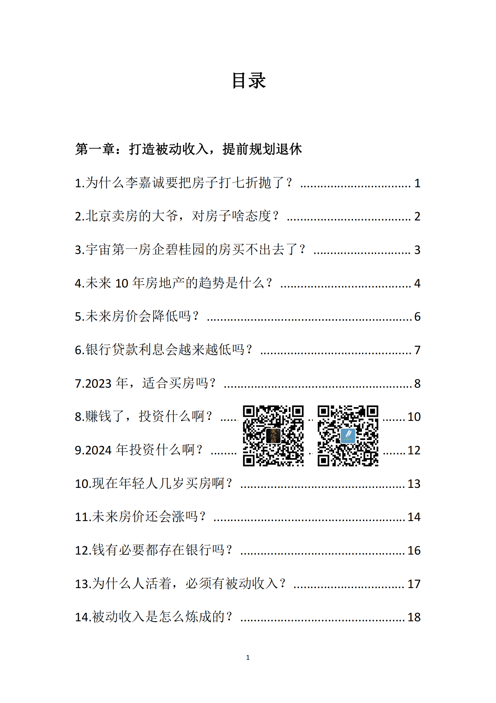
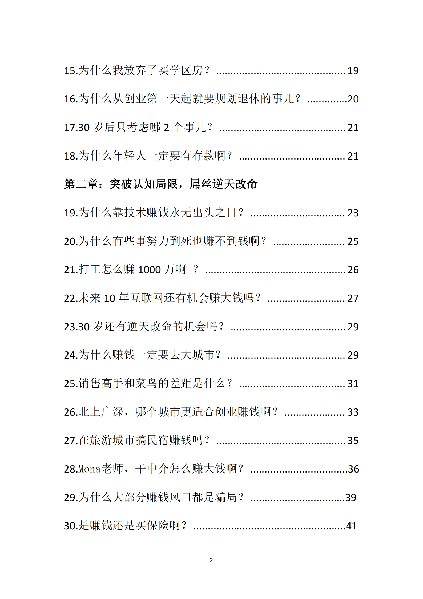
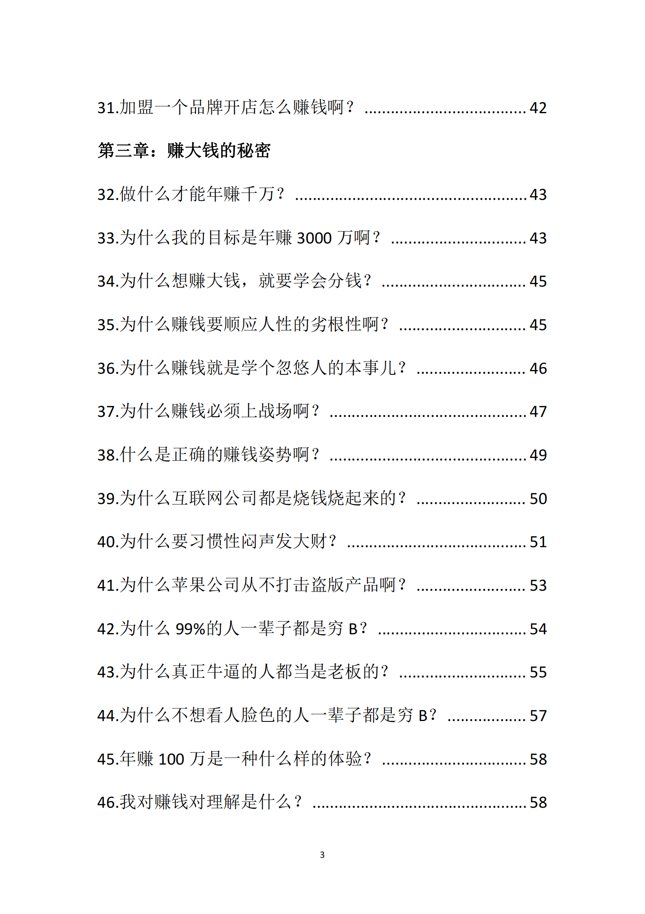
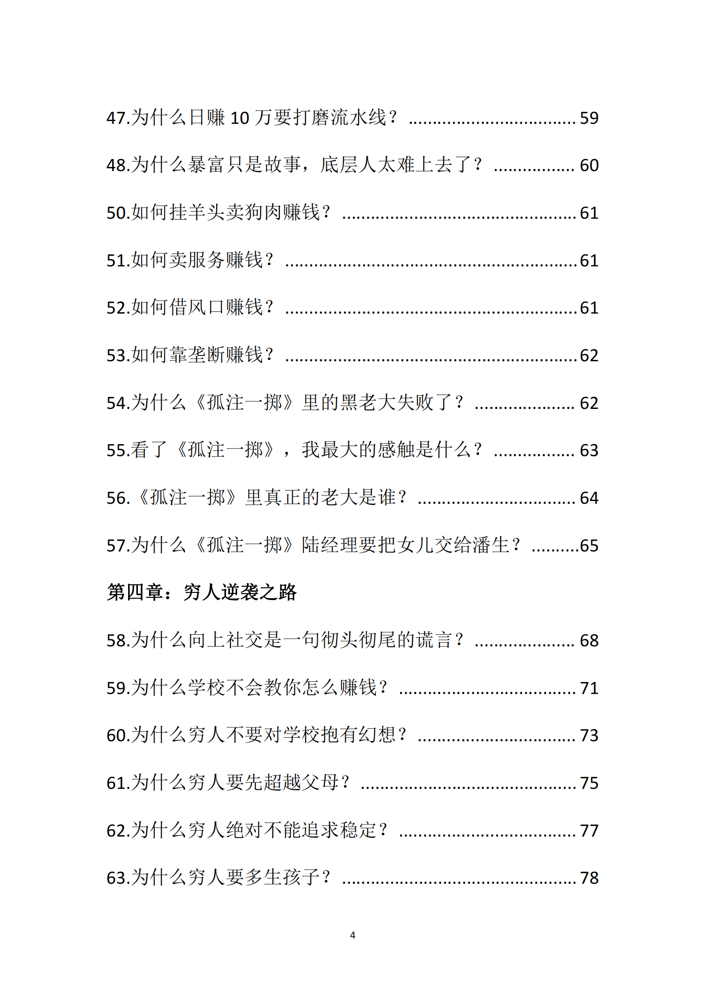
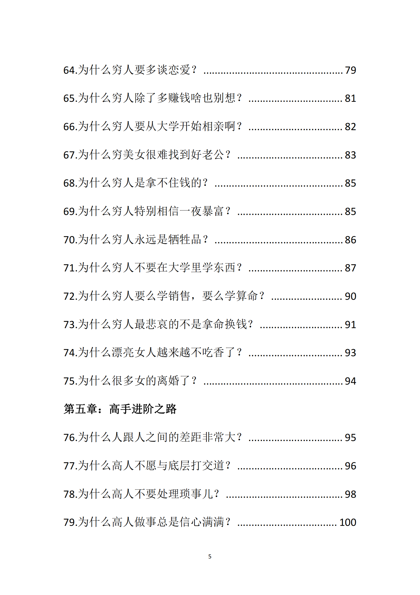
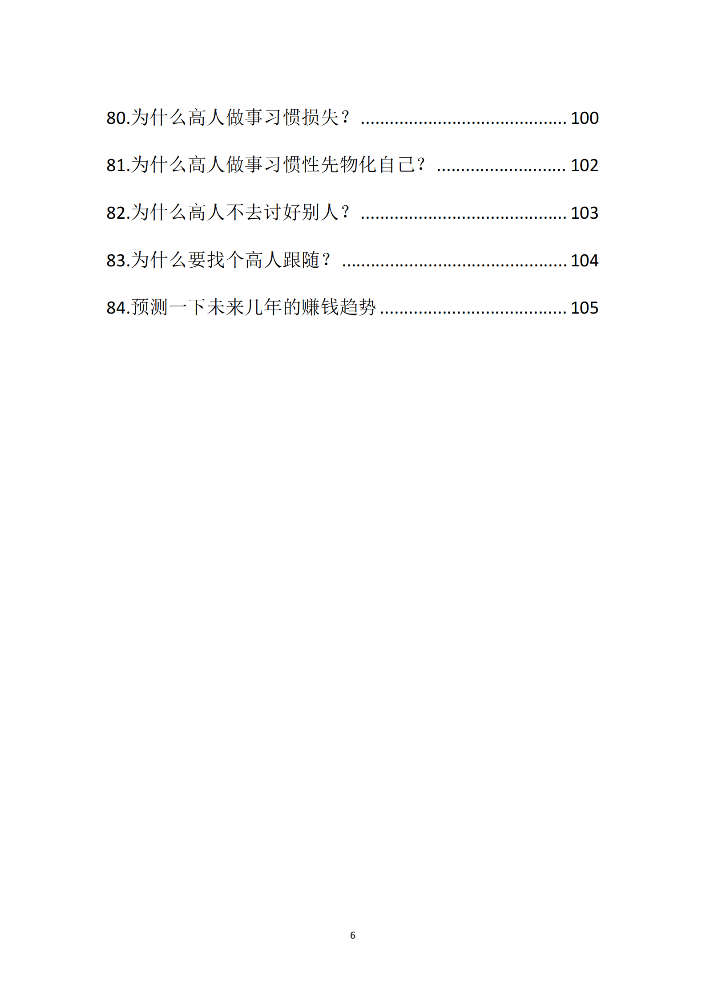

<!-- 原书第 1 页 -->

目
第一章：打造被动收入，提前规划退休
1.为什么李嘉诚要把房子打七折抛了?
2.北京卖房的大爷，对房子啥态度？
3.宇宙第一房企碧桂园的房买不出去了？
4.未来10年房地产的趋势是什么？
5.未来房价会降低吗？
6.银行贷款利息会越来越低吗？
7.2023年，适合买房吗？
8.赚钱了，投资什么啊？
9.2024年投资什么啊？
10.现在年轻人几岁买房啊？
13
11.未来房价还会涨吗？
12.钱有必要都存在银行吗？
16
13.为什么人活着，必须有被动收入?
17
14.被动收入是怎么炼成的？
18

<!-- source-image-start -->

查看原书第 1 页影像

<!-- source-image-end -->

<!-- 原书第 2 页 -->

15.为什么我放弃了买学区房？
16.为什么从创业第一天起就要规划退休的事儿？
.20
17.30岁后只考虑哪2个事儿？
21
18.为什么年轻人一定要有存款啊？
21
第二章：突破认知局限，屌丝逆天改命
19.为什么靠技术赚钱永无出头之日？
23
20.为什么有些事努力到死也赚不到钱啊？
25
21.打工怎么赚1000万啊？
26
22.未来10年互联网还有机会赚大钱吗？
27
23.30岁还有逆天改命的机会吗？
29
24.为什么赚钱一定要去大城市？
29
25.销售高手和菜鸟的差距是什么？
31
26.北上广深，哪个城市更适合创业赚钱啊？
33
27.在旅游城市搞民宿赚钱吗?
35
28.Mona老师，干中介怎么赚大钱啊?
36
29.为什么大部分赚钱风口都是骗局？
.39
30.是赚钱还是买保险啊？
.41

<!-- source-image-start -->

查看原书第 2 页影像

<!-- source-image-end -->

<!-- 原书第 3 页 -->

31.加盟一个品牌开店怎么赚钱啊？
42
第三章：赚大钱的秘密
32.做什么才能年赚千万？
43
33.为什么我的目标是年赚3000万啊？
43
34.为什么想赚大钱，就要学会分钱？
45
35.为什么赚钱要顺应人性的劣根性啊？
45
36.为什么赚钱就是学个忽悠人的本事儿？
46
37.为什么赚钱必须上战场啊？
47
38.什么是正确的赚钱姿势啊？
49
39.为什么互联网公司都是烧钱烧起来的？
50
40.为什么要习惯性闷声发大财？
51
41.为什么苹果公司从不打击盗版产品啊？
53
42.为什么99%的人一辈子都是穷B?
54
43.为什么真正牛逼的人都当是老板的?
55
44.为什么不想看人脸色的人一辈子都是穷B?
57
45.年赚100万是一种什么样的体验？
58
46.我对赚钱对理解是什么？
58

<!-- source-image-start -->

查看原书第 3 页影像

<!-- source-image-end -->

<!-- 原书第 4 页 -->

47.为什么日赚10万要打磨流水线？
59
48.为什么暴富只是故事，底层人太难上去了？
.60
50.如何挂羊头卖狗肉赚钱？
61
51.如何卖服务赚钱？
61
52.如何借风口赚钱？
61
53.如何靠垄断赚钱？
.62
54.为什么《孤注一掷》里的黑老大失败了？
62
55.看了《孤注一掷》，我最大的感触是什么？
63
56．《孤注一掷》里真正的老大是谁?
.64
57.为什么《孤注一掷》陆经理要把女儿交给潘生？.....65
第四章：穷人逆袭之路
58.为什么向上社交是一句彻头彻尾的谎言？
68
59.为什么学校不会教你怎么赚钱？
71
60.为什么穷人不要对学校抱有幻想？
73
61.为什么穷人要先超越父母？
75
62.为什么穷人绝对不能追求稳定？
77
63.为什么穷人要多生孩子？
.78

<!-- source-image-start -->

查看原书第 4 页影像

<!-- source-image-end -->

<!-- 原书第 5 页 -->

64.为什么穷人要多谈恋爱？
79
65.为什么穷人除了多赚钱啥也别想？
81
66.为什么穷人要从大学开始相亲啊？
82
67.为什么穷美女很难找到好老公？
83
68.为什么穷人是拿不住钱的？
85
69.为什么穷人特别相信一夜暴富？
85
70.为什么穷人永远是牺牲品？
86
71.为什么穷人不要在大学里学东西？
87
72.为什么穷人要么学销售，要么学算命？
90
73.为什么穷人最悲哀的不是拿命换钱？
91
74.为什么漂亮女人越来越不吃香了？
93
75.为什么很多女的离婚了？
94
第五章：高手进阶之路
76.为什么人跟人之间的差距非常大?
95
77.为什么高人不愿与底层打交道？
96
78.为什么高人不要处理琐事儿？
98
79.为什么高人做事总是信心满满？
100

<!-- source-image-start -->

查看原书第 5 页影像

<!-- source-image-end -->

<!-- 原书第 6 页 -->

80.为什么高人做事习惯损失？
100
81.为什么高人做事习惯性先物化自己?
102
82.为什么高人不去讨好别人？
103
83.为什么要找个高人跟随？
104
84.预测一下未来几年的赚钱趋势
105

<!-- source-image-start -->

查看原书第 6 页影像

<!-- source-image-end -->

<!-- 原书第 7 页 -->

<!-- source-image-start -->

查看原书第 7 页影像

<!-- source-image-end -->
