<!-- 原书第 8 页 -->

# 第一章：打造被动收入，提前规划退休

1.为什么李嘉诚要把房子打七折抛了？

答：说白了，就是一直捂盘，都没销量。

捂了几年，别说升了，还在降。

二手房七年前什么价格买的，业主现在什么价格卖，求爷爷告奶奶，都扔不出去。

我打七折，赌一下，看看能卖出去吗？李嘉诚说到做到。

现实是什么？

打七折，也没人要。

为什么打七折，也没人要了？

李嘉诚说过：房价上涨，有销量；房价下跌，没销量。

<!-- source-image-start -->

查看原书第 8 页影像

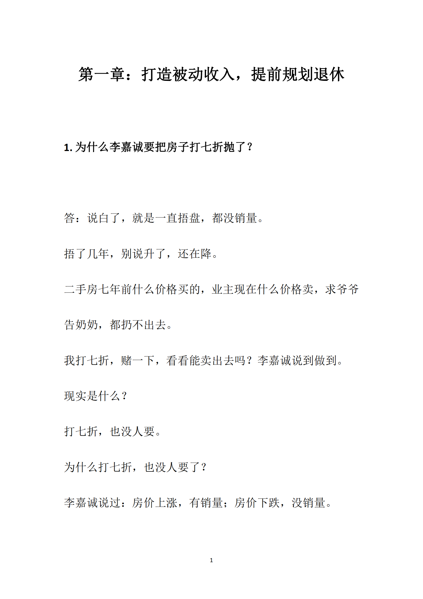

<!-- source-image-end -->
<!-- 原书第 9 页 -->

2.北京卖房的大爷，对房子啥态度？

答：房子我是120万买的，现在市场价是800万，我啊，400万都敢甩。

结果呢？

北京大爷的房子，挂了好几个月，还是卖不出去。

这个时代，房价不上涨，就没人买。

房价上涨了，或许才有人上车。

有人对我说：以后不管房价涨不涨，都没人上车了。

我说不对。

以后房价上涨，就有人上车。房价不上涨，就没人上车。

人都是犯贱的。

人要不犯贱，怎么会有28定律？（我的微信：1848636859）

<!-- source-image-start -->

查看原书第 9 页影像

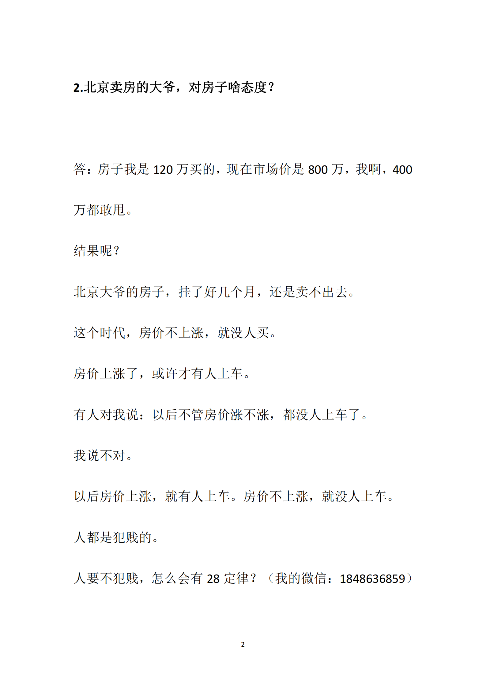

<!-- source-image-end -->
<!-- 原书第 10 页 -->

3.宇宙第一房企碧桂园的房买不出去了？

答：不管宇宙第一还是银河系第一，现在全国的房子都没销量了。

为什么？

就业岗位少了，来钱的渠道少了。

而且很多老板越折腾越不赚钱，不愿干了，大爷我躺平了。

躺平的成本高吗？

只要没车贷房贷，兜里有10万，就可以躺平了。

钱嘛，就是用来吃个饭。

就业岗位多，且薪水高，房价就会继续上涨，反之，房价永远都不会涨了。

<!-- source-image-start -->

查看原书第 10 页影像

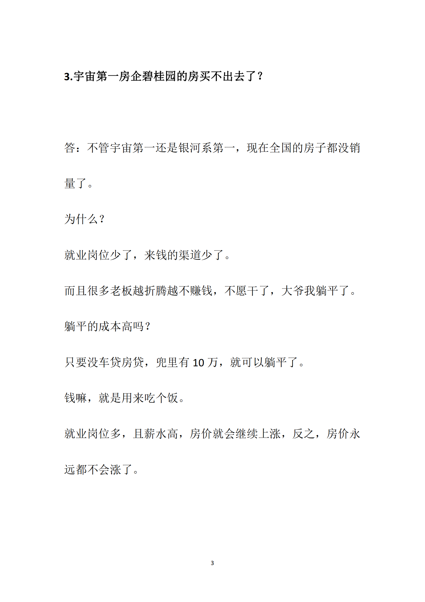

<!-- source-image-end -->
<!-- 原书第 11 页 -->

4.未来10年房地产的趋势是什么？

答：1、一二线城市能稳就不错了；环京、环沪、环深、以及广大三四线面临巨大的考验，即将步入一个下降通道，而且这个通道深不见底。

在有可能的情况下，大家尽量把房子往核心城市转移！

2、虽然一线城市的房子依然还会很值钱，但是一个不得不提的现实是：要想把房子变现也不是那么容易，看看现在的情况吧：都是保证新房的成交，二手房成就却越来越不活跃。

3、这一条最关键，买房一定要去限价的新房，这一点很重要！哪怕是摇号也要一直去摇，这种几率总比你买彩票中奖

<!-- source-image-start -->

查看原书第 11 页影像

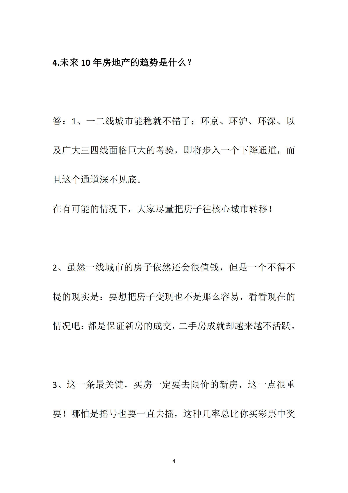

<!-- source-image-end -->
<!-- 原书第 12 页 -->

的几率高吧。限价的新房，就像股市上的“打新股”。

而二手房就像一个二级市场，涨涨跌跌都很难说，唯有新房才能确保是赚的。中国的房市越来越像股市，要按股市的那套逻辑才能赚到钱。

未来房地产的一个原则就是：刺激新房市场，维持住二手房市场。

只有这样经济才能继续运转，并且不出现问题。

<!-- source-image-start -->

查看原书第 12 页影像

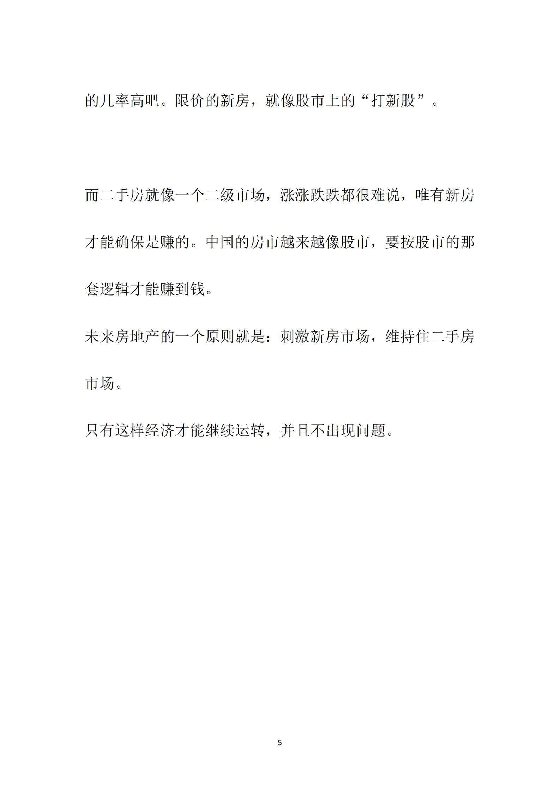

<!-- source-image-end -->
<!-- 原书第 13 页 -->

5.未来房价会降低吗？

答：不会降低。

背后的逻辑很简单。

房价越低，越没人买。

楼市下跌，是从房价降低开始的。

大家的消费心理是什么？

买涨不买跌。

现在股票多便宜啊，为什么没人买了？

就是跌的太厉害了。

物业会不会取消？当然不会取消了。

99.99%的物业公司，都是人情世故的产物。你说取消就取消了？你是谁啊？

<!-- source-image-start -->

查看原书第 13 页影像

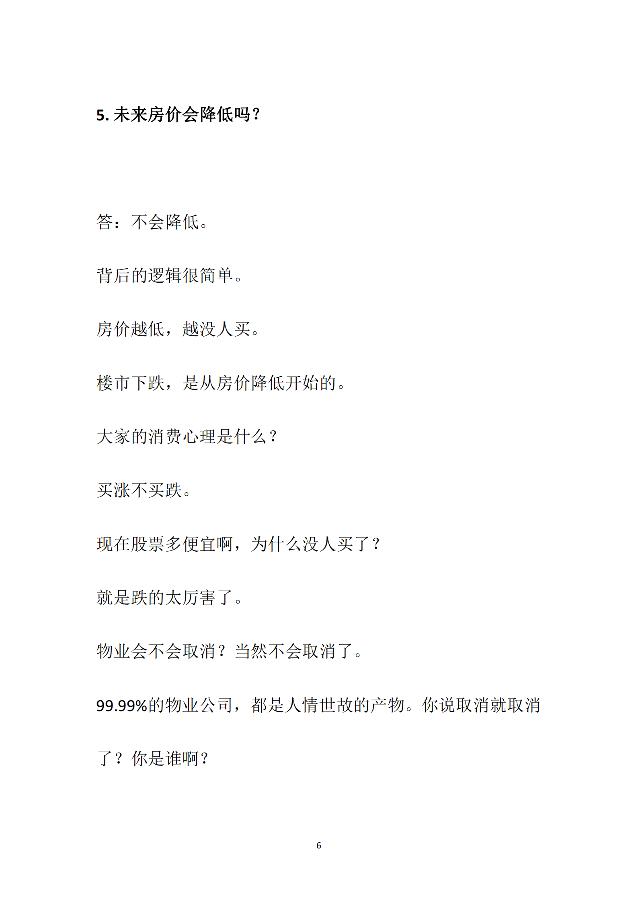

<!-- source-image-end -->
<!-- 原书第 14 页 -->

6.银行贷款利息会越来越低吗？

答：对。

确实越来越低。

但贷款的人不会增加。

因为很多人，并没有做生意的打算。

我会贷款吗？

会。

只要这个钱，利息足够低，我还是会贷款投资房子。

我的租金，每年能达到30万时，我就可以退出江湖，云游世界了，哈哈。

<!-- source-image-start -->

查看原书第 14 页影像

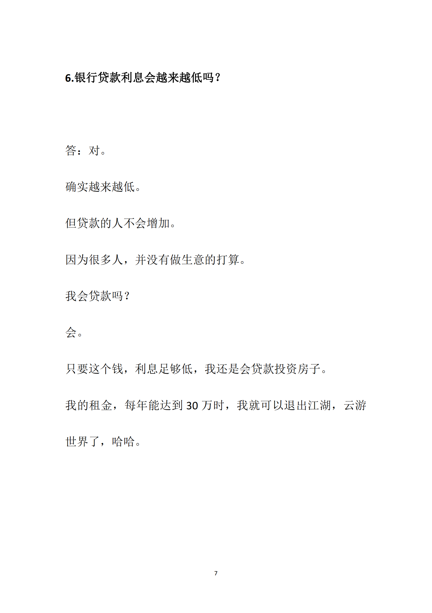

<!-- source-image-end -->
<!-- 原书第 15 页 -->

7.2023年，适合买房吗？

答：2023年，我又买了几套房。

我不想做太多的宏观分析。

我知道，很多人都说我二。

2024年，要是房价继续下跌，我会继续投资。

主要房价一直下跌，我就一直买。

什么叫有路不走？

这就叫有路不走。

如果房价一直跌，我就一直买。

有人喜欢买涨，有人喜欢买跌。

我是涨时卖，跌时买。

反正都是全款，表示没压力。

<!-- source-image-start -->

查看原书第 15 页影像

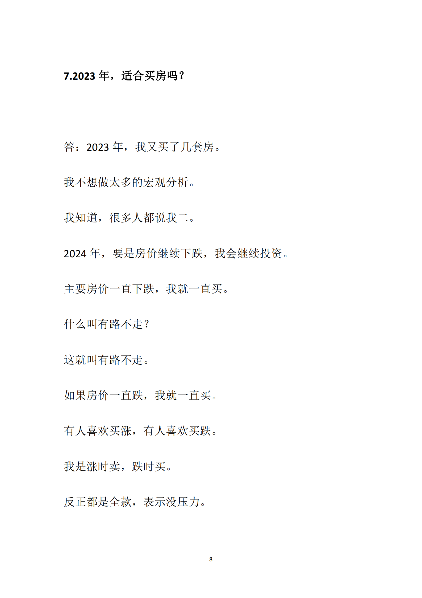

<!-- source-image-end -->
<!-- 原书第 16 页 -->

现金流淌具有唯一性。

我有钱就买房。

这辈子就这样吧。

人生实在太短了，什么都研究，这一生，似乎什么都没干，就过去了。

2023年，越保守越幸福。

<!-- source-image-start -->

查看原书第 16 页影像

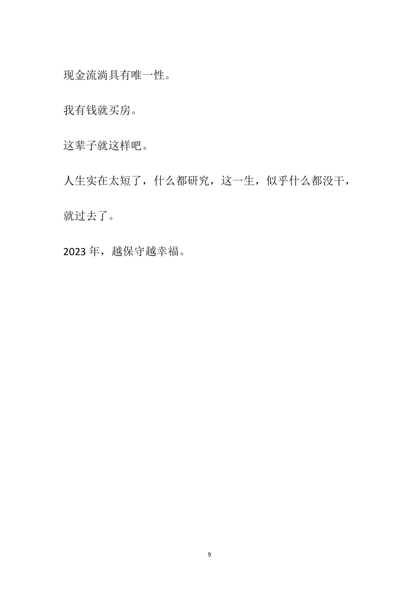

<!-- source-image-end -->
<!-- 原书第 17 页 -->

8.赚钱了，投资什么啊？

答：我依旧会投资商铺。

现金流淌具有唯一性。

穷人的资源，原本有限，还搞分散投资，是不是会导致自己手里的资源会更少？

现在不管别人怎么唱衰商铺，我依旧是赚钱了，继续投商铺。

投资的原则依旧是中心的中心。

只要这个商铺没在中心的中心，我是不投的。

老家的房子，我全卖了。

卖了干嘛啊？

依旧是投资商铺。

我对很多人说了，我老了，我唯一的被动收入就是租金。

<!-- source-image-start -->

查看原书第 17 页影像

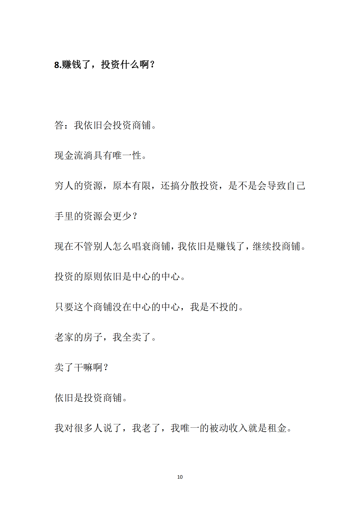

<!-- source-image-end -->
<!-- 原书第 18 页 -->

真正的进攻，都是保守性进攻。

即在不消耗自己的前提下发力。

人到了35岁，没有被动收入，是非常危险非常危险的。

共勉之。

（我的微信：1848636859）

<!-- source-image-start -->

查看原书第 18 页影像

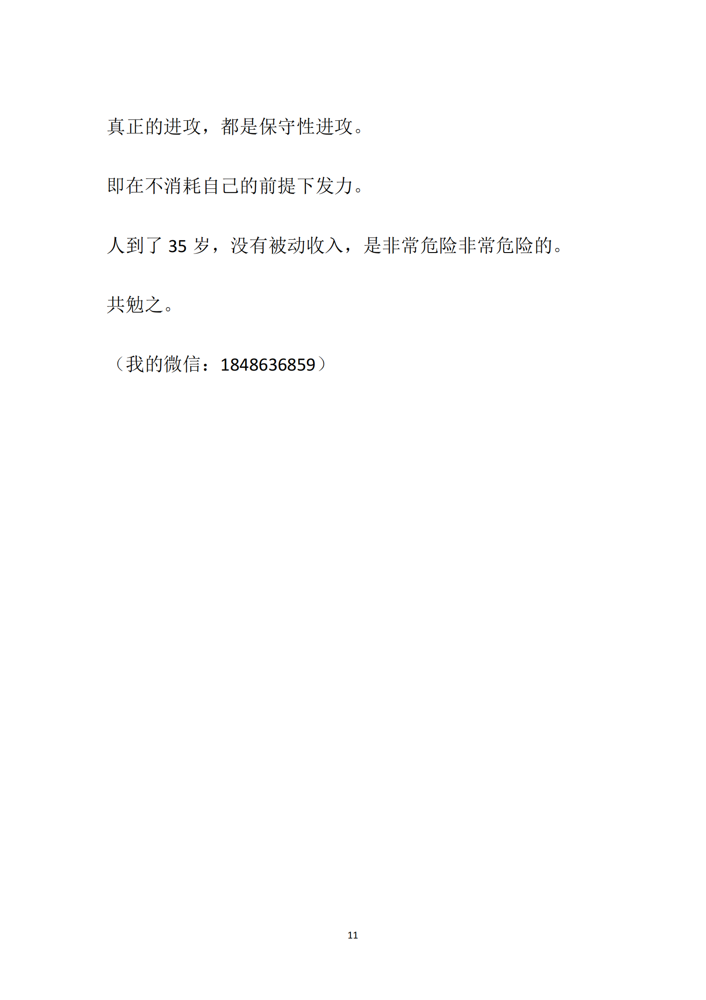

<!-- source-image-end -->
<!-- 原书第 19 页 -->

9.2024年投资什么啊？

答：前几年我买了很多房子，我很焦虑。

现在我不焦虑了，就当变相存钱了。

反正我的钱，不买房，也会花在其他地方。

花在其他地方，未必有花在房子上靠谱。

我在深圳投的房子，也是中心的中心。

投了600多万，每年的租金是10多万，全款投的。

这10多万，绝对够我们一家吃喝拉撒和孩子的学费了。

我在深圳投资的商铺，每年大概能收30多万的租金。

2024年，我打算再投一套商铺。

这套商铺，我投了，租出去，一年收个20万，问题不大。

对于住宅和公寓，我不碰。

<!-- source-image-start -->

查看原书第 19 页影像

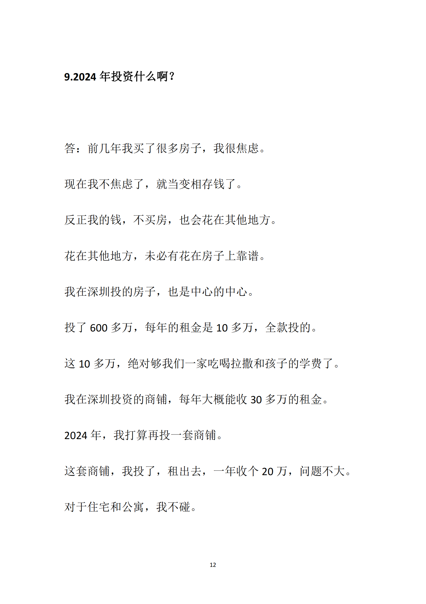

<!-- source-image-end -->
<!-- 原书第 20 页 -->

10.现在年轻人几岁买房啊？

答：日韩买房者的年龄都是40岁左右。

未来国内买房的人，也会在40岁左右开始买房。

不可能一辈子租房的。

你年龄大了，没人愿把房子租给你。

房东怕你死在里面。

以前咱买房，都是20多岁买。

未来就是40岁左右，才有条件买真正属于自己的第一套房。

父母给你买的房子，你未必住。

房子都20多年了30多年了，体验感肯定不好。

经济发展到一定的程度，大家都很在乎舒适度。

<!-- source-image-start -->

查看原书第 20 页影像

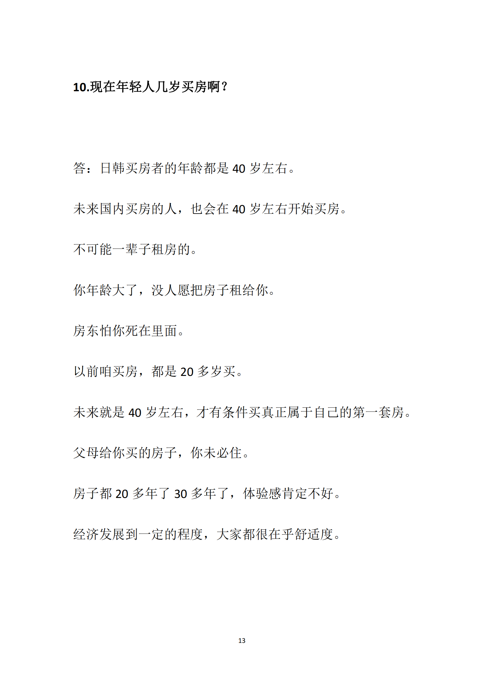

<!-- source-image-end -->
<!-- 原书第 21 页 -->

11.未来房价还会涨吗？

答：未来，房价还是会上涨的。

因为房价下跌，永无销量。

有人说：我不买房。不买，也没人逼你。

车来了，上车不上车，咱自个儿说了算。

要是大伙儿都上车了，试问你上车吗？

人都有从众心理，习惯性保持特立独行，非常非常痛苦。

大家都结婚了，就你没结婚，你难受吗？肯定难受。

大趋势是什么？

大家都会结婚，都会生子，都会买房。

大家说日韩年轻人都不买房都不结婚都不生子。

咱的国情，跟人家的国情不一样。

<!-- source-image-start -->

查看原书第 21 页影像

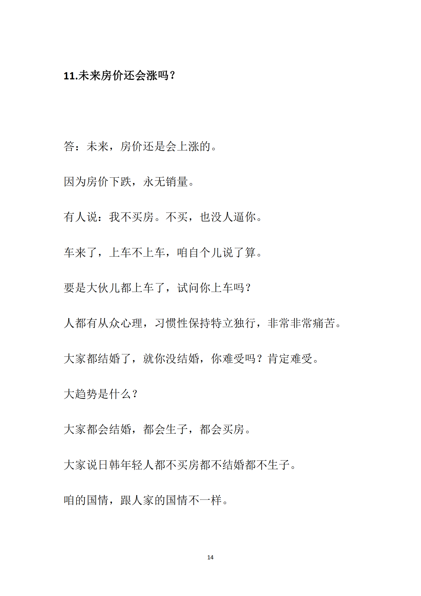

<!-- source-image-end -->
<!-- 原书第 22 页 -->

人家是发达国家。

日韩看病都很便宜，韩国看病只收药费，此外，任何费用都不收。日本看病，报销70%。

还有日本的房租很贵，占薪水的30%，韩国的房租相对便宜点儿，占薪水的18%。

咱国内的房租是多少，你心里没点儿逼数吗？

（我的微信：1848636859）

<!-- source-image-start -->

查看原书第 22 页影像

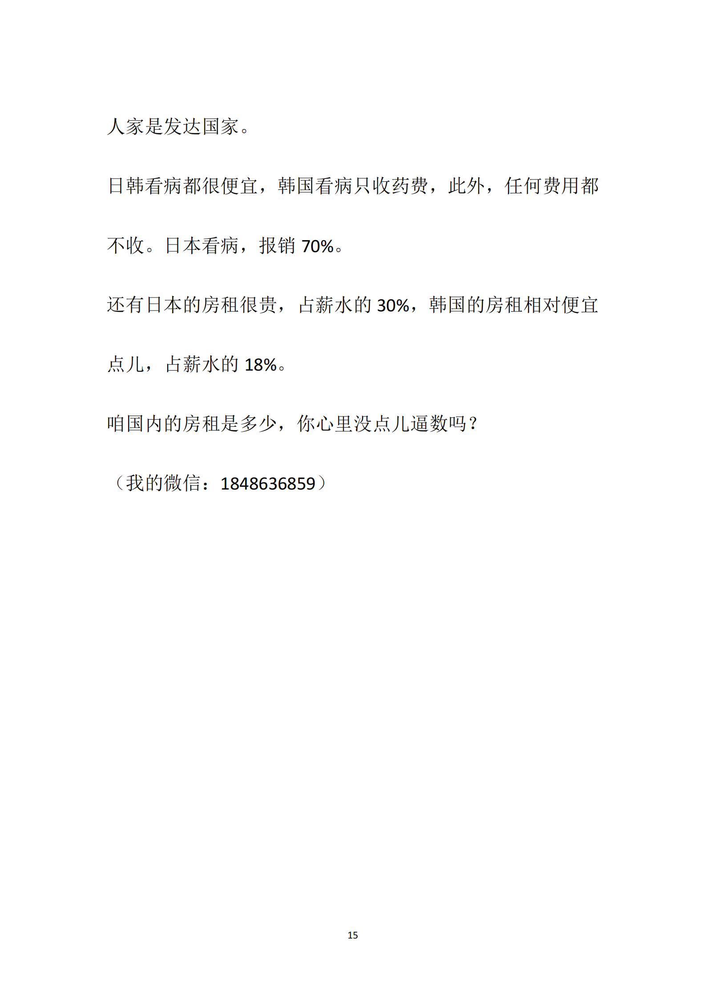

<!-- source-image-end -->
<!-- 原书第 23 页 -->

12.钱有必要都存在银行吗？

答：我收的租金都是来源于商铺。

我投资的商铺，都是中心的中心。

只要价格合适，都能租出去。

人活着，有个被动收入，还是比较踏实的。

有人说现金为王，有钱存在银行吃利息，也香啊。

现实是什么？

穿衣吃饭花不了几个钱。

大钱还是花在了教育，医疗和房产上。

钱存在银行，原本可以全款买套房子。

等10年后取出来，估计连房的首付都不够了。

<!-- source-image-start -->

查看原书第 23 页影像

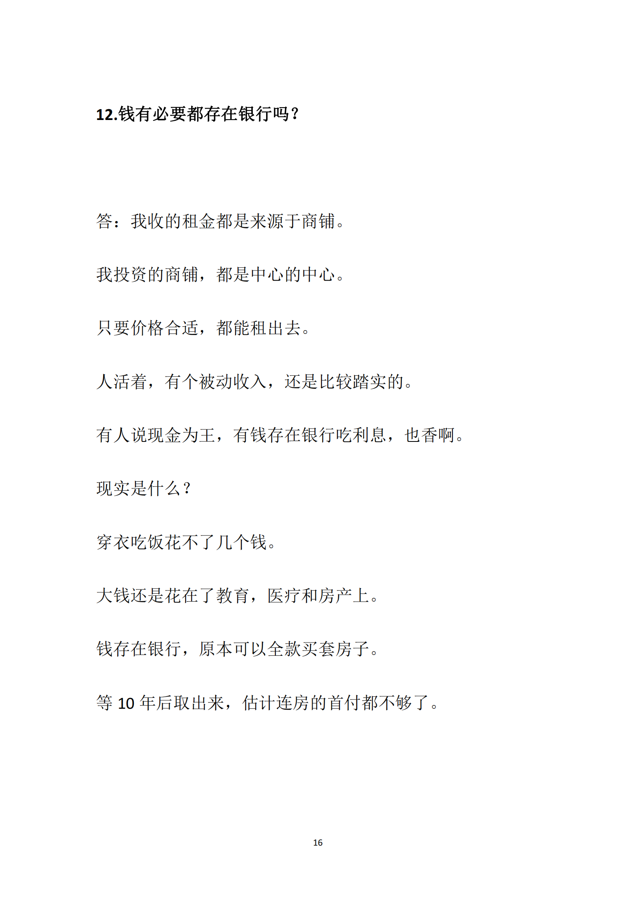

<!-- source-image-end -->
<!-- 原书第 24 页 -->

13.为什么人活着，必须有被动收入？

答：有被动收入，就能混吃等死。

没有被动收入，只能去吃屎。

我对被动收入的理解就是房租。

我赚到钱了就不断的买房子。

现在我赚钱，更多的时候，不是考虑我的执行力有多牛，我在物色合适的“猎物”。

也就是我出钱，他去冲锋陷阵。

成功了，赚钱55分。

失败了，所有的损失由我来承担。

赚钱，其实就是把自己的事儿，变成一群人的事儿。

<!-- source-image-start -->

查看原书第 24 页影像

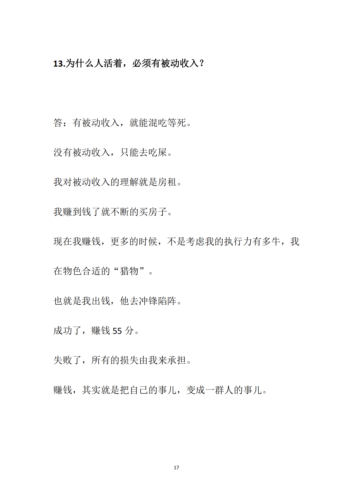

<!-- source-image-end -->
<!-- 原书第 25 页 -->

14.被动收入是怎么炼成的？

答：缓解焦虑的最佳方式就是有被动收入。

被动收入是怎么炼成的？

边上班边攒钱。

攒够5万了，辞职，全职做项目。

记住：钱是用来吃饭的，不是用来投资的。

全职做项目，说白了，就是锁定一个项目，一直做流量。

习惯性跟时间做朋友。

赚钱了，就投资商铺。

因为商铺能给我们带来被动收入。

年纪轻轻，就有被动收入了，是不是生活在鸟不拉屎的地方，也会气定神闲。

<!-- source-image-start -->

查看原书第 25 页影像

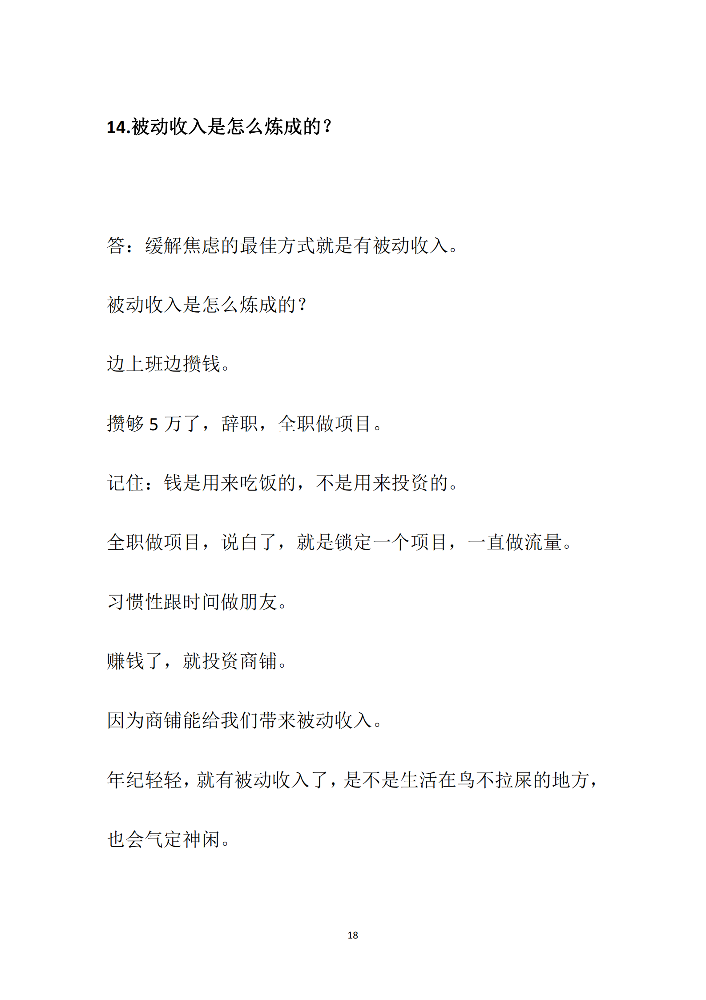

<!-- source-image-end -->
<!-- 原书第 26 页 -->

15.为什么我放弃了买学区房？

答：孩子在私立学校读书就行了。

他们的成绩无论好坏，现在我们的终点，就是他们的起点。

更多的时候，孩子要怎么样怎么样啊，还是取决于父母做什么。

能超越父母的孩子，没有我们想象的多。

比如父母能年赚30万，这对孩子来说：这是一个很难逾越的天堑。

<!-- source-image-start -->

查看原书第 26 页影像

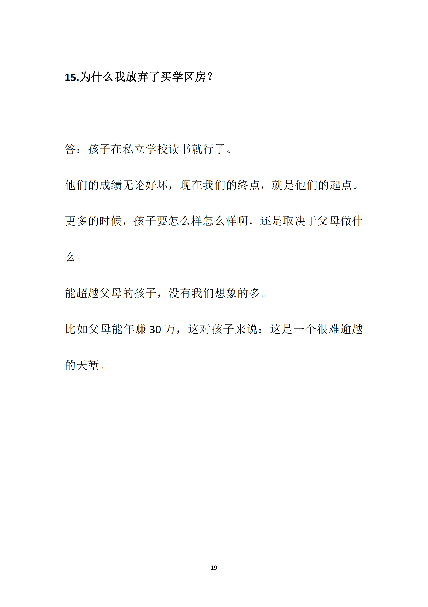

<!-- source-image-end -->
<!-- 原书第 27 页 -->

16.为什么从创业第一天起就要规划退休的事儿？

有能力的人，想啥时候退休，就啥时候退休。

我是一个没啥能力的人。

笨鸟先飞，我从创业第一天起，我就在规划退休的事儿。

我退休，一是靠社保，二是靠房租租金。（每年有30-50W被动收入就OK，够吃够喝够看病就行了）我对儿女，期望不大。

说真的，我不觉得子女会比我更出息。

我也不相信，孩子能有我的好运气。

我创业，运气实在太好了。

熬过3个月，就赚到了第一桶金。

<!-- source-image-start -->

查看原书第 27 页影像

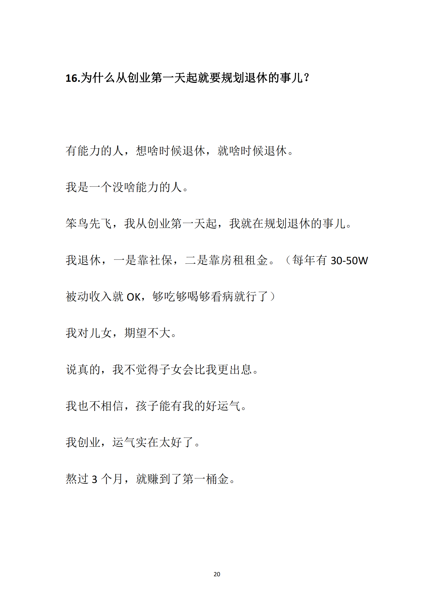

<!-- source-image-end -->
<!-- 原书第 28 页 -->

17.30岁后只考虑哪2个事儿？

答：1、去杠杆；2、打造被动收入。

去杠杆=把所有的债务消除了。

打造被动收入就是买房，当房东。

18.为什么年轻人一定要有存款啊？

答：有了存款，你就可以不用上班了，可以去做自己喜欢的事儿。

现在很多年轻人，被房贷压死了，工作没了，连利息都还不上，更不要提有存款了，所以他们压根不敢辞职出来创业。

记住：一定要把自己喜欢的事儿，变成一个项目。

<!-- source-image-start -->

查看原书第 28 页影像

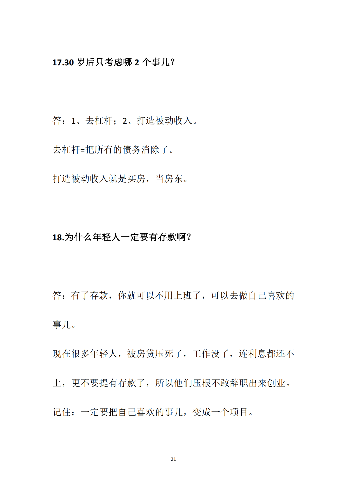

<!-- source-image-end -->
<!-- 原书第 29 页 -->

不然，这个坚持毫无意义。

为什么现在街上的年轻人少了？

因为他们在家吹着空调就把业务给搞定了。

你有了存款，就考虑怎么辞职在家把业务给搞定，自由自在地做自己想做的事儿顺便赚钱就行了。

<!-- source-image-start -->

查看原书第 29 页影像

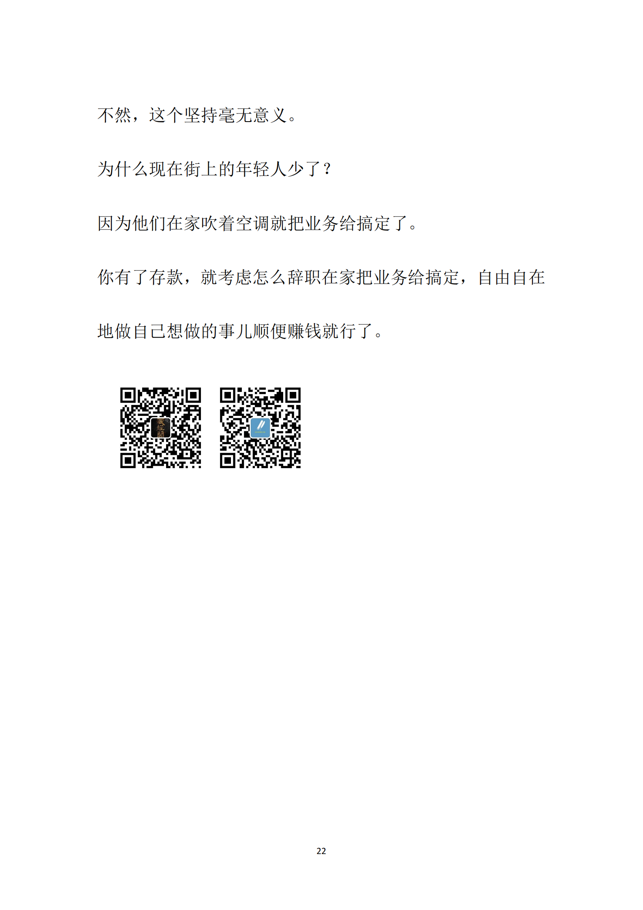

<!-- source-image-end -->
