<!-- 原书第 30 页 -->

# 第二章：突破认知局限，屌丝逆天改命

19.为什么靠技术赚钱永无出头之日？

答：学技术无穷而人力又穷，学技术永无出头之日！

大道至简，赚钱并不难，关键是找到本质。

关键就在于能不能找到那一道小小的认知门槛。

选择什么样的赚钱方式。

一是取决于你的个人能力。

二是取决于什么赛道更赚钱。

更赚钱的赛道，一个是行业老大。

一个是暴利产业。

暴利的产业有3个：医疗，教育，房地产。

<!-- source-image-start -->

查看原书第 30 页影像

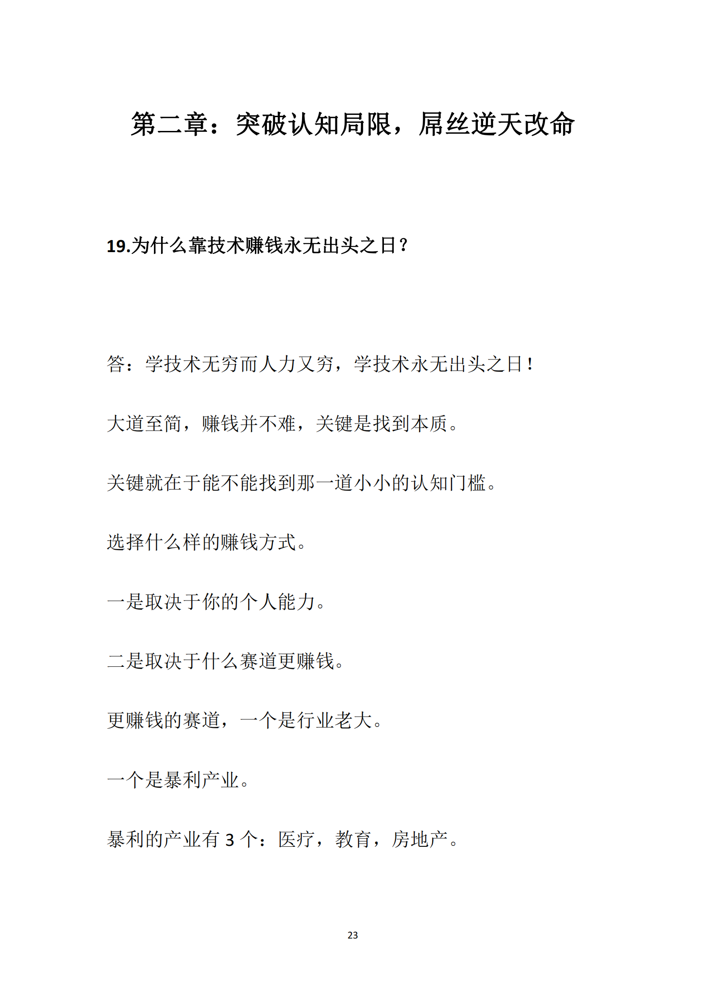

<!-- source-image-end -->
<!-- 原书第 31 页 -->

现在房地产不行了，萎靡的不成样子。

医疗门槛比较高，咱去卖药，风险又大。

所以啊，咱还是搞教育。

这个教育怎么搞啊？

刘一秒怎么搞，你就怎么搞。

现在大家想赚钱，就是赚学生的钱，就是赚学生家长的钱。

学生家长不舍得吃不舍得喝，但为了孩子，什么都他娘舍得了。

（我的微信：1848636859）

<!-- source-image-start -->

查看原书第 31 页影像

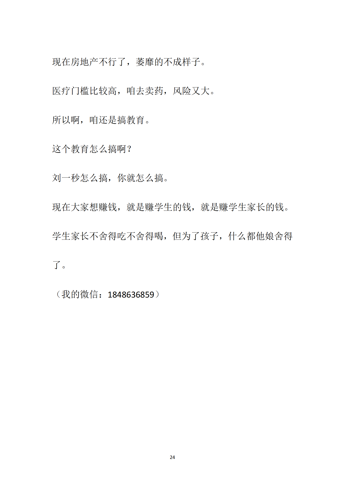

<!-- source-image-end -->
<!-- 原书第 32 页 -->

20.为什么有些事努力到死也赚不到钱啊？

答：表面的东西和真相，永远隔着一层无法解开的薄膜。

没有人指点，有些事儿你努力到死也不会有长进。

有些人能赚大钱，跟他做什么职业没关系。

真正能赚大钱的人，不在于他的职业，而是他们背后有高人指点，懂得变现自己的能力，能一针见血地找到市场需求。

职业啊，技术啊，只能算是基本功。

武功之所以强大，在于你要创造招式。

说白了，技巧永远大于力量。

一身腱子肉，也可能被一个灵活的胖子击倒。

<!-- source-image-start -->

查看原书第 32 页影像

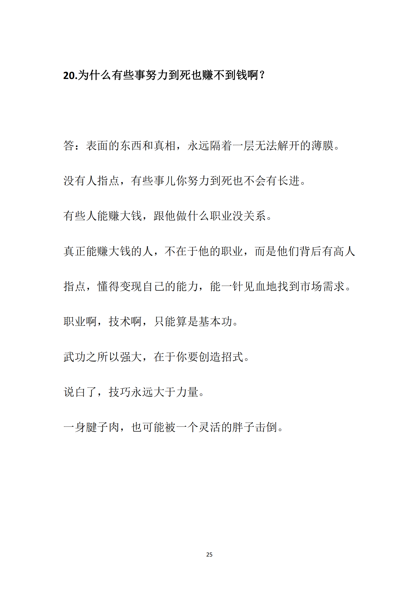

<!-- source-image-end -->
<!-- 原书第 33 页 -->

21.打工怎么赚1000万啊？

答：找准目标。

一个身价10亿的企业老板，身份至少要需要释放10个千万级别的岗位。

为什么？

因为对大佬来说，人力和金钱都是投资品，不用掉一个亿，赚不回10个亿。

打工想要出人头地，就是找准老板的需求。

你不要把打工看成一个工作，要看成一门生意，做生意也要学会动脑筋。

<!-- source-image-start -->

查看原书第 33 页影像

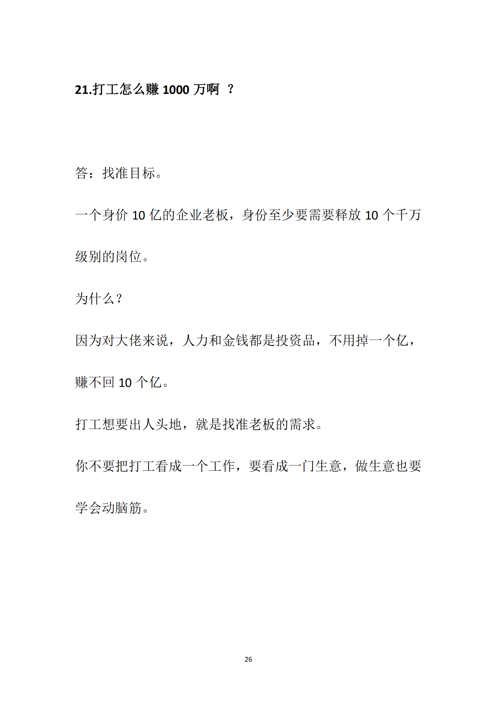

<!-- source-image-end -->
<!-- 原书第 34 页 -->

22.未来10年互联网还有机会赚大钱吗？

答：现在还不是互联网时代的巅峰，很多机会才刚刚开始。

未来10年还是互联网赚大钱的好时机。

互联网的本质还是商业，互联网从来没有颠覆啥，只是提高了人与人沟通、交易、链接的效率。

28法则，在任何领域都适用，互联网同理。

大部分公司活不下去，少量活下去的只有两成赚钱。

未来，谁能创造优质的内容，谁就是获胜，群魔乱舞的时代终究会过去，赢家通吃才是正常情况。

互联网创业的机会在于：

1、不断优化内容，不断吸引粉丝;

2、找到蓝海，并且知道如何从中赚钱;

<!-- source-image-start -->

查看原书第 34 页影像

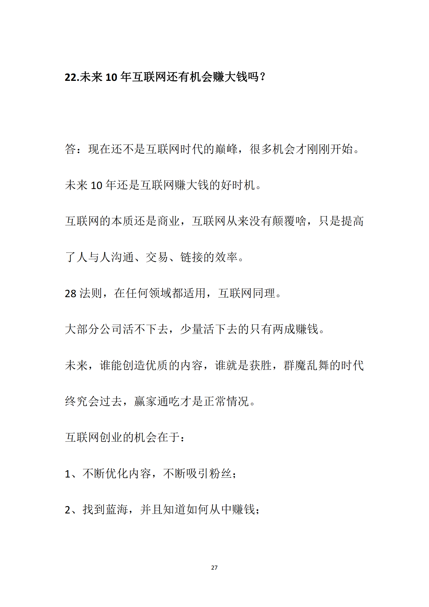

<!-- source-image-end -->
<!-- 原书第 35 页 -->

3、赚不懂行的人的钱和高利润行业的钱。比如教育、金融、医美、医疗，这些行业原本的从业者并不熟悉互联网玩法，两栖人才很容易降维打击（主要是90后）。

（我的微信：1848636859）

<!-- source-image-start -->

查看原书第 35 页影像

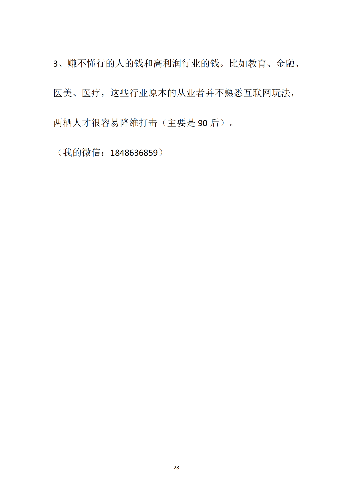

<!-- source-image-end -->
<!-- 原书第 36 页 -->

23.30岁还有逆天改命的机会吗？

答：核心就一个，有没有找到一个比较屌的卖点。

找到了，就可以逆天改命。

找不到，还是按部就班，以前做什么，现在还做什么。

24.为什么赚钱一定要去大城市？

答：大城市充满了工作机会，你才有机会找到高薪的工作，见到行业顶尖的人才，以及配套的资源。

城市决定了眼界和资源，年轻人考大学、找工作，直接选择北上广深。

在你人生进步最快的时间，你选择一个非一二线城市，你就

<!-- source-image-start -->

查看原书第 36 页影像

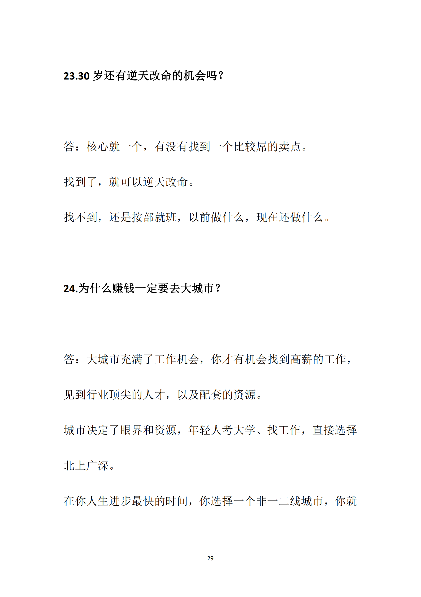

<!-- source-image-end -->
<!-- 原书第 37 页 -->

是坐牢。

你选择一线、新一线、强二线，你才有机会知道最新的技术，看到短视频直播网红电商房产，才知道别人是怎么赚钱的，在大城市，你接触到的世界维度，要比小城市复杂100倍。

我有个房客，是小店老板，卖卤味的，已经非常习惯深圳的生活，他说，这辈子一心一意交房租，熬到七十回农村。

他现在月入2、3万，小孩在深圳上小学，老婆也过来帮忙生意，他说大城市的环境、教育、服务太牛了，打死也不走。

<!-- source-image-start -->

查看原书第 37 页影像

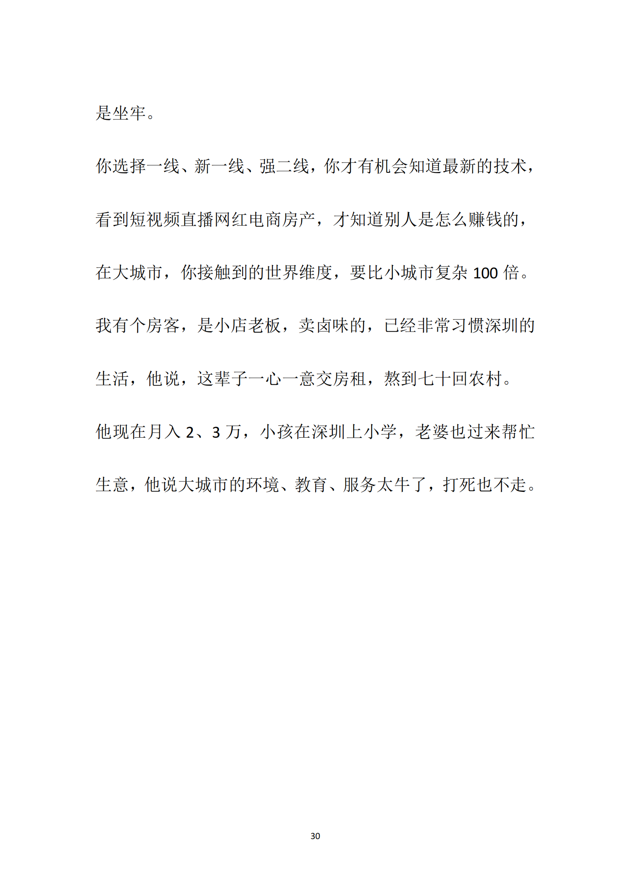

<!-- source-image-end -->
<!-- 原书第 38 页 -->

25.销售高手和菜鸟的差距是什么？

答：菜鸟完全靠运气吃饭，销售高手任何时候都能找到赚钱的机会。

我有个朋友，做中介的，哪怕现在市场行情不好，他也依然成交了不少单子，顺手做点租赁，一周也能两三单。

哪些人去看房，朋友都会察言观色，观察靠谱好下手的，完事了再沟通一下，大部分一次成功。

这还不是最牛的。

朋友专做那种高端楼盘租赁，服务很贴心，这些客户里，有不少是着钞票准备买房的，做几个租赁客户，顺道又成了一单业务。

不仅如此。

<!-- source-image-start -->

查看原书第 38 页影像

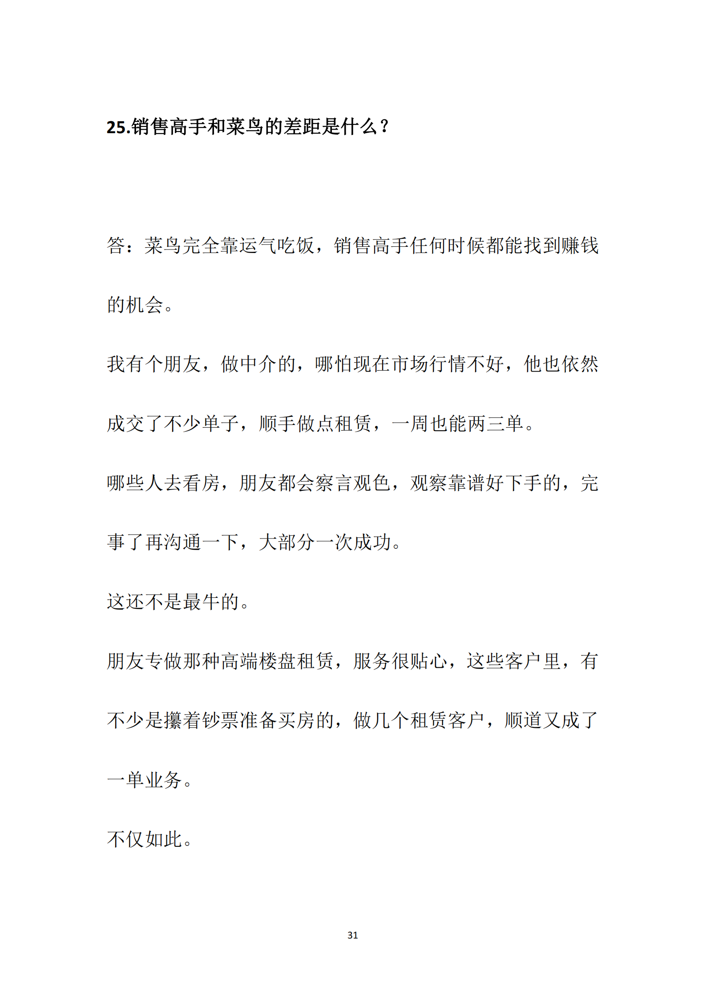

<!-- source-image-end -->
<!-- 原书第 39 页 -->

朋友因为业务熟悉，沟通到位，很多业主也愿意把房子交给他打理。

业主需要卖房，其他中介的客户来了，业主最后把要签的那个客户推给朋友。

朋友马上开车尾随，又签下一单。

朋友说，要习惯性多赚小钱。

不要怕钱小。

小单子会变成大单子。

不要着急，慢慢来。

积少成多，积腋成裘。

慢慢做，慢慢积累，发财是迟早的事儿。

<!-- source-image-start -->

查看原书第 39 页影像

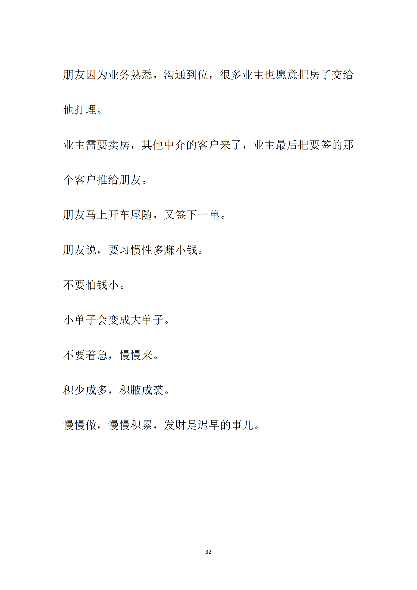

<!-- source-image-end -->
<!-- 原书第 40 页 -->

26.北上广深，哪个城市更适合创业赚钱啊？

答：北上广深4个城市，特点完全不同，作用也不同。

北京，是权力中心，也是文化中心，这个城市，适合做头部生意：创业、上市、网红新媒体、服务有钱人。一个字：莽。

同时，北京也比较“贵”，不适合草根生存。

上海，商业发展很充分，吃喝玩乐一条龙，也比较国际化，各方面物价都比北京低，非常适合中产以上阶级作为消费城市，但总体人群比较精致，不适合野蛮生、繁衍后代。

深圳，商业发展很充分，虽然没有上海潮，但是居住环境和物价都更低。除了房价现在排名第一，其他各方面都还不错，

<!-- source-image-start -->

查看原书第 40 页影像

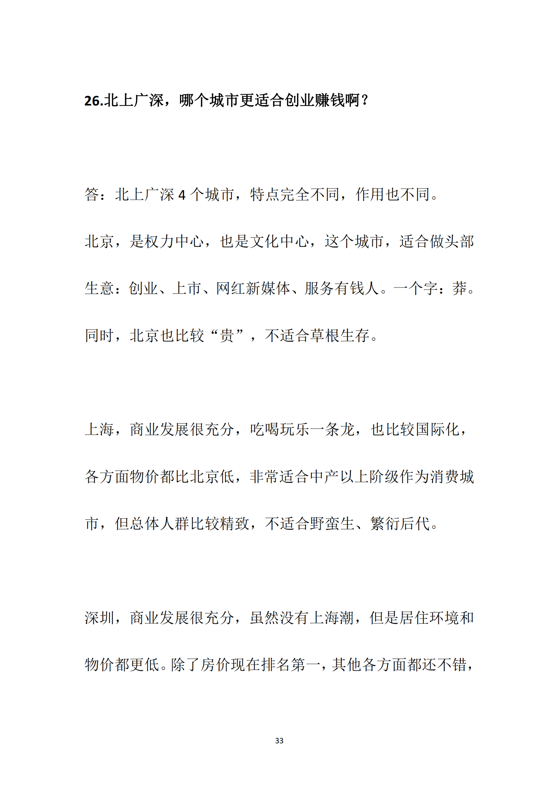

<!-- source-image-end -->
<!-- 原书第 41 页 -->

没有太多人际关系和权力网络关系，适合草根创业、普通人打拼。

广州，商业发展充分多样，也很国际化，吃喝玩乐一条龙，比较宜居，各方面的物价都很低，除了没有深圳那么活力，各方面都好不错，尤其适合繁衍后代，网络上知名的多娃人士，大多居住在广州。

<!-- source-image-start -->

查看原书第 41 页影像

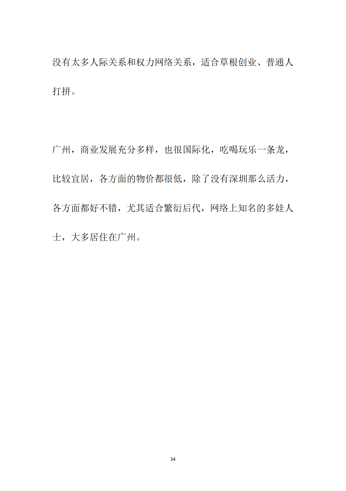

<!-- source-image-end -->
<!-- 原书第 42 页 -->

27.在旅游城市搞民宿赚钱吗？

答：没有做互联网项目赚钱。

几个人合伙干，没啥利润，油水很少。

自己干，风险较大。

总之，这个不是啥暴利行业，因为很少有资本家干这个。

为啥做项目先让大家关注同行？

你卖什么，如果没有同行在卖，你还去卖吗？

如果你还去，我真佩服你的胆量，家里有矿随便挥霍吧。

首先关注同行，同行就是我们的风向标。

同行打哪儿，我们打哪儿。同行怎么打，我们就怎么打。

成功案例在面前，你不去参考，你要靠自己趟出一条血路，这勇气不敢恭维。

<!-- source-image-start -->

查看原书第 42 页影像

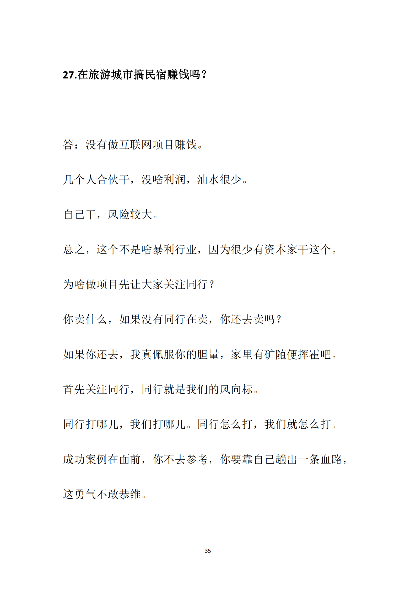

<!-- source-image-end -->
<!-- 原书第 43 页 -->

28.Mona老师，干中介怎么赚大钱啊？

答：中介本质就是销售。

干中介，收入取决于两部分：市场行情+个人能力。

一部分从业者积累经验年工，挖到了第一桶金，扎根城市成家立业，逐渐转为夫妻小店，坚守区域，用最小的精力，获得一定范围的最大回报。

极少数中介，依靠市场风口和个人销售能力，频频出单，或者碰到一个抢手的一手好项目，好运再碰到金主，一天签10单，偶尔发个财。

大部分中介，月收入在基本工资徘徊，游走在失业和跳槽的边缘地带。

我有个学员，叫啥名字不说了。

<!-- source-image-start -->

查看原书第 43 页影像

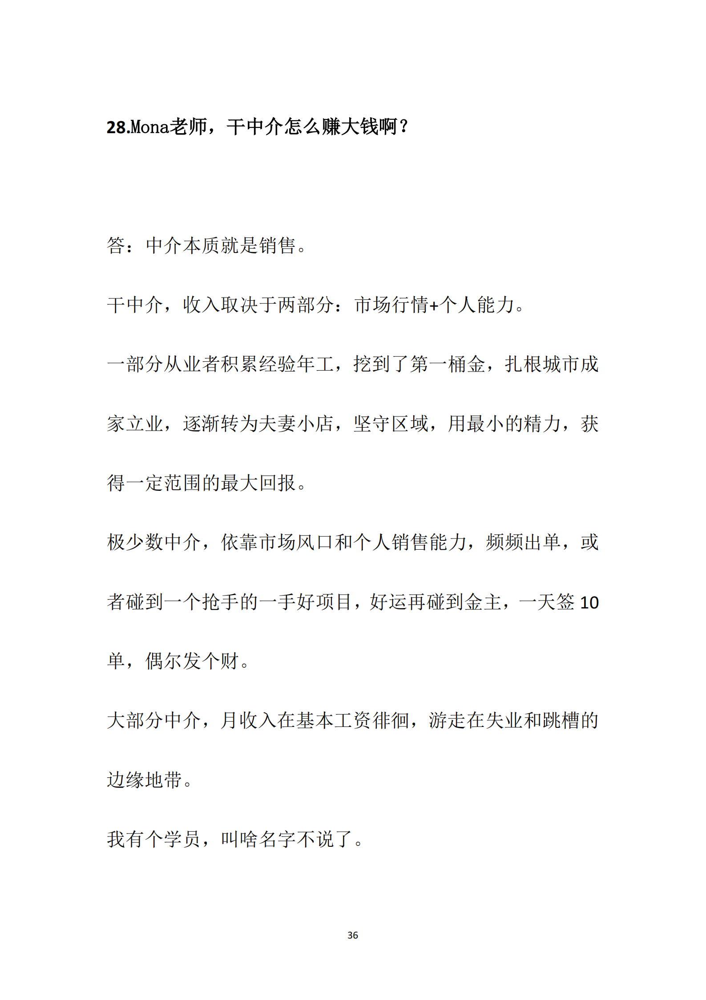

<!-- source-image-end -->
<!-- 原书第 44 页 -->

他啊，复制我。

他赚钱了。

他爸爸妈妈辞职了，帮他做流量。

他爸爸是开出租的，他妈妈是在服装厂打板。

他爸爸妈妈奋斗了12年，还住在成都郊区的老房子。

他爸爸妈妈帮他发了一年的朋友圈，就在成都春熙路买房了。

他成功的秘密是啥啊？

全家支持他，全家都跟他干。

全家都循环一个动作：做流量。

我还遇到一个人，他全家都在弄抖音。

白天全家写段子，拍段子，晚上全家都弄直播。

现在他们有800多万的粉丝，每月有20万的收入。

赚钱这事儿，就是全家齐心协力日一个点。

<!-- source-image-start -->

查看原书第 44 页影像

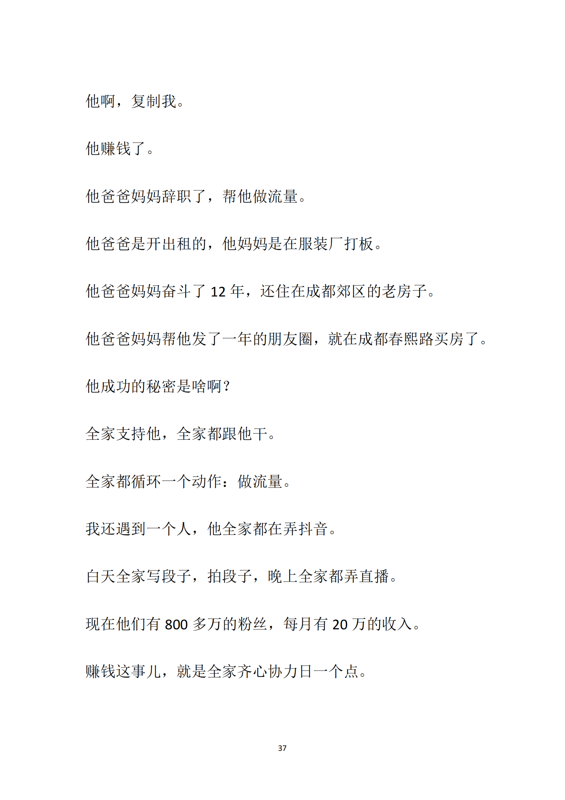

<!-- source-image-end -->
<!-- 原书第 45 页 -->

我在深圳，认识一个卖房的小姐姐。

这个小姐姐对我说：她爸爸妈妈干中介，她啊，也是干中介。

他们全家，一天到晚都在研究，怎么买房啊，怎么卖房啊，《穷爸爸富爸爸》到底说了啥做了啥。

你干中介的话，你不要当成一个工作，你要上升一个高度，当成是一辈子死磕的生意或事业，这样赚大钱的概率比较大。

（我的微信是1848636859）

<!-- source-image-start -->

查看原书第 45 页影像

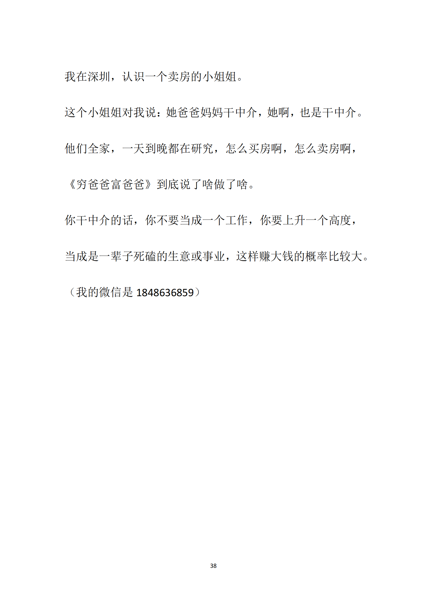

<!-- source-image-end -->
<!-- 原书第 46 页 -->

29.为什么大部分赚钱风口都是骗局？

答：很多所谓的风口，都是概念，包装出来的骗局而已。

这种骗局并不新鲜，每隔一段时间就会换个马甲继续出来割韭菜。

哪里有目光，哪里就有流量；哪里有流量，哪里就有生意。

不过靠概念炒起来的流量，来得快，去得也快，割的就是那些追求新鲜刺激、高回报、低风险的韭菜，基本上就是打一炮就跑的战术理念。

当你被这些概念成功吸引住了，往前一步，也许就是韭菜。

有两种人最容易受骗：一是被成功学洗脑的人，一天到晚只想一夜暴富，认为人脉就是钱脉，到处结交所谓的人脉。（当你不值钱的时候，你

<!-- source-image-start -->

查看原书第 46 页影像

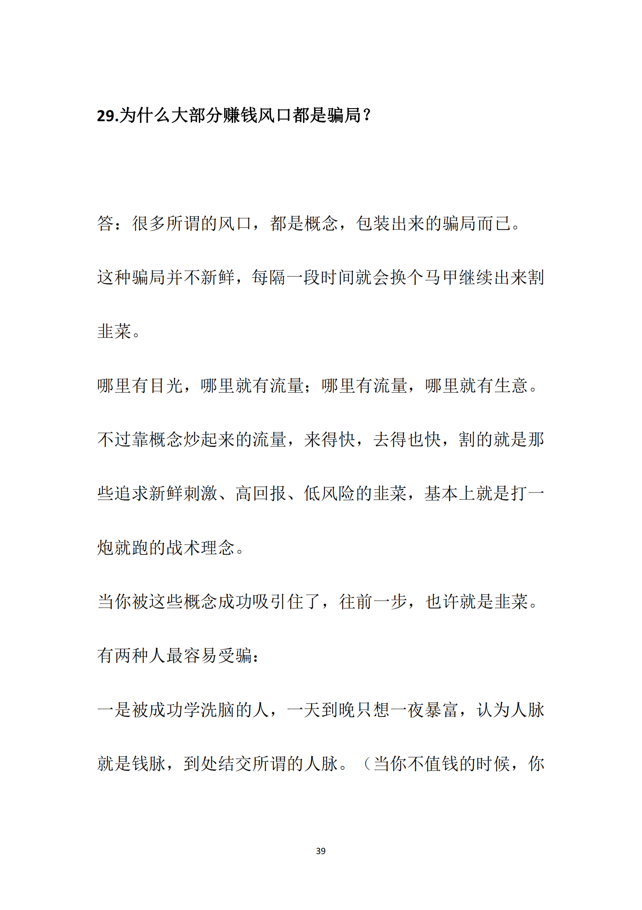

<!-- source-image-end -->
<!-- 原书第 47 页 -->

也吸引不到值钱的人）二是遇到困难的人，这种人一心想摆脱困境，很容易被人利用。

高手说谎，不会笨到全是假话，都是真真假假，假假真真，在一大堆谎言中夹杂几句特别真实的话，听的人往往就会信以为真。

现在，我们需要练就一种功夫，叫做阴阳眼。

我们的认知要比骗子更高一个维度，我们的手段要比骗子更高明。

高手说谎，喜欢在前面加一句：其实你没有必要完全相信我。

这句话反而会让你更容易相信他。

当你上当的时候，千万不要骂人。你要问一问，为什么这么容易相信别人？（我的微信是1848636859）

<!-- source-image-start -->

查看原书第 47 页影像

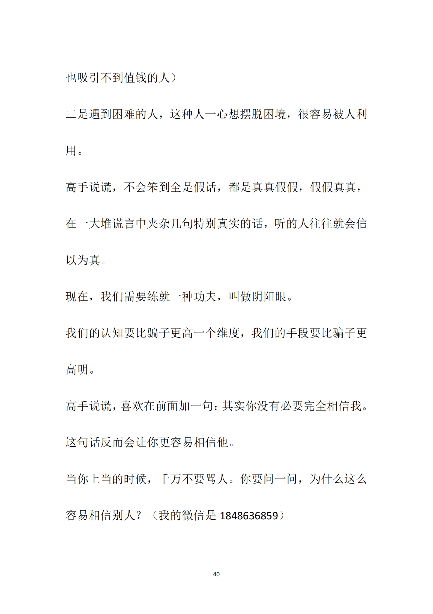

<!-- source-image-end -->
<!-- 原书第 48 页 -->

30.是赚钱还是买保险啊？

答：我们卖保险的初衷是什么？

只是简单的遇事儿、赔钱。

如果你有钱，不管什么人什么病，都可以解决。

但你把钱变成保险，就不是了。

所以，你只要赚到足够的钱，就行了。

现在通货膨胀这么严重，现金很宝贵的，现金为王。

把你的现金拿去赚钱，抵抗人生的基本风险挣到一百万就够

<!-- source-image-start -->

查看原书第 48 页影像

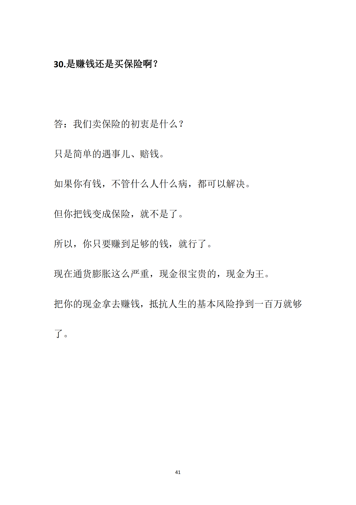

<!-- source-image-end -->
<!-- 原书第 49 页 -->

31.加盟一个品牌开店怎么赚钱啊？

答：第一，你要对商业有基本的分析能力，这件事儿到底是什么模式，在战略上是否可行，有多少利润，有哪些风险？

都要考虑。

第二，去实际经营的店内查看实际经营情况，核对商业的目标和结果。

第三，不要只听加盟总部说得有多好，如果你没有大量的市场调研，一定会被投其所好，结果就是被放弃的石头或者被收割的韭菜。

（我的微信是1848636859）

<!-- source-image-start -->

查看原书第 49 页影像

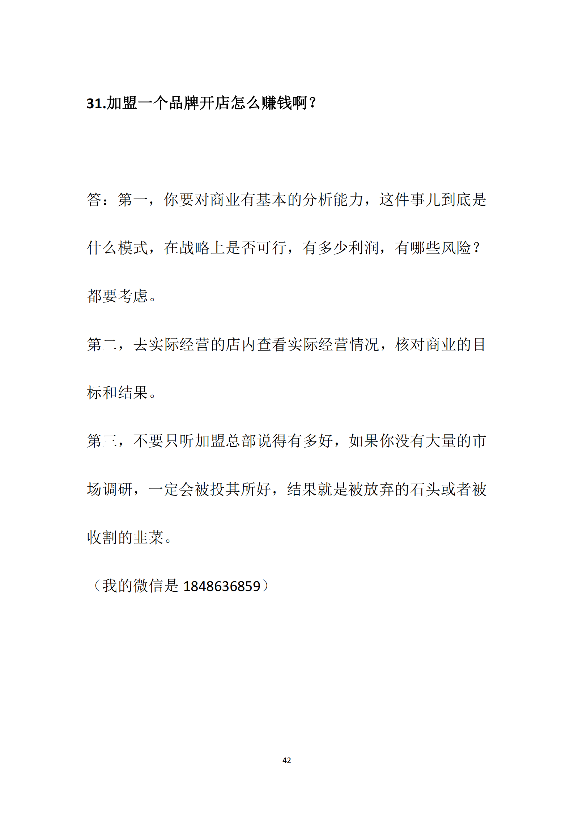

<!-- source-image-end -->
