<!-- 原书第 50 页 -->

# 第三章：赚大钱的秘密

32.做什么才能年赚千万？

答：做讲师，或做玄学，或卖滋补品。

33.为什么我的目标是年赚3000万啊？

答：一个人的成就是和自身欲望相匹配的。

如果你能赚3000万，就不要想着赚300万。

想赚300万，就是放弃赚3000万的机会。

如果你的目标是年赚300万，大概率赚不到100万。

如果你的目标是年赚3000万，那么是有可能赚到一两千万

<!-- source-image-start -->

查看原书第 50 页影像

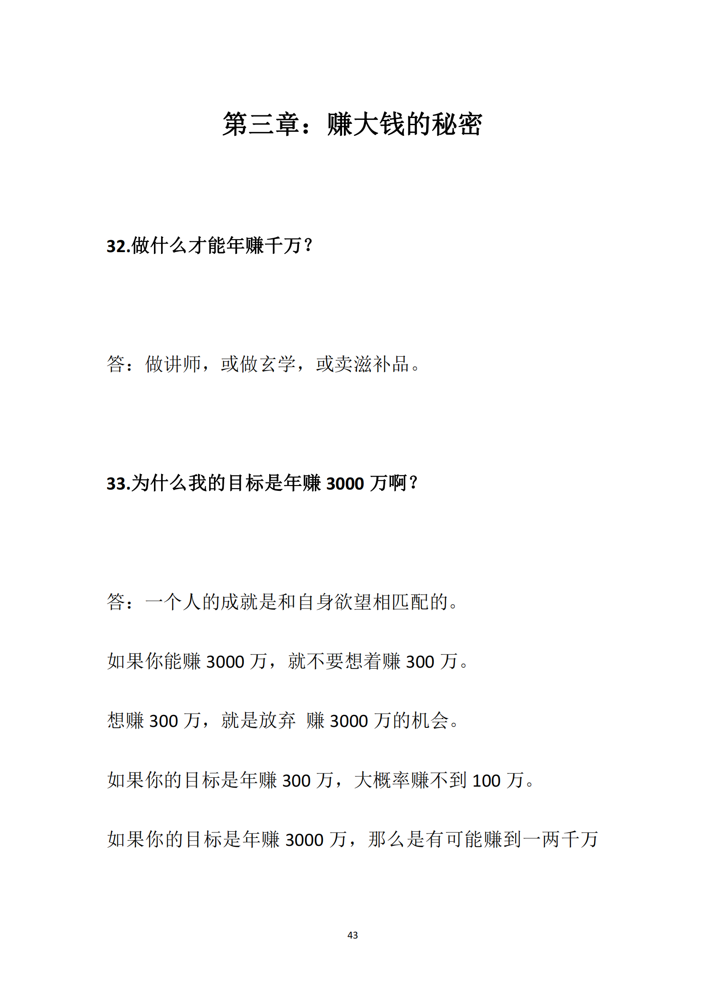

<!-- source-image-end -->
<!-- 原书第 51 页 -->

的。

你的目标，会让你思考，寻找正确的方向。

方向对了，才能做出正确的事儿。

方向错了，努力再多也不一样有效果，还有可能亏钱。

人活着，做不到年赚3000万，活着又有什么意思呢？

现在年赚百万，大家都觉得没有什么。

年赚千万，是不是幸福感就会变强？

要是你是出类拔萃之人，可以跟着我往前走走。

当别人都在走时，你习惯了跑，是不是能得到常人得不到的东西，哈哈·……（我的微信是1848636859）

<!-- source-image-start -->

查看原书第 51 页影像

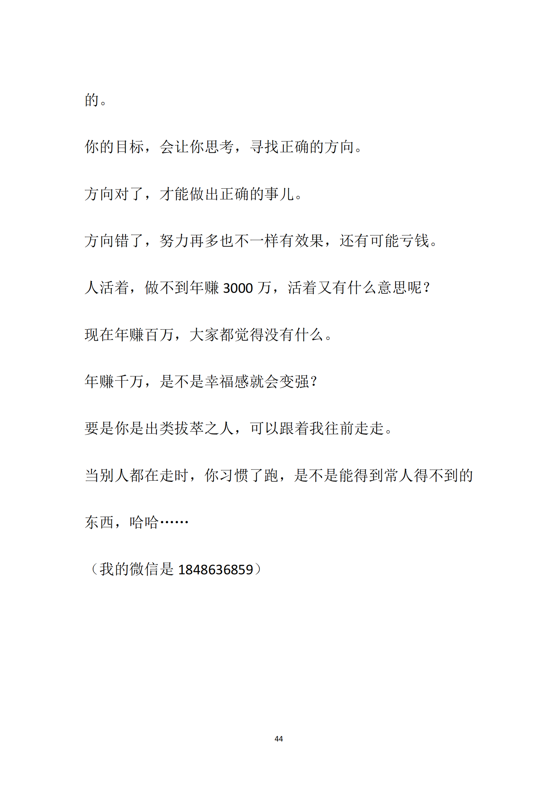

<!-- source-image-end -->
<!-- 原书第 52 页 -->

34.为什么想赚大钱，就要学会分钱？

答：聪明人，会考虑如何让双方利益最大化;普通人，只想让自己的利益最大化;傻逼的人，想让别人赚不到钱。

35.为什么赚钱要顺应人性的劣根性啊？

答：大多数直接对人真正有价值的东西，往往很难赚钱。

大多数赚钱的生意，都需要符合人的劣根性。

只有高认知的人，才能直接消化吸收真理，而普通人只想满足情绪。

所有做生意赚钱的高手，一定是先穿透对方的内心，满足了

<!-- source-image-start -->

查看原书第 52 页影像

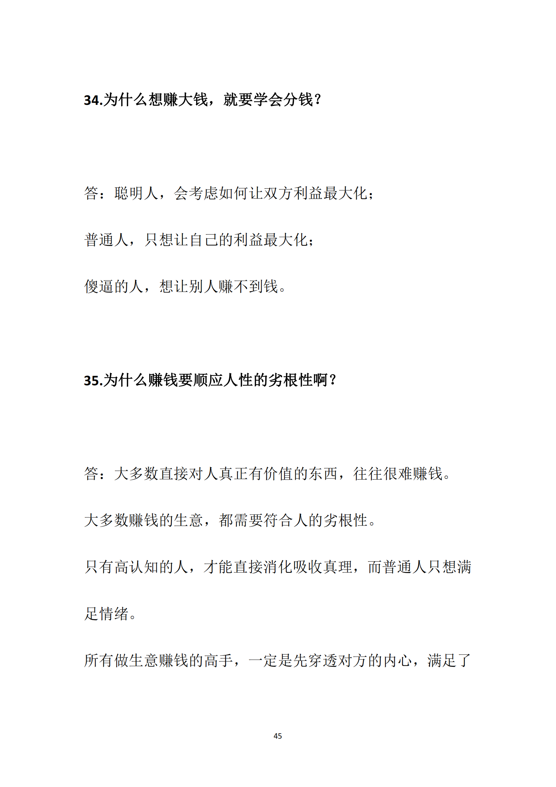

<!-- source-image-end -->
<!-- 原书第 53 页 -->

对方的劣根性。

无论一个人多烂，只要你赞美他，鼓励他，让他自信，他就会兴高采烈地为你卖命。

36.为什么赚钱就是学个忽悠人的本事儿？

我理解的赚钱，就是学个本事去忽悠人。

忽悠的人多了，也就成了大师。

人生原本就是一本正经的胡说八道。

我们所看到的东西，都是先虚后实。

以前哪有啥城市，乡村，法律，道德，文明....这些玩意儿啊。

这些玩意儿，都是虚构出来的。

傻点儿的，会被这些东西催眠。

<!-- source-image-start -->

查看原书第 53 页影像

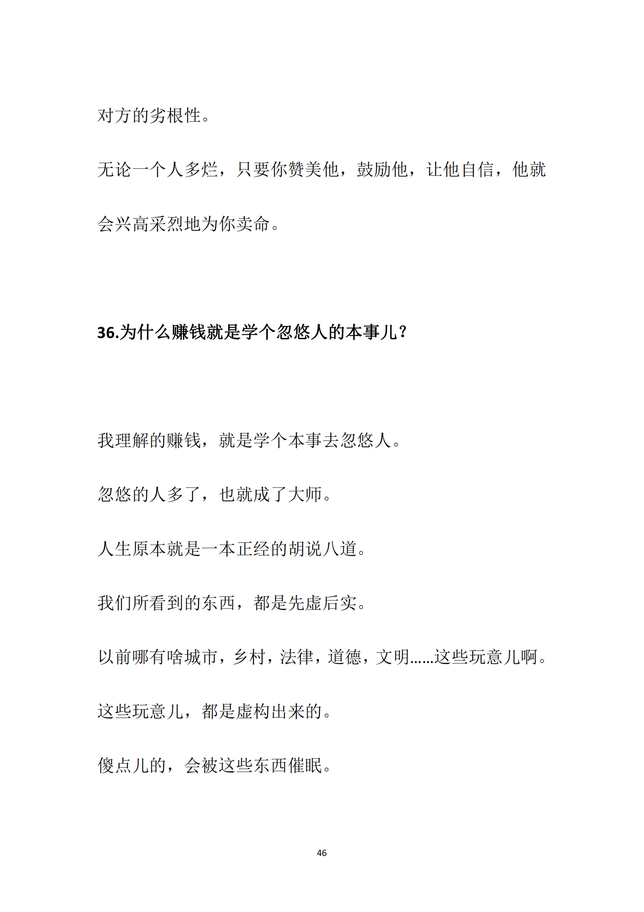

<!-- source-image-end -->
<!-- 原书第 54 页 -->

开窍的人，只是把这玩意儿当笑话。

就说营销和策略，当笑话学，一会儿就学会了。

当"老祖宗"来学，一辈子都学不会。

你能赚多少钱，就看你能忽悠多少人了，哈哈..想世世代代学忽悠的，可报名咱们的VIP，我给你一对一辅导。

（我的微信是1848636859）

37.为什么赚钱必须上战场啊？

答：如果一个人整天跟你讨论这个战略，那个局势，这个热搜，那个政策的，你要头也不回地远离他。

这种人离的越远越好，他们就是一辈子碌碌无为，永远上不了战场，也赚不了钱的人。

<!-- source-image-start -->

查看原书第 54 页影像

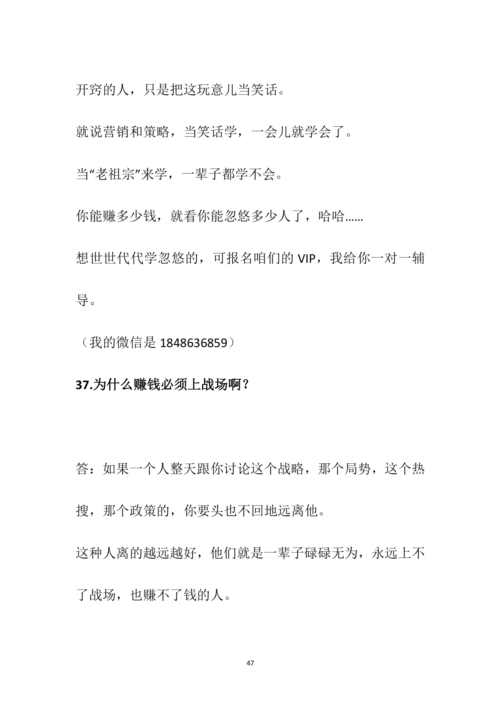

<!-- source-image-end -->
<!-- 原书第 55 页 -->

商业大佬的战略你都背下来能买房吗？

分析叙利亚局势能帮你孩子安排学校吗？

xX政策给你爸妈在三甲医院挂上号了吗？

鼓吹佛系、躺平的大V，自己背地里很勤奋。

说人间不值得的人，自己私下又是开公司又是做节目。

宣扬逃离北上广深的人，早已在北京拿到了2个亿的融资。

天天嘴里都是国家大事，崇高理想的人，资产依然是负数。

不要老看他们说了什么，你要看他们做了什么。

每一种思想思潮背后都是生意，而不是当成圣旨供奉起来自欺欺人。

<!-- source-image-start -->

查看原书第 55 页影像

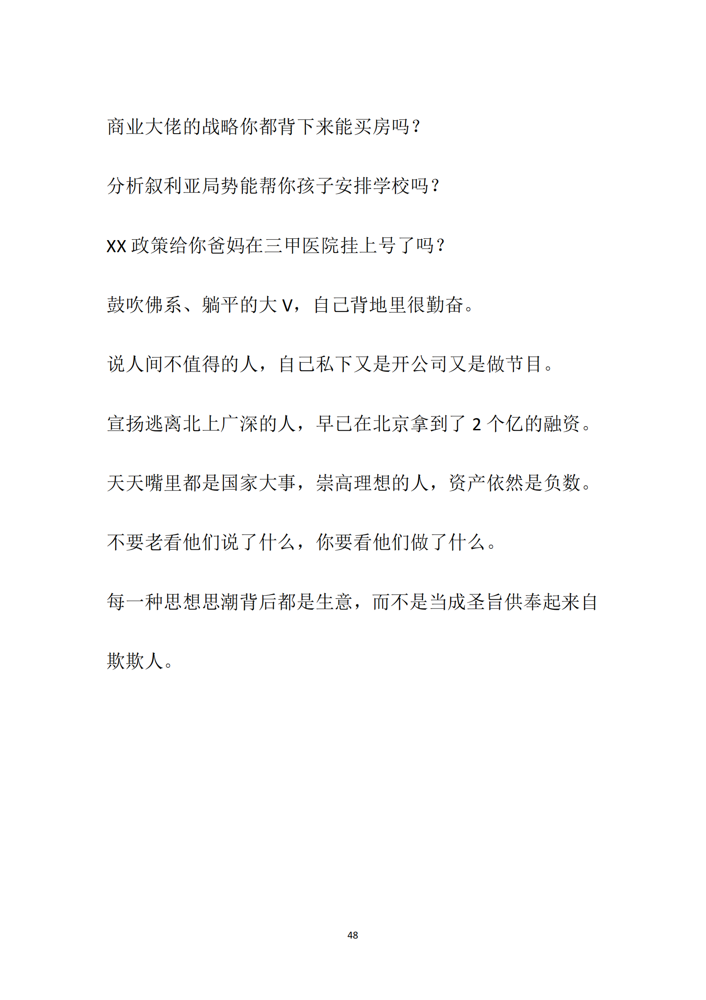

<!-- source-image-end -->
<!-- 原书第 56 页 -->

38.什么是正确的赚钱姿势啊？

答：在你动手之前，就已经想到结果。

做销售，在你开口之前就要想到对方是什么反应。

我写书，动笔之前，就知道这本书给我带来多少收入，30万还是50万？

创业做生意，无论是融资，还是实打实的经营利润，动手之前，都要预知未来。

凡事预则立，不预则废。

牛人的眼光，都要看到3年5年，甚至10年以后的趋势。

每一步都要留余量，再把初始的设想打个5折，给意外留出应有的位置，如果这样的结果你仍然可以接受，这件事儿就会变得十分靠谱。

<!-- source-image-start -->

查看原书第 56 页影像

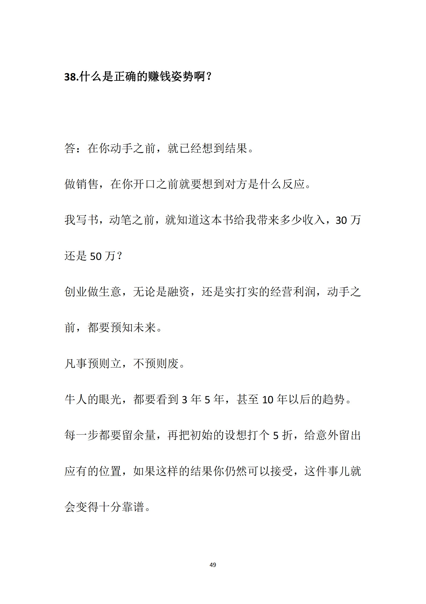

<!-- source-image-end -->
<!-- 原书第 57 页 -->

记住：给预期打个折，给意外留出位置，遇事这么做，大概率能成！

39.为什么互联网公司都是烧钱烧起来的？

答：互联网运营的本质，其实就是流量的生意。

很多互联网公司起步，都是烧钱，搞补贴，抢流量，等用户形成了使用习惯再赚钱。

所以，你想做一家互联网公司，首先你得烧得起。

滴滴打车，亏了100多亿，还没有盈利。

因为出租车运营平台本身就是微薄利润，相比于滴滴补贴开拓市场、大量扩充人员，这点利润实在是杯水车薪。

为什么国内的出租车大多很破，服务很差，司机生猛，但是

<!-- source-image-start -->

查看原书第 57 页影像

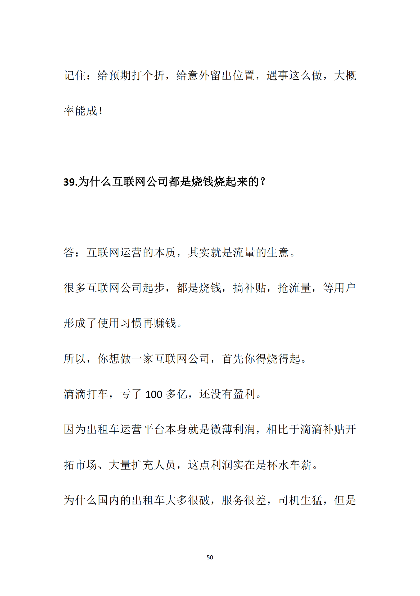

<!-- source-image-end -->
<!-- 原书第 58 页 -->

依然能活下来？

恰恰是因为这种状态符合市场的规律。

滴滴加的几块钱，远远不够支付这份服务成本。

如果你想知道什么是“赚钱的滴滴”，参考日本。

日本的出租车，起步价30-40元。

（我的微信是1848636859）

40.为什么要习惯性闷声发大财？

答：大多数赚钱的事情，往往不适合公开。

闷声发大财才是最好的。

名气可以用来赚钱，但不要拿赚钱的本事来换名气。

人有了一定的名气，要多想想怎么下山。

<!-- source-image-start -->

查看原书第 58 页影像

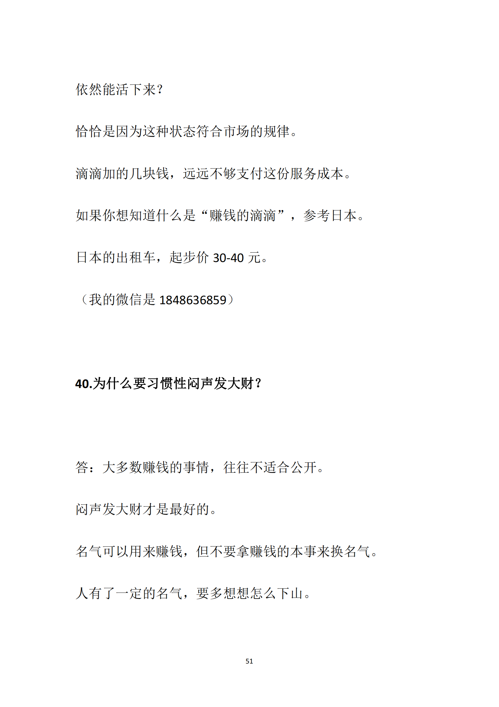

<!-- source-image-end -->
<!-- 原书第 59 页 -->

该下山的时候，一定要下山。

我啥时候下山啊？

被动收入稳定在50万/年，立马下山。

下山了，干啥啊？

终身做一对一辅导。

赚钱多少都无所谓，就是老老实实帮学员解决问题。

人活着，不能一直往前冲。

该下山的时候，一定要下山。

老往前走，易缺氧。

（我的微信是1848636859）

<!-- source-image-start -->

查看原书第 59 页影像

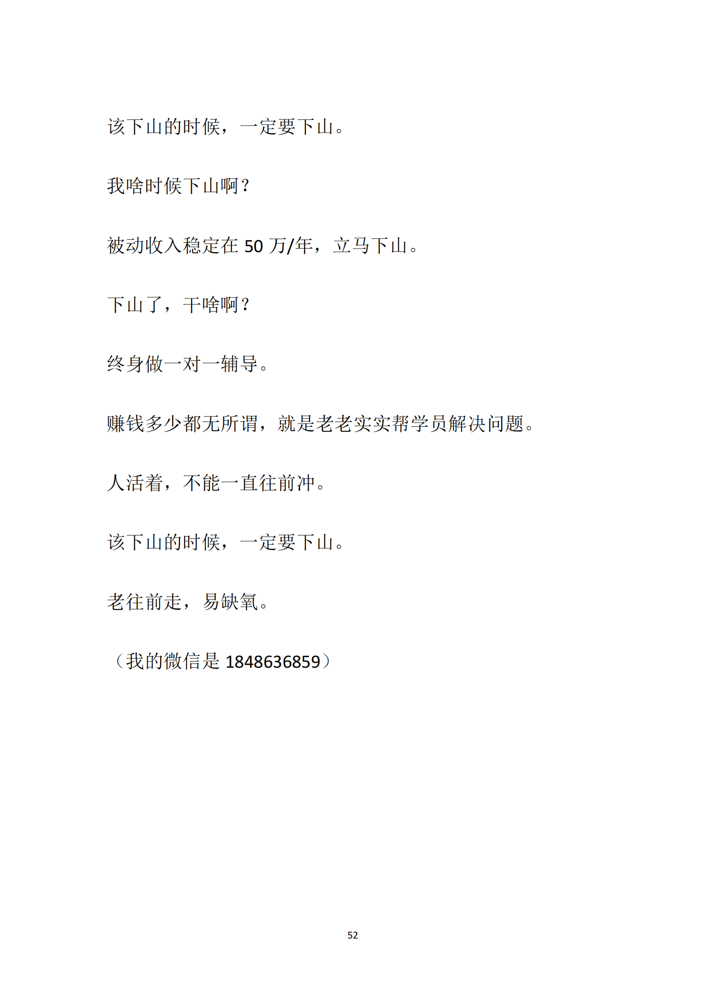

<!-- source-image-end -->
<!-- 原书第 60 页 -->

41.为什么苹果公司从不打击盗版产品啊？

答：市场经济谁也不保护，只拒绝暴力。

能做到凭自身实力不惧怕抄袭，也是一种实力。

不要打击盗版产品。

产品有价值，客户还是愿花大价钱。

苹果手机，有多少人山寨？

苹果公司打击过人家没有？

没有。

每年还是出一个系列，继续轰炸。

我们都说华为牛逼，其实华为所有的销售额加起来，只有苹果公司的25分之1。

如果你更强，盗版你的人是在帮你。

<!-- source-image-start -->

查看原书第 60 页影像

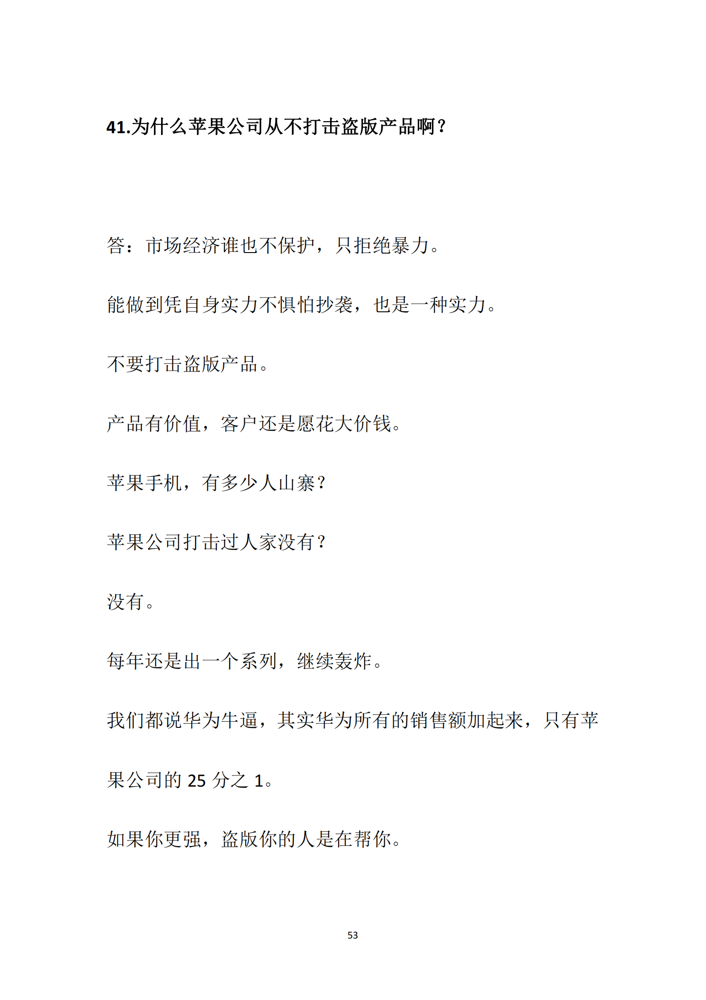

<!-- source-image-end -->
<!-- 原书第 61 页 -->

如果你更弱，盗版的人才能赢你。

比别人更弱，本事就是印证竞争淘汰的天道。

42.为什么99%的人一辈子都是穷B?

答：99%的人不尊重市场，不尊重消费者。

做生意，有没有想好谁会来买我的东西，有多少人会买，能支付的单价是多少？

沟通谈判，有没有调查过对方是谁，对方喜欢什么，对方需要什么？

求职应聘，有没有调查过公司做什么，我有哪些能力可以被对方所有？

在这个社会上，你的每一句话，每一个动作，每一个表情，

<!-- source-image-start -->

查看原书第 61 页影像

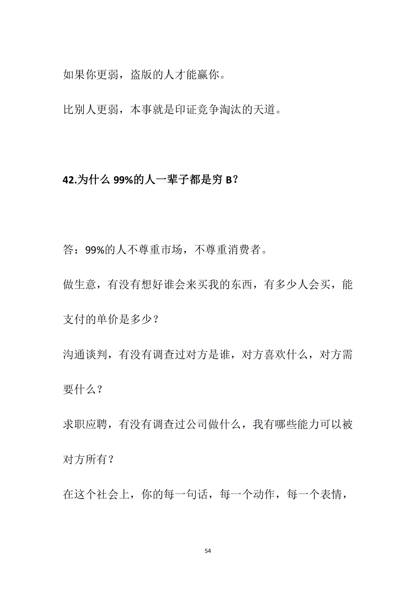

<!-- source-image-end -->
<!-- 原书第 62 页 -->

如果不能给你加分，必然给你减分。

当你糊弄自己，市场就会淘汰你，客户就会拒绝你。

贫穷就像编码一样，蚀刻在基因里，病入膏盲者，无可救药也！

43.为什么真正牛逼的人都当是老板的？

答：很多人搞技术搞得很好，但是真的到了做商业变现的时候，立马晕头转向。

公司技能最全面的人，一定是老板。

天天搞业务，公司就会挂掉;天天搞公司，业务就没人做。

如果想把公司继续下去，就要一边做业务，一边招人。

<!-- source-image-start -->

查看原书第 62 页影像

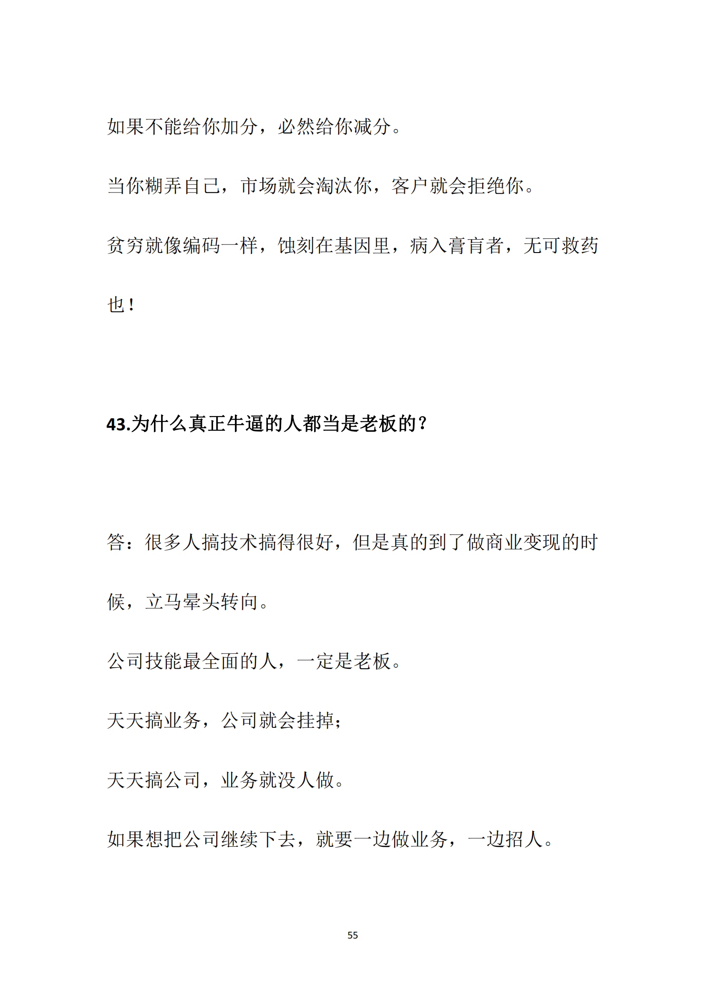

<!-- source-image-end -->
<!-- 原书第 63 页 -->

老大存在的意义就一个，流水线变制度，制度变文化，文化就是约定俗成的东西。

大家天天聊东西就叫文化，天天聊的东西就叫制度，天天聊的东西就叫流水线。

流水线变制度，制度变文化。

最高深的技能，其实是管理学。

最深奥的能力，是运用人心的能力。

（我的微信：1848636859）

<!-- source-image-start -->

查看原书第 63 页影像

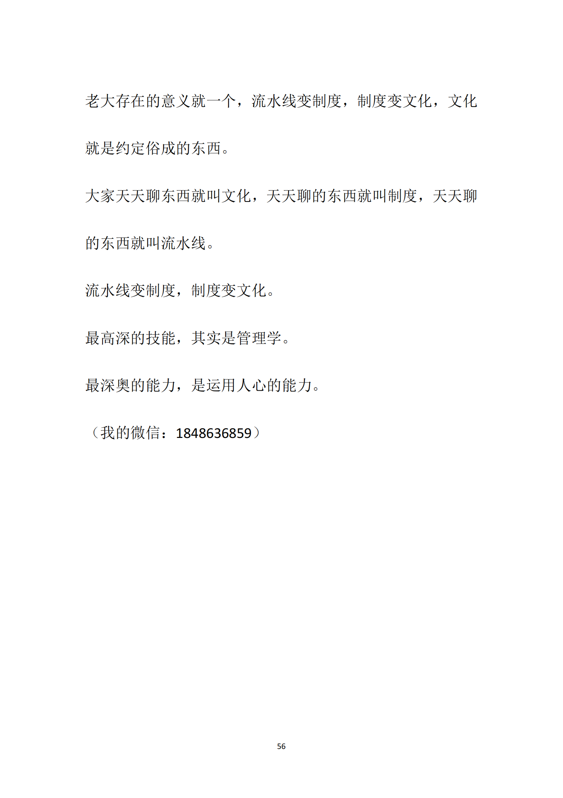

<!-- source-image-end -->
<!-- 原书第 64 页 -->

44.为什么不想看人脸色的人一辈子都是穷B？

答：很多人觉得，当大老板不用看人脸色。

这样想的人，妥妥一辈子做底层。

小老板要看客户的脸色，看工商的脸色，看物业的脸色。

大老板，要看投资人的脸色，看合作伙伴的脸色，还要看员工的脸色。小公司十几张脸，大公司几百上千张脸。

为什么会有人认为当老板不用看脸色？

因为他们一辈子都没有机会当老板。

那么，看脸色这么憋屈的事儿，是不是无解？

也不是，在有钱人眼中，事情不叫看脸色，一切都是交易。

<!-- source-image-start -->

查看原书第 64 页影像

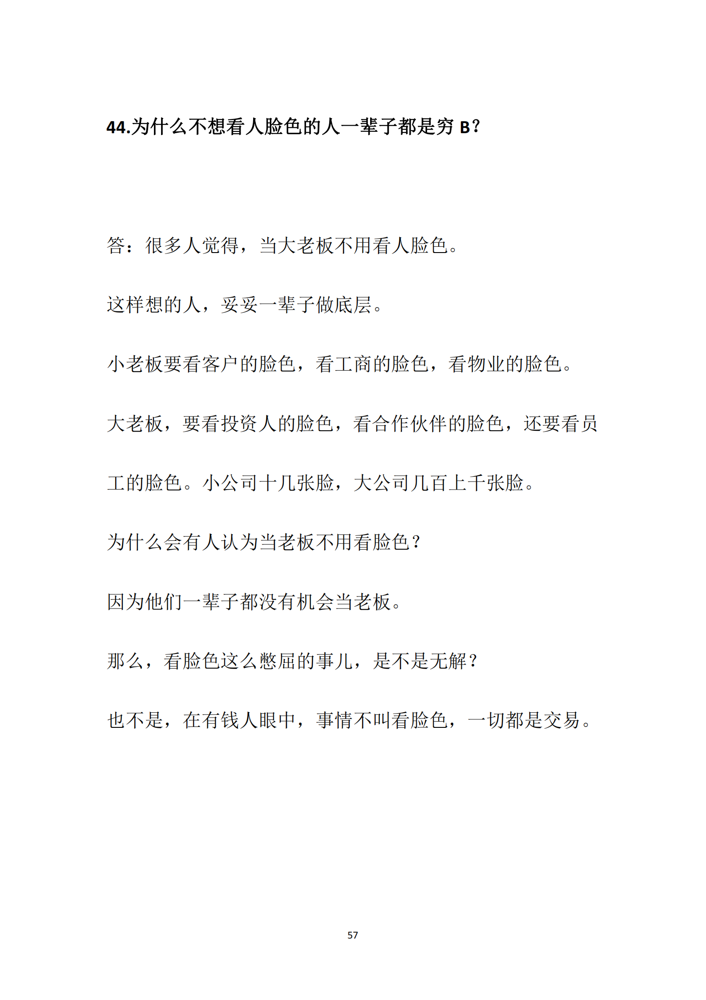

<!-- source-image-end -->
<!-- 原书第 65 页 -->

45.年赚100万是一种什么样的体验？

答：先开始做赚钱的事情。

年赚100万需要什么样的能力，只有自己体会一遍才能明白。

先把自己推进赚钱的深渊，等你挣扎出头了，就入门了。

46.我对赚钱对理解是什么？

答：财不入急门。

要是你太着急赚钱的话，一定赚不到钱。

钱是慢慢的赚，在慢慢赚的过程中，找到感觉了，把这个感觉放大100倍1000倍。

<!-- source-image-start -->

查看原书第 65 页影像

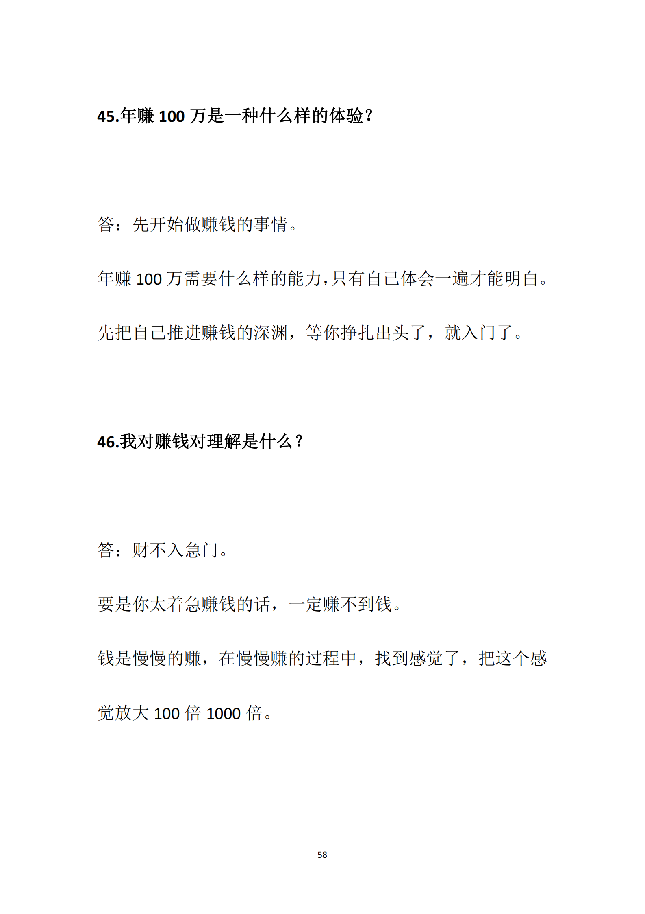

<!-- source-image-end -->
<!-- 原书第 66 页 -->

47.为什么日赚10万要打磨流水线？

答：做事业，赚钱，最重要的一点是：不能停。

想出人头地，就不要离开自己的办公室。

离开自己的办公室，野心就没了。

反正我是一天24小时在办公室呆着。每天讲课8个小时，每天写作8个小时。每天还要处理七八个疑难杂症，回复50个消息，回答学员几十个问题。

只有大脑保持高度专注、自制，才能行云流水地处理每一件事。

也就是把流水线打磨出来，日赚10万小意思。

流水线打磨不出来，日赚10万就稍微有点儿难。

<!-- source-image-start -->

查看原书第 66 页影像

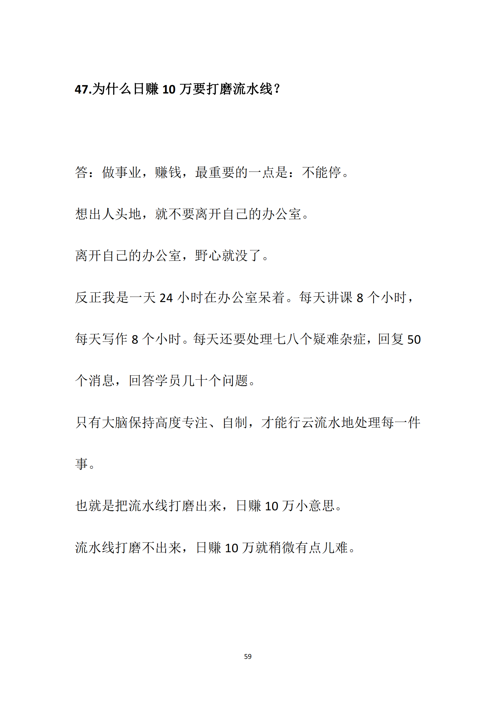

<!-- source-image-end -->
<!-- 原书第 67 页 -->

48.为什么暴富只是故事，底层人太难上去了？

答：第一年赚100万。

第二年赚1000万。

第三年赚1亿。

第四年开始摇摆不定。

第五年遇锤破产，成了老赖。

这是当下很多企业家的真实经历。

什么叫修行啊？

该下山的时候，下山就是了。

现在我要做的，不是扩张，是收缩。

项目越来越专一，流量渠道越来越专一。

习惯性对着一个项目猛冲猛干。（我的微信：1848636859）

<!-- source-image-start -->

查看原书第 67 页影像

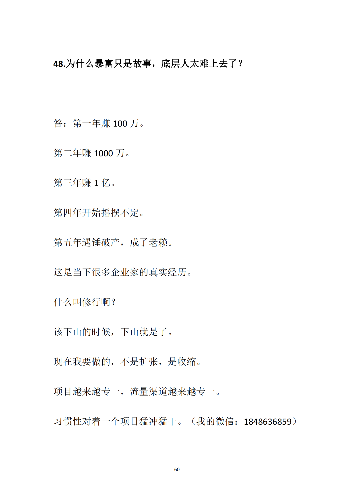

<!-- source-image-end -->
<!-- 原书第 68 页 -->

50.如何挂羊头卖狗肉赚钱？

答：先卖承诺，收到钱了，再变脸，参考所有的房地产销售公司。

51.如何卖服务赚钱？

答：跟着有结果的人走，要么复制他们，要么超越他。

52.如何借风口赚钱？

答：先找到风口再说。一般的风口都是在女人比较多的地方。

哪儿的女人多，哪儿的风口就多。

<!-- source-image-start -->

查看原书第 68 页影像

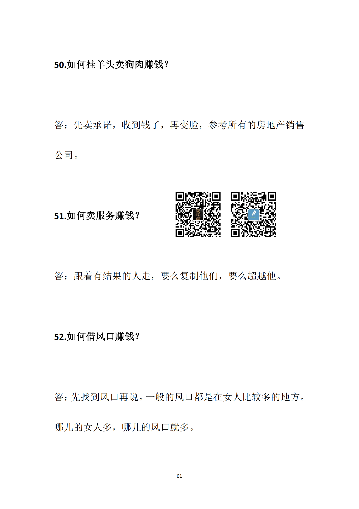

<!-- source-image-end -->
<!-- 原书第 69 页 -->

53.如何靠垄断赚钱？

答：帮已经实现了垄断的公司或企业打工即可。

54.为什么《孤注一掷》里的黑老大失败了？

答：就是他的小弟，放走了一个人。

要是他小弟不放走这个人，他失败的概率很低。

很多公司失败，就是出了“叛徒"。

这个小弟，为什么要放走这个人啊？

就是这个人太美了。

自古英雄难过美人关。

一个女的，很丑，她生活多灾多难，大家没感觉。

<!-- source-image-start -->

查看原书第 69 页影像

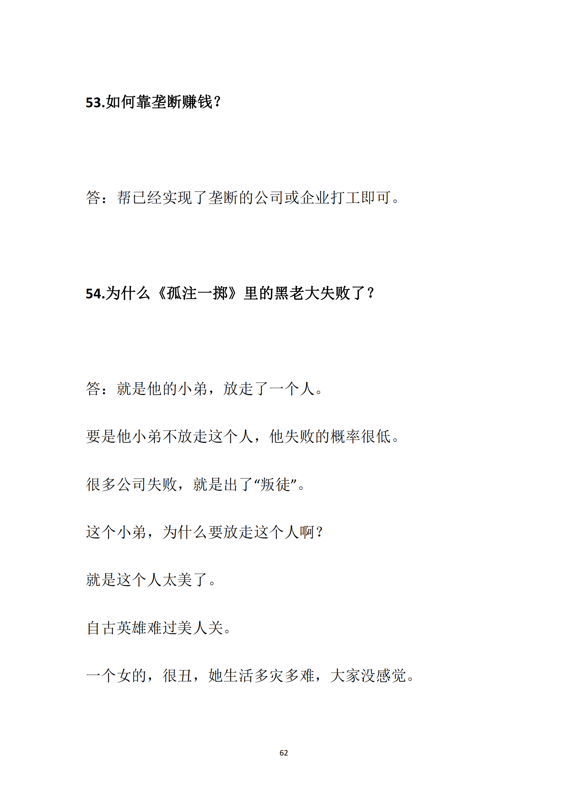

<!-- source-image-end -->
<!-- 原书第 70 页 -->

要是这个女的很美，她生活多灾多难，大家都同情她。

美，永远都是奢侈品。

很多老大，为了让小弟过美人关，老带他们去风月场见识各类野玫瑰。

小弟见的美女多了，自然会对美才彻底失去兴趣。

55.看了《孤注一掷》，我最大的感触是什么？

答：不要迷恋什么高薪。

就在国内踏踏实实打螺丝。

我们不干涉任何国家的内政，这意味着什么？

中国JC没有境外执法权。

而且还跟很多国家没有建立引渡条约。

<!-- source-image-start -->

查看原书第 70 页影像

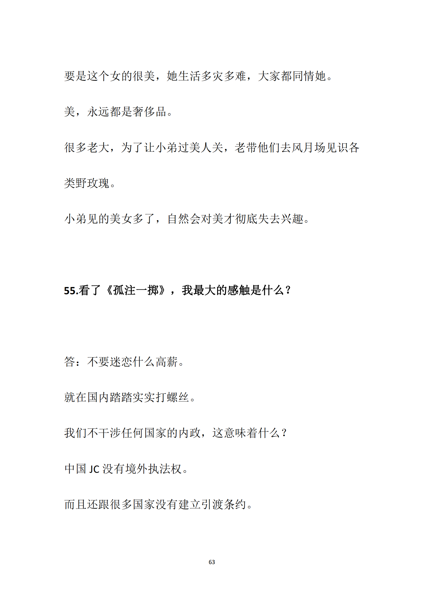

<!-- source-image-end -->
<!-- 原书第 71 页 -->

啥意思啊？

我在国内贪了1000亿，我跑到美国去了，你没法抓我？

为啥啊？

咱跟美国没有引渡条约（这个自行去百度）。

56.《孤注一掷》里真正的老大是谁？

答：在《孤注一掷》这个电影里，死掉的老大，不是真正意义上的老大。

电影最后陆某说自己要立功，不是给警察立功，而是给老大立功。

他拼命想要销毁证据，无非是为了保护自己的女儿。

真正意义上的老大，是个老外。

<!-- source-image-start -->

查看原书第 71 页影像

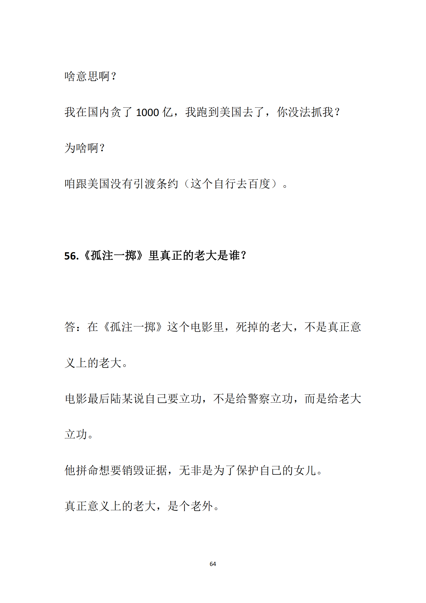

<!-- source-image-end -->
<!-- 原书第 72 页 -->

这个老外，在镜头的最后出现了。

他拿个筹码，气定神闲，像是什么事都没有发生过。

我们所看到的恶，都不是真正意义上的恶。

真正意义上的恶，是没法呈现的。

当老大，最重要的是什么？

把自己隐起来，让他人冲锋陷阵。

这个老大啊，就是跑关系，把这些冲锋陷阵的人保护起来。

57.为什么《孤注一掷》陆经理要把女儿交给潘生？

什么是镰刀？

掌握核心资源，参与分配的人。

镰刀所做的事儿都是在符合常识的前提下绝对反人性。

<!-- source-image-start -->

查看原书第 72 页影像

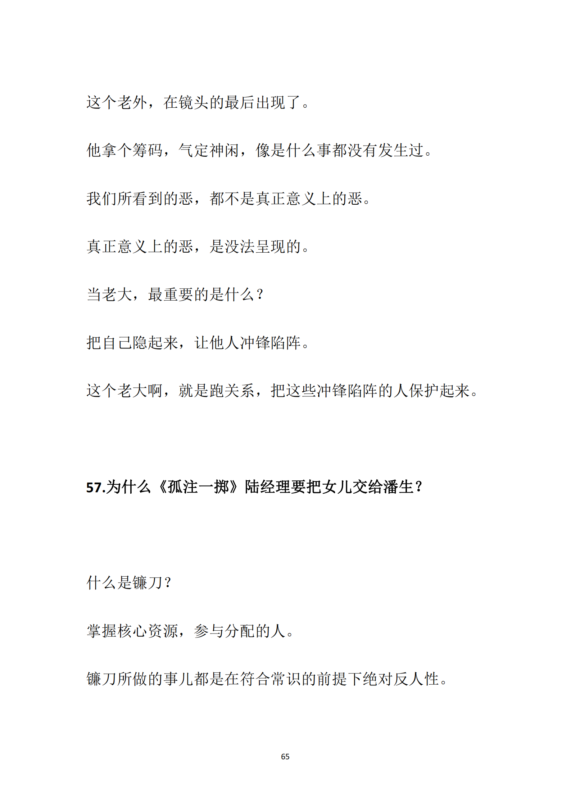

<!-- source-image-end -->
<!-- 原书第 73 页 -->

电影《孤注一掷》的结局，陆经理在被捕前，将女儿托付给潘生，看似不可理解。

看过电影的一定知道，潘生在获救之前，可是受尽陆某的折磨，过着人间炼狱的日子。

女儿，岂能托付给这死敌和仇家？

然而陆某就这么做了，潘生也不负所托。

这里面的道理其实很简单：一个心地善良的正派人，一定会尽力保护无辜的儿童;而一个利用人性弱点实施诈骗和虐待的，其识人之明也肯定超过那些岁月静好的人。

所以李木子看不穿何非，陆经理却可以相信潘生。

很多小单纯，小天真，以为大家都是人，我对你好，你应该好好待我。

<!-- source-image-start -->

查看原书第 73 页影像

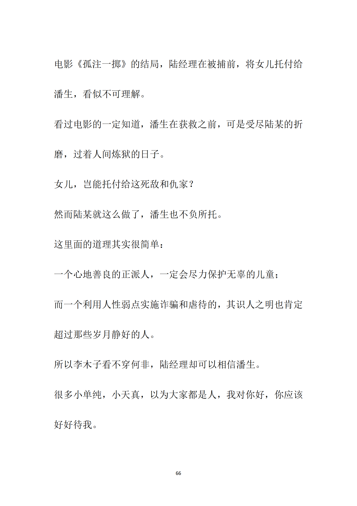

<!-- source-image-end -->
<!-- 原书第 74 页 -->

我这么信任你，你也不能骗我。

我对你掏心掏肺，你也得帮我。

大家别忘了，人都有动物的本性，趋利避害，贪婪无度，遇到人性差点儿的，不是倾家荡产，就是死于非命。

（我的微信：1848636859）

<!-- source-image-start -->

查看原书第 74 页影像

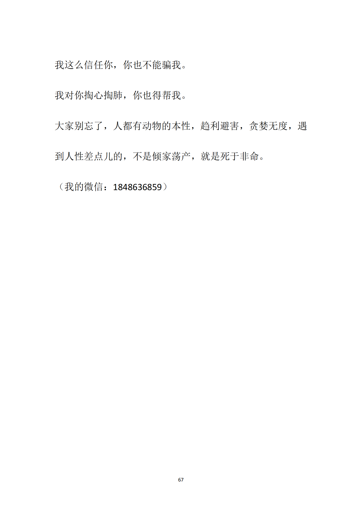

<!-- source-image-end -->
