<!-- 原书第 75 页 -->

# 第四章：穷人逆袭之路

58.为什么向上社交是一句彻头彻尾的谎言？

答：很多人喜欢讲，人要向上社交，这句话是一句彻头彻尾的谎言。

正确的做法是永远不要开口讲这几个字：向上社交。

先帮大佬解决两次问题，大佬自然会记得你，这才是一个正常的人际交往。

之所以有那么多人中计，是因为大多数人在为人处事/人情世故上没有人教。

牛逼的家教，都是祖传的。

类似某某家训一类的书啊，没事儿翻翻，确实能学到很多东

<!-- source-image-start -->

查看原书第 75 页影像

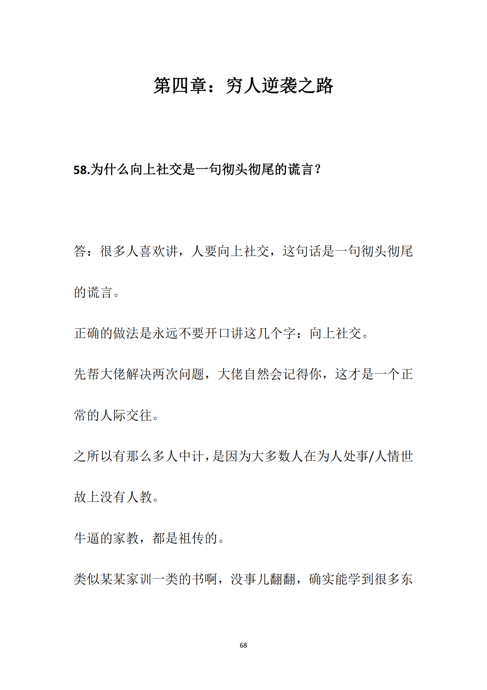

<!-- source-image-end -->
<!-- 原书第 76 页 -->

西。

尤其是消极的家训，更是价值连城。

至于相当积极，符合主旋律的教训，多是口号，多是忽悠。

类似《朱子家训》，300字左右，含金量有多高，得问问从政的朋友。

很多家训是显性的，真正牛逼的家训，是隐性的，是秘而不宣的。

小孩子刚识字时，就天天聊这个。

一般而言，都是30岁、40岁的人在学的东西。

在某些家族，小孩从3岁就开始学了，先学礼，再学理，理有了学道，道有了学术。

为什么有些名门望族，300年过去了，他还在。

600年过去了，他还在。

<!-- source-image-start -->

查看原书第 76 页影像

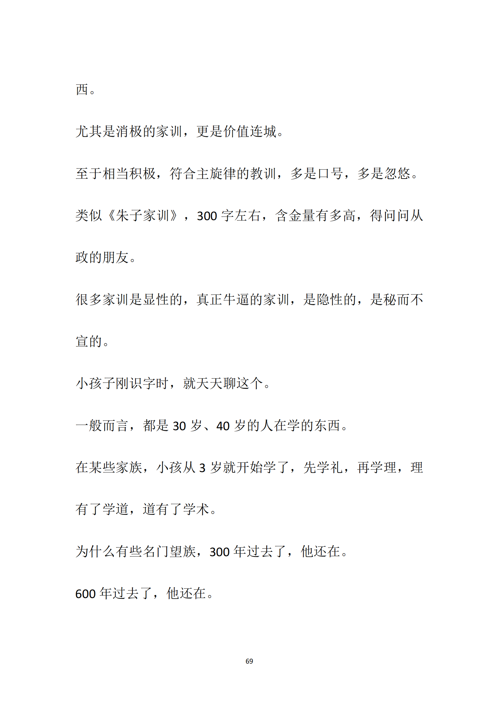

<!-- source-image-end -->
<!-- 原书第 77 页 -->

900年过去了，他在啊。

他有祖传秘方，家训。

地主的小孩，还是地主，基因是可以传承的。

某些时候，思想也是可以传承的。

（我的微信：1848636859）

<!-- source-image-start -->

查看原书第 77 页影像

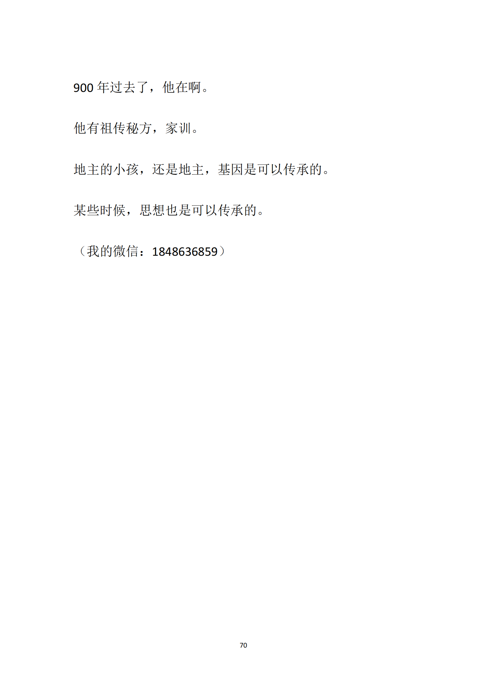

<!-- source-image-end -->
<!-- 原书第 78 页 -->

59.为什么学校不会教你怎么赚钱？

答：课本对你的要求是，怎么当一个好学生，将来当一个好工人。

没有任何一个课本告诉你，该怎么当一个好商人，怎么成为一个企业家，怎么挖掘市场，如何满足消费者的需求，怎么创造市场的价值。

没有任何一个课本告诉你，该怎么赚钱。

因为经营一座城市、一家公司，底层人民是城市最坚实的社会基础，正因为有了底层人民，才能诞生白领中产，才能产生富人阶层。

底层人民进城，就好比游戏里的新手村，你把新手村灭了，游戏自然没人玩了。

<!-- source-image-start -->

查看原书第 78 页影像

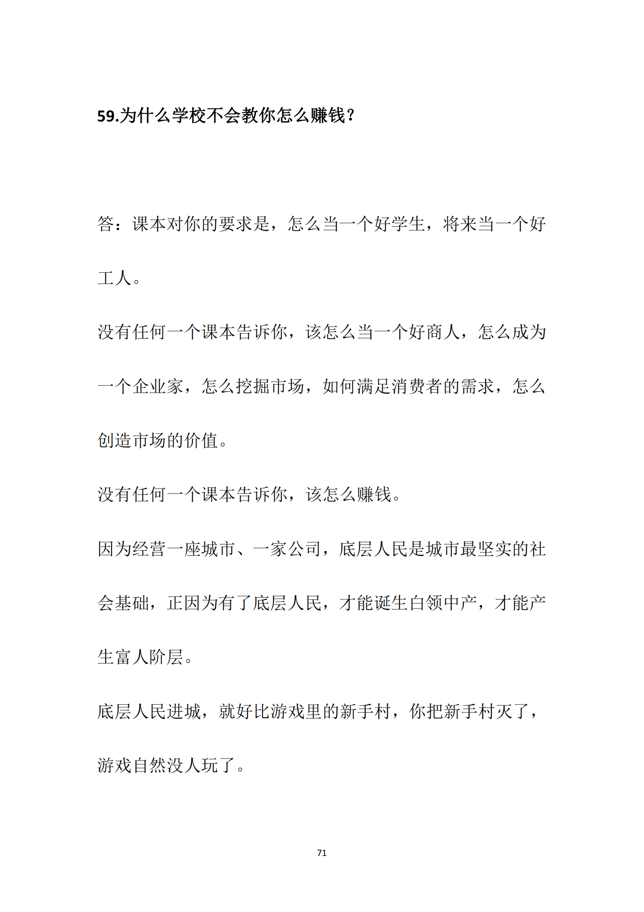

<!-- source-image-end -->
<!-- 原书第 79 页 -->

这个社会的三观，对于做生意，对于商人多是击的。

但反过来，如果一个人总是击别人赚钱，这辈子也不会有发财的可能。

你要做一个好学生，就做不了一个好商人，好企业家。

（我的微信：1848636859）

<!-- source-image-start -->

查看原书第 79 页影像

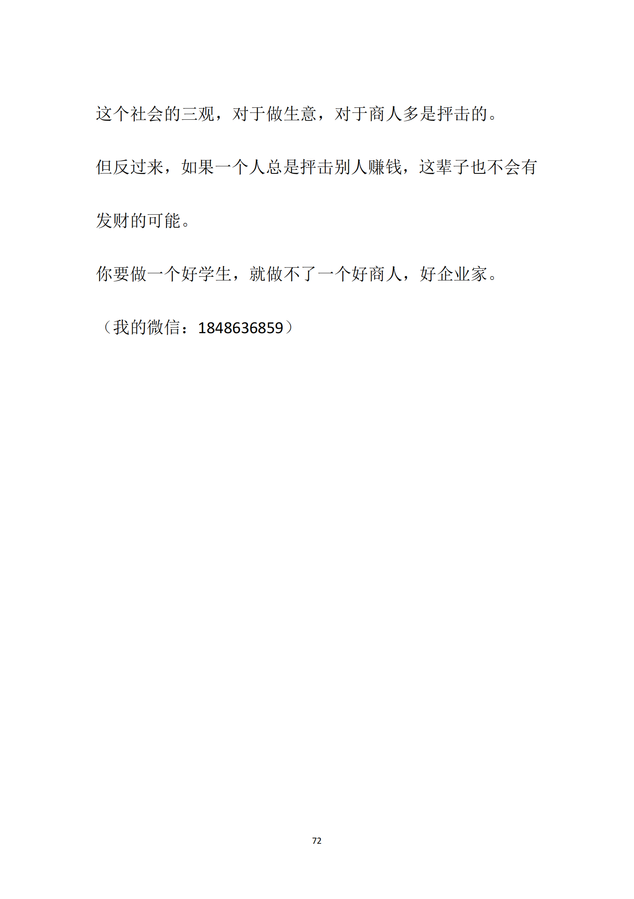

<!-- source-image-end -->
<!-- 原书第 80 页 -->

60.为什么穷人不要对学校抱有幻想？

答：很多穷父母还孩子都觉得，只要上了大学，当了大学生，就会有出息，将来就能找到一个好工作。

赶快停止这种幻想，这种幻想只会害了孩子。

今天的北京，研究生数量比本科生还多;今天在一线城市，有些地方高中生的本科率高达50%，其中一本率有20%的。

遍地都是大学生，但真实的社会，月薪1万，已经是前1%的人群。

年入百万，是前百万分之一。

考大学，是五分之一，年入百万，是万分之一。

穷父母还指望孩子上完大学就能出人头地？

<!-- source-image-start -->

查看原书第 80 页影像

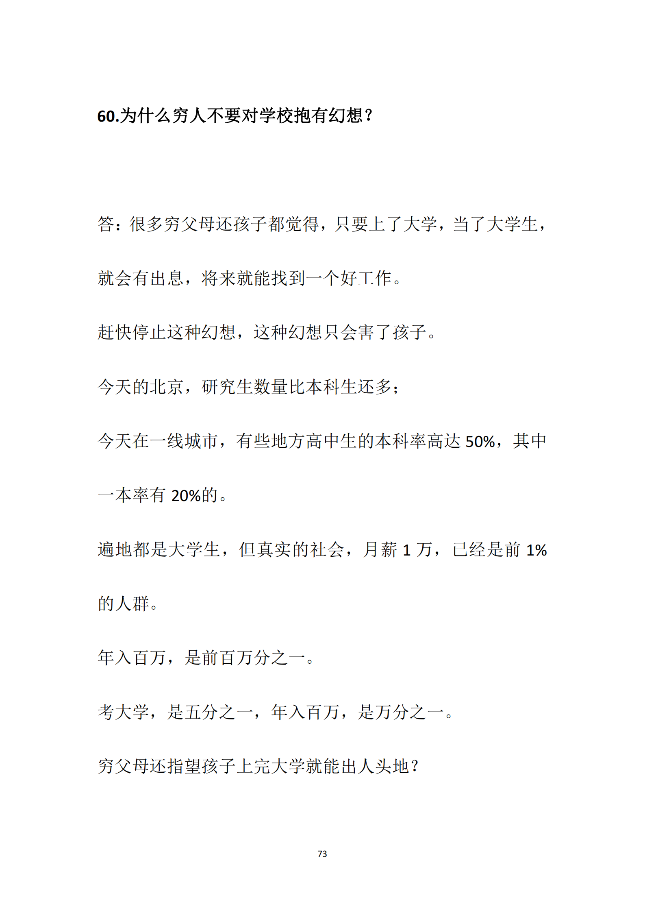

<!-- source-image-end -->
<!-- 原书第 81 页 -->

说真的，我刚出大学出来，非常绝望。

我不知道何去何从，父母也帮不了我什么。

同学们，都可以“子承父业"，我只能投石问路。

后来赚到钱了，也是靠运气。

人活着，要么靠投胎，要么靠运气，单纯靠实力，赚钱太难太难了。

<!-- source-image-start -->

查看原书第 81 页影像

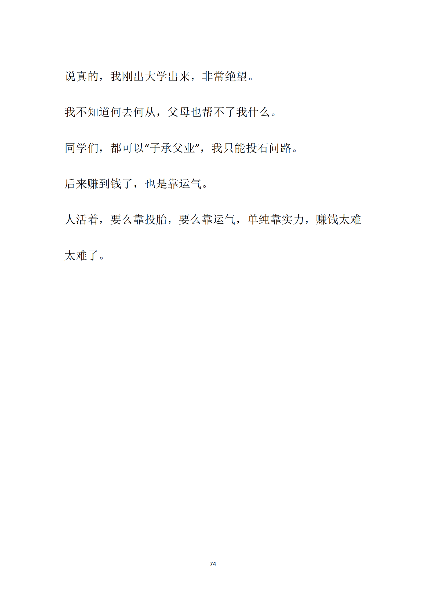

<!-- source-image-end -->
<!-- 原书第 82 页 -->

61.为什么穷人要先超越父母？

答：大多数穷人家的孩子，之所以没有立起来，就是因为太听话了。

听话的背后，还是不愿自己承担责任。

他们的行为习惯，甚至对智力的运用，都来自于穷父母的言传身教，耳濡目染。

父母的认知水平很烂，怎么教得出牛逼哄哄的孩子？

现实中，能把孩子教育成材的父母少之又少，大部分父母是孩子教育失败的头号罪犯。

我们这些普通人，能超越芸芸众生，不是因为我们比较聪明，是因为我们比较勇敢。

说白了，就是我们承担风险的能力较强。

<!-- source-image-start -->

查看原书第 82 页影像

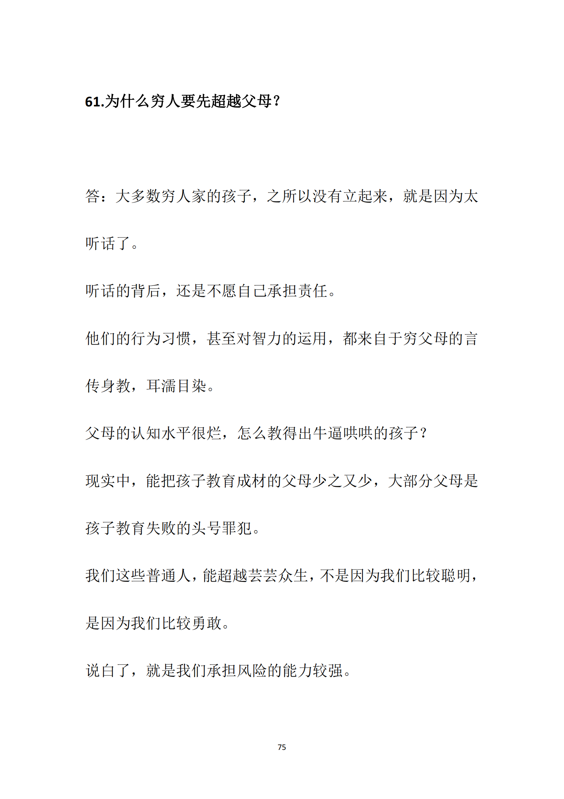

<!-- source-image-end -->
<!-- 原书第 83 页 -->

穷人想要翻身，第一件事就是拉黑父母，去赚钱，去赚大钱。

在赚钱的过程中，人必然经历各种艰难险阻，你在以一种不同的方式吃苦，并且这种苦，要比父母吃的苦更高级。

穷人的出路在哪儿？

离开父母，离开原生家庭，离开原来的成长环境，去一线城市，去人多的地方，去美女多地方发展。

穷人最大的问题不在于穷，而在于骨子里根深蒂固的懒惰、愚昧、占小便宜、走捷径、自卑、幻想、好逸恶劳。

穷人唯有超越父母，才能超越基因里的穷根。

<!-- source-image-start -->

查看原书第 83 页影像

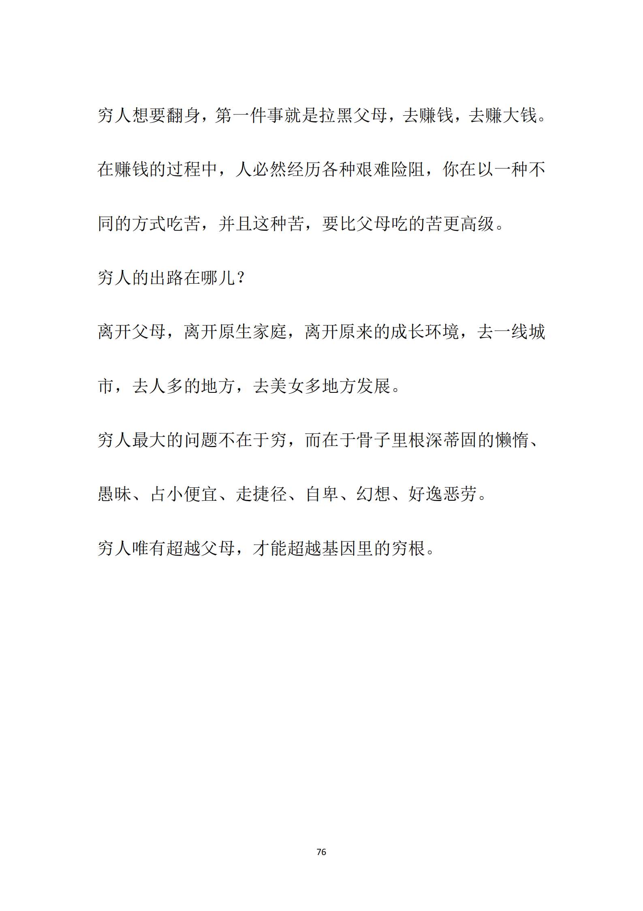

<!-- source-image-end -->
<!-- 原书第 84 页 -->

62.为什么穷人绝对不能追求稳定？

答：穷人没有资源，绝对不能稳定。

必须折腾。

必须去一线城市。

必须想办法创业。

必须想办法多谈恋爱。

必须想尽一切办法靠近有钱人，哪怕对方不给你钱，给你的信息和价值观都是可以帮你赚钱的。

（我的微信：1848636859）

<!-- source-image-start -->

查看原书第 84 页影像

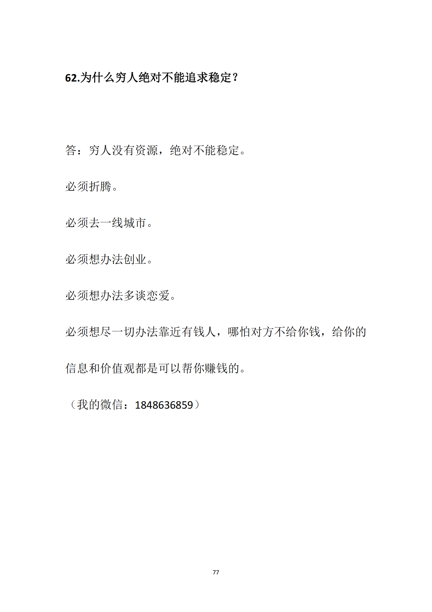

<!-- source-image-end -->
<!-- 原书第 85 页 -->

63.为什么穷人要多生孩子？

答：穷人靠变异。

孩子就是穷人的彩票，孩子多总有一两个比父母更加出类拔萃的，甚至于大多数人之所以出类拔萃，和他童年有兄弟姐妹是分不开的。

一人得道鸡犬升天，家族一个人有出息了，全都起来了。类似家里有一个日赚1W，他愿带着这个家族往前冲，都可以做到日赚1W元。

做生意带着全家一起循环卖卖卖，一个家族一起赚钱，家族化运营，才能生生不息。

<!-- source-image-start -->

查看原书第 85 页影像

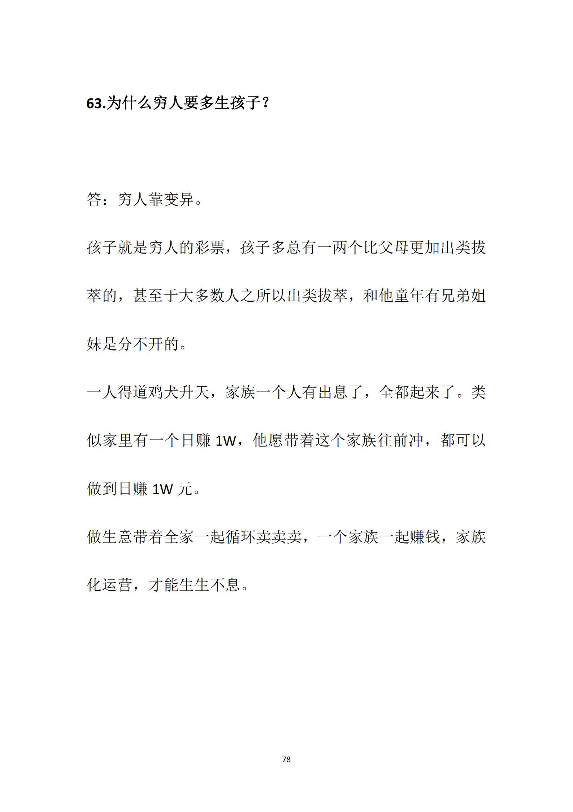

<!-- source-image-end -->
<!-- 原书第 86 页 -->

64.为什么穷人要多谈恋爱？

答：傻逼父母是怎么做的？

指望孩子好好学习，18岁之前不要搞男女关系，大学毕业马上谈婚论嫁。

熟悉男女关系要2年，谈恋爱2年，拉扯要3年，相亲起步3年，18+11=29岁，距离剩男剩女只差临门一脚。

聪明的父母怎么做？

把认知梳理好了，不害羞，不社恐，家学传授给孩子。

12岁就可以男女接触，15岁就开始正式谈恋爱，父母坦然面对和支持，孩子才能不苟且不躲藏。

等孩子到了18岁，已经可以像成年人一样坦然面对男女感情。

<!-- source-image-start -->

查看原书第 86 页影像

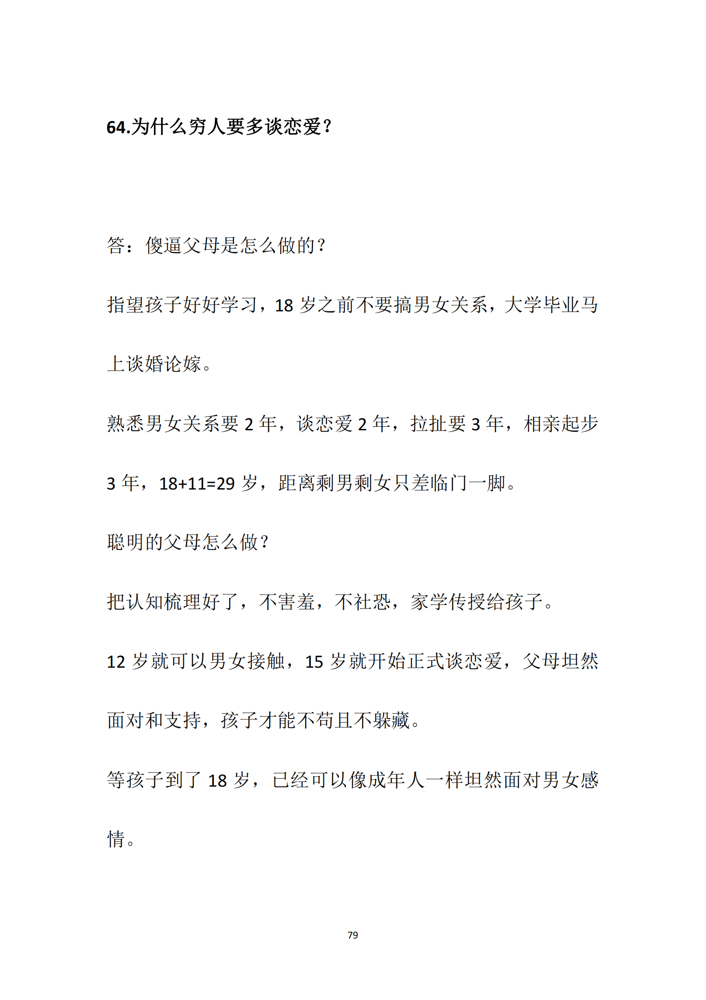

<!-- source-image-end -->
<!-- 原书第 87 页 -->

在同龄人还是大龄巨婴的时候，你的孩子已经是别人眼中的妙人和情圣了。

无论谈恋爱还是相亲，甚至在创业中，妙人和情圣都是碾压的优势。

即使是一个100万的小中产，也可以轻轻松松和5000万身家的有钱人同学大方相处。

两个人的结合，不仅手到擒来，人格也更健全。

家族命运的改变，往往来自一个正确的选择。

（我的微信：1848636859）

<!-- source-image-start -->

查看原书第 87 页影像

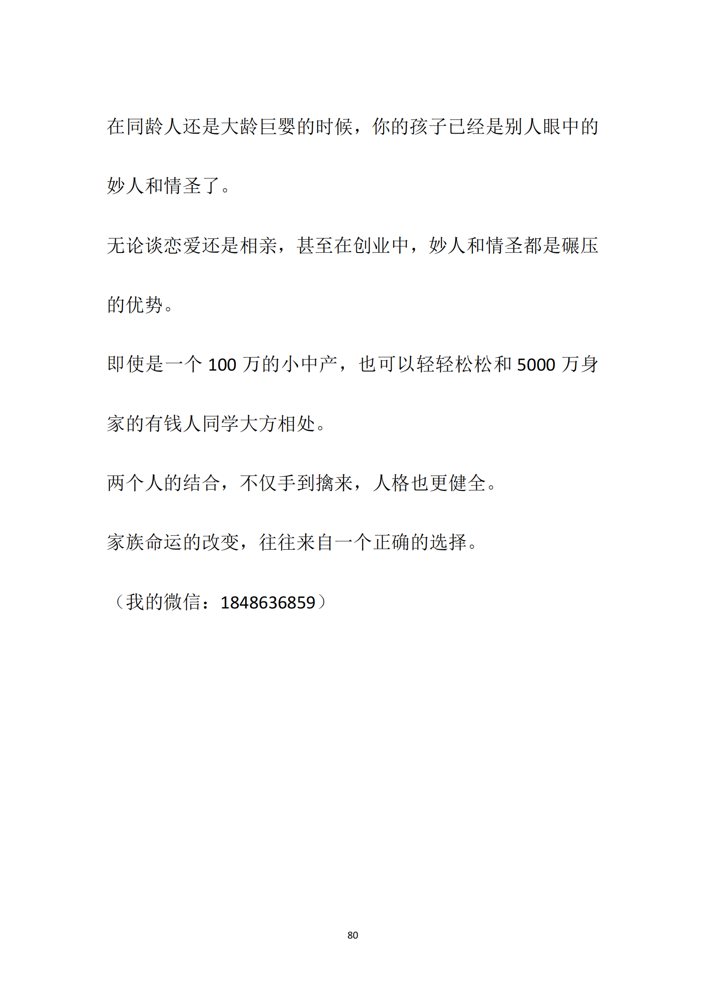

<!-- source-image-end -->
<!-- 原书第 88 页 -->

65.为什么穷人除了多赚钱啥也别想？

答：如果你想成为对这个社会有价值的人。

就什么也别多想，使劲赚钱。

赚钱是世上最难的修行。

你为什么赚钱了？

因为你为整个世界创造了价值。

是富人对这个世界的贡献大？

还是穷人对这个世界的贡献大？

答案是：富人。

因为富人能调动的资源更多。

富人看待这个世界是立体的，高纬度的。

穷人除了一无是处的发善心，啥也做不了。

<!-- source-image-start -->

查看原书第 88 页影像

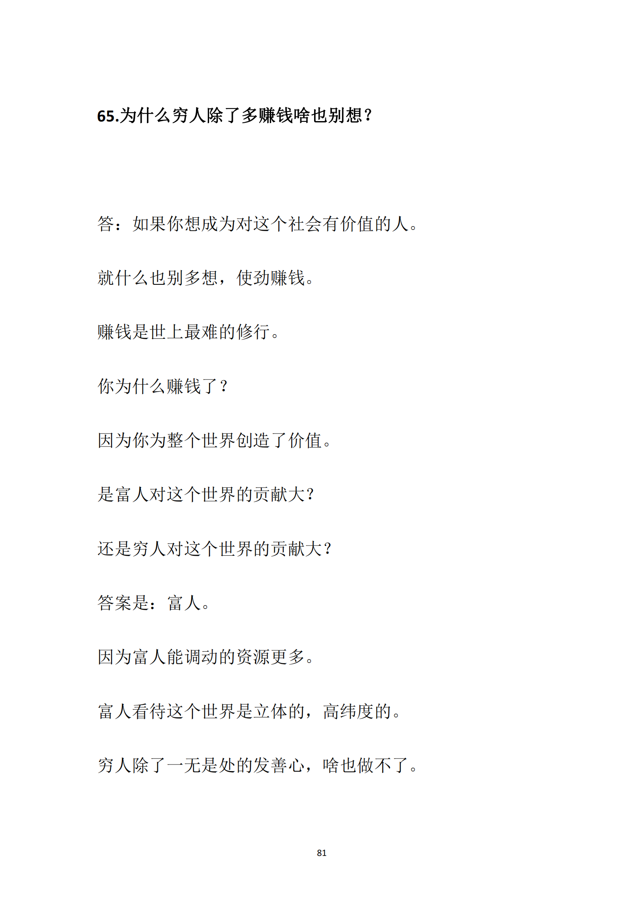

<!-- source-image-end -->
<!-- 原书第 89 页 -->

66.为什么穷人要从大学开始相亲啊？

答：穷人家的孩子，尤其是女孩，上大学就要开始相亲。

改变命运就一条，学会心里有数。

穷人在大学追富二代，追到的概率很大。

穷人读完大学，富二代再也不会看TA一眼.没有家学的孩子，还会搞不清自己几斤几两，看不起富二代。

越是优秀的人，找对象越难。

因为今天没有家教的孩子太多。

正确的做法，是主动去追优秀的人。

任何人最大的差别，是认知差别。

很多家庭父母不清醒，就是你们的套利空间。

<!-- source-image-start -->

查看原书第 89 页影像

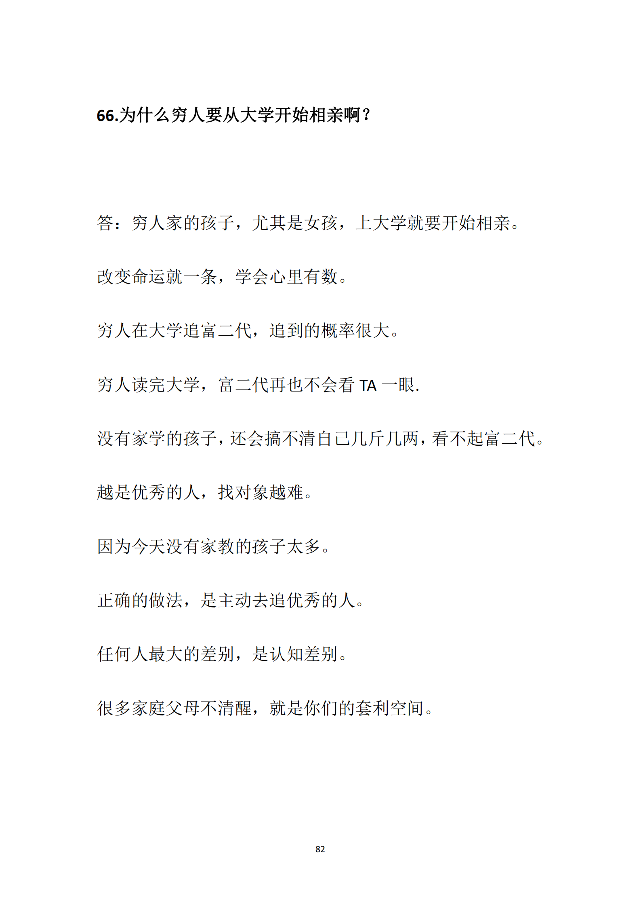

<!-- source-image-end -->
<!-- 原书第 90 页 -->

67.为什么穷美女很难找到好老公？

答：女孩子长得漂亮，不一定是好事。

越高级的美貌，越需要高阶的德行去驾驭。

否则，美貌就是一种毒药。

人一旦得到不属于自己的财富和资源，就会变得自负而愚蠢。

美貌就是一种财富，需要与之匹配的德行，美貌才能变成一个人真正的优点。

大多数穷美女，并没有家庭父母的指导，不知道如何与这份天资相处。

从小开始，美貌就带给她无数的资源，容易得到夸赞，容易得到金钱，同样，人也容易沉浸其中。

没有家教的美女，一般不会太聪明，性格不会太好，更不擅

<!-- source-image-start -->

查看原书第 90 页影像

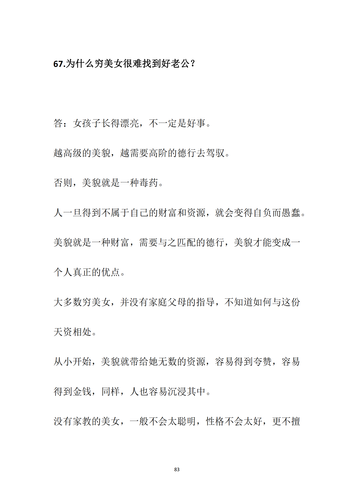

<!-- source-image-end -->
<!-- 原书第 91 页 -->

长解读人性。

美女的身体是天生的武器。

美女的身体+智商+价值观，可以征服一切。

穷美女喜欢吹嘘自己，贪图享乐，对人生没有规划，自然吸引不到真正有钱的顶级男人。

顶级美女不会吹嘘任何事，主打一个质朴，真诚，善良，温柔，有才华，有文化，性格还好，任何男人都扛不住。

（我的微信：1848636859）

<!-- source-image-start -->

查看原书第 91 页影像

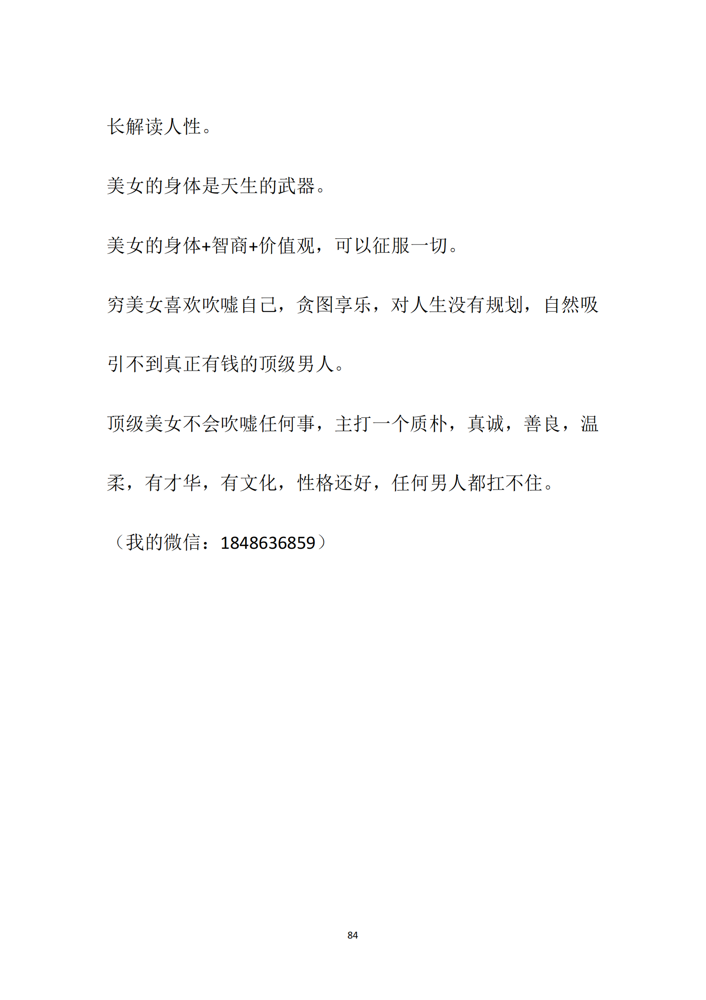

<!-- source-image-end -->
<!-- 原书第 92 页 -->

68.为什么穷人是拿不住钱的？

答：有了2万存款，赶紧买一个包包搞劳自己。

好不容易月薪1万5了，赶紧租一个5000的房子。

父母给了50万，恨不得赶紧去贷款买个房，让自己背上500万的房贷。

69.为什么穷人特别相信一夜暴富？

答：穷人特别相信小概率事件，因为穷人看不到希望，比如买彩票一夜暴富。市面上任何一个项目，吸引的都是穷人，都是走投无路的人。我们不想吸引穷人。帮走投无路的人找路，这是一件非常难的事儿，而且还出力不讨好。

<!-- source-image-start -->

查看原书第 92 页影像

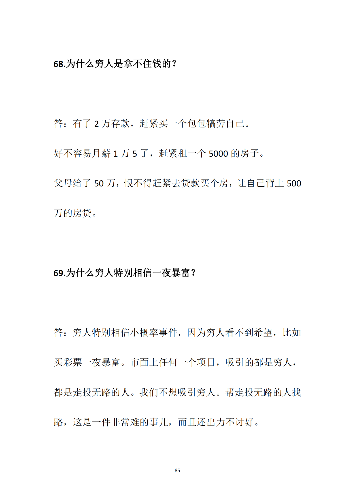

<!-- source-image-end -->
<!-- 原书第 93 页 -->

70.为什么穷人永远是牺牲品？

答：夏威夷火灾，富豪们的豪宅毫发未伤，穷人的房子被烧个精光。

任何形式的改 ge，不是A砸了B的饭碗，就是B砸了C的饭碗。

想想第一次改ge，砸了多少人的饭碗。

任何形式的改 ge，都要牺牲一部分人的利益。

试问是牺牲富人，还是牺牲穷人？

你自己去细品。

（我的微信：1848636859）

<!-- source-image-start -->

查看原书第 93 页影像

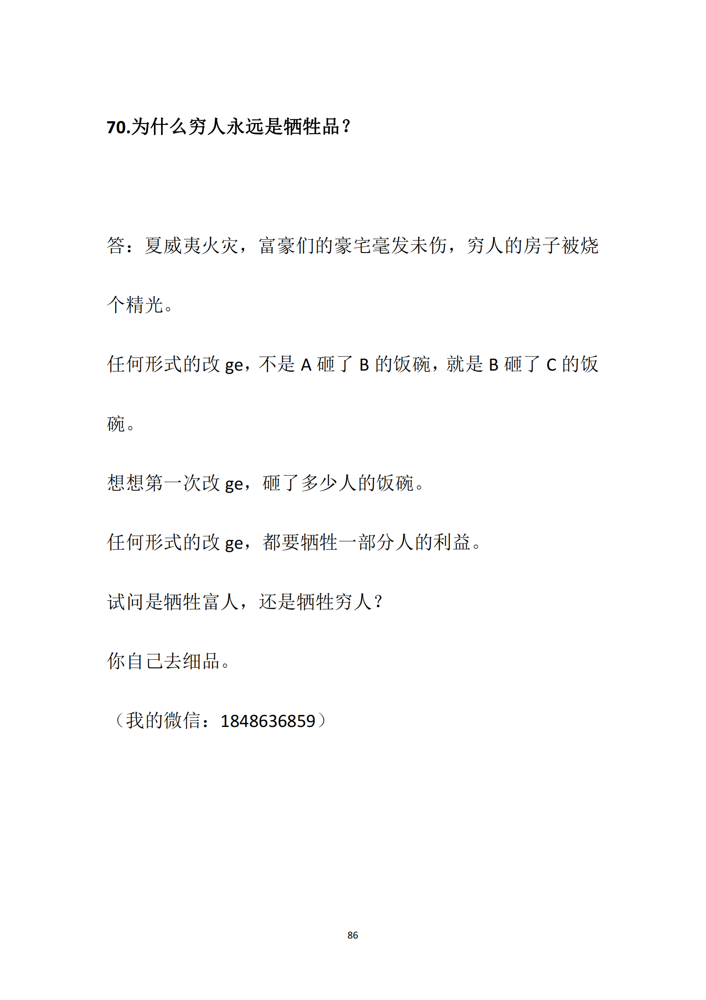

<!-- source-image-end -->
<!-- 原书第 94 页 -->

71.为什么穷人不要在大学里学东西？

答：现在几乎所有的大学，所有的专业，都是垃圾。

只有放弃对大学对专业的幻想，才能学到真正的东西。

越早放弃，越早成熟。

放弃下流武功，才能学上乘功夫。

大学专业课本的内容，至少落好30年。

你想学专业的东西，你要到市面上，去看专业实操人士的内容，去拜师学艺，去自学，都比大学课本强。

我建议大家大学学点什么？

聪明点儿的，学营销，做销售。

脑子不太好的，学个技术。

这辈子就这样了。

<!-- source-image-start -->

查看原书第 94 页影像

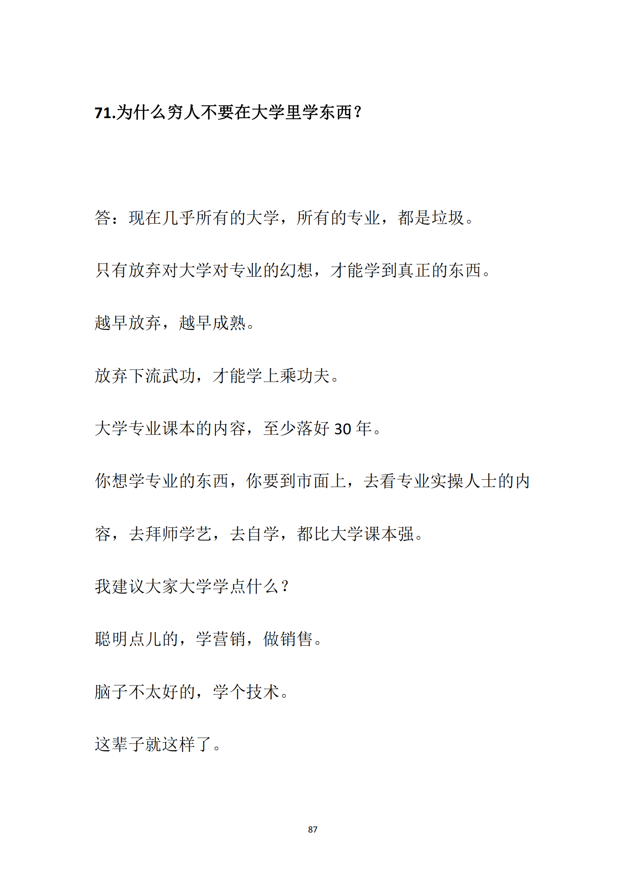

<!-- source-image-end -->
<!-- 原书第 95 页 -->

因为人生很烂，所以要学一些很烂的东西。

什么叫实事求是？

这就是实事求是。

什么都不想放弃的人，最后失去都最多。

什么都想一步到位的人，最后什么都得不到。

我一个朋友，上学的时候学习成绩很好。

毕业了，找工作。

既想要待遇高，又想要福利好，最好有分红的，还要加班少，还要专业对口，还要发展前景，还要离家近...结果找了一年多，都没有找到合适的工作。

后来，他想买房。

想要找个位置好，还要面积大点儿，还要朝向好、带电梯，自住和投资兼得，能带一个学区最好..

<!-- source-image-start -->

查看原书第 95 页影像

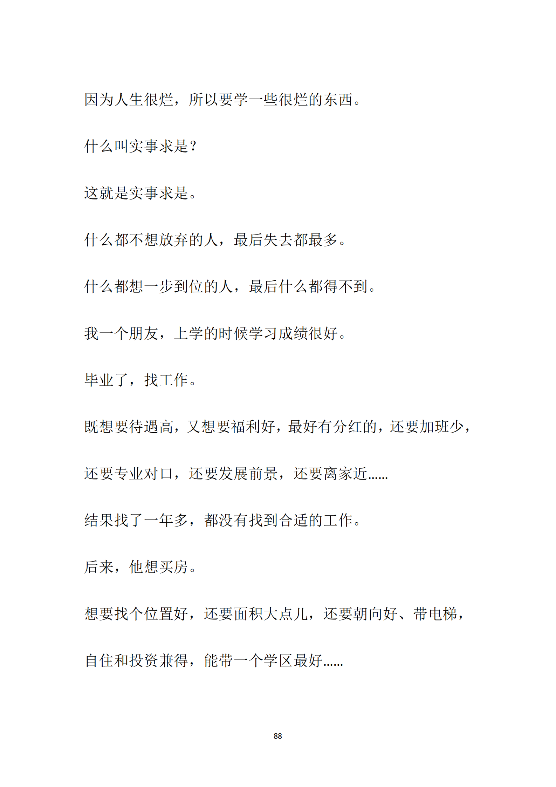

<!-- source-image-end -->
<!-- 原书第 96 页 -->

犹豫了几年，终于，终于，他再也买不起房了。

我是习惯性先上车再说。

房子，买不起别墅，可以买住宅嘛！

买不起住宅，可以买公寓嘛！

买不起公寓，可以买老破小嘛！

买不起大的，可以买小的嘛！

市中心买不起，可以买郊区嘛！

总之，习惯性上车。

房子，有了第一套，便会有第二套、第三套..而且，一套比一套漂亮！

但是，一定要保守型进攻。

也就是第一套的贷款没还完，不要考虑第二套！

<!-- source-image-start -->

查看原书第 96 页影像

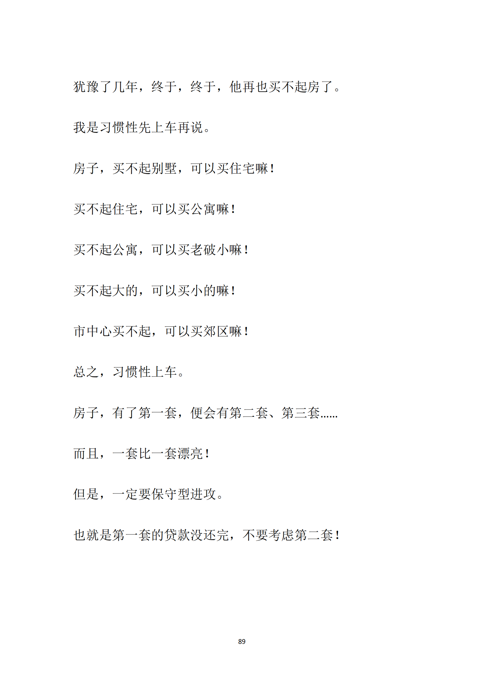

<!-- source-image-end -->
<!-- 原书第 97 页 -->

72.为什么穷人要么学销售，要么学算命？

答：开窍的穷人，要么学销售，要么学算命。

不开窍的，学一些非常卷的技术，活活把自己累死。

记住：穷人改变命运，就是学个能收钱的技术。

在我很小的时候，我就意识到父母都是穷人，我啊，也是穷要是我走“宽阔”的大道（考公或考研），只会活活饿死。

唯有走世人理解不了的“羊肠小道”才能改变命运。

（+我微信：1848636859）

<!-- source-image-start -->

查看原书第 97 页影像

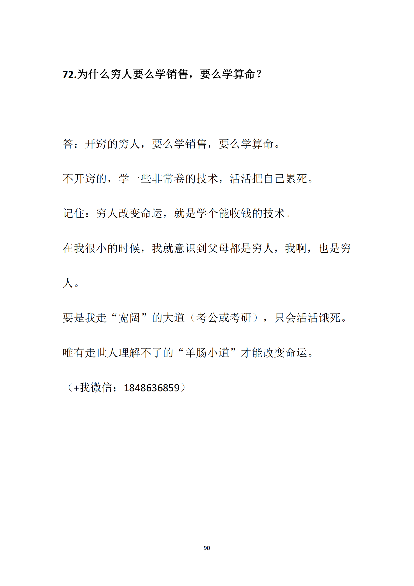

<!-- source-image-end -->
<!-- 原书第 98 页 -->

73.为什么穷人最悲哀的不是拿命换钱？

答：以前我对于死亡，我没啥概念。

当身边有同龄人离开这个世界时，我才知道，原来死亡就在我身边。

穷人最悲哀的，不是拿命换钱。

而是拿命换钱后，才发现钱并没有挣到多少，命也时日无多。

没有伞的孩子，到了一定岁数，比谁都想活出个样子。

伞=背景、家底、实力、财力·…··为了挣钱，即便有些路我们看起来可笑，他们还是愿意拼命。

“命”这个字很贵，但对于有些人来说，一个“穷”字，便能让它一文不值。

有些事儿我一辈子都不碰，哪怕只喝了一口酒，我也绝不开

<!-- source-image-start -->

查看原书第 98 页影像

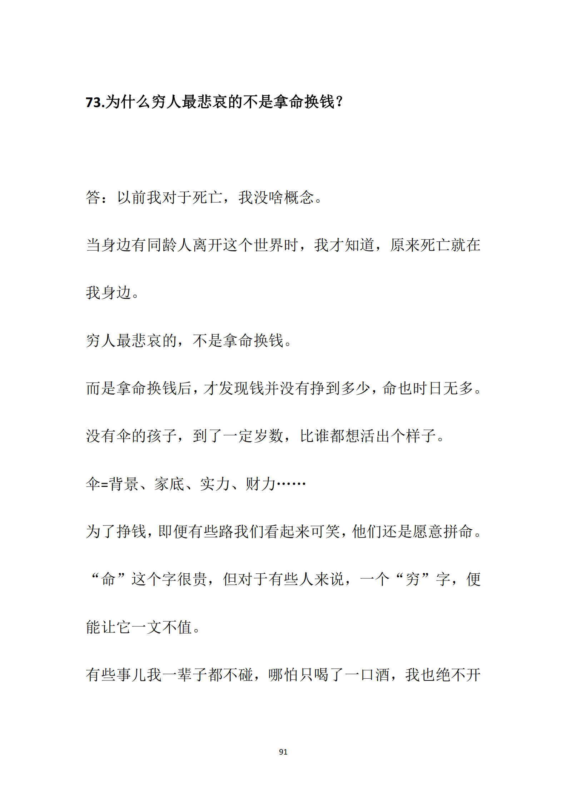

<!-- source-image-end -->
<!-- 原书第 99 页 -->

车。

为什么他们不怕？或许是艺高人胆大。

当艺高人胆大时，是不是离死亡就近点儿？

一个人安逸久了，就会变成温水中的青蛙;一个人过于迷恋自己的技术，就会变成瞎眼的麻雀。

生于忧患死于安乐，敬畏常识。

这是我们做人的底线，不知道为什么，说突破就突破了。

一切都是命运，一切都是烟云，一切都是智商税，一切都是万劫不复。

哎，人啊人。实在太脆弱了。

（我的微信：1848636859）

<!-- source-image-start -->

查看原书第 99 页影像

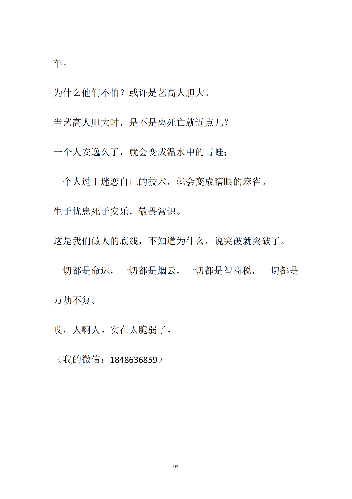

<!-- source-image-end -->
<!-- 原书第 100 页 -->

74.为什么漂亮女人越来越不吃香了？

答：因为有钱的男人越来越少了。

漂亮的女人会越来越多了。

为什么有钱的男人越来越少？

因为钱将越来越难赚了，暴富的机会越来越少了。

大家都靠实力和能力赚钱了，都是靠自己创造的价值换回来的。

以后很少有一夜暴富的事出现了，所以能赚到钱的男人将越来越少。

最关键的是，这部分能赚到的男人，品味肯定不一般。

没有一定文化素养和修养的人很难赚到钱，毕竟都是拼实力和能力。

<!-- source-image-start -->

查看原书第 100 页影像

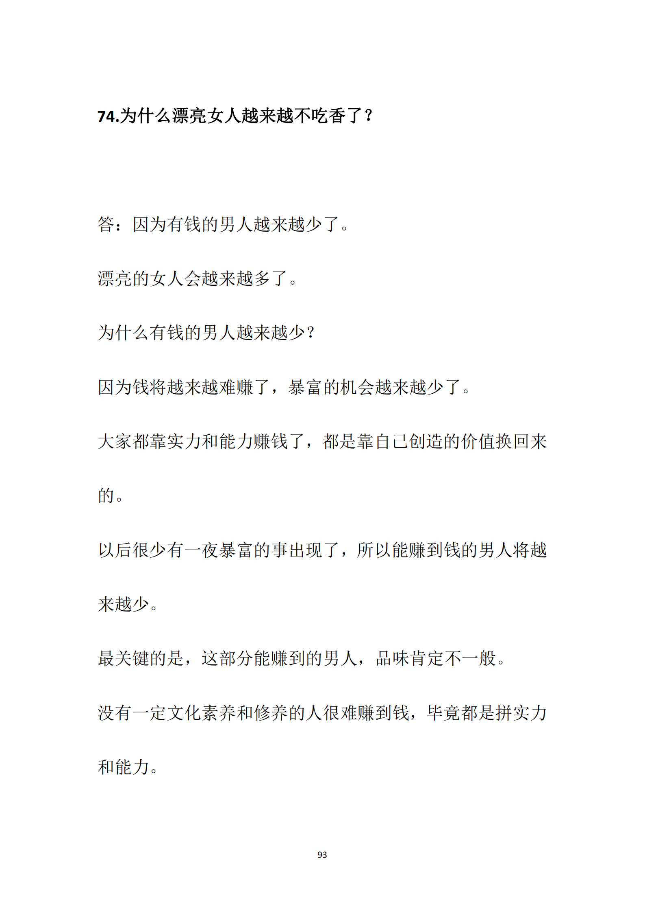

<!-- source-image-end -->
<!-- 原书第 101 页 -->

这部分男人的品味肯定不是只看女人的外表，他们将更注重女人的内涵。

那为什么漂亮的女人越来越多呢？

因为整容业太发达了，女人只要花点钱都可以彻底改头换面，所以女人变漂亮是很容易的事。

女人再指望自己漂亮就可以通吃，是非常愚蠢的想法。

75.为什么很多女的离婚了？

答：因为她会赚钱，她老公不会赚钱。

自己的老板，脑子灵活不灵活，就一个判断标准：他会做流量吗？

会，就是脑子灵活，不会，就是脑子有点儿“二

<!-- source-image-start -->

查看原书第 101 页影像

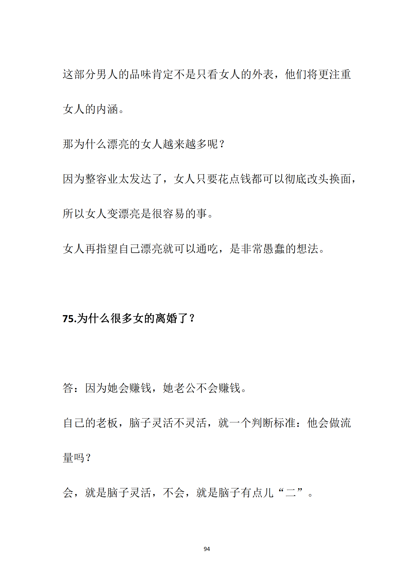

<!-- source-image-end -->
