<!-- 原书第 102 页 -->

# 第五章：高手进阶之路

76.为什么人跟人之间的差距非常大？
答：因为认知水平和智商高低差距太大了。
高智商与高智商对话，事半功倍。高智商与低智商对话，被
记仇。低智商与高智商对话，气岔对方。低智商与低智商对
话，鸡毛蒜皮乌烟瘴气。
所以领导说话永远都绕着弯儿说，底下的人才能心平气和，
这就是所谓的中庸之道。
人与人的结果，最终变成两大类：高智商人群，迅速与底层
智商人群划清界限。低智商人群，无法做更高级的事儿，乐
95

<!-- source-image-start -->

查看原书第 102 页影像

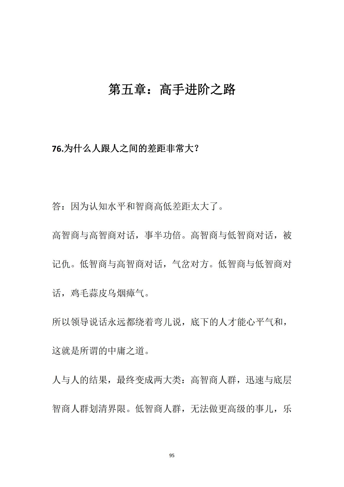

<!-- source-image-end -->

<!-- 原书第 103 页 -->

于寻求被奴役之路。
77.为什么高人不愿与底层打交道？
答：一个人获得的东西，无时无刻都在与德行匹配。
底层人即使遇到高人，也未必能抓住机缘。
底层人因为看不懂、因为自负（自负的本质是弱者），所以
出言不逊;
底层人因为反常识（总是相信小概率事件），所以不断反问
质问。
底层人因为听不懂道理（弱者见识有限），所以只能用暴力
和威慑。
弱者把自己的智力摘除，成了争强斗狠的下人。
高人只讲常识，只讲规则。
96

<!-- source-image-start -->

查看原书第 103 页影像

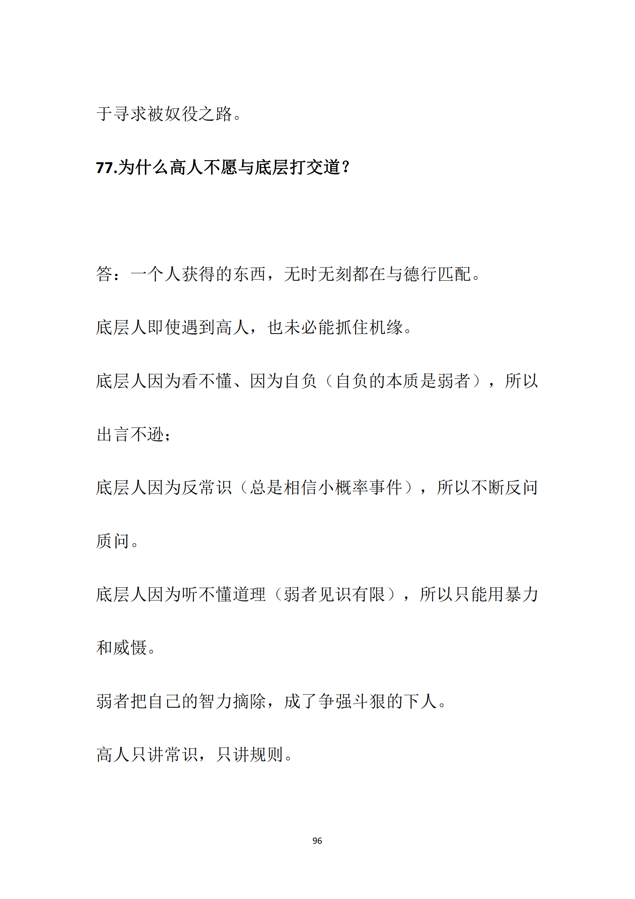

<!-- source-image-end -->

<!-- 原书第 104 页 -->

高人在持续讲规则，下人在持续人。
最终高人只能叹气一声，拂袖而去。
高人走了，下人发现自己得逞了，心中得意。
过了几天，下人发现自己不能接收到新的知识了，就开始攻
击高人没修养，小心眼，垃圾，说几句就不搭理人了。
近则不逊，远则怨。
高人和底层人打交道，老是吃亏，时间久了，就不跟底层人
玩了。
（我的微信：1848636859）

<!-- source-image-start -->

查看原书第 104 页影像

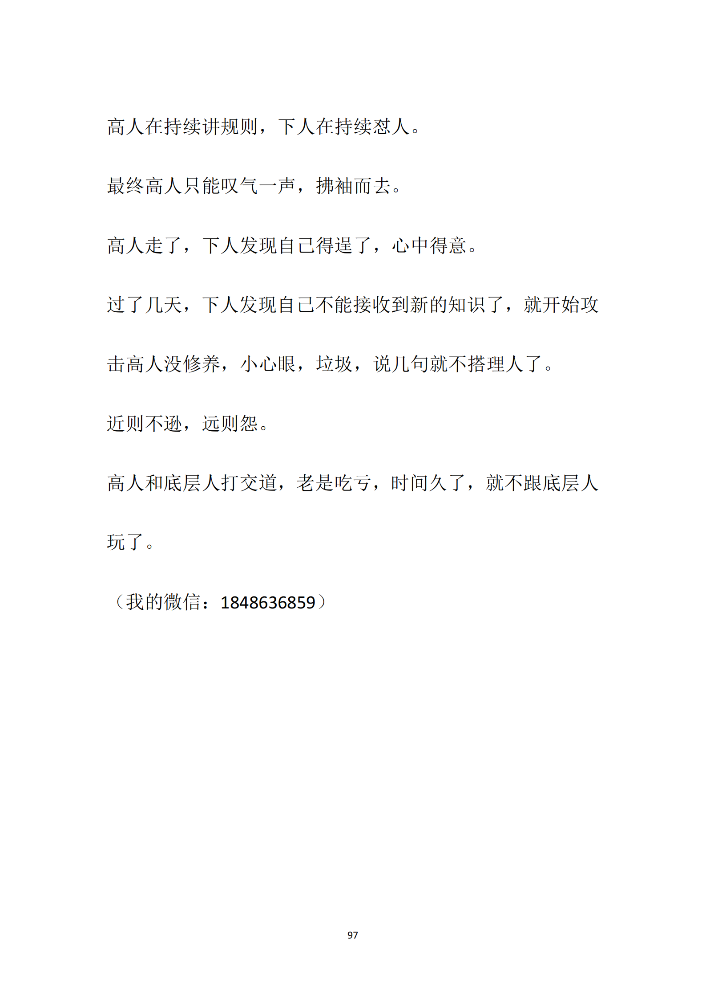

<!-- source-image-end -->

<!-- 原书第 105 页 -->

78.为什么高人不要处理琐事儿？
答：因为高人做事，靠的不是意志力，而是心流。
什么是心流？
就是一个人沉浸在某件事之中的状态。
写作，需要积累素材，3、4个小时不间断输出，才能产出一
篇成熟的文章;
做生意，做投资，需要持续几个月甚至几年，保持状态，才
能够维持做事的心流;
搞科研的专家，还有一辈子专研一个问题直到生命最后一刻
的。
维度很高的人，他们在生活中大多看起来像低能儿。
98

<!-- source-image-start -->

查看原书第 105 页影像

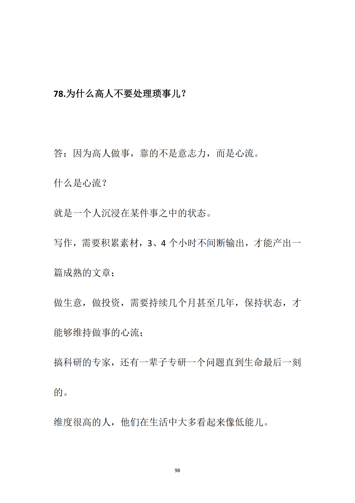

<!-- source-image-end -->

<!-- 原书第 106 页 -->

高人不适合有琐事。
一点点干扰，你写作可能就此3小时，变成6小时。
七八件琐事，你的事业，可能就要从1年，延长到2年。
心流，不可被打断。
越是高阶的工作，越需要充足的物质环境，来维持你的状态。
心流，是一个人最宝贵的资源。
（我的微信：1848636859）
99

<!-- source-image-start -->

查看原书第 106 页影像

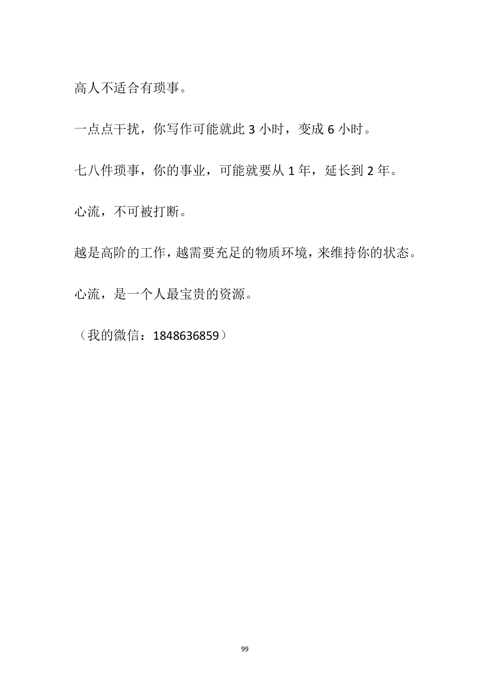

<!-- source-image-end -->

<!-- 原书第 107 页 -->

79.为什么高人做事总是信心满满？
答：一切财富都是观念的产物，信心决定了自己的认知，决
定了可以达到的高度。
悲观者也许是正确的，但乐观者才能成事儿。
老板和员工的区别在于老板对于公司有100%的信心，愿承
担高风险，否则他会失败。
（我的微信：1848636859）
100

<!-- source-image-start -->

查看原书第 107 页影像

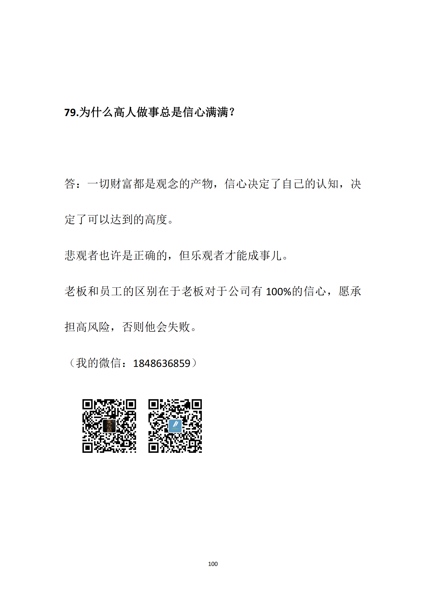

<!-- source-image-end -->

<!-- 原书第 108 页 -->

80.为什么高人做事习惯损失？
答：所有的事情都是不完美的。
如果要达到最大收益，要的是效率，不是个人的完美情结，
追求完美只是其中的一种手段。
我做任何事儿，早已习惯了损失。
精致的工作曾经给予我足够的回报，但想要再度升级，就要
放弃这种回报。
101

<!-- source-image-start -->

查看原书第 108 页影像

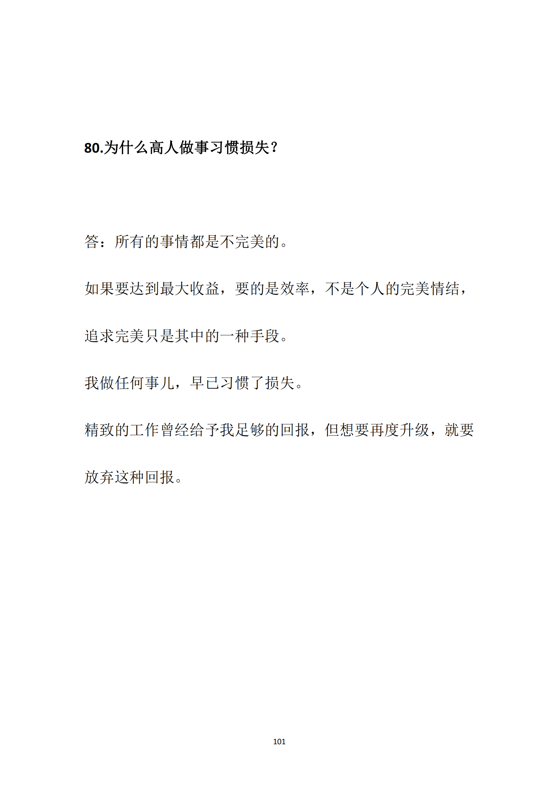

<!-- source-image-end -->

<!-- 原书第 109 页 -->

81.为什么高人做事习惯性先物化自己？
答：小说里的剑客最高境界是：人剑合一。
做人的境界：首先学会做一个优秀的工具人。
如果连工具人都做不好，那就连最基础的价值都无法提供给
别人，这个人也就没有任何所谓的交换价值。
一个人，首先要明白：自己的角色是谁?
为了扮演好这个角色，需要付出什么样的代价？
一旦想清楚，就不顾一切，全情投入。
激流勇进，握紧刀锋，鲜血淋漓，从死人堆里爬出来。
摒弃无关的情绪，无聊的话语。
做老板，就是赚钱机器。
102

<!-- source-image-start -->

查看原书第 109 页影像

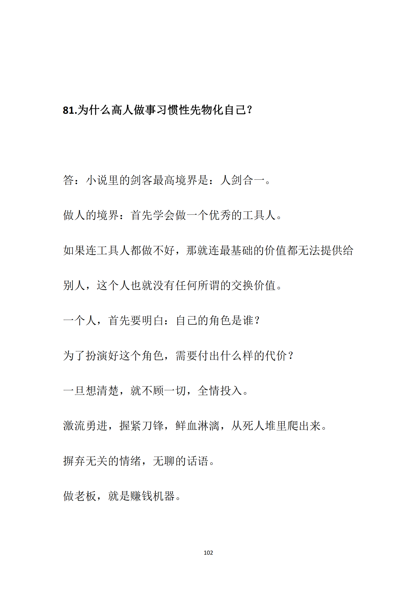

<!-- source-image-end -->

<!-- 原书第 110 页 -->

做父亲，就是生育机器。
做领导，就是假面机器。
放弃无用的矜持，对自己的物化越深，做人做事的能力才能
更上一层楼。
如果一个人不够成功，大概率就是他还不够物化自己。
82.为什么高人不去讨好别人？
答：你做得再好，也还是有人指指点点；你即便一塌糊涂，
也还是有人唱赞歌。所以不必掉进他人的眼神，你需要讨好
的，仅仅是你自己。
103

<!-- source-image-start -->

查看原书第 110 页影像

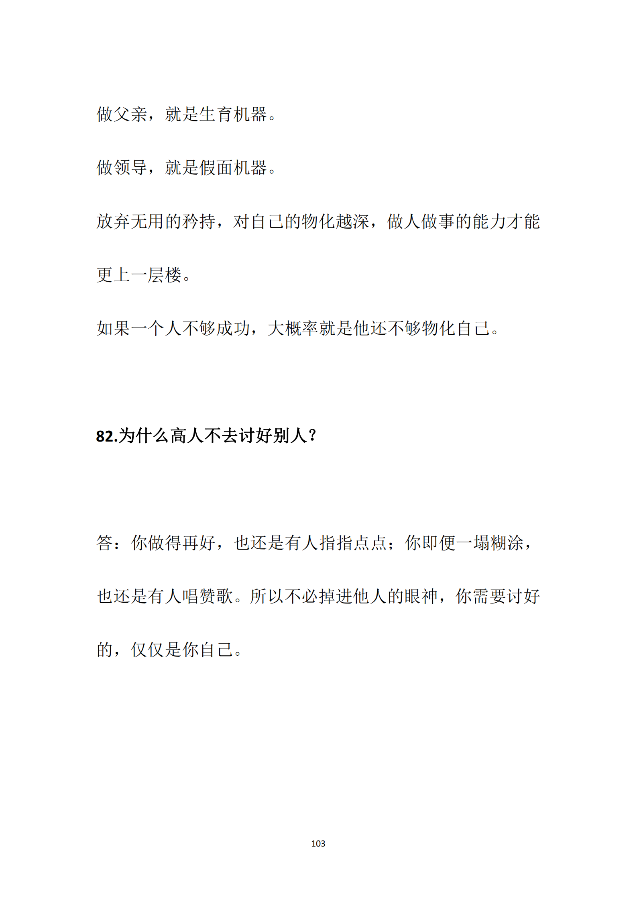

<!-- source-image-end -->

<!-- 原书第 111 页 -->

83.为什么要找个高人跟随？
答：结交高人，就像是开了一扇窗户，就能看到不一样的东
西，听到不一样的声音，能让你思考、觉悟，这已经够了。
其他还有很多，比如机会、帮助。
人活着，就是找一个高人跟随嘛。
事在人为。
谁不是摸着石头过河?
连试试的勇气都没有，还混个毛啊。
链接了高人，所有的迷茫和困惑，都会在一瞬间消失。
知道跟着谁走了，每天除了马不停蹄地走路，还能做什么？
104

<!-- source-image-start -->

查看原书第 111 页影像

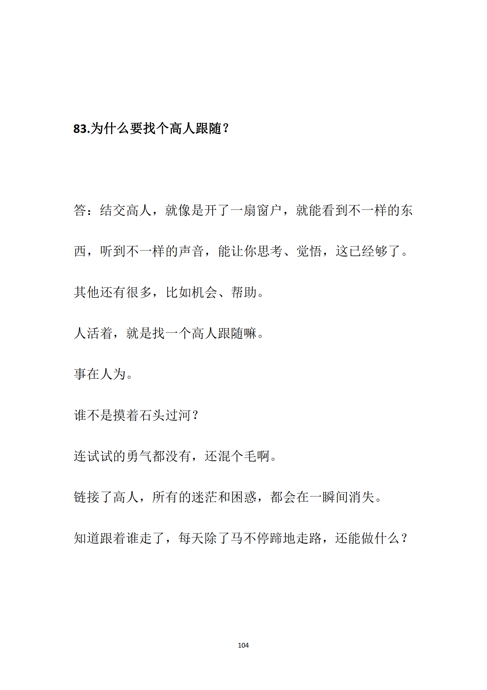

<!-- source-image-end -->

<!-- 原书第 112 页 -->

84.预测一下未来几年的赚钱趋势
很多人咨询我，Mona老师，未来会好吗？经济会好吗？大环
境会好吗？（Mona老师微信：1848636859）
我预测了一下未来几年一些赚钱趋势：
1、过去3年，整个市场充满不确定性，每个人都过得不容
易。但是这两年（2023-2024年）会是一个转折点，是黎明
前的黑暗！2023年将会是无数普通人的改命年！
2、世界每隔一百年会诞生一个新的全球霸主。而种种迹象
105

<!-- source-image-start -->

查看原书第 112 页影像

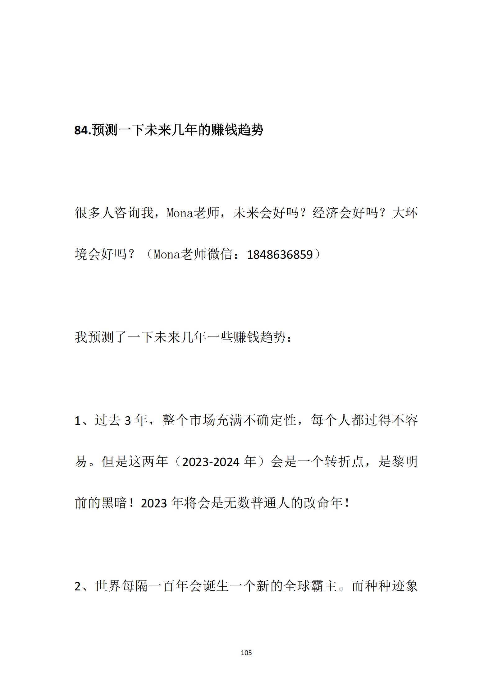

<!-- source-image-end -->

<!-- 原书第 113 页 -->

都表明，中国极有可能是未来新的一百年下一个全球霸主。
3、不要只看微博和抖音上说什么，要多去线下做调研。这
些做自媒体的，只报“负能量”。对于“正能量”视而不见。
“好事不出门，坏事传千里”嘛。现在很多唱衰经济。这不
是聪明，这是愚蠢的表现。
4、全面人口红利已经接近尾声，从今往后，我们将再也听
不到，人口红利这个词了。未来的赚钱机会在哪儿，总结起
来有：养老保健、女性经济、单身经济、陪伴经济、传统文
化、国学、中医等。每一个红利期背后，考验的都是我们对
于市场的洞察力。
5、要把兴趣技能化，技能商业化，把你擅长的东西变成你
106

<!-- source-image-start -->

查看原书第 113 页影像

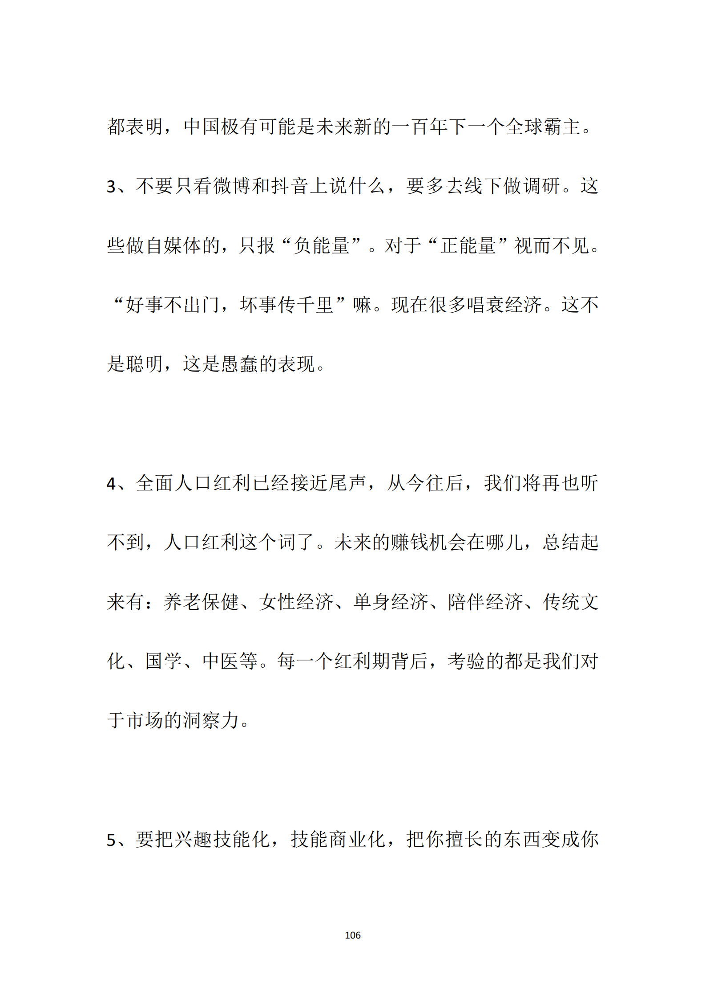

<!-- source-image-end -->

<!-- 原书第 114 页 -->

的核心竞争力，变成不可替代的能力，才能在未来的竞争中
取胜。找到一个适合自己的领域，练到极致，干到极致，赚
钱就会多点儿，猛点儿。
6、未来，你一定要思考一件事：怎么让你的客户/员工/合伙
人/投资人/经销商充满信心，谁能让他人重拾信心，谁就有
可能称王称霸。
7、未来能赢到最后的人，一定是踏踏实实走好每一步的长
期主义者。工作即生活，生活即工作，这个节奏非常重要，
能够笑到最后的人，一定是内功深厚的人。
8、不论你是卖食品的、服装的、还是卖化妆品的，把公司
107

<!-- source-image-start -->

查看原书第 114 页影像

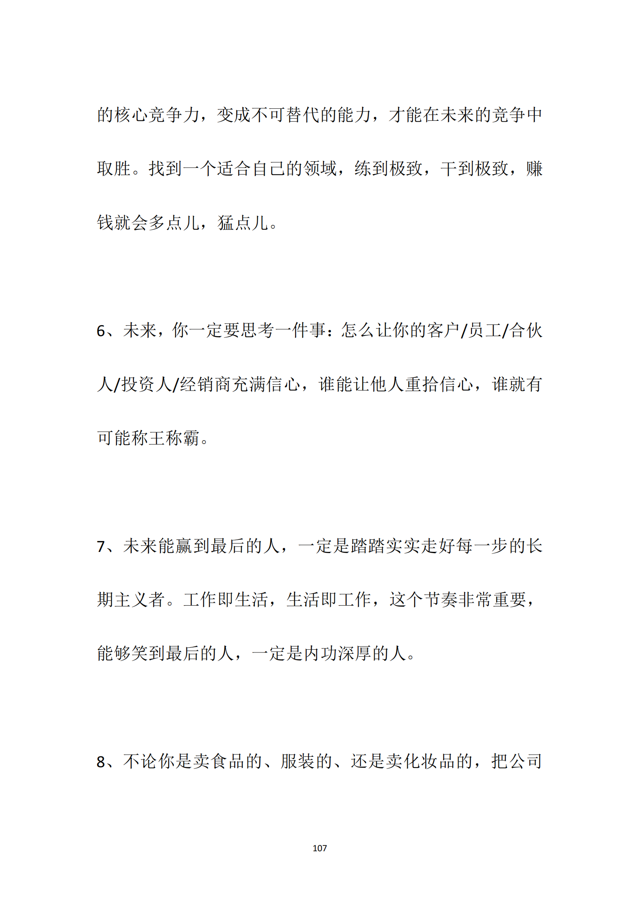

<!-- source-image-end -->

<!-- 原书第 115 页 -->

做小、把用户做大，小而美，深挖一口井，才符合未来的发
展趋势。这是时代的馈赠，一个人也可以活成一家赚钱公司。
一个人今天的生活状态，是由他过去5年的选择所决定。而
5 年后你会成为谁，则取决于你当下的布局。
9、短期之内，赚钱是会越来越难的，面对未来不确定的因
素，我们唯一能够改变的，唯一能确定的，就是自己。不断
修炼自我，提升自我，日日精进，活出自己的确定性，是未
来最好的出路。
10、未来谁粉丝多，谁变现能力强，谁就牛逼。这就代表了
公平。未来10年，正确的经营方式是先囤人，把公司做到
极小、把用户做极大。就像很多网红，他们只有两三个或者
108

<!-- source-image-start -->

查看原书第 115 页影像

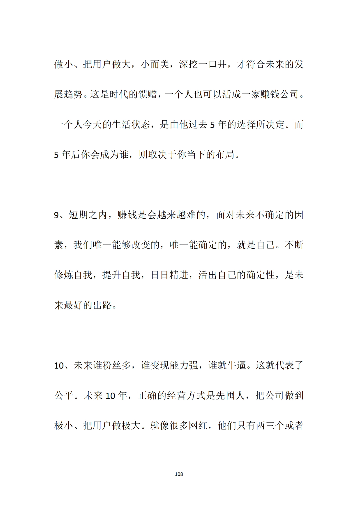

<!-- source-image-end -->

<!-- 原书第 116 页 -->

三五个人的团队，但一年能够带来几百万、上千万、甚至上
亿的收入。
11、由于现在是产能过剩的时代，谁有了用户，谁就相当于
有了隐形现金流，无论卖什么都可以赚到钱。
12、如果你至今一无所有，你记住一个点：从现在起，踏踏
实实搞流量。不要什么都做，什么都碰。对于常人来说：真
正的幸福来源于长年累月做一件商业价值比较高的事儿。
13、我对年轻人的忠告是什么？不要陷入消费主义。钱是攒
出来的。我攒钱就比较厉害。我从公司离职时，卡上有10
万多。我不上班了，出来创业了，我卡上的钱更多。很多傻
109

<!-- source-image-start -->

查看原书第 116 页影像

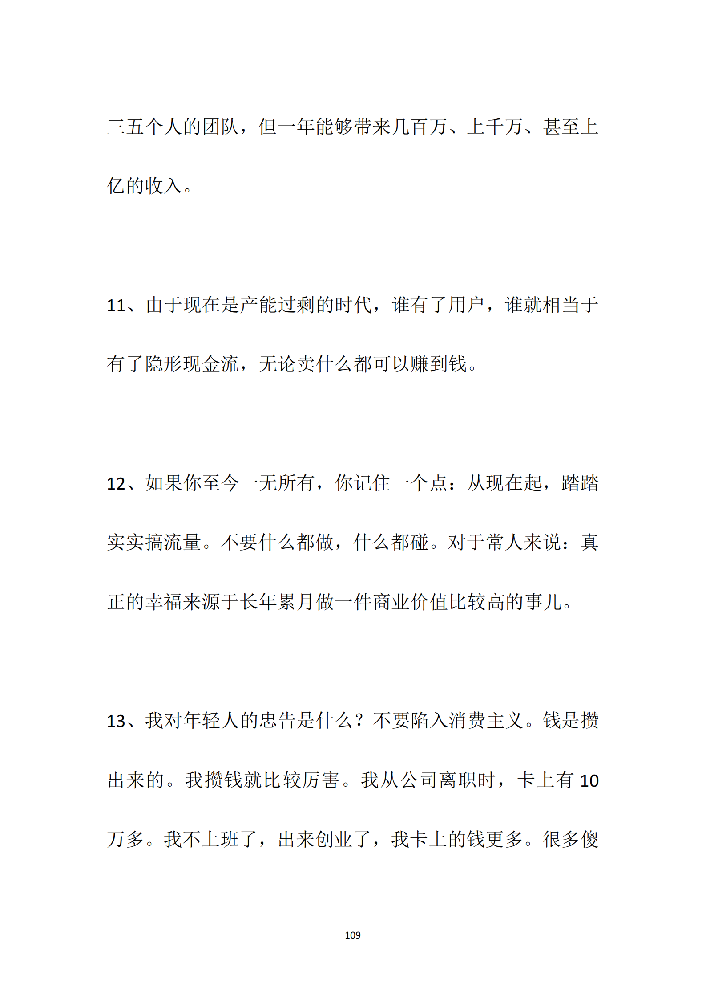

<!-- source-image-end -->

<!-- 原书第 117 页 -->

逼呢？陷入了消费主义。一天不上班，就会饿死。
14、还有些傻逼，上班时，搞得负债累累。要是不上班，他
连利息都还不了。这些都是典型的消费主义。记住：穷逼的
第一桶金就是攒来的。要么是你父母攒的，要么是你自己攒
的。有了第一桶金，才会有后续的发展潜能！
15、那些看起来高大上的职业，其实一年到头弄不了几个钱。
都是表面光鲜而已。做销售，每天笑脸相迎，点头哈腰，是
有很多人看不起你，但每天赚个3000或5000，还是比较香
的。
16、每当我膨胀时，我就对自己说：我是一个穷人，我只能
干销售。高大上的项目，什么人工智能啊，元宇宙啊，区块
110

<!-- source-image-start -->

查看原书第 117 页影像

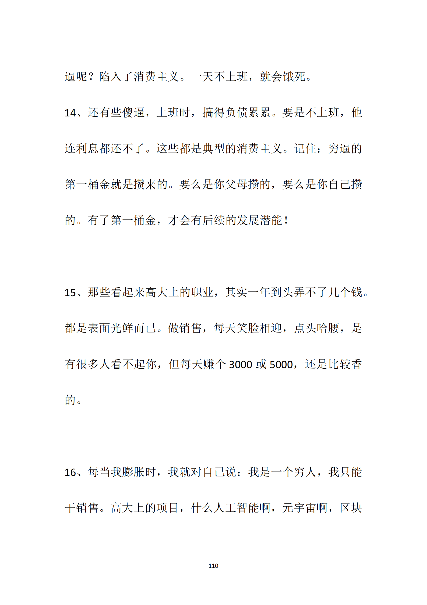

<!-- source-image-end -->

<!-- 原书第 118 页 -->

链啊，跟我们这些穷人没一毛钱的关系。穷有穷的好处。这
个好处就是比较务实。
17、开窍的穷人，要么学销售，要么学算命。不开窍的，学
一些非常卷的技术，活活把自己累死。记住：穷人改变命运，
就是学个能收钱的技术。
18、这个年代哪个行业都不好做，没有哪个行业不内卷，千
万不要轻易去换行业。不赚钱的时候，千万不要瞎折腾。手
里有闲钱了，去投资自己，让自己变得聪明一点儿，智慧一
点儿，变得运筹帷之中，决胜千里之外，才能在当下的局
势中找到破局之路！
111

<!-- source-image-start -->

查看原书第 118 页影像

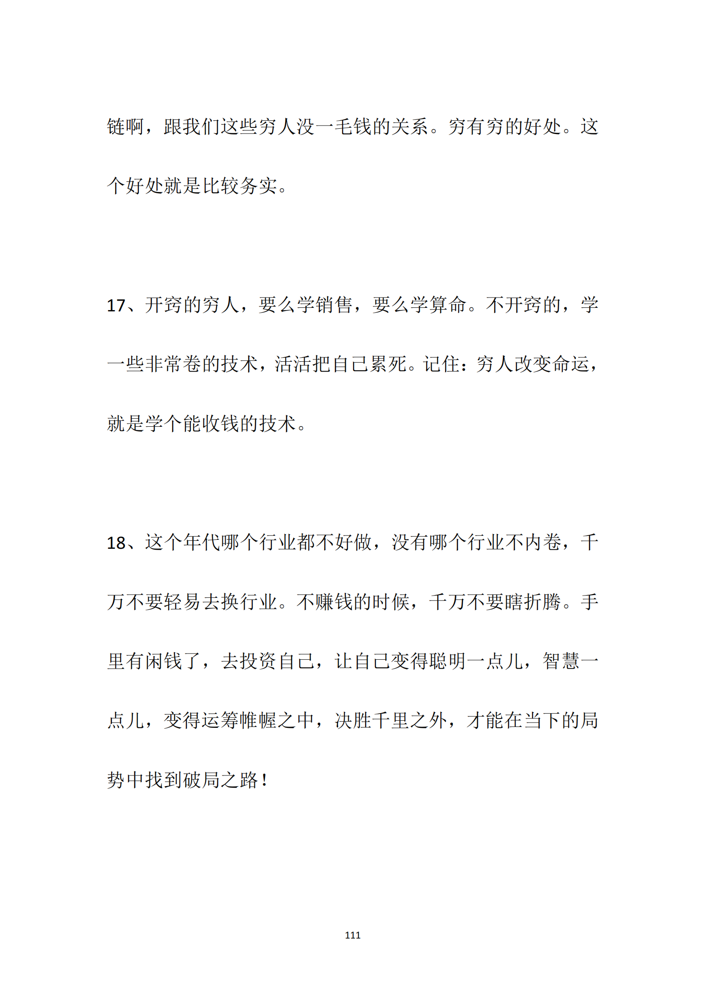

<!-- source-image-end -->

<!-- 原书第 119 页 -->

普通人，投资创业、结婚、买房，这三个重大决策，错1个
用 10 年填坑，错2个用半辈子填坑，错3个这辈子就 game
over了。
112

<!-- source-image-start -->

查看原书第 119 页影像

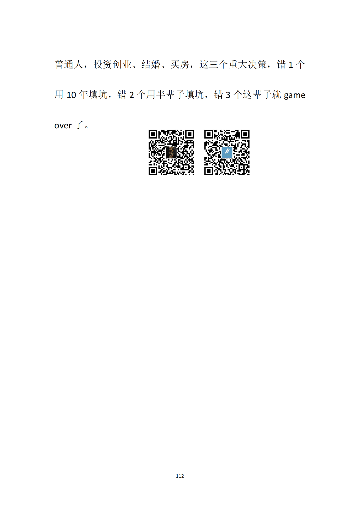

<!-- source-image-end -->
