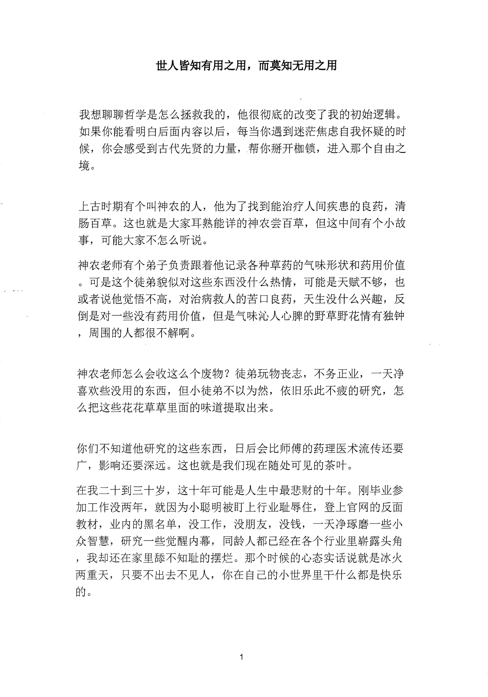
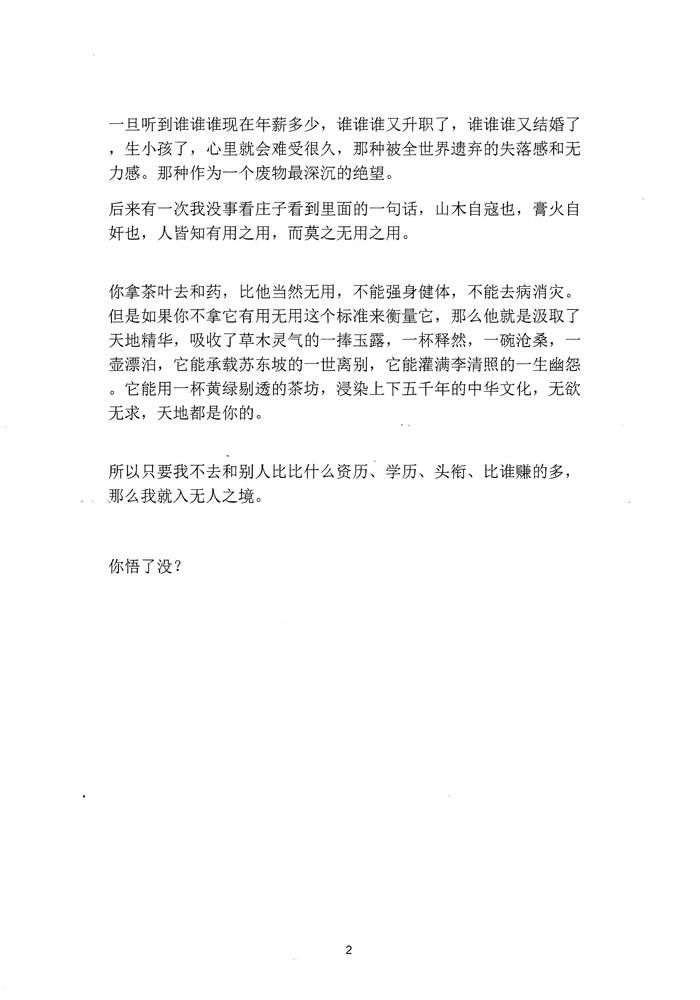

<!-- 原书第 8 页 -->

# 世人皆知有用之用，而莫知无用之用

我想聊聊哲学是怎么拯救我的，他很彻底的改变了我的初始逻辑。如果你能看明白后面内容以后，每当你遇到迷茫焦虑自我怀疑的时候，你会感受到古代先贤的力量，帮你挣开枷锁，进入那个自由之境。

上古时期有个叫神农的人，他为了找到能治疗人间疾患的良药，清肠百草。这也就是大家耳熟能详的神农尝百草，但这中间有个小故事，可能大家不怎么听说。神农老师有个弟子负责跟着他记录各种草药的气味形状和药用价值。可是这个徒弟貌似对这些东西没什么热情，可能是天赋不够，也或者说他觉悟不高，对治病救人的苦口良药，天生没什么兴趣，反倒是对一些没有药用价值，但是气味沁人心脾的野草野花情有独钟，周围的人都很不解啊。

神农老师怎么会收这么个废物？徒弟玩物丧志，不务正业，一天净喜欢些没用的东西，但小徒弟不以为然，依旧乐此不疲的研究，怎么把这些花花草草里面的味道提取出来。

你们不知道他研究的这些东西，日后会比师傅的药理医术流传还要广，影响还要深远。这也就是我们现在随处可见的茶叶。在我二十到三十岁，这十年可能是人生中最悲惨的十年。刚毕业参加工作没两年，就因为小聪明被钉上行业耻辱柱，登上官网的反面教材，业内的黑名单，没工作，没朋友，没钱，一天净琢磨一些小众智慧，研究一些觉醒内幕，同龄人都已经在各个行业里崭露头角，我却还在家里恬不知耻的摆烂。那个时候的心态实话说就是冰火两重天，只要不出去不见人，你在自己的小世界里干什么都是快乐的。

<!-- source-image-start -->

查看原书第 8 页影像

<!-- source-image-end -->
<!-- 原书第 9 页 -->

一旦听到谁谁谁现在年薪多少，谁谁谁又升职了，谁谁谁又结婚了，生小孩了，心里就会难受很久，那种被全世界遗弃的失落感和无力感。那种作为一个废物最深沉的绝望。后来有一次我没事看庄子看到里面的一句话，山木自寇也，膏火自奸也，人皆知有用之用，而莫之无用之用。

你拿茶叶去和药，比他当然无用，不能强身健体，不能去病消灾。但是如果你不拿它有用无用这个标准来衡量它，那么他就是汲取了天地精华，吸收了草木灵气的一捧玉露，一杯释然，一碗沧桑，一壶漂泊，它能承载苏东坡的一世离别，它能灌满李清照的一生幽怨。它能用一杯黄绿剔透的茶坊，浸染上下五千年的中华文化，无欲无求，天地都是你的。

所以只要我不去和别人比比什么资历、学历、头衔、比谁赚的多，那么我就入无人之境。

你悟了没？

<!-- source-image-start -->

查看原书第 9 页影像

<!-- source-image-end -->
