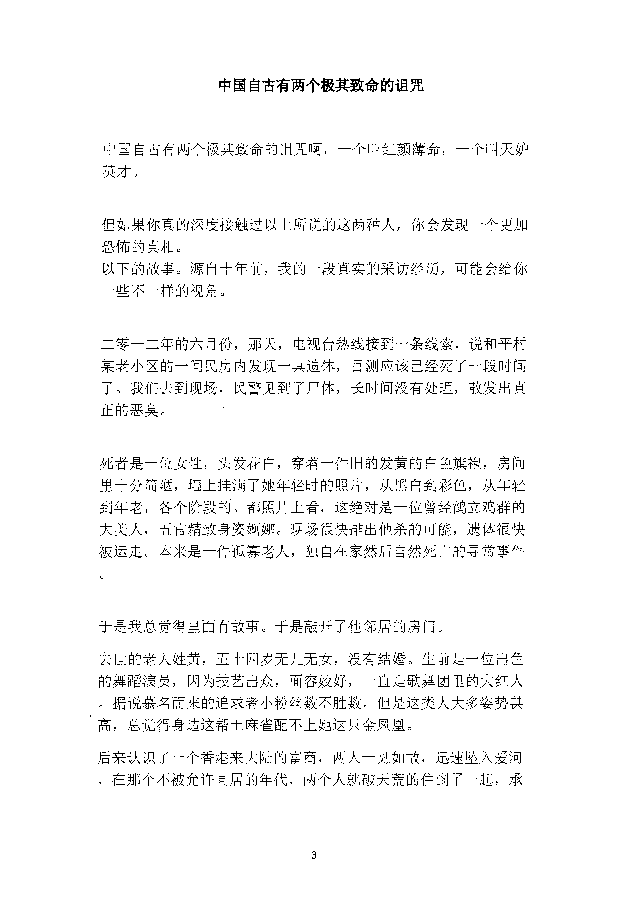
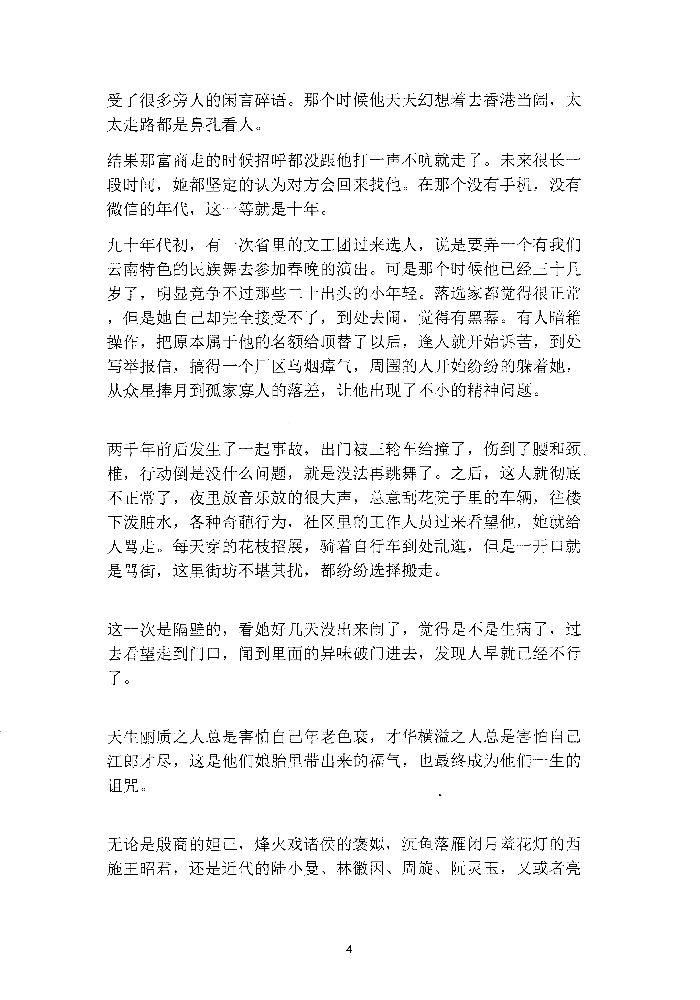
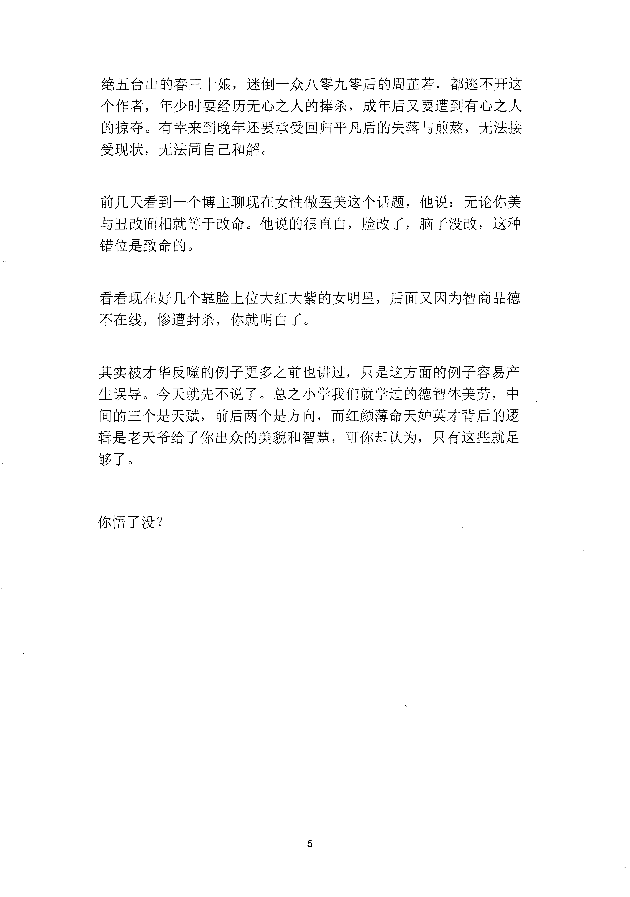

<!-- 原书第 10 页 -->

# 中国自古有两个极其致命的诅咒

中国自古有两个极其致命的诅咒啊，一个叫红颜薄命，一个叫天妒英才。

但如果你真的深度接触过以上所说的这两种人，你会发现一个更加恐怖的真相。以下的故事。源自十年前，我的一段真实的采访经历，可能会给你一些不一样的视角。

二零一二年的六月份，那天，电视台热线接到一条线索，说和平村某老小区的一间民房内发现一具遗体，目测应该已经死了一段时间了。我们去到现场，民警见到了尸体，长时间没有处理，散发出真正的恶臭。

死者是一位女性，头发花白，穿着一件旧的发黄的白色旗袍，房间里十分简陋，墙上挂满了她年轻时的照片，从黑白到彩色，从年轻到年老，各个阶段的。都照片上看，这绝对是一位曾经鹤立鸡群的大美人，五官精致身姿娴娜。现场很快排出他杀的可能，遗体很快被运走。本来是一件孤寡老人，独自在家然后自然死亡的寻常事件

于是我总觉得里面有故事。于是敲开了他邻居的房门。去世的老人姓黄，五十四岁无儿无女，没有结婚。生前是一位出色的舞蹈演员，因为技艺出众，面容姣好，一直是歌舞团里的大红人。据说慕名而来的追求者小粉丝数不胜数，但是这类人大多姿势甚高，总觉得身边这帮土麻雀配不上她这只金凤凰。后来认识了一个香港来大陆的富商，两人一见如故，迅速坠入爱河，在那个不被允许同居的年代，两个人就破天荒的住到了一起，承

<!-- source-image-start -->

查看原书第 10 页影像

<!-- source-image-end -->
<!-- 原书第 11 页 -->

受了很多旁人的闲言碎语。那个时候他天天幻想着去香港当阔，太太走路都是鼻孔看人。结果那富商走的时候招呼都没跟他打一声不吭就走了。未来很长一段时间，她都坚定的认为对方会回来找他。在那个没有手机，没有微信的年代，这一等就是十年。九十年代初，有一次省里的文工团过来选人，说是要弄一个有我们云南特色的民族舞去参加春晚的演出。可是那个时候他已经三十几岁了，明显竞争不过那些二十出头的小年轻。落选家都觉得很正常，但是她自己却完全接受不了，到处去闹，觉得有黑幕。有人暗箱操作，把原本属于他的名额给顶替了以后，逢人就开始诉苦，到处写举报信，搞得一个厂区乌烟瘫气，周围的人开始纷纷的躲着她，从众星捧月到孤家寡人的落差，让他出现了不小的精神问题。

两于年前后发生了一起事故，出门被三轮车给撞了，伤到了腰和颈。椎，行动倒是没什么问题，就是没法再跳舞了。之后，这人就彻底不正常了，夜里放音乐放的很大声，总意刮花院子里的车辆，往楼下泼脏水，各种奇葩行为，社区里的工作人员过来看望他，她就给人骂走。每天穿的花枝招展，骑着自行车到处乱逛，但是一开口就是骂街，这里街坊不堪其扰，都纷纷选择搬走。

这一次是嗟壁的，看她好几天没出来闹了，觉得是不是生病了，过去看望走到门口，闻到里面的异味破门进去，发现人早就已经不行了。

天生丽质之人总是害怕自己年老色衰，才华横溢之人总是害怕自己江郎才尽，这是他们娘胎里带出来的福气，也最终成为他们一生的诅咒。

无论是殷商的姐己，烽火戏诸侯的褒拟，沉鱼落雁闭月羞花灯的西施王昭君，还是近代的陆小曼、林徽因、周旋、阮灵玉，又或者亮

<!-- source-image-start -->

查看原书第 11 页影像

<!-- source-image-end -->
<!-- 原书第 12 页 -->

绝五台山的春三十娘，迷倒一众八零九零后的周芷若，都逃不开这个作者，年少时要经历无心之人的捧杀，成年后又要遭到有心之人的掠夺。有幸来到晚年还要承受回归平凡后的失落与煎熬，无法接受现状，无法同自己和解。

前几天看到一个博主聊现在女性做医美这个话题，他说：无论你美与丑改面相就等于改命。他说的很直白，脸改了，脑子没改，这种错位是致命的。

看看现在好几个靠脸上位大红大紫的女明星，后面又因为智商品德不在线，惨遭封杀，你就明白了。

其实被才华反噬的例子更多之前也讲过，只是这方面的例子容易产生误导。今天就先不说了。总之小学我们就学过的德智体美劳，中间的三个是天赋，前后两个是方向，而红颜薄命天妒英才背后的逻辑是老天爷给了你出众的美貌和智慧，可你却认为，只有这些就足够了。

你悟了没？

<!-- source-image-start -->

查看原书第 12 页影像

<!-- source-image-end -->
