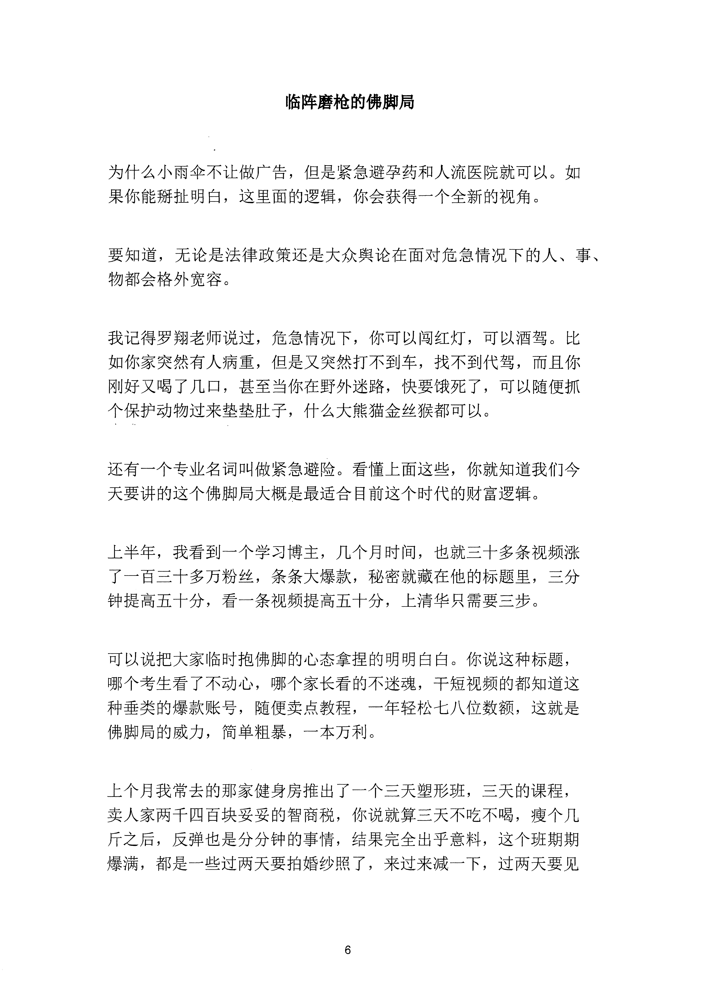
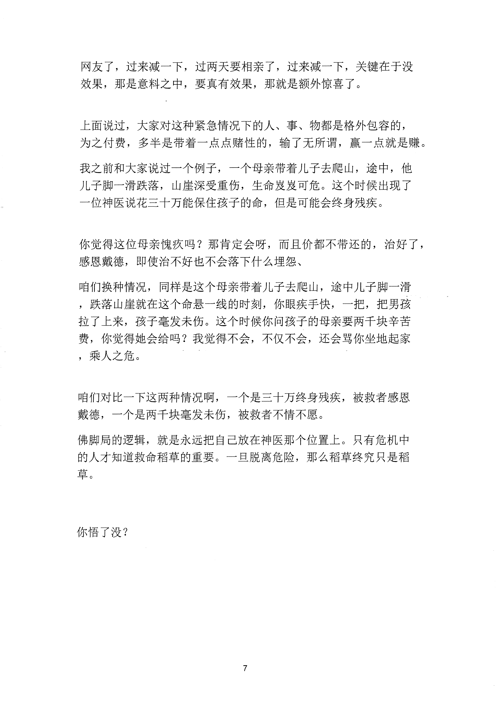

<!-- 原书第 13 页 -->

# 临阵磨枪的佛脚局

为什么小雨伞不让做广告，但是紧急避孕药和人流医院就可以。如果你能掰扯明白，这里面的逻辑，你会获得一个全新的视角。

要知道，无论是法律政策还是大众舆论在面对危急情况下的人、事、物都会格外宽容。

我记得罗翔老师说过，危急情况下，你可以闯红灯，可以酒驾。比如你家突然有人病重，但是又突然打不到车，找不到代驾，而且你刚好又喝了几口，甚至当你在野外迷路，快要饿死了，可以随便抓个保护动物过来垫垫肚子，什么大熊猫金丝猴都可以。

还有一个专业名词叫做紧急避险。看懂上面这些，你就知道我们今天要讲的这个佛脚局大概是最适合目前这个时代的财富逻辑。

上半年，我看到一个学习博主，几个月时间，也就三十多条视频涨了一百三十多万粉丝，条条大爆款，秘密就藏在他的标题里，三分钟提高五十分，看一条视频提高五十分，上清华只需要三步。

可以说把大家临时抱佛脚的心态拿捏的明明白臼。你说这种标题，哪个考生看了不动心，哪个家长看的不迷魂，干短视频的都知道这种垂类的爆款账号，随便卖点教程，一年轻松七八位数额，这就是佛脚局的威力，简单粗暴，一本万利。

上个月我常去的那家健身房推出了一个三天塑形班，三天的课程，卖人家两千四百块妥妥的智商税，你说就算三天不吃不喝，瘦个几斤之后，反弹也是分分钟的事情，结果完全出乎意料，这个班期期爆满，都是一些过两天要拍婚纱照了，来过来减一下，过两天要见

<!-- source-image-start -->

查看原书第 13 页影像

<!-- source-image-end -->
<!-- 原书第 14 页 -->

网友了，过来减一下，过两天要相亲了，过来减一下，关键在于没效果，那是意料之中，要真有效果，那就是额外惊喜了。

上面说过，大家对这种紧急情况下的人、事、物都是格外包容的，为之付费，多半是带着一点点赌性的，输了无所谓，赢一点就是赚。我之前和大家说过一个例子，一个母亲带着儿子去爬山，途中，他儿子脚一滑跌落，山崖深受重伤，生命发发可危。这个时候出现了一位神医说花三十万能保住孩子的命，但是可能会终身残疾。

你觉得这位母亲愧疚吗？那肯定会呀，而且价都不带还的，治好了，感恩戴德，即使治不好也不会落下什么埋怨、咱们换种情况，同样是这个母亲带着儿子去爬山，途中儿子脚一滑，跌落山崖就在这个命悬一线的时刻，你眼疾手快，一把，把男孩拉了上来，孩子毫发未伤。这个时候你问孩子的母亲要两千块辛苦费，你觉得她会给吗？我觉得不会，不仅不会，还会骂你坐地起家，乘人之危。

咱们对比一下这两种情况啊，一个是三十万终身残疾，被救者感恩戴德，一个是两千块毫发未伤，被救者不情不愿。佛脚局的逻辑，就是永远把自己放在神医那个位置上。只有危机中的人才知道救命稻草的重要。一旦脱离危险，那么稻草终究只是稻草。

你悟了没？

<!-- source-image-start -->

查看原书第 14 页影像

<!-- source-image-end -->
