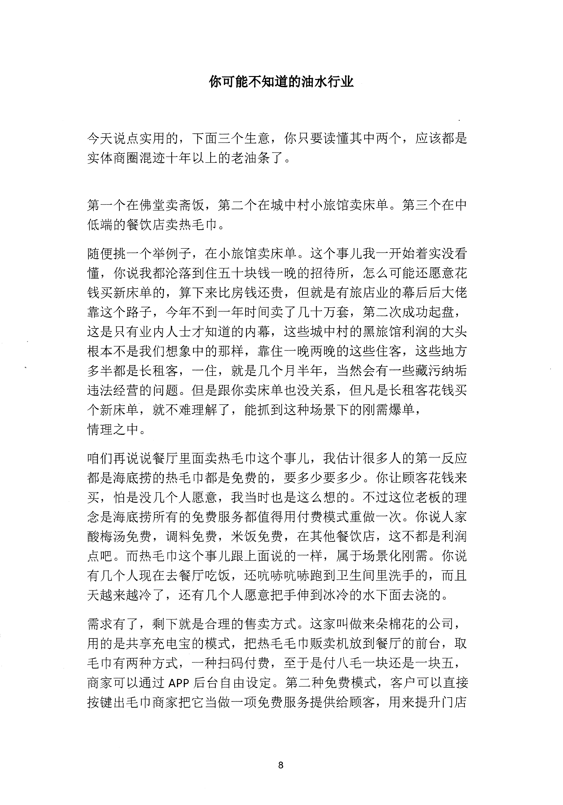
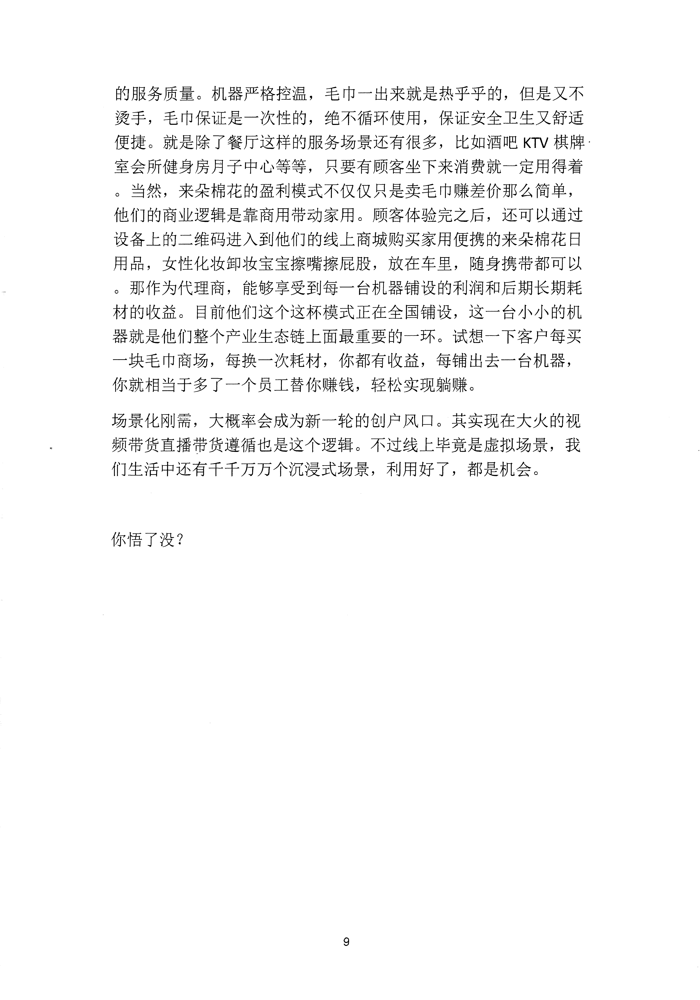

<!-- 原书第 15 页 -->

# 你可能不知道的油水行业

今天说点实用的，下面三个生意，你只要读懂其中两个，应该都是
实体商圈混迹十年以上的老油条了。
第一个在佛堂卖斋饭，第二个在城中村小旅馆卖床单。第三个在中
低端的餐饮店卖热毛巾。
随便挑一个举例子，在小旅馆卖床单。这个事儿我一开始着实没看
懂，你说我都沦落到住五十块钱一晚的招待所，怎么可能还愿意花
钱买新床单的，算下来比房钱还贵，但就是有旅店业的幕后后大佬
靠这个路子，今年不到一年时间卖了几十万套，第二次成功起盘，
这是只有业内人士才知道的内幕，这些城中村的黑旅馆利润的大头
根本不是我们想象中的那样，靠住一晚两晚的这些住客，这些地方
多半都是长租客，一住，就是几个月半年，当然会有一些藏污纳垢
违法经营的问题。但是跟你卖床单也没关系，但凡是长租客花钱买
个新床单，就不难理解了，能抓到这种场景下的刚需爆单，
情理之中。
咱们再说说餐厅里面卖热毛巾这个事儿，我估计很多人的第一反应
都是海底捞的热毛巾都是免费的，要多少要多少。你让顾客花钱来
买，怕是没几个人愿意，我当时也是这么想的。不过这位老板的理
念是居底捞所有的免费服务都值得用付费模式重做一次。你说人家
酸梅汤免费，调料免费，米饭免费，在其他餐饮店，这不都是利润
点吧。而热毛巾这个事儿跟上面说的一样，属于场景化刚需。你说
有几个入现在去餐厅吃饭，还吭捇吭咭跑到卫生间里洗手的，而且
天越来越冷了，还有几个人愿意把手伸到冰冷的水下面去浇的。
需求有了，剩下就是合理的售卖方式。这家叫做来朵棉花的公司，
用的是共享充电宝的模式，把热毛毛巾贩卖机放到餐厅的前台，取
毛巾有两种方式，一种扫码付费，至于是付八毛一块还是一块五，
商家可以通过APP 后台自由设定。第二种免费模式，客户可以直接
按键出毛巾商家把它当做一项免费服务提供给顾客，用来提升门店
8
更多kr66e9gs

<!-- source-image-start -->

查看原书第 15 页影像

<!-- source-image-end -->

<!-- 原书第 16 页 -->

的服务质量。机器严格控温，毛巾一出来就是热乎乎的，但是又不
烫手，毛巾保证是一次性的，绝不循环使用，保证安全卫生又舒适
便捷。就是除了餐厅这样的服务场景还有很多，比如酒吧KTV 棋牌
室会所健身房月子中心等等，只要有顾客坐下来消费就一定用得着
。当然，来朵棉花的盈利模式不仅仅只是卖毛巾赚差价那么简单，
他们的商业逻辑是靠商用带动家用。顾客体验完之后，还可以通过
设备上的二维码进入到他们的线上商城购买家用便携的来朵棉花日
用品，女性化妆卸妆宝宝擦嘴擦屁股，放在车里，随身携带都可以
。那作为代理商，能够享受到每一台机器铺设的利润和后期长期耗
材的收益。目前他们这个这杯模式正在全国铺设，这一台小小的机
器就是他们整个产业生态链上面最重要的一环。试想一下客户每买
一块毛巾商场，每换一次耗材，你都有收益，每铺出去一台机器，
你就相当于多了一个员工替你赚钱，轻松实现躺赚。
场景化刚需，大概率会成为新一轮的创户风口。其实现在大火的视
频带货直播带货遵循也是这个逻辑。不过线上毕竞是虚拟场景，我
们生活中还有于千万万个沉浸式场景，利用好了，都是机会。
你悟了没？
9
更多kr66e9gs

<!-- source-image-start -->

查看原书第 16 页影像

<!-- source-image-end -->
