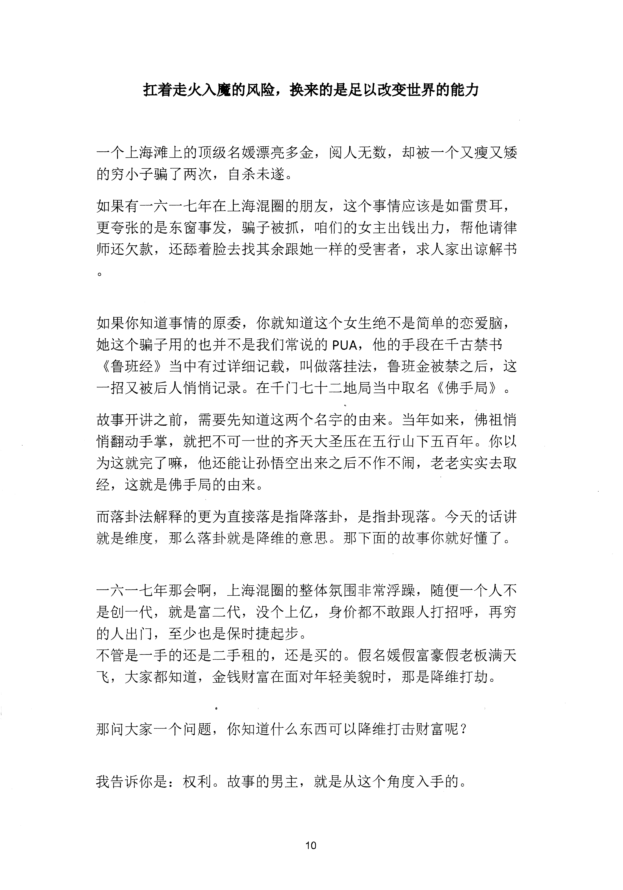
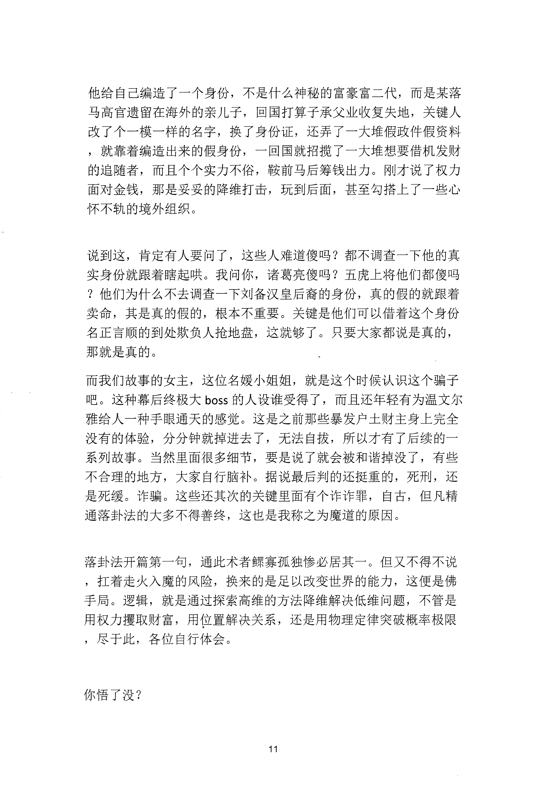

<!-- 原书第 17 页 -->

# 扛着走火入魔的风险，换来的是足以改变世界的能力

一个上海滩上的顶级名媛漂亮多金，阅人无数，却被一个又瘦又矮
的穷小子骗了两次，自杀未遂。
如果有一六一七年在上海混圈的朋友，这个事情应该是如雷贯耳，
更夸张的是东窗事发，骗子被抓，咱们的女主出钱出力，帮他请律
师还欠款，还婖着脸去找其余跟她一样的受害者，求人家出谅解书
如果你知道事情的原委，你就知道这个女生绝不是简单的恋爱脑，
她这个骗子用的也并不是我们常说的PUA,
他的手段在千古禁书
《鲁班经》当中有过详细记载，叫做落挂法，鲁班金被禁之后，这
一招又被后人悄悄记录。在于门七十二地局当中取名《佛手局》。
故事开讲之前，需要先知道这两个名字的由来。当年如来，佛祖悄
悄翻动手掌，就把不可一世的齐天大圣压在五行山下五百年。你以
为这就完了嘛，他还能让孙悟空出来之后不作不闹，老老实实去取
经，这就是佛手局的由来。
而落卦法解释的更为直接落是指降落卦，是指卦现落。今天的话讲
就是维度，那么落卦就是降维的意思。那下面的故事你就好懂了。
一六一七年那会啊，上海混圈的整体氛围非常浮躁，随便一个入不
是创一代，就是富二代，没个上亿，身价都不敢跟人打招呼，再穷
的人出门，至少也是保时捷起步。
不管是一手的还是二手租的，还是买的。假名媛假富豪假老板满天
飞，大家都知道，金钱财富在面对年轻美貌时，那是降维打劫。
那问大家一个问题，你知道什么东西可以降维打击财富呢？
我告诉你是：权利。故事的男主，就是从这个角度入手的。
10
更多kr66e9gs

<!-- source-image-start -->

查看原书第 17 页影像

<!-- source-image-end -->

<!-- 原书第 18 页 -->

他给自己编造了一个身份，不是什么神秘的富豪富二代，而是某落
马高官遗留在海外的亲儿子，回国打算子承父业收复失地，关键人
改了个一模一样的名字，换了身份证，还弄了一大堆假政件假资料
，就靠着编造出来的假身份，一回国就招揽了一大堆想要借机发财
的追随者，而且个个实力不俗，鞍前马后筹钱出力。刚才说了权力
面对金钱，那是妥妥的降维打击，玩到后面，甚至勾搭上了一些心
怀不轨的境外组织。
说到这，肯定有人要问了，这些人难道傻吗？都不调查一下他的真
实身份就跟着瞎起哄。我问你，诸葛亮傻吗？五虎上将他们都傻吗
？他们为什么不去调查一下刘备汉皇后裔的身份，真的假的就跟着
卖命，其是真的假的，根本不重要。关键是他们可以借着这个身份
名正言顺的到处欺负人抢地盘，这就够了。只要大家都说是真的，
那就是真的。
而我们故事的女主，这位名媛小姐姐，就是这个时候认识这个骗子
吧。这种幕后终极大boss 的人设谁受得了，而且还年轻有为温文尔
雅给人一种手眼通天的感觉。这是之前那些暴发户土财主身上完全
没有的体验，分分钟就掉进去了，无法自拔，所以才有了后续的一
系列故事。当然里面很多细节，要是说了就会被和谐掉没了，有些
不合理的地方，大家自行脑补。据说最后判的还挺重的，死刑，还
是死缓。诈骗。这些还其次的关键里面有个诈诈罪，自古，但凡精
通落卦法的大多不得善终，这也是我称之为魔道的原因。
落卦法开篇第一旬，通此术者鲸寡孤独惨必居其一。但又不得不说
，扛着走火入魔的风险，换来的是足以改变世界的能力，这便是佛
手局。逻辑，就是通过探索高维的方法降维解决低维问题，不管是
用权力攫取财富，用位置解决关系，还是用物理定律突破概率极限
，尽于此，各位自行体会。
你悟了没？
11
更多kr66e9gs

<!-- source-image-start -->

查看原书第 18 页影像

<!-- source-image-end -->
