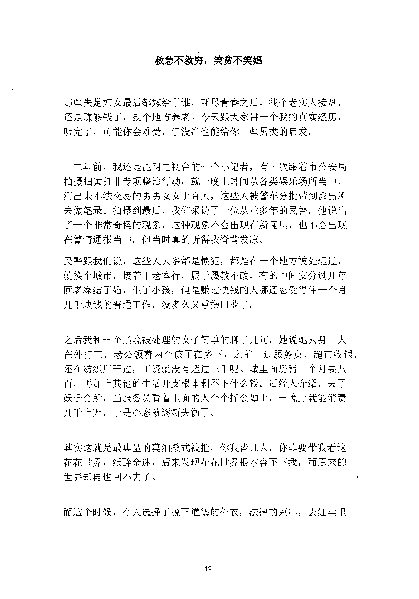

<!-- 原书第 19 页 -->

# 救急不救穷，笑贫不笑娼

那些失足妇女最后都嫁给了谁，耗尽青春之后，找个老实人接盘，
还是赚够钱了，换个地方养老。今天跟大家讲一个我的真实经历，
听完了，可能你会难受，但没准也能给你一些另类的启发。
十二年前，我还是昆明电视台的一个小记者，有一次跟着市公安局
拍摄扫黄打非专项整治行动，就一晚上时间从各类娱乐场所当中，
清出来不法交易的男男女女上百人，这些人被警车分批带到派出所
去做笔录。拍摄到最后，我们采访了一位从业多年的民警，他说出
了一个非常奇怪的现象，这种现象不会出现在新闻里，也不会出现
在警情通报当中。但当时真的听得我脊背发凉。
民警跟我们说，这些人大多都是惯犯，都是在一个地方被处理过，
就换个城市，接着干老本行，属于屡教不改，有的中间安分过几年
回老家结了婚，生了小孩，但是赚过快钱的人哪还忍受得住一个月
几千块钱的普通工作，没多久又重操旧业了。
之后我和一个当晚被处理的女子简单的聊了几句，她说她只身一人
在外打工，老公领着两个孩子在乡下，之前干过服务员，超市收银，
还在纺织厂干过，工资就没有超过三千呢。城里面房租一个月要八
百，再加上其他的生活开支根本剩不下什么钱。后经人介绍，去了
娱乐会所，当服务员看着里面的人个个挥金如土，一晚上就能消费
几千上万，于是心态就逐渐失衡了。
其实这就是最典型的莫泊桑式被拒，你我皆凡人，你非要带我看这
花花世界，纸醉金迷，后来发现花花世界根本容不下我，而原来的
世界却再也回不去了。
而这个时候，有人选择了脱下道德的外衣，法律的束缚，去红尘里
12
更多kr66e9gs

<!-- source-image-start -->

查看原书第 19 页影像

<!-- source-image-end -->

<!-- 原书第 20 页 -->

捞金，有人选择在赌桌上孤注一掷，还有人想去金三角缅北碰碰运
气。人世间的悲剧，就像俄罗斯套娃一样，环环相扣。
你悟了没？
13
更多kr66e9gs

<!-- source-image-start -->

查看原书第 20 页影像

<!-- source-image-end -->
