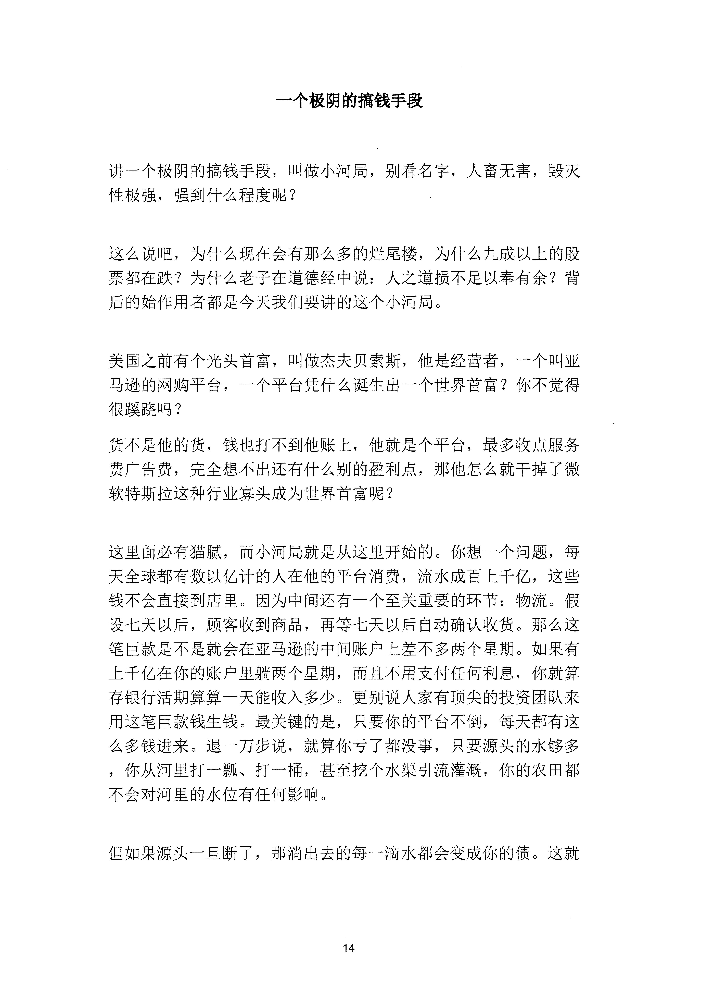
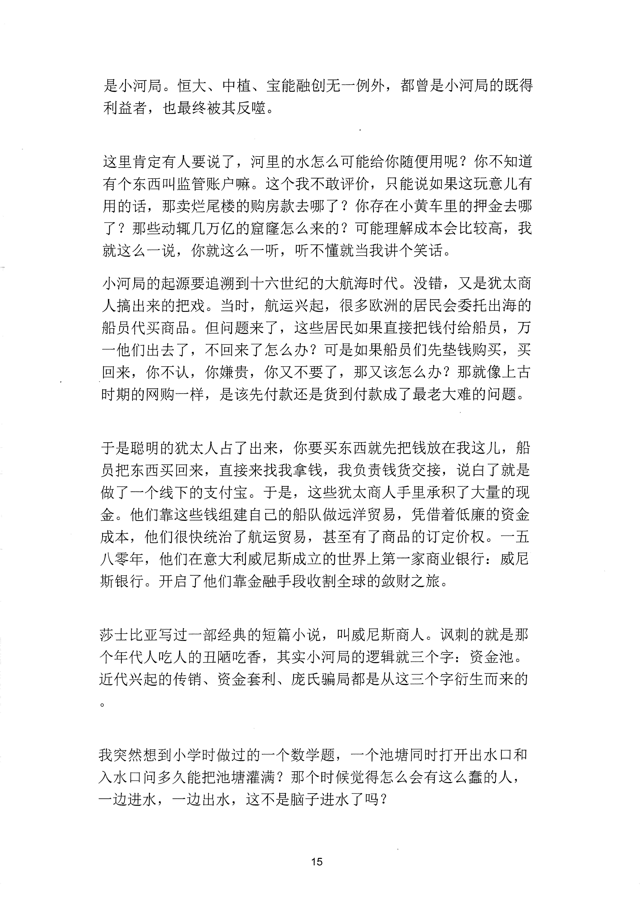
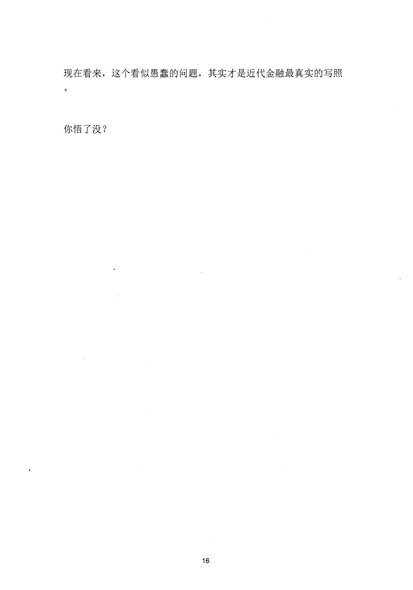

<!-- 原书第 21 页 -->

# 一个极阴的搞钱手段

讲一个极阴的搞钱手段，叫做小河局，别看名字，人畜无害，毁灭性极强，强到什么程度呢？

这么说吧，为什么现在会有那么多的烂尾楼，为什么九成以上的股票都在跌？为什么老子在道德经中说：人之道损不足以奉有余？背后的始作用者都是今天我们要讲的这个小河局。

美国之前有个光头首富，叫做杰夫贝索斯，他是经营者，一个叫亚马逊的网购平台，一个平台凭什么诞生出一个世界首富？你不觉得很蹊跷吗？货不是他的货，钱也打不到他账上，他就是个平台，最多收点服务费广告费，完全想不出还有什么别的盈利点，那他怎么就干掉了微软特斯拉这种行业寡头成为世界首富呢？

这里面必有猫腻，而小河局就是从这里开始的。你想一个问题，每天全球都有数以亿计的人在他的平台消费，流水成百上千亿，这些钱不会直接到店里。因为中间还有一个至关重要的环节：物流。假设七天以后，顾客收到商品，再等七天以后自动确认收货。那么这笔巨款是不是就会在亚马逊的中间账户上差不多两个星期。如果有上于亿在你的账户里躺两个星期，而且不用支付任何利息，你就算存银行活期算算一天能收入多少。更别说人家有顶尖的投资团队来用这笔巨款钱生钱。最关键的是，只要你的平台不倒，每天都有这么多钱进来。退一万步说，就算你亏了都没事，只要源头的水够多，你从河里打一飘、打一桶，甚至挖个水渠引流灌溉，你的农田都不会对河呈的水位有任何影响。

但如果源头一旦断了，那淌出去的每一滴水都会变成你的债。这就

<!-- source-image-start -->

查看原书第 21 页影像

<!-- source-image-end -->
<!-- 原书第 22 页 -->

是小河局。恒大、中植、宝能融创无一例外，都曾是小河局的既得利益者，也最终被其反噬。

这里肯定有人要说了，河里的水怎么可能给你随便用呢？你不知道有个东西叫监管账户嘛。这个我不敢评价，只能说如果这玩意儿有用的话，那卖烂尾楼的购房款去哪了？你存在小黄车里的押金去哪了？那些动辄几万亿的窟窟怎么来的？可能理解成本会比较高，我就这么一说，你就这么一听，听不懂就当我讲个笑话。小河局的起源要追溯到十六世纪的大航海时代。没错，又是犹太商人搞出来的把戏。当时，航运兴起，很多欧洲的居民会委托出海的船员代买商品。但问题来了，这些居民如果直接把钱付给船员，万一他们出去了，不回来了怎么办？可是如果船员们先垫钱购买，买回来，你不认，你嫌贵，你又不要了，那又该怎么办？那就像上古时期的网购一样，是该先付款还是货到付款成了最老大难的问题。

于是聪明的犹太人占了出来，你要买东西就先把钱放在我这儿，船员把东西买回来，直接来找我拿钱，我负责钱货交接，说白了就是做了一个线下的支付宝。于是，这些犹太商人手里承积了大量的现金。他们靠这些钱组建自己的船队做远洋贸易，凭借着低廉的资金成本，他们很快统治了航运贸易，甚至有了商品的订定价权。一五八零年，他们在意大利威尼斯成立的世界上第一家商业银行：威尼斯银行。开启了他们靠金融手段收割全球的敛财之旅。

莎士比亚写过一部经典的短篇小说，叫威尼斯商人。讽刺的就是那个年代人吃人的丑陋吃香，其实小河局的逻辑就三个字：资金池。近代兴起的传销、资金套利、庞氏骗局都是从这三个字衍生而来的

我突然想到小学时做过的一个数学题，一个池塘同时打开出水口和入水口问多久能把池塘灌满？那个时候觉得怎么会有这么蠢的人，一边进水，一边出水，这不是脑子进水了吗？

<!-- source-image-start -->

查看原书第 22 页影像

<!-- source-image-end -->
<!-- 原书第 23 页 -->

现在看来，这个看似愚蠢的问题，其实才是近代金融最真实的写照

你悟了没？

<!-- source-image-start -->

查看原书第 23 页影像

<!-- source-image-end -->
