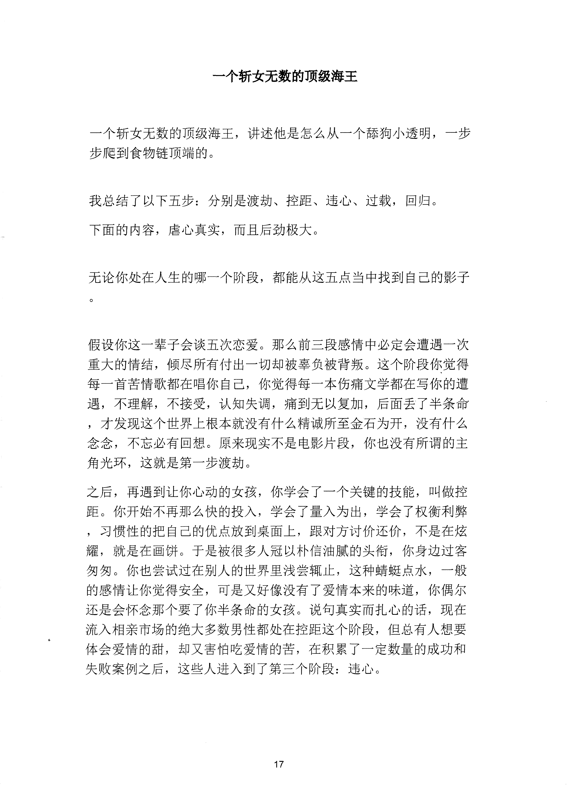
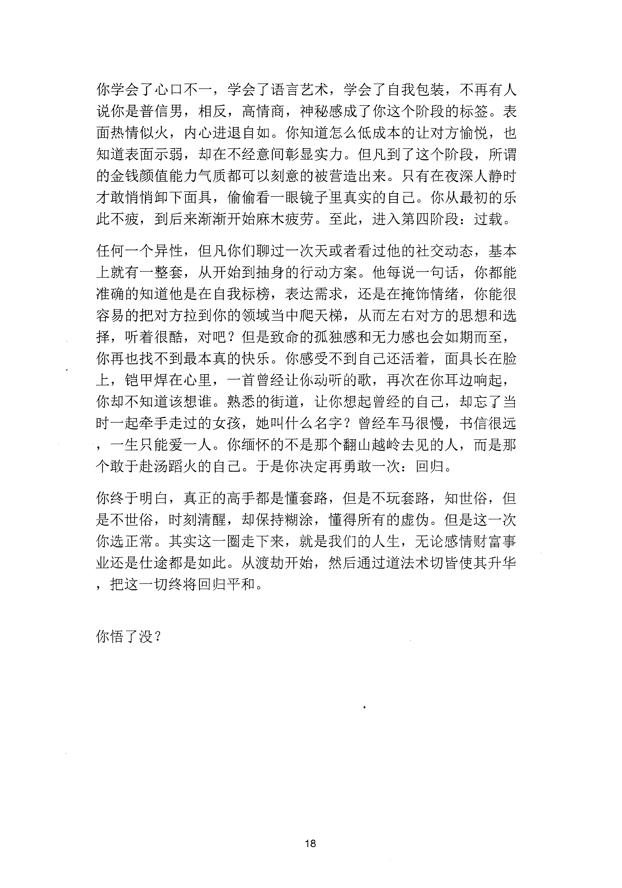

<!-- 原书第 24 页 -->

# 一个斩女无数的顶级海王

一个斩女无数的顶级海王，讲述他是怎么从一个舔狗小透明，一步步爬到食物链顶端的。

我总结了以下五步：分别是渡劫、控距、违心、过载，回归。下面的内容，虐心真实，而且后劲极大。

无论你处在人生的哪一个阶段，都能从这五点当中找到自己的影子

假设你这一辈子会谈五次恋爱。那么前三段感情中必定会遭遇一次重大的情结，倾尽所有付出一切却被辜负被背叛。这个阶段你觉得每一首苦情歌都在唱你自己，你觉得每一本伤痛文学都在写你的遭遇，不理解，不接受，认知失调，痛到无以复加，后面丢了半条命，才发现这个世界上根本就没有什么精诚所至金石为开，没有什么念念，不忘必有回想。原来现实不是电影片段，你也没有所谓的主角光环，这就是第一步渡劫。之后，再遇到让你心动的女孩，你学会了一个关键的技能，叫做控距。你开始不再那么快的投入，学会了量入为出，学会了权衡利弊，习惯性的把自己的优点放到桌面上，跟对方讨价还价，不是在炫耀，就是在画饼。于是被很多人冠以朴信油腻的头衔，你身边过客匆匆。你也尝试过在别人的世界里浅尝辄止，这种蜡蜓点水，一般的感情让你觉得安全，可是又好像没有了爱情本来的味道，你偶尔还是会怀念那个要了你半条命的女孩。说旬真实而扎心的话，现在流入相亲市场的绝大多数男性都处在控距这个阶段，但总有人想要体会爱情的甜，却又害怕吃爱情的苦，在积累了一定数量的成功和失败案例之后，这些人进入到了第三个阶段：违心。

<!-- source-image-start -->

查看原书第 24 页影像

<!-- source-image-end -->
<!-- 原书第 25 页 -->

你学会了心口不一，学会了语言艺术，学会了自我包装，不再有人说你是普信男，相反，高情商，神秘感成了你这个阶段的标签。表面热情似火，内心进退自如。你知道怎么低成本的让对方愉悦，也知道表面示弱，却在不经意间彰显实力。但凡到了这个阶段，所谓的金钱颜值能力气质都可以刻意的被营造出来。只有在夜深人静时才敢悄悄卸下面具，偷偷看一眼镜子里真实的自己。你从最初的乐此不疲，到后来渐渐开始麻木疲劳。至此，进入第四阶段：过载。任何一个异性，但凡你们聊过一次天或者看过他的社交动态，基本上就有一整套，从开始到抽身的行动方案。他每说一句话，你都能准确的知道他是在自我标榜，表达需求，还是在掩饰情绪，你能很容易的把对方拉到你的领域当中爬天梯，从而左右对方的思想和选择，听着很酷，对吧？但是致命的孤独感和无力感也会如期而至，你再也找不到最本真的快乐。你感受不到自己还活着，面具长在脸上，令岂甲焊在心里，一首曾经让你动听的歌，再次在你耳边响起，你却不知道该想谁。熟悉的街道，让你想起曾经的自己，却忘了当时一起牵手走过的女孩，她叫什么名字？曾经车马很慢，书信很远，一生只能爱一人。你缅怀的不是那个翻山越岭去见的人，而是那个敢于赴汤蹈火的自己。于是你决定再勇敢一次：回归。你终于明白，真正的高手都是懂套路，但是不玩套路，知世俗，但是不世俗，时刻清醒，却保持糊涂，懂得所有的虚伪。但是这一次你选正常。其实这一圈走下来，就是我们的人生，无论感情财富事业还是仕途都是如此。从渡劫开始，然后通过道法术切皆使其升华，把这一切终将回归平和。

你悟了没？

<!-- source-image-start -->

查看原书第 25 页影像

<!-- source-image-end -->
