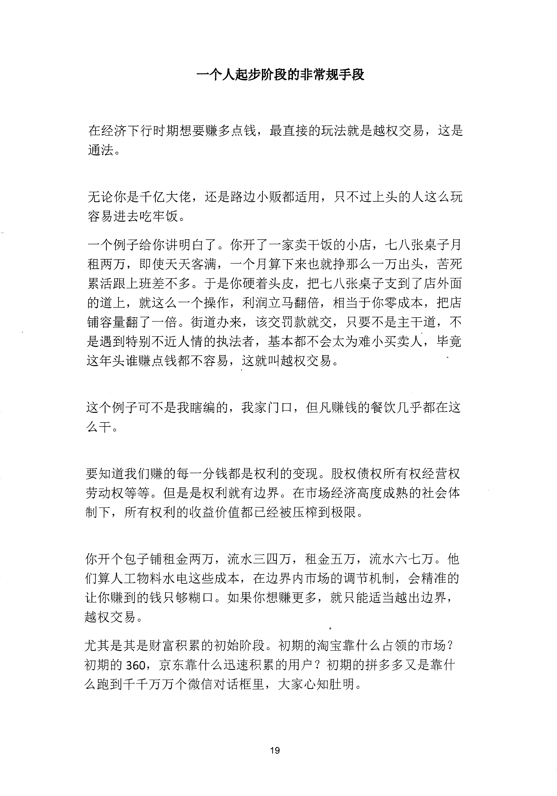
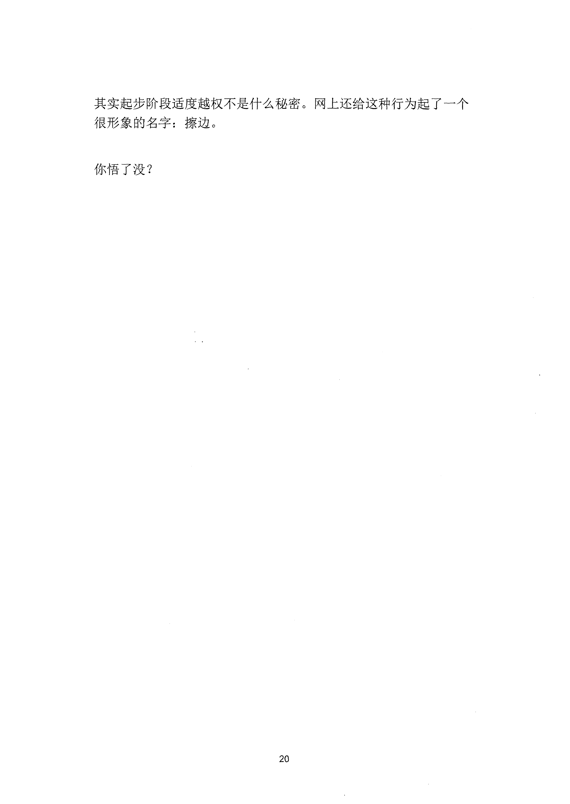

<!-- 原书第 26 页 -->

# 一个人起步阶段的非常规手段

在经济下行时期想要赚多点钱，最直接的玩法就是越权交易，这是
通法。
无论你是千亿大佬，还是路边小贩都适用，只不过上头的人这么玩
容易进去吃牢饭。
一个例子给你讲明臼了。你开了一家卖干饭的小店，七八张桌子月
租两万，即使天天客满，一个月算下来也就挣那么一万出头，苦死
累活跟上班差不多。千是你硬着头皮，把七八张桌子支到了店外面
的道上，就这么一个操作，利润立马翻倍，相当于你零成本，把店
铺容量翻了一倍。街道办来，该交罚款就交，只要不是主干道，不
是遇到特别不近人情的执法者，基本都不会太为难小买卖人，毕竟
这年头谁赚点钱都不容易，这就叫越权交易。
这个例子可不是我瞎编的，我家门口，但凡赚钱的餐饮几乎都在这
么干。
要知道我们赚的每一分钱都是权利的变现。股权债权所有权经营权
劳动权等等。但是是权利就有边界。在市场经济高度成熟的社会体
制下，所有权利的收益价值都已经被压椋到极限。
你开个包子铺租金两万，流水三四万，租金五万，流水六七万。他
们算人工物料水电这些成本，在边界内市场的调节机制，会精准的
让你赚到的钱只够糊口。如果你想赚更多，就只能适当越出边界，
越权交易。
尤其是其是财富积累的初始阶段。初期的淘宝靠什么占领的市场？
初期的360,
京东靠什么迅速积累的用户？初期的拼多多又是靠什
么跑到千千万万个微信对话框里，大家心知肚明。
19
更多kr66e9gs

<!-- source-image-start -->

查看原书第 26 页影像

<!-- source-image-end -->

<!-- 原书第 27 页 -->

其实起步阶段适度越权不是什么秘密。网上还给这种行为起了一个
很形象的名字：擦边。
你悟了没？
20
更多kr66e9gs

<!-- source-image-start -->

查看原书第 27 页影像

<!-- source-image-end -->
