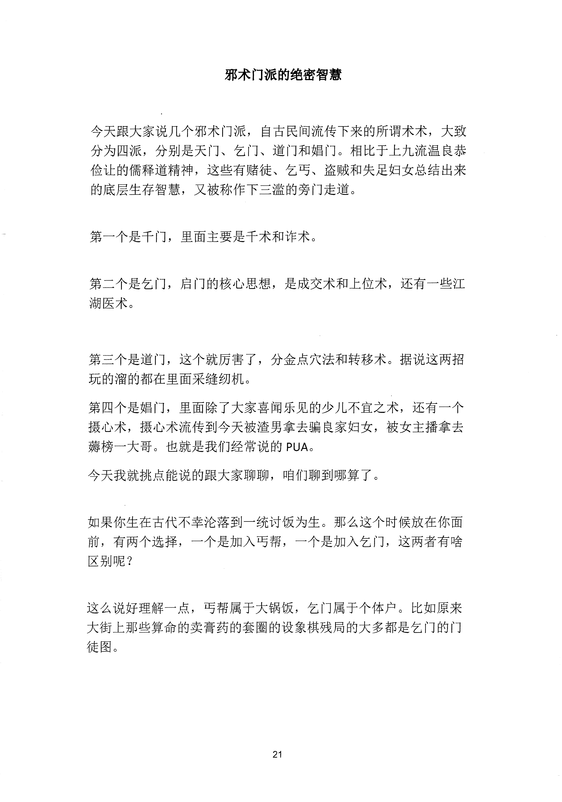
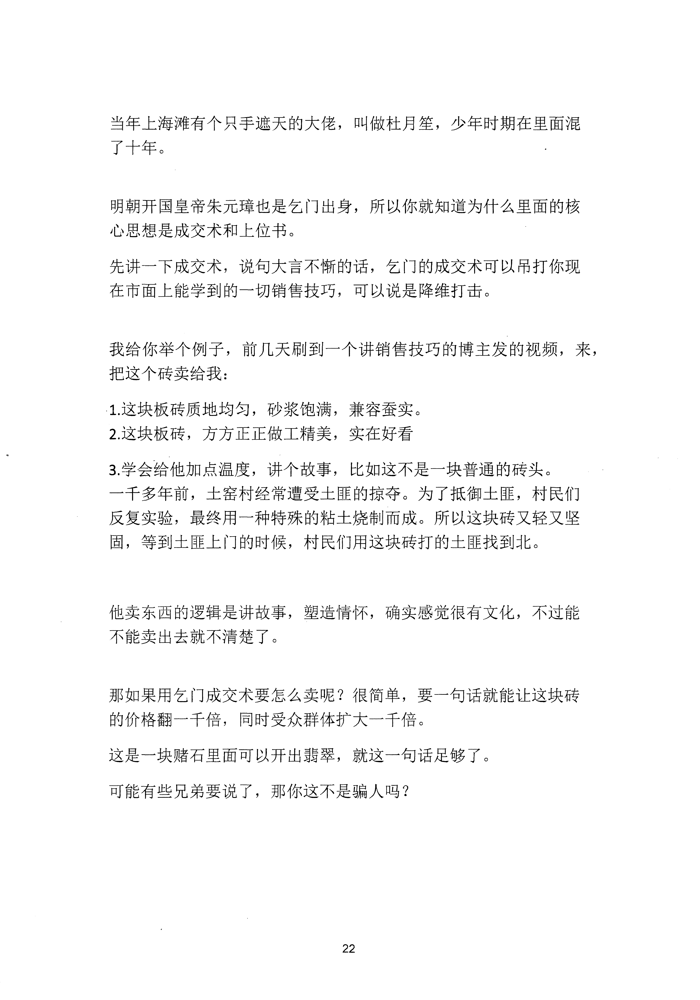
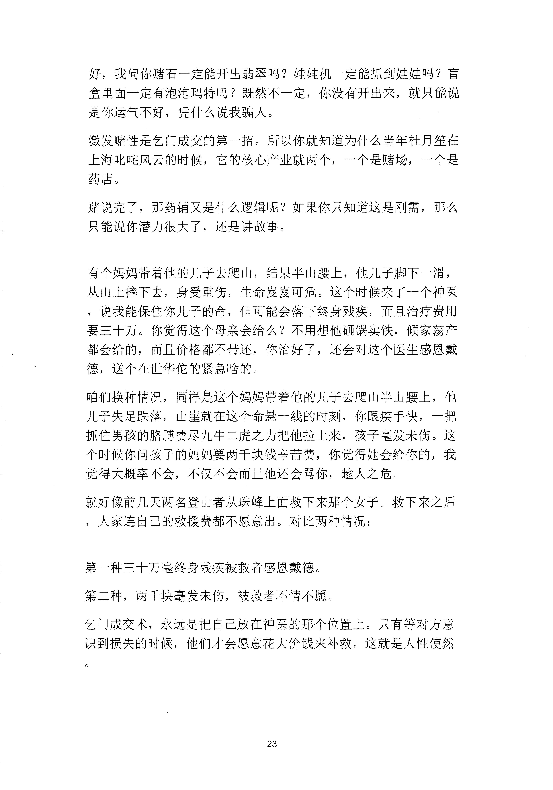
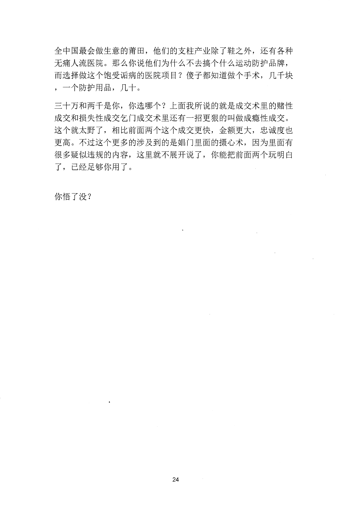

<!-- 原书第 28 页 -->

# 邪术门派的绝密智慧

今天跟大家说几个邪术门派，自古民间流传下来的所谓术术，大致分为四派，分别是天门、乞门、道门和娼门。相比千上九流温良恭俭让的儒释道精神，这些有赌徒、乞丐、盗贼和失足妇女总结出来的底层生存智慧，又被称作下三滥的旁门走道。

第一个是千门，里面主要是千术和诈术。

第二个是乞门，启门的核心思想，是成交术和上位术，还有一些江湖医术。

第三个是道门，这个就厉害了，分金点穴法和转移术。据说这两招玩的溜的都在里面采缝纫机。第四个是娼门，里面除了大家喜闻乐见的少儿不宜之术，还有一个摄心术，摄心术流传到今天被渣男拿去骗良家妇女，被女主播拿去姆榜一大哥。也就是我们经常说的PUA。今天我就挑点能说的跟大家聊聊，咱们聊到哪算了。

如果你生在古代不幸沦落到一统讨饭为生。那么这个时候放在你面前，有两个选择，一个是加入丐帮，一个是加入乞门，这两者有啥区别呢？

这么说好理解一点，丐帮属于大锅饭，乞门属于个体户。比如原来大街上那些算命的卖膏药的套圈的设象棋残局的大多都是乞门的门徒图。

<!-- source-image-start -->

查看原书第 28 页影像

<!-- source-image-end -->
<!-- 原书第 29 页 -->

当年上海滩有个只手遮天的大佬，叫做杜月笙，少年时期在里面混了十年。

明朝开国皇帝朱元璋也是乞门出身，所以你就知道为什么里面的核心思想是成交术和上位书。先讲一下成交术，说旬大言不惭的话，乞门的成交术可以吊打你现在市面上能学到的一切销售技巧，可以说是降维打击。

我给你举个例子，前几天刷到一个讲销售技巧的博主发的视频，来，把这个砖卖给我：1这块板砖质地均匀，砂浆饱满，兼容蚕实。2这块板砖，方方正正做工精美，实在好看

3．学会给他加点温度，讲个故事，比如这不是一块普通的砖头。一千多年前，土窑村经常遭受土匪的掠夺。为了抵御土匪，村民们反复实验，最终用一种特殊的粘土烧制而成。所以这块砖又轻又坚固，等到土匪上门的时候，村民们用这块砖打的土匪找到北。

他卖东西的逻辑是讲故事，塑造情怀，确实感觉很有文化，不过能不能卖出去就不清楚了。

那如果用乞门成交术要怎么卖呢？很简单，要一句话就能让这块砖的价格翻一千倍，同时受众群体扩大一千倍。这是一块赌石里面可以开出翡翠，就这一旬话足够了。可能有些兄弟要说了，那你这不是骗人吗？

<!-- source-image-start -->

查看原书第 29 页影像

<!-- source-image-end -->
<!-- 原书第 30 页 -->

好，我问你赌石一定能开出翡翠吗？娃娃机一定能抓到娃娃吗？盲盒里面一定有泡泡玛特吗？既然不一定，你没有开出来，就只能说是你运气不好，凭什么说我骗人。激发赌性是乞门成交的第一招。所以你就知道为什么当年杜月笙在上海叱咤风云的时候，它的核心产业就两个，一个是赌场，一个是药店。赌说完了，那药铺又是什么逻辑呢？如果你只知道这是刚需，那么只能说你潜力很大了，还是讲故事。

有个妈妈带着他的儿子去爬山，结果半山腰上，他儿子脚下一滑，从山上摔下去，身受重伤，生命岌岌可危。这个时候来了一个神医，说我能保住你儿子的命，但可能会落下终身残疾，而且治疗费用要三十万。你觉得这个母亲会给么？不用想他砸锅卖铁，倾家荡产都会给的，而且价格都不带还，你治好了，还会对这个医生感恩戴德，送个在世华佗的锦旗啥的。咱们换种情况，同样是这个妈妈带着他的儿子去爬山半山腰上，他儿子失足跌落，山崖就在这个命悬一线的时刻，你眼疾手快，一把抓住男孩的胳膊费尽九牛二虎之力把他拉上来，孩子毫发未伤。这个时候你问孩子的妈妈要两千块钱辛苦费，你觉得她会给你的，我觉得大概率不会，不仅不会而且他还会骂你，趁人之危。就好像前几天两名登山者从珠峰上面救下来那个女子。救下来之后，人家连自己的救援费都不愿意出。对比两种情况：

第一种，三十万，终身残疾，被救者感恩戴德。第二种，两千块，毫发未伤，被救者不情不愿。乞门成交术，永远是把自己放在神医的那个位置上。只有等对方意识到损失的时候，他们才会愿意花大价钱来补救，这就是人性使然

<!-- source-image-start -->

查看原书第 30 页影像

<!-- source-image-end -->
<!-- 原书第 31 页 -->

全中国最会做生意的首田，他们的支柱产业除了鞋之外，还有各种无痛人流医院。那么你说他们为什么不去搞个什么运动防护品牌，而选择做这个饱受话病的医院项目？傻子都知道做个手术，几千块，一个防护用品，几十。三十万和两于是你，你选哪个？上面我所说的就是成交术里的赌性成交和损失性成交乞门成交术里还有一招更狠的叫做成瘾性成交。这个就太野了，相比前面两个这个成交更快，金额更大，忠诚度也更高。不过这个更多的涉及到的是娼门里面的摄心术，因为里面有很多疑似违规的内容，这里就不展开说了，你能把前面两个玩明白了，已经足够你用了。

你悟了没？

<!-- source-image-start -->

查看原书第 31 页影像

<!-- source-image-end -->
