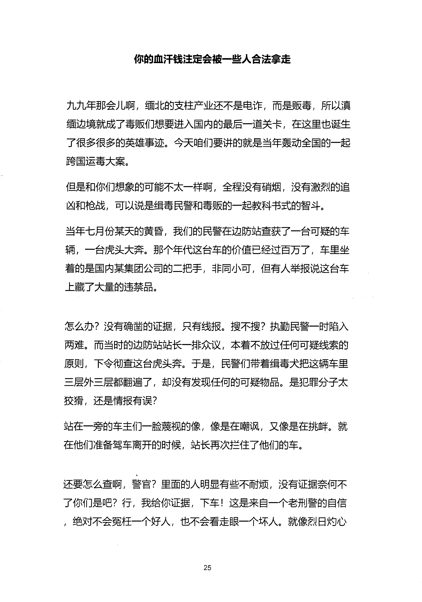
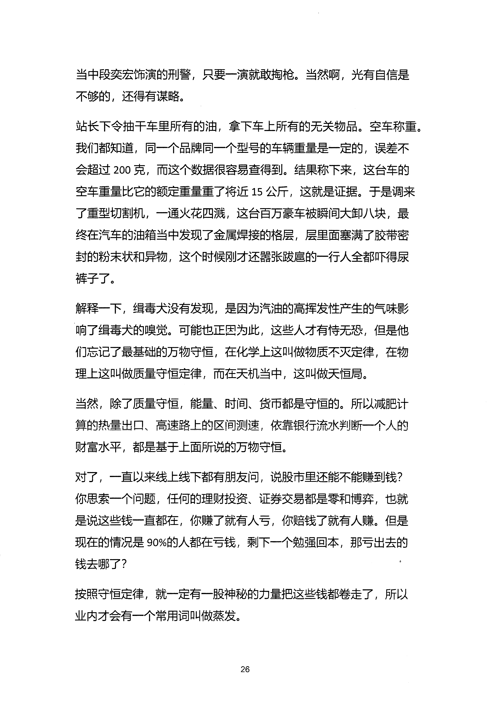
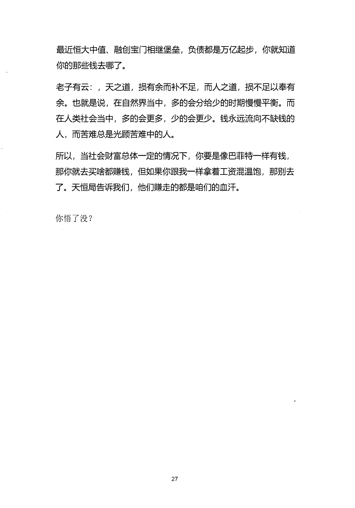

<!-- 原书第 32 页 -->

# 你的血汗钱注定会被一些人合法拿走

九九年那会儿啊，缅北的支柱产业还不是电诈，而是贩毒，所以滇
缅边境就成了毒贩们想要进入国内的最后一道关卡，在这里也诞生
了很多很多的英雄事迹。今天咱们要讲的就是当年轰动全国的一起
跨国运毒大案。
但是和你们想象的可能不太一样啊，全程没有硝烟，没有激烈的追
凶和枪战，可以说是缉毒民警和毒贩的—起教科书式的智斗。
当年七月份某天的黄昏，我们的民警在边防站查获了一台可疑的车
辆，一台虎头大奔。那个年代这台车的价值已经过百万了，车里坐
着的是国内某集团公司的二把手，非同小可，但有人举报说这台车
上瘢了大量的违禁品
怎么办？没有确凿的证据，只有线报。搜不搜？执勤民警一时陷入
两难。而当时的边防站站长一排众议，本着不放过任何可疑线索的
原则下令彻查这台虎头奔。于是，民警们带着缉毒犬把这辆车里
三层外三层都翻遍了，却没有发现任何的可疑物品。是犯罪分子太
狡猾，还是清报有误？
站在一旁的车主们一脸蔑视的像，像是在嘲讽，又像是在挑衅。就
在他们准备驾车离开的时候，站长再次拦住了他们的车。
还要怎么查啊，警官？里面的人明显有些不耐烦，没有证据奈何不
了你们是吧？行，我给你证据，下车！这是来自一个老刑警的自信
，绝对不会冤枉—个好人，也不会看走眼一个坏人。就像烈日灼心
25
更多kr66e9gs

<!-- source-image-start -->

查看原书第 32 页影像

<!-- source-image-end -->

<!-- 原书第 33 页 -->

当中段奕宏饰演的刑警，只要一演就敢掏枪。当然啊，光有自信是
不够的，还得有谋略。
站长下令抽干车里所有的油，拿下车上所有的无关物品。空车称重。
我们都知道，同一个品牌同一个型号的车辆重量是一定的，误差不
会超过200 克，而这个数据很容易查得到。结果称下来，这台车的
空车重量比它的额定重量垂了将近15 公斤，这就是证据。于是调来
了重型切割机，一通火花四溅，这台百万豪车被瞬间大卸八块，最
终在汽车的油箱当中发现了金属焊接的格层，层里面塞满了胶带密
封的粉末状和异物，这个时候刚才还嚣张跋扈的一行人全都吓得尿
裤子了。
解释一下，缉毒犬没有发现，是因为汽油的高挥发性产生的气味影
响了缉毒犬的嗅觉。可能也正因为此，这些人才有恃无恐，但是他
们忘记了最基础的万物守恒，在化学上这叫做物质不灭定律，在物
理上这叫做质量守恒定律，而在天机当中，这叫做天恒局。
当然，除了质量守恒，能量、时间、货币都是守恒的。所以减肥计
算的热量出口、高速路上的区间测速，依靠银行流水判断一个人的
财富水平，都是基于上面所说的万物守恒。
对了，一直以来线上线下都有朋友问，说股市里还能不能赚到钱？
你思索一个问题，任何的理财投资、证券交易都是零和博弈，也就
是说这些钱—直都在，你赚了就有人亏，你赔钱了就有人赚。但是
现在的清况是90％的人都在亏钱，剩下一个勉强回本，那亏出去的
钱去哪了？
按照守恒定律，就一定有一股神秘的力量把这些钱都卷走了，所以
业内才会有一个常用词叫做蒸发。
26
更多kr66e9gs

<!-- source-image-start -->

查看原书第 33 页影像

<!-- source-image-end -->

<!-- 原书第 34 页 -->

最近恒大中值、融创宝门相继堡垒，负债都是万亿起步，你就知道
你的那些钱去哪了。
老子有云：，天之道，损有余而补不足，而人之道，损不足以奉有
余。也就是说，在自然界当中，多的会分给少的时期漫慢平衡。而
在人类社会当中，多的会更多，少的会更少。钱永远流向不缺钱的
人，而苦难总是光顾苦难中的人。
所以，当社会财富总体—定的渭况下，你要是像巴菲特一样有钱，
那你就去买啥都赚钱，但如果你踉我一样拿着工资混温饱，那别去
了。天恒局告诉我们，他们赚走的都是咱们的血汗。
你悟了没？
27
更多kr66e9gs

<!-- source-image-start -->

查看原书第 34 页影像

<!-- source-image-end -->
