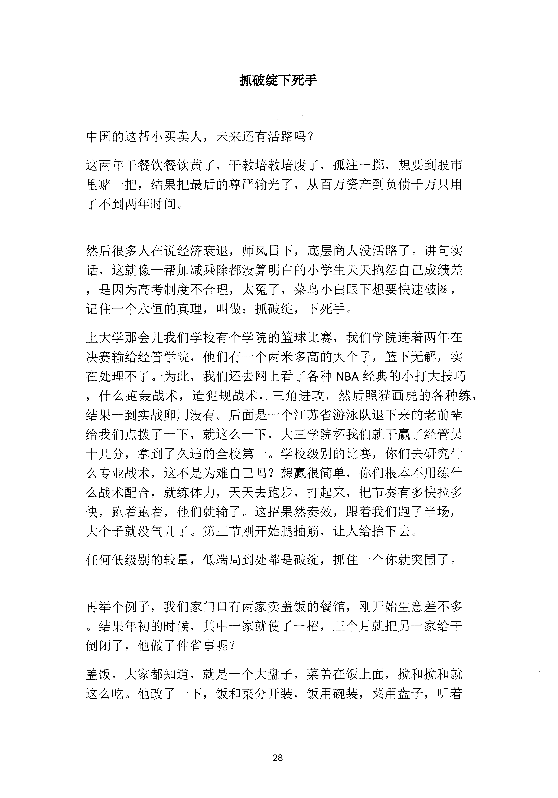
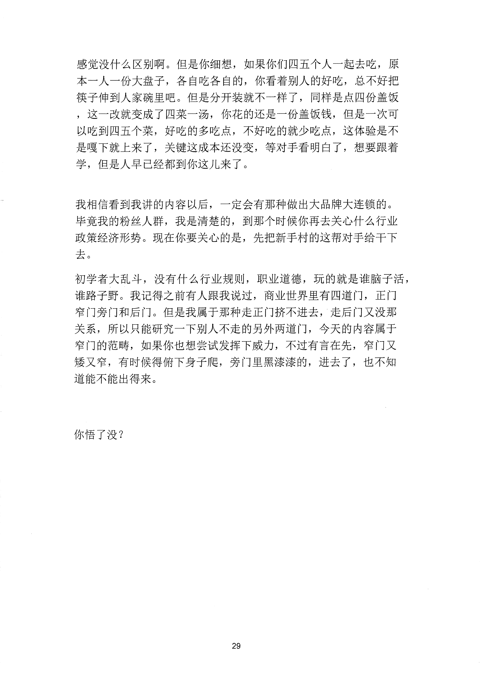

<!-- 原书第 35 页 -->

# 抓破绽下死手

中国的这帮小买卖人，未来还有活路吗？这两年干餐饮餐饮黄了，干教培教培废了，孤注一掷，想要到股市里赌一把，结果把最后的尊严输光了，从百万资产到负债千万只用了不到两年时间。

然后很多人在说经济衰退，师风日下，底层商人没活路了。讲句实话，这就像一帮加减乘除都没算明白的小学生天天抱怨自已成绩差，是因为高考制度不合理，太冤了，菜鸟小白眼下想要快速破圈，记住一个永恒的真理，叫做：抓破绽，下死手。上大学那会儿我们学校有个学院的篮球比赛，我们学院连着两年在决赛输给经管学院，他们有一个两米多高的大个子，篮下无解，实在处理不了。为此，我们还去网上看了各种NBA 经典的小打大技巧，什么跑轰战术，造犯规战术，三角进攻，然后照猫画虎的各种练，结果一到实战卵用没有。后面是一个江苏省游泳队退下来的老前辈给我们点拨了一下，就这么一下，大三学院杯我们就千赢了经管员十几分，拿到了久违的全校第一。学校级别的比赛，你们去研究什么专业战术，这不是为难自己吗？想赢很简单，你们根本不用练什么战术配合，就练体力，天天去跑步，打起来，把节奏有多快拉多快，跑着跑着，他们就输了。这招果然奏效，跟着我们跑了半场，大个子就没气儿了。第三节刚开始腿抽筋，让人给抬下去。任何低级别的较量，低端局到处都是破绽，抓住一个你就突围了。

再举个例子，我们家门口有两家卖盖饭的餐馆，刚开始生意差不多。结果年初的时候，其中一家就使了一招，三个月就把另一家给干倒闭了，他做了件省事呢？盖饭，大家都知道，就是一个大盘子，菜盖在饭上面，搅和搅和就这么吃。他改了一下，饭和菜分开装，饭用碗装，菜用盘子，听着

<!-- source-image-start -->

查看原书第 35 页影像

<!-- source-image-end -->
<!-- 原书第 36 页 -->

感觉没什么区别啊。但是你细想，如果你们四五个人一起去吃，原本一人一份大盘子，各自吃各自的，你看着别人的好吃，总不好把筷子伸到人家碗里吧。但是分开装就不一样了，同样是点四份盖饭，这一改就变成了四菜一汤，你花的还是一份盖饭钱，但是一次可以吃到四五个菜，好吃的多吃点，不好吃的就少吃点，这体验是不是嘎下就上来了，关键这成本还没变，等对手看明白了，想要跟着学，但是人早已经都到你这儿来了。

我相信看到我讲的内容以后，一定会有那种做出大品牌大连锁的。毕竟我的粉丝人群，我是清楚的，到那个时候你再去关心什么行业政策经济形势。现在你要关心的是，先把新手村的这帮对手给干下去。初学者大乱斗，没有什么行业规则，职业道德，玩的就是谁脑子活，谁路子野。我记得之前有人跟我说过，商业世界里有四道门，正门窄门旁门和后门。但是我属于那种走正门挤不进去，走后门又没那关系，所以只能研究一下别人不走的另外两道门，今天的内容属于窄门的范畴，如果你也想尝试发挥下威力，不过有言在先，窄门又矮又窄，有时候得俯下身子爬，旁门里黑漆漆的，进去了，也不知道能不能出得来。

你悟了没？

<!-- source-image-start -->

查看原书第 36 页影像

<!-- source-image-end -->
