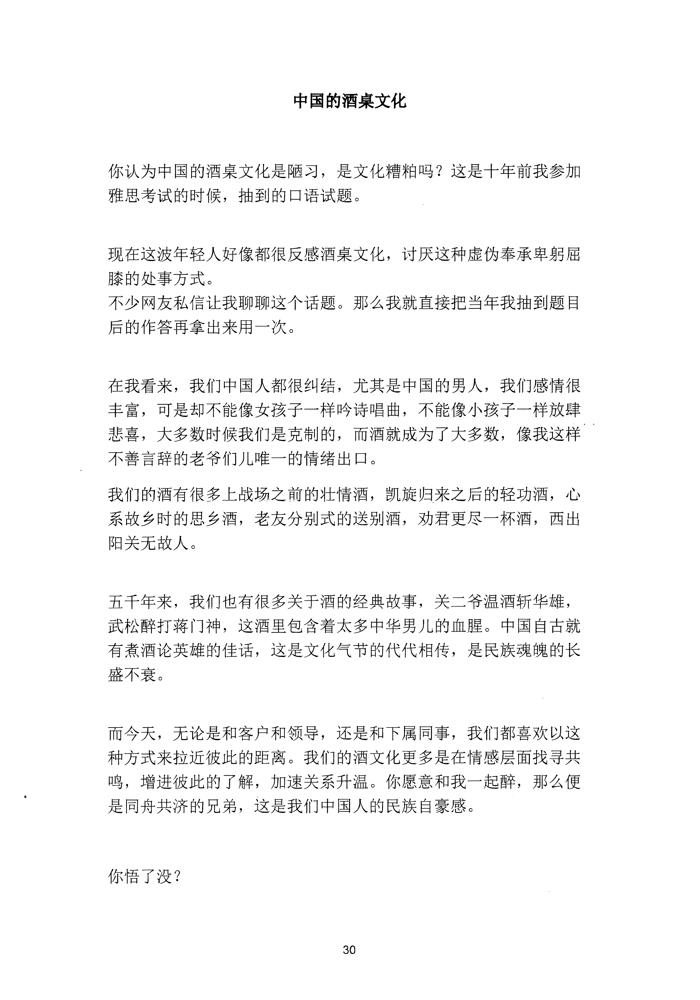

<!-- 原书第 37 页 -->

# 中国的酒桌文化

你认为中国的酒桌文化是陋习，是文化糟粕吗？这是十年前我参加雅思考试的时候，抽到的口语试题。

现在这波年轻人好像都很反感酒桌文化，讨厌这种虚伪奉承卑躬屈膝的处事方式。不少网友私信让我聊聊这个话题。那么我就直接把当年我抽到题目后的作答再拿出来用一次。

在我看来，我们中国人都很纠结，尤其是中国的男人，我们感情很丰富，可是却不能像女孩子一样吟诗唱曲，不能像小孩子一样放肆悲喜，大多数时候我们是克制的，而酒就成为了大多数，像我这样不善言辞的老爷们儿唯一的情绪出口。我们的酒有很多上战场之前的壮情酒，凯旋归来之后的轻功酒，心系故乡时的思乡酒，老友分别式的送别酒，劝君更尽一杯酒，西出阳关无故人。

五千年来，我们也有很多关于酒的经典故事，关二爷温酒斩华雄，武松醉打蒋门神，这酒里包含着太多中华男儿的血腥。中国自古就有煮酒论英雄的佳话，这是文化气节的代代相传，是民族魂魄的长盛不衰。

而今天，无论是和客户和领导，还是和下属同事，我们都喜欢以这种方式来拉近彼此的距离。我们的酒文化更多是在情感层面找寻共鸣，增进彼此的了解，加速关系升温。你愿意和我一起醉，那么便是同舟共济的兄弟，这是我们中国人的民族自豪感。

你悟了没？

<!-- source-image-start -->

查看原书第 37 页影像

<!-- source-image-end -->
