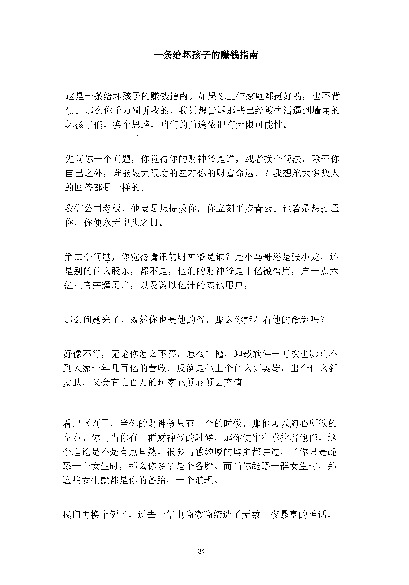
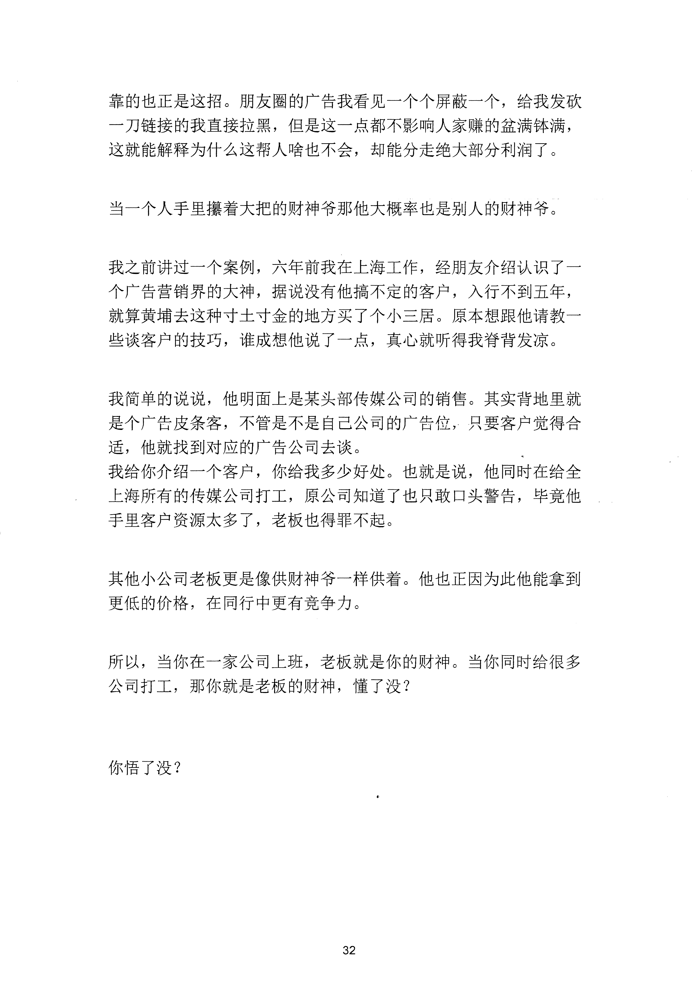

<!-- 原书第 38 页 -->

# 一条给坏孩子的赚钱指南

这是一条给坏孩子的赚钱指南。如果你工作家庭都挺好的，也不背
债。那么你千万别听我的，我只想告诉那些已经被生活逼到墙角的
坏孩子们，换个思路，咱们的前途依旧有无限可能性。
先问你一个问题，你觉得你的财神爷是谁，或者换个问法，除开你
自己之外，谁能最大限度的左右你的财富命运，？我想绝大多数人
的回答都是一样的。
我们公司老板，他要是想提拔你，你立刻平步青云。他若是想打压
你，你便永无出头之日。
第二个问题，你觉得腾讯的财神爷是谁？是小马哥还是张小龙，还
是别的什么股东，都不是，他们的财神爷是十亿微信用，户一点六
亿王者荣耀用户，以及数以亿计的其他用户。
那么问题来了，既然你也是他的爷，那么你能左右他的命运吗？
好像不行，无论你怎么不买，怎么吐槽，卸载软件一万次也影响不
到人家一年几百亿的营收。反倒是他上个什么新英雄，出个什么新
皮肤，又会有上百万的玩家屁颠屁颠去充值。
看出区别了，当你的财神爷只有一个的时候，那他可以随心所欲的
左右。你而当你有一群财神爷的时候，那你便牢牢掌控着他们，这
个理论是不是有点耳熟。很多情感领域的博主都讲过，当你只是跪
薛一个女生时，那么你多半是个备胎。而当你跪婖一群女生时，那
这些女生就都是你的备胎，一个道理。
我们再换个例子，过去十年电商微商缔造了无数一夜暴富的神话，
31
更多kr66e9gs

<!-- source-image-start -->

查看原书第 38 页影像

<!-- source-image-end -->

<!-- 原书第 39 页 -->

靠的也正是这招。朋友圈的广告我看见一个个屏蔽一个，给我发砍
一刀链接的我直接拉黑，但是这一点都不影响人家赚的盆满钵满，
这就能解释为什么这帮人啥也不会，却能分走绝大部分利润了。
当一个人手里操着大把的财神爷那他大概率也是别人的财神爷。
我之前讲过一个案例，六年前我在上涛工作，经朋友介绍认识了一
个广告营销界的大神，据说没有他搞不定的客户，入行不到五年，
就算黄埔去这种寸土寸金的地方买了个小三居。原本想跟他请教一
些谈客户的技巧，谁成想他说了一点，真心就听得我脊背发凉。
我简单的说说，他明面上是某头部传媒公司的销售。其实背地里就
是个广告皮条客，不管是不是自己公司的广告位，只要客户觉得合
适，他就找到对应的广告公司去谈。
我给你介绍一个客户，你给我多少好处。也就是说，他同时在给全
上海所有的传媒公司打工，原公司知道了也只敢口头警告，毕竞他
手里客户资源太多了，老板也得罪不起。
其他小公司老板更是像供财神爷一样供着。他也正因为此他能拿到
更低的价格，在同行中更有竞争力。
所以，当你在一家公司上班，老板就是你的财神。当你同时给很多
公司打工，那你就是老板的财神，懂了没？
你悟了没？
32
更多kr66e9gs

<!-- source-image-start -->

查看原书第 39 页影像

<!-- source-image-end -->
