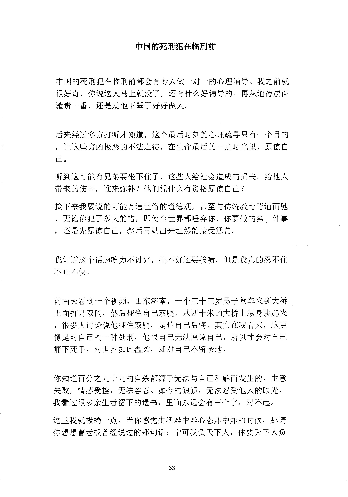
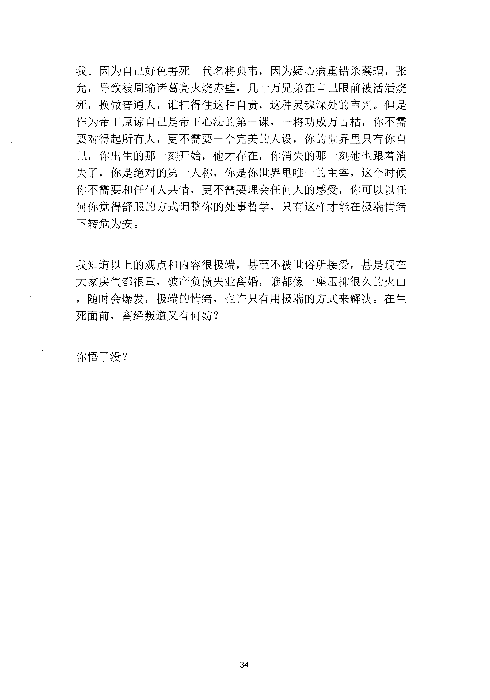

<!-- 原书第 40 页 -->

# 中国的死刑犯在临刑前

中国的死刑犯在临刑前都会有专人做一对一的心理辅导。我之前就很好奇你说这人马上就没了，还有什么好辅导的。再从道德层面谴责一番，还是劝他下辈子好好做人。

后来经过多方打听才知道，这个最后时刻的心理疏导只有一个目的，让这些穷凶极恶的不法之徒，在生命最后的一点时光里，原谅自已。听到这可能有兄弟要坐不住了，这些入给社会造成的损失，给他人带来的伤害，谁来弥补？他们凭什么有资格原谅自己？接下来我要说的可能有违世俗的道德观，甚至与传统教育背道而驰，无论你犯了多大的错，即使全世界都唾弃你，你要做的第一件事，还是先原谅自己，然后再站出来坦然的接受惩罚。

我知道这个话题吃力不讨好，搞不好还要挨喷，但是我真的忍不住不吐不快。

前两天看到一个视频，山东济南，一个三十三岁男子驾车来到大桥上面打开双闪，然后捆住自己双腿。从四十米的大桥上纵身跳起来，很多人讨论说他捆住双腿，是怕自己后悔。其实在我看来，这更像是对自己的一种处刑，他恨自己无法原谅自己，所以才会对自己痛下死手，对世界如此温柔，却对自己不留余地。

你知道百分之九十九的自杀都源千无法与自己和解而发生的。生意失败，情感受挫，无法容忍。如今的狼狈，无法忍受他人的眼光。我看过很多亲生者留下的遗书，里面永远会有三个字，对不起。这里我就极端一点。当你感觉生活难中难心态炸中炸的时候，那请你想想曹老板曾经说过的那句话：宁可我负天下人，休要天下人负

<!-- source-image-start -->

查看原书第 40 页影像

<!-- source-image-end -->
<!-- 原书第 41 页 -->

我。因为自己好色害死一代名将典韦，因为疑心病重错杀蔡瑁，张允，导致被周瑜诸葛亮火烧赤壁，几十万兄弟在自己眼前被活活烧死，换做普通人，谁扛得住这种自责，这种灵魂深处的审判。但是作为帝王原谅自己是帝王心法的第一课，一将功成万古枯，你不需要对得起所有人，更不需要一个完美的人设，你的世界里只有你自己，你出生的那一刻开始，他才存在，你消失的那一刻他也跟着消失了，你是绝对的第一人称，你是你世界里唯一的主宰，这个时候你不需要和任何人共情，更不需要理会任何人的感受，你可以以任何你觉得舒服的方式调整你的处事哲学，只有这样才能在极端情绪下转危为安。

我知道以上的观点和内容很极端，甚至不被世俗所接受，甚是现在大家戾气都很重，破产负债失业离婚，谁都像一座压抑很久的火山，随时会爆发，极端的情绪，也许只有用极端的方式来解决。在生死面前，离经叛道又有何妨？

你悟了没？

<!-- source-image-start -->

查看原书第 41 页影像

<!-- source-image-end -->
