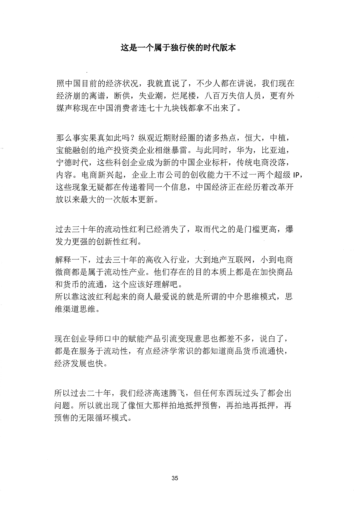
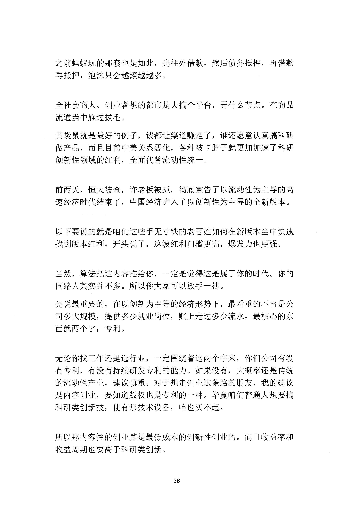
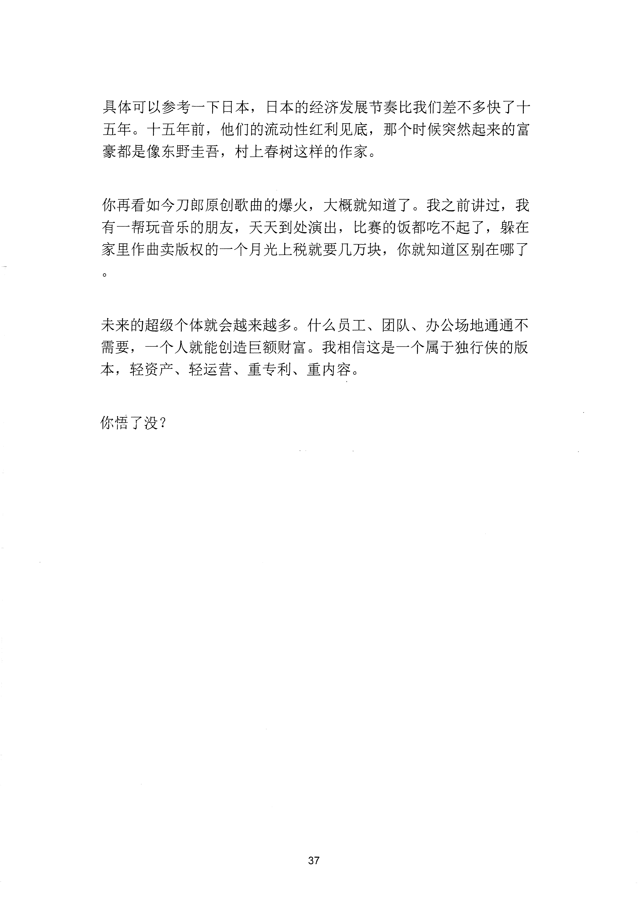

<!-- 原书第 42 页 -->

# 这是一个属于独行侠的时代版本

照中国目前的经济状况，我就直说了，不少人都在讲说，我们现在经济崩的离谱，断供，失业潮，烂尾楼，八百万失信人员，更有外媒声称现在中国消费者连七十九块钱都拿不出来了。

那么事实果真如此吗？纵观近期财经圈的诸多热点，恒大，中植，宝能融创的地产投资类企业相继暴雷。与此同时，华为，比亚迪，宁德时代，这些科创企业成为新的中国企业标杆，传统电商没落，内容。电商新兴起，企业上市公司的创收能力干不过一两个超级

IP,这些现象无疑都在传递着同一个信息，中国经济正在经历着改革开放以来最大的一次版本更新。

过去三十年的流动性红利已经消失了，取而代之的是门槛更高，瀑发力更强的创新性红利。解释一下，过去三十年的高收入行业，大到地产互联网，小到电商微商都是属于流动性产业。他们存在的目的本质上都是在加快商品和货币的流通，这个应该好理解吧。所以靠这波红利起来的商人最爱说的就是所谓的中介思维模式，思维渠道思维。

现在创业导师口中的赋能产品引流变现意思也都差不多，说白了，都是在服务于流动性，有点经济学常识的都知道商品货币流通快，经济发展也快。

所以过去二十年，我们经济高速腾飞，但任何东西玩过头了都会出问题。所以就出现了像恒大那样拍地抵押预售，再拍地再抵押，再预售的无限循环模式。

<!-- source-image-start -->

查看原书第 42 页影像

<!-- source-image-end -->
<!-- 原书第 43 页 -->

之前蚂蚁玩的那套也是如此，先往外借款，然后债务抵押，再借款再抵押，泡沫只会越滚越越多。

全社会商人、创业者想的都市是去搞个平台，弄什么节点。在商品流通当中雁过拔毛。黄袋鼠就是最好的例子，钱都让渠道赚走了，谁还愿意认真搞科研做产品，而且目前中美关系恶化，各种被卡脖子就更加加速了科研创新性领域的红利，全面代替流动性统一。

前两天，恒大被查，许老板被抓，彻底宣告了以流动性为主导的高速经济时代结束了，中国经济进入了以创新性为主导的全新版本。

以下要说的就是咱们这些手无寸铁的老百姓如何在新版本当中快速找到版本红利，开头说了，这波红利门槛更高，爆发力也更强。

当然，算法把这内容推给你，一定是觉得这是属于你的时代。你的同路人其实并不多。所以你大家可以放手一搏。先说最重要的，在以创新为主导的经济形势下，最看重的不再是公司多大规模，提供多少就业岗位，账上走过多少流水，最核心的东西就两个字：专利。

无论你找工作还是选行业，一定围绕着这两个字来，你们公司有没有专利，有没有持续研发专利的能力。如果没有，大概率还是传统的流动性产业，建议慎重。对于想走创业这条路的朋友，我的建议是内容创业，要知道版权也是专利的一种。毕竟咱们普通人想要搞科研类创新技，使有那技术设备，咱也买不起。

所以那内容性的创业算是最低成本的创新性创业的。而且收益率和收益周期也要高于科研类创新。

<!-- source-image-start -->

查看原书第 43 页影像

<!-- source-image-end -->
<!-- 原书第 44 页 -->

具体可以参考一下日本，日本的经济发展节奏比我们差不多快了十五年。十五年前，他们的流动性红利见底，那个时候突然起来的富豪都是像东野圭吾，村上春树这样的作家。

你再看如今刀郎原创歌曲的爆火，大概就知道了。我之前讲过，我有一帮玩音乐的朋友，天天到处演出，比赛的饭都吃不起了，躲在家里作曲卖版权的一个月光上税就要几万块，你就知道区别在哪了

未来的超级个体就会越来越多。什么员工、团队、办公场地通通不需要，一个人就能创造巨额财富。我相信这是一个属于独行侠的版本，轻资产、轻运营、重专利、重内容。

你悟了没？

<!-- source-image-start -->

查看原书第 44 页影像

<!-- source-image-end -->
