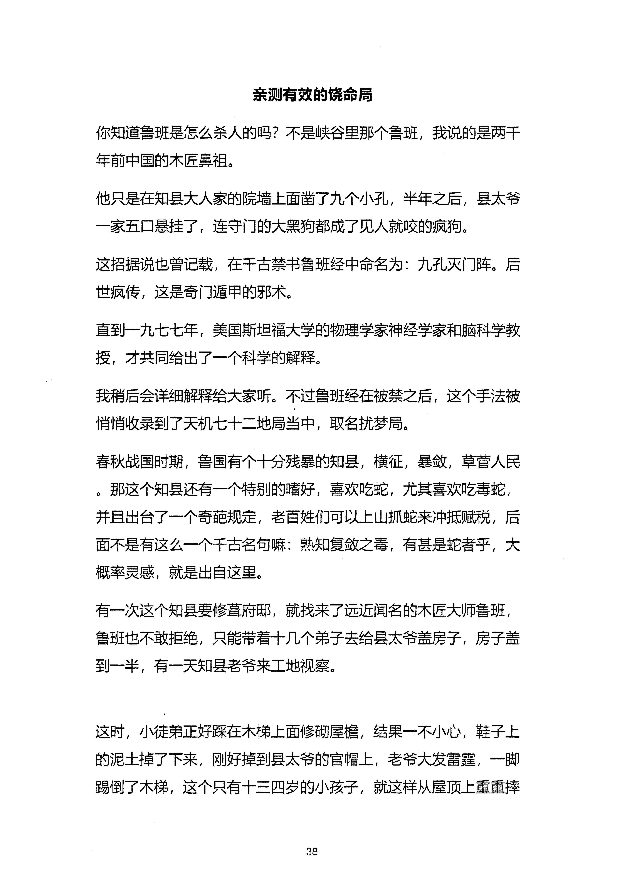
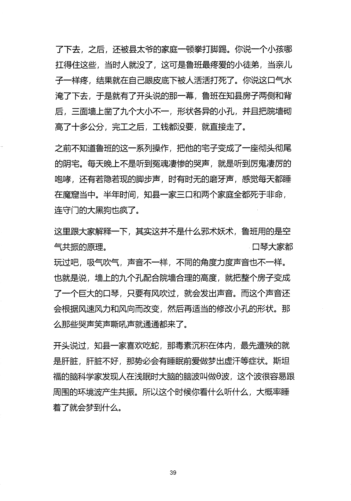
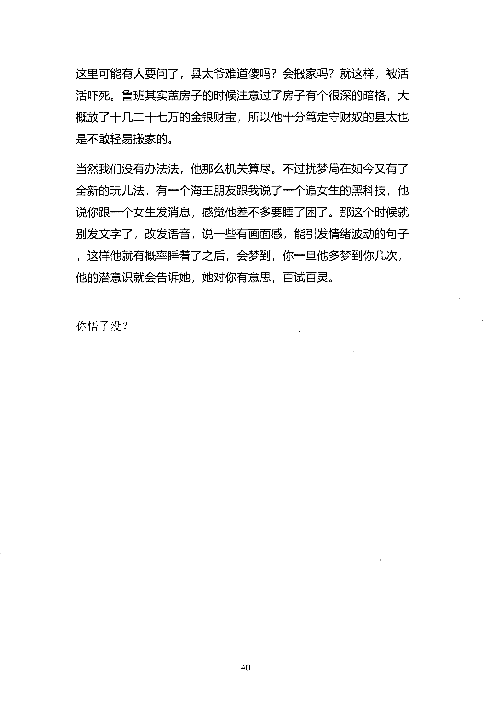

<!-- 原书第 45 页 -->

# 亲测有效的饶命局

你知道鲁班是怎么杀人的吗？不是峡谷里那个鲁班，我说的是两干
年前中国的木匠鼻祖。
他只是在知县大人家的院墙上面凿了九个小孔，半年之后，县太爷
一家五口悬挂了，连守门的大黑狗都成了见人就咬的疯狗。
这招据说也曾记载，在干古禁书鲁班经中命名为：九孔灭门阵。后
世疯传，这是奇门遁甲的邪术。
直到—九七七年，美国斯坦福大学的物理学家神经学家和脑科学教
授，才共同给出了一个科学的解释。
我稍后会详细解释给大家听。不过鲁班经在被禁之后，这个手法被
悄消收录到了天机七十二地局当中，取名扰梦局。
春秋战国时期，鲁国有个十分残暴的知县，横征，县敛，草营人民
。那这个知县还有一个特别的嗜好，喜欢吃蛇，尤其喜欢吃毒蛇，
并且出台了一个奇葩规定，老百姓们可以上山抓蛇来冲抵赋税，后
面不是有这么一个千古名句嘛：熟知复敛之毒，有甚是蛇者乎，大
概率灵感，就是出自这里。
有一次这个知县要修聋府邸，就找来了远近闻名的木匠大师鲁班，
鲁班也不敢拒绝，只能带着十几个弟子去给县太爷盖房子，房子盖
到一半，有一天知县老爷来工地视察。
这时，小徒弟正好踩在木梯上面修砌屋檐，结果一不小心，鞋子上
的泥土掉了下来，刚好掉到县太爷的官帽上，老爷大发雷霆，一脚
踢倒了木梯，这个只有十三四岁的小孩子，就这样从屋顶上重重摔
38
更多kr66e9gs

<!-- source-image-start -->

查看原书第 45 页影像

<!-- source-image-end -->

<!-- 原书第 46 页 -->

了下去，之后，还被县太爷的家庭一顿拳打脚踢。你说—个小孩哪
扛得住这些，当时人就没了，这可是鲁班最疼爱的小徒弟，当亲儿
子一样疼，结果就在自己眼皮底下被人活活打死了。你说这口气水
淹了下去，于是就有了开头说的那一幕，鲁班在知县房子两侧和背
后，三面墙上凿了九个大小不一，形状各异的小孔，并且把院墙砌
高了十多公分，完工之后，工钱都没要，就直接走了。
之前不知道鲁班的这一系列操作，把他的宅子变成了一座彻头彻尾
的阴宅。每天晚上不是听到冤魂凄渗的哭声，就是听到厉鬼凄厉的
玸哮，还有若隐若现的脚步声，时有时无的磨牙声，感觉每天都睡
在魔窟当中。半年时间知县一家三口和两个家庭全都死于非命，
连守门的大黑狗也疯了。
这里跟大家解释一下，其实这并不是什么邪术妖术，鲁班用的是空
气共振的原理。
口琴大家都
玩过吧，吸气吹气，声音不一样，不同的角度力度声音也不一样。
也就是说，墙上的九个孔配合院墙合理的高度，就把整个房子变成
了—个巨大的口琴，只要有风吹过，就会发出声音。而这个声音还
会根据风速风力和风向而改变，然后再适当的修改小孔的形状。那
么那些哭声笑声嘶吼声就通通都来了。
开头说过，知县一家喜欢吃蛇，那毒素沉积在体内，最先遭殃的就
是肝脏，肝脏不好，那势必会有睡眠前爱做梦出虚汗等症状。斯坦
福的脑科学家发现人在浅眠时大脑的脑波叫做6波，这个波很容易跟
周围的环境波产生共振。所以这个时候你看什么听什么，大概率睡
着了就会梦到什么。
39
更多kr66e9gs

<!-- source-image-start -->

查看原书第 46 页影像

<!-- source-image-end -->

<!-- 原书第 47 页 -->

这里可能有人要问了，县太爷难道傻吗？会搬家吗？就这样，被活
活吓死。鲁班其实盖房子的时候注意过了房子有个很深的暗格，大
概放了十几二十七万的金银财宝，所以他十分笃定守财奴的县太也
是不敢轻易搬家的。
当然我们没有办法法，他那么机关算尽。不过扰梦局在如今又有了
全新的玩儿法，有一个海王朋友跟我说了一个追女生的黑科技，他
说你跟一个女生发消息，感觉他差不多要睡了困了。那这个时候就
别发文字了，改发语音，说一些有画面感，能引发清绪波动的句子
，这样他就有概率睡着了之后，会梦到，你一旦他多梦到你几次，
他的潜意识就会告诉她，她对你有意思，百试百灵。
你悟了没？
40
更多kr66e9gs

<!-- source-image-start -->

查看原书第 47 页影像

<!-- source-image-end -->
