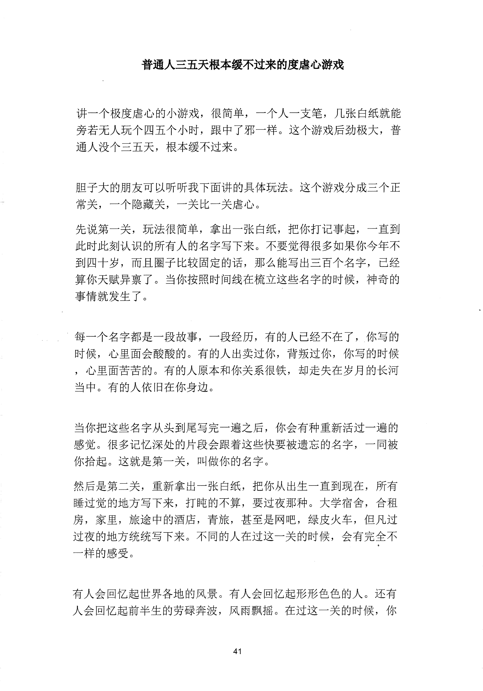
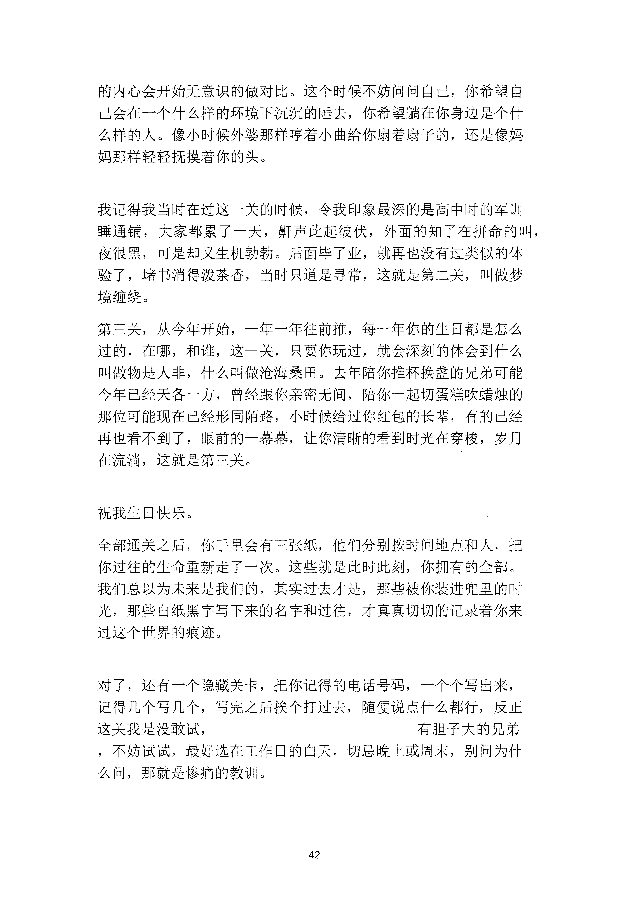
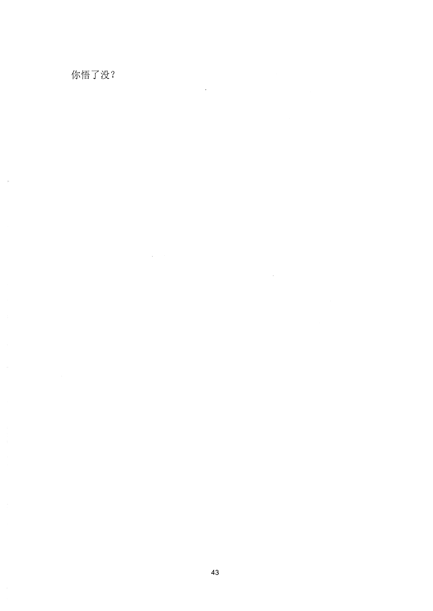

<!-- 原书第 48 页 -->

# 普通人三五天根本缓不过来的度虐心游戏

讲一个极度虐心的小游戏，很简单，一个人一支笔，几张白纸就能旁若无人玩个四五个小时，跟中了邪一样。这个游戏后劲极大，普通人没个三五天，根本缓不过来。

胆子大的朋友可以听听我下面讲的具体玩法。这个游戏分成三个正常关，一个隐藏关，一关比一关虐心。先说第一关，玩法很简单，拿出一张白纸，把你打记事起，一直到此时此刻认识的所有人的名字写下来。不要觉得很多如果你今年不到四十岁，而且圈子比较固定的话，那么能写出三百个名字，已经算你天赋异禀了。当你按照时间线在梳立这些名字的时候，神奇的事情就发生了。

每一个名字都是一段故事，一段经历，有的人已经不在了，你写的时候，心里面会酸酸的。有的人出卖过你，背叛过你，你写的时候，心里面苦苦的。有的人原本和你关系很铁，却走失在岁月的长河当中。有的人依旧在你身边。

当你把这些名字从头到尾写完一遍之后，你会有种重新活过一遍的感觉。很多记忆深处的片段会跟着这些快要被遗忘的名字，一同被你拾起。这就是第一关，叫做你的名字。然后是第二关，重新拿出一张白纸，把你从出生一直到现在，所有睡过觉的地方写下来，打盹的不算，要过夜那种。大学宿舍，合租房，家里，旅途中的酒店，青旅，甚至是网吧，绿皮火车，但凡过过夜的地方统统写下来。不同的人在过这一关的时候，会有完全不一样的感受。

有人会回忆起世界各地的风景。有人会回忆起形形色色的人。还有人会回忆起前半生的劳碌奔波，风雨飘摇。在过这一关的时候，你

<!-- source-image-start -->

查看原书第 48 页影像

<!-- source-image-end -->
<!-- 原书第 49 页 -->

的内心会开始无意识的做对比。这个时候不妨问问自己，你希望自己会在一个什么样的环境下沉沉的睡去，你希望躺在你身边是个什么样的人。像小时候外婆那样哼着小曲给你扇着扇子的，还是像妈妈那样轻轻抚摸着你的头。

我记得我当时在过这一关的时候，令我印象最深的是高中时的军训睡通铺，大家都累了一天，鼻干声此起彼伏，外面的知了在拼命的叫，夜很黑，可是却又生机勃勃。后面毕了业，就再也没有过类似的体验了，堵书消得泼茶香，当时只道是寻常，这就是第二关，叫做梦境缠绕。第三关，从今年开始，一年一年往前推，每一年你的生日都是怎么过的，在哪，和谁，这一关，只要你玩过，就会深刻的体会到什么叫做物是人非，什么叫做沧海桑田。去年陪你推杯换盏的兄弟可能今年已经天各一方，曾经跟你亲密无间，陪你一起切蛋糕吹蜡烛的那位可能现在已经形同陌路，小时候给过你红包的长辈，有的已经再也看不到了，眼前的一幕幕，让你清晰的看到时光在穿梭，岁月在流淌，这就是第三关。

祝我生日快乐。全部通关之后，你手里会有三张纸，他们分别按时间地点和人，把你过往的生命重新走了一次。这些就是此时此刻，你拥有的全部。我们总以为未来是我们的，其实过去才是，那些被你装进兜里的时光，那些白纸黑字写下来的名字和过往，才真真切切的记录着你来过这个世界的痕迹。

对了，还有一个隐藏关卡，把你记得的电话号码，一个个写出来，记得几个写几个，写完之后挨个打过去，随便说点什么都行，反正这关我是没敢试，

有胆子大的兄弟，不妨试试，最好选在工作日的臼天，切忌晚上或周末，别问为什么问，那就是惨痛的教训。

<!-- source-image-start -->

查看原书第 49 页影像

<!-- source-image-end -->
<!-- 原书第 50 页 -->

你悟了没？

<!-- source-image-start -->

查看原书第 50 页影像

<!-- source-image-end -->
