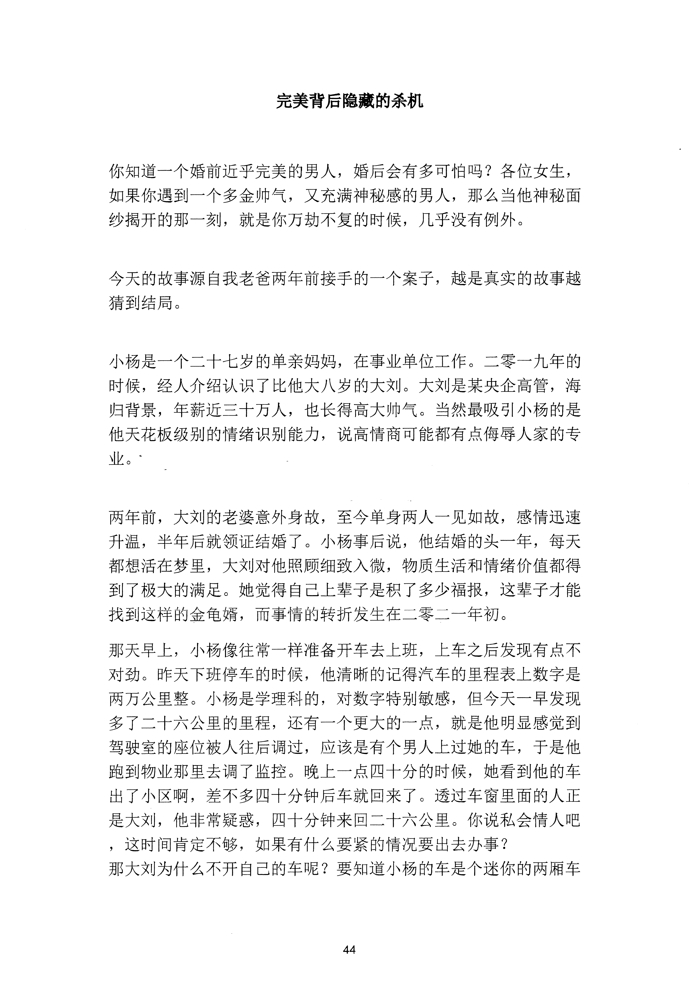
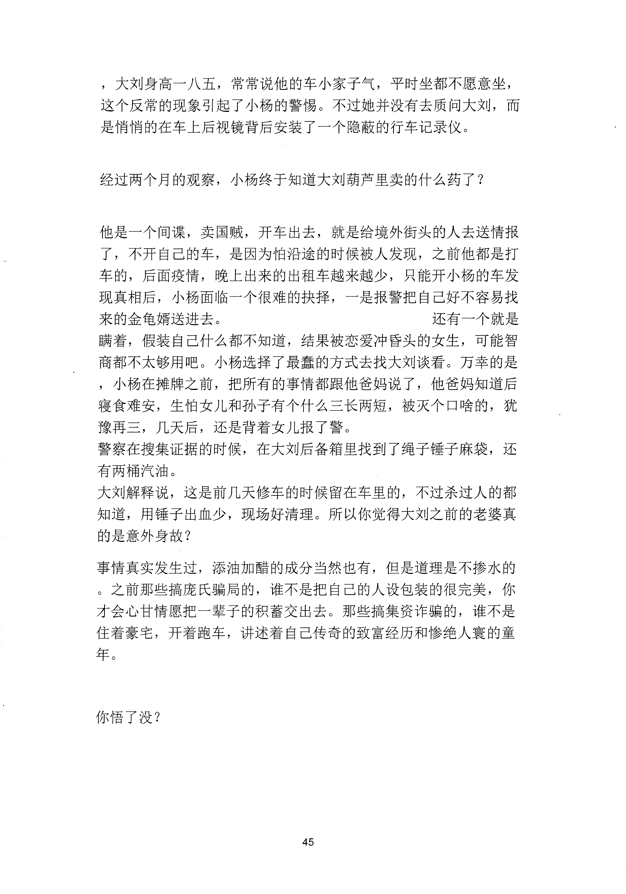

<!-- 原书第 51 页 -->

# 完美背后隐藏的杀机

你知道一个婚前近乎完美的男人，婚后会有多可怕吗？各位女生，如果你遇到一个多金帅气，又充满神秘感的男人，那么当他神秘面纱揭开的那一刻，就是你万劫不复的时候，几乎没有例外。

今天的故事源自我老爸两年前接手的一个案子，越是真实的故事越猜到结局。

小杨是一个二十七岁的单亲妈妈，在事业单位工作。二零一九年的时候，经人介绍认识了比他大八岁的大刘。大刘是某央企高管，海归背景，年薪近三十万人，也长得高大帅气。当然最吸引小杨的是他天花板级别的情绪识别能力，说高情商可能都有点侮辱人家的专业。｀

两年前，大刘的老婆意外身故，至今单身两人一见如故，感情迅速升温，半年后就领证结婚了。小杨事后说，他结婚的头一年，每天都想活在梦里，大刘对他照顾细致入微，物质生活和情绪价值都得到了极大的满足。她觉得自己上辈子是积了多少福报，这辈子才能找到这样的金龟婿，而事情的转折发生在＿零二一年初。那天早上，小杨像往常一样准备开车去上班，上车之后发现有点不对劲。昨天下班停车的时候，他清晰的记得汽车的呈程表上数字是两万公里整。小杨是学理科的，对数字特别敏感，但今天一早发现多了二十六公里的里程，还有一个更大的一点，就是他明显感觉到驾驶室的座位被人往后调过，应该是有个男人上过她的车，于是他跑到物业那里去调了监控。晚上一点四十分的时候，她看到他的车出了小区啊，差不多四十分钟后车就回来了。透过车窗里面的人正是大刘，他非常疑惑，四十分钟来回二十六公里。你说私会情人吧，这时间肯定不够，如果有什么要紧的情况要出去办事？那大刘为什么不开自己的车呢？要知道小杨的车是个迷你的两厢车

<!-- source-image-start -->

查看原书第 51 页影像

<!-- source-image-end -->
<!-- 原书第 52 页 -->

，大刘身高一八五，常常说他的车小家子气，平时坐都不愿意坐，这个反常的现象引起了小杨的警惕。不过她并没有去质问大刘，而是悄悄的在车上后视镜背后安装了一个隐蔽的行车记录仪。

经过两个月的观察，小杨终千知道大刘葫芦里卖的什么药了？

他是一个间谍，卖国贼，开车出去，就是给境外街头的人去送情报了，不开自己的车，是因为怕沿途的时候被人发现，之前他都是打车的，后面疫情，晚上出来的出租车越来越少，只能开小杨的车发现真相后，小杨面临一个很难的抉择，一是报警把自己好不容易找来的金龟婿送进去。

还有一个就是瞒着，假装自己什么都不知道，结果被恋爱冲昏头的女生，可能智商都不太够用吧。小杨选择了最蠢的方式去找大刘谈看。万幸的是，小杨在摊牌之前，把所有的事情都跟他爸妈说了，他爸妈知道后寝食难安，生怕女儿和孙子有个什么三长两短，被灭个口啥的，犹豫再三，几天后，还是背着女儿报了警。警察在搜集证据的时候，在大刘后备箱里找到了绳子锤子麻袋，还有两桶汽油。大刘解释说，这是前几天修车的时候留在车里的，不过杀过人的都知道，用锤子出血少，现场好清理。所以你觉得大刘之前的老婆真的是意外身故？事情真实发生过，添油加醋的成分当然也有，但是道理是不掺水的。之前那些搞庞氏骗局的，谁不是把自己的人设包装的很完美，你才会心甘情愿把一辈子的积蓄交出去。那些搞集资诈骗的，谁不是住着豪宅，开着跑车，讲述着自己传奇的致富经历和惨绝人寰的童年。

你语了没？

<!-- source-image-start -->

查看原书第 52 页影像

<!-- source-image-end -->
