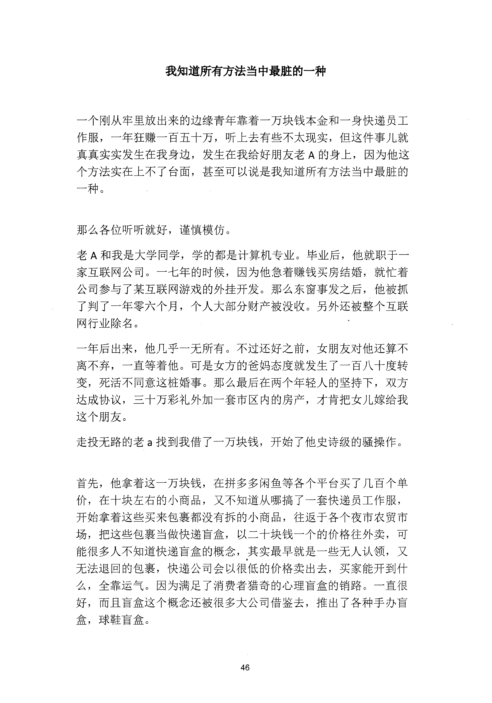
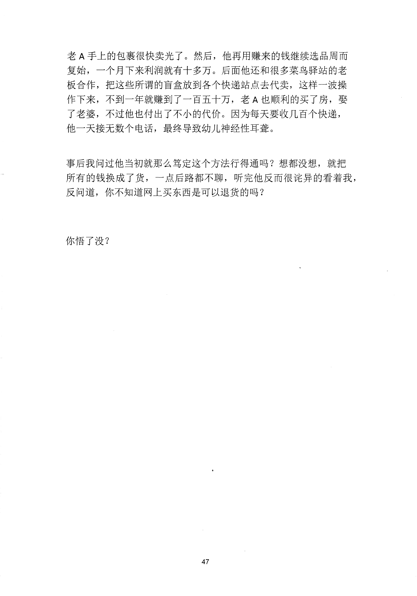

<!-- 原书第 53 页 -->

# 我知道所有方法当中最脏的一种

一个刚从牢里放出来的边缘青年靠着一万块钱本金和一身快递员工
作服，一年狂赚一百五十万，听上去有些不太现实，但这件事儿就
真真实实发生在我身边，发生在我给好朋友老A 的身上，因为他这
个方法实在上不了台面，甚至可以说是我知道所有方法当中最脏的
一种。
那么各位听听就好，谨慎模仿。
老A 和我是大学同学，学的都是计算机专业。毕业后，他就职于一
家互联网公司。一七年的时候，因为他急着赚钱买房结婚，就忙着
公司参与了某互联网游戏的外挂开发。那么东窗事发之后，他被抓
了判了一年零六个月，个人大部分财产被没收。另外还被整个互联
网行业除名。
一年后出来，他几乎一无所有。不过还好之前，女朋友对他还算不
离不弃，一直等着他。可是女方的爸妈态度就发生了一百八十度转
变，死活不同意这桩婚事。那么最后在两个年轻人的坚持下，双方
达成协议，三十万彩礼外加一套市区内的房产，才肯把女儿嫁给我
这个朋友。
走投无路的老a 找到我借了一万块钱，开始了他史诗级的骚操作。
首先，他拿着这一万块钱，在拼多多闲鱼等各个平台买了几百个单
价，在十块左右的小商品，又不知道从哪搞了一套快递员工作服，
开始拿着这些买来包裹都没有拆的小商品，往返千各个夜市农贸市
场，把这些包裹当做快递盲盒，以二十块钱一个的价格往外卖，可
能很多人不知道快递盲盒的概念，其实最早就是一些无人认领，又
无法退回的包裹，快递公司会以很低的价格卖出去，买家能开到什
么，全靠运气。因为满足了消费者猎奇的心理盲盒的销路。一直很
好，而且盲盒这个概念还被很多大公司借鉴去，推出了各种手办盲
盒，球鞋盲盒。
46
更多kr66e9gs

<!-- source-image-start -->

查看原书第 53 页影像

<!-- source-image-end -->

<!-- 原书第 54 页 -->

老A 手上的包裹很快卖光了。然后，他再用赚来的钱继续选品周而
复始，一个月下来利润就有十多万。后面他还和很多菜鸟驿站的老
板合作，把这些所谓的盲盒放到各个快递站点去代卖，这样一波操
作下来，不到一年就赚到了一百五十万，老A 也顺利的买了房，娶
了老婆，不过他也付出了不小的代价。因为每天要收几百个快递，
他一天接无数个电话，最终导致幼儿神经性耳聋。
事后我问过他当初就那么笃定这个方法行得通吗？想都没想，就把
所有的钱换成了货，一点后路都不聊，听完他反而很诧异的看着我，
反问道，你不知道网上买东西是可以退货的吗？
你悟了没？
47
更多kr66e9gs

<!-- source-image-start -->

查看原书第 54 页影像

<!-- source-image-end -->
