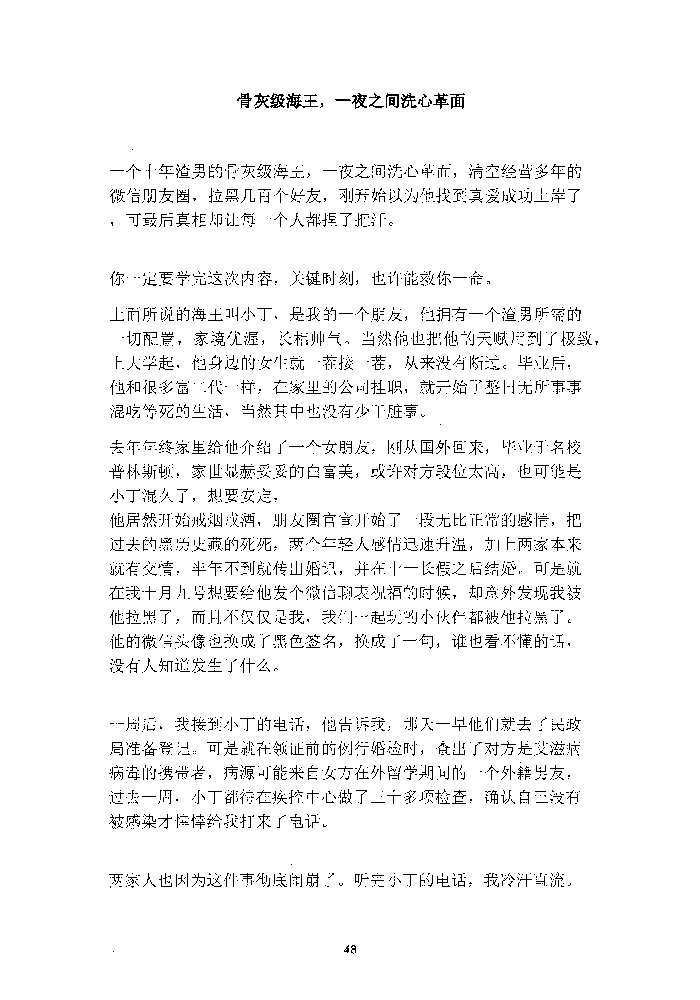
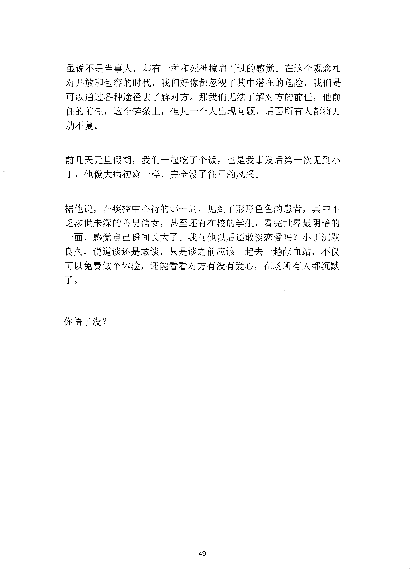

<!-- 原书第 55 页 -->

# 骨灰级海王，一夜之间洗心革面

一个十年渣男的骨灰级海王，一夜之间洗心革面，清空经营多年的
微信朋友圈，拉黑几百个好友，刚开始以为他找到真爱成功上岸了
，可最后真相却让每一个人都捏了把汗。
你一定要学完这次内容，关键时刻，也许能救你一命。
上面所说的海王叫小丁，是我的一个朋友，他拥有一个渣男所需的
一切配置，家境优渥，长相帅气。当然他也把他的天赋用到了极致，
上大学起，他身边的女生就一茬接一茬，从来没有断过。毕业后，
他和很多富二代一样，在家里的公司挂职，就开始了整日无所事事
混吃等死的生活，当然其中也没有少干脏事。
去年年终家里给他介绍了一个女朋友，刚从国外回来，毕业于名校
普林斯顿，家世显赫妥妥的白富美，或许对方段位太高，也可能是
小丁混久了，想要安定，
他居然开始戒烟戒酒，朋友圈官宣开始了一段无比正常的感情，把
过去的黑历史藏的死死，两个年轻人感情迅速升温，加上两家本来
就有交情，半年不到就传出婚讯，并在十一长假之后结婚。可是就
在我十月九号想要给他发个微信聊表祝福的时候，却意外发现我被
他拉黑了，而且不仅仅是我，我们一起玩的小伙伴都被他拉黑了。
他的微信头像也换成了黑色签名，换成了一句，谁也看不懂的话，
没有人知道发生了什么。
一周后，我接到小丁的电话，他告诉我，那天一早他们就去了民政
局准备登记。可是就在领证前的例行婚检时，查出了对方是艾滋病
病毒的携带者，病源可能来自女方在外留学期间的一个外籍男友，
过去一周，小丁都待在疾控中心做了三十多项检查，确认自己没有
被感染才悖悖给我打来了电话。
两家人也因为这件事彻底闹崩了。听完小丁的电话，我冷汗直流。
48
更多kr66e9gs

<!-- source-image-start -->

查看原书第 55 页影像

<!-- source-image-end -->

<!-- 原书第 56 页 -->

虽说不是当事人，却有一种和死神擦肩而过的感觉。在这个观念相
对开放和包容的时代，我们好像都忽视了其中潜在的危险，我们是
可以通过各种途径去了解对方。那我们无法了解对方的前任，他前
任的前任，这个链条上，但凡一个人出现问题，后面所有人都将万
劫不复。
前几天元旦假期，我们一起吃了个饭，也是我事发后第一次见到小
丁，他像大病初愈一样，完全没了往日的风采。
据他说，在疾控中心待的那一周，见到了形形色色的患者，其中不
乏涉世未深的善男信女，甚至还有在校的学生，看完世界最阴暗的
一面，感觉自己瞬间长大了。我问他以后还敢谈恋爱吗？小丁沉默
良久，说道谈还是敢谈，只是谈之前应该一起去一趟献血站，不仅
可以免费做个体检，还能看看对方有没有爱心，在场所有人都沉默
了。
你悟了没？
49
更多kr66e9gs

<!-- source-image-start -->

查看原书第 56 页影像

<!-- source-image-end -->
