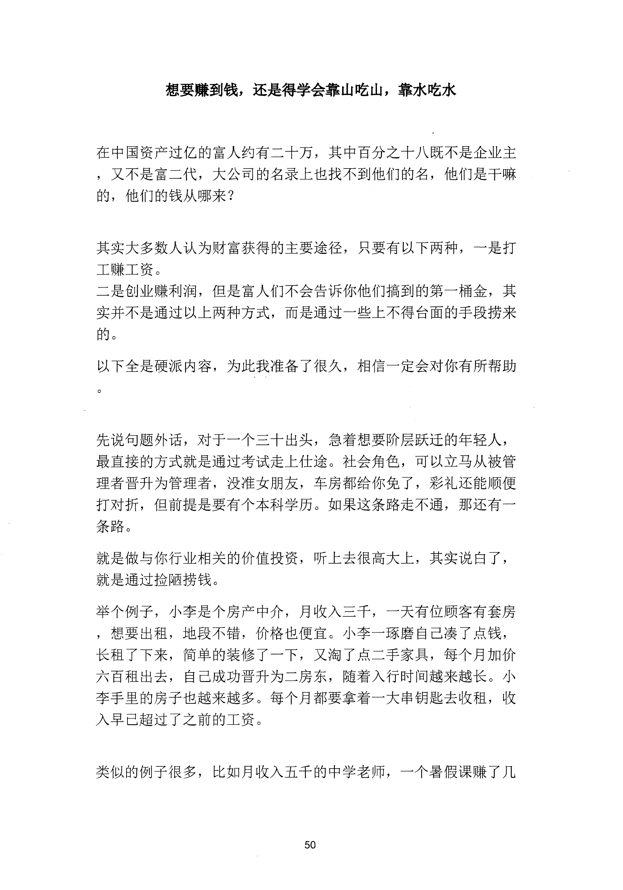
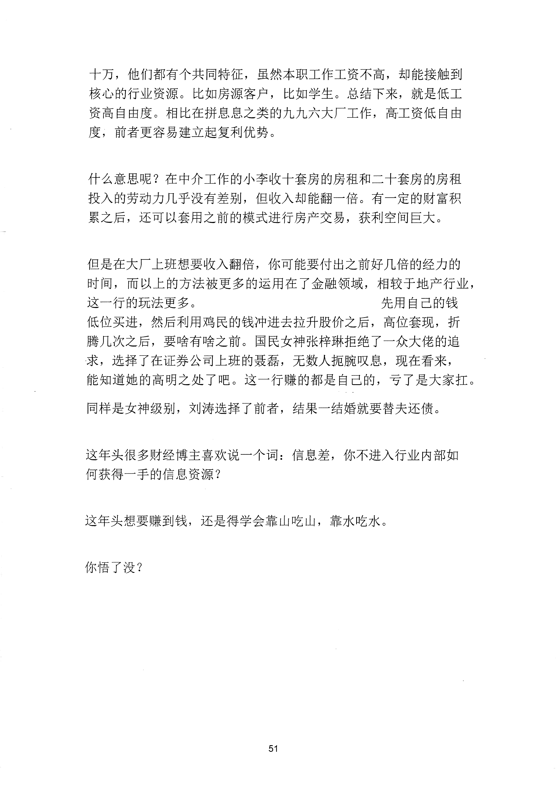

<!-- 原书第 57 页 -->

# 想要赚到钱，还是得学会靠山吃山，靠水吃水

在中国资产过亿的富人约有二十万，其中百分之十八既不是企业主
，又不是富二代，大公司的名录上也找不到他们的名，他们是干嘛
的，他们的钱从哪来？
其实大多数人认为财富获得的主要途径，只要有以下两种，一是打
工赚工资。
二是创业赚利润，但是富人们不会告诉你他们搞到的第一桶金，其
实并不是通过以上两种方式，而是通过一些上不得台面的手段捞来
的。
以下全是硬派内容，为此我准备了很久，相信一定会对你有所帮助
先说句题外话，对于一个三十出头，急着想要阶层跃迁的年轻人，
最直接的方式就是通过考试走上仕途。社会角色，可以立马从被管
理者晋升为管理者，没准女朋友，车房都给你免了，彩礼还能顺便
打对折，但前提是要有个本科学历。如果这条路走不通，那还有一
条路。
就是做与你行业相关的价值投资，听上去很高大上，其实说白了，
就是通过捡陋捞钱。
举个例子，小李是个房产中介，月收入三千，一天有位顾客有套房
，想要出租，地段不错，价格也便宜。小李一琢磨自己凑了点钱，
长租了下来，简单的装修了一下，又淘了点二手家具，每个月加价
六百租出去，自已成功晋升为二房东，随着入行时间越来越长。小
李手里的房子也越来越多。每个月都要拿着一大串钥匙去收租，收
入早已超过了之前的工资。
类似的例子很多，比如月收入五于的中学老师，一个暑假课赚了几
50
更多kr66e9gs

<!-- source-image-start -->

查看原书第 57 页影像

<!-- source-image-end -->

<!-- 原书第 58 页 -->

十万，他们都有个共同特征，虽然本职工作工资不高，却能接触到
核心的行业资源。比如房源客户，比如学生。总结下来，就是低工
资高自由度。相比在拼息息之类的九九六大厂工作，高工资低自由
度，前者更容易建立起复利优势。
什么意思呢？在中介工作的小李收十套房的房租和二十套房的房租
投入的劳动力几乎没有差别，但收入却能翻一倍。有一定的财富积
累之后，还可以套用之前的模式进行房产交易，获利空间巨大。
但是在大厂上班想要收入翻倍，你可能要付出之前好几倍的经力的
时间，而以上的方法被更多的运用在了金融领域，相较千地产行业，
这一行的玩法更多。
先用自己的钱
低位买进，然后利用鸡民的钱冲进去拉升股价之后，高位套现，折
腾几次之后，要啥有啥之前。国民女神张梓琳拒绝了一众大佬的追
求，选择了在证券公司上班的聂磊，无数人扼腕叹息，现在看来，
能知道她的高明之处了吧。这一行赚的都是自己的，亏了是大家扛。
同样是女神级别，刘涛选择了前者，结果一结婚就要替夫还债。
这年头很多财经博主喜欢说一个词：信息差，你不进入行业内部如
何获得一手的信息资源？
这年头想要赚到钱，还是得学会靠山吃山，靠水吃水。
你悟了没？
51
更多kr66e9gs

<!-- source-image-start -->

查看原书第 58 页影像

<!-- source-image-end -->
