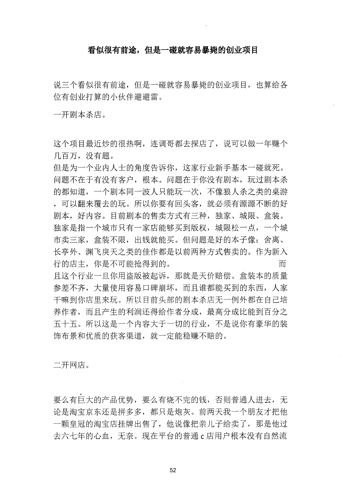
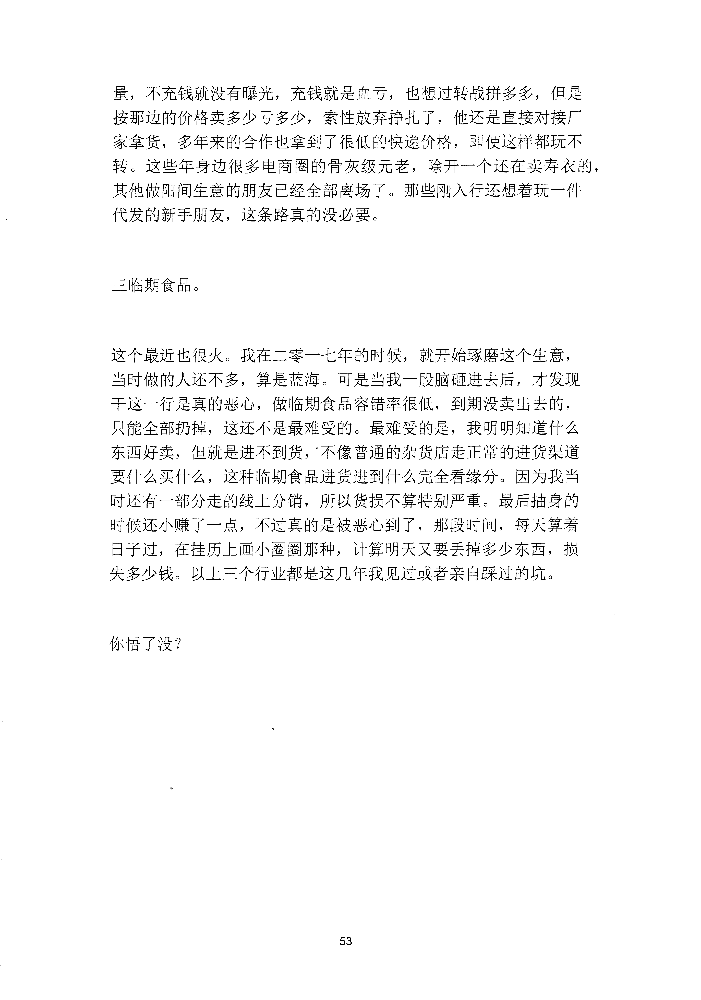

<!-- 原书第 59 页 -->

# 看似很有前途，但是一碰就容易暴毙的创业项目

说三个看似很有前途，但是一碰就容易暴毙的创业项目，也算给各
位有创业打算的小伙伴避避雷。
一开剧本杀店。
这个项目最近炒的很热啊，连调哥都去探店了，说可以做一年赚个
几百万，没有题。
但是为一个业内人士的角度告诉你，这家行业新手基本一碰就死。
问题不在于有没有客户，根本。问题在于你没有剧本，玩过剧本杀
的都知道，一个剧本同一波人只能玩一次，不像狼人杀之类的桌游
，可以翻来覆去的玩。所以你要有回头客，就必须有源源不断的好
剧本，好内容。目前剧本的售卖方式有三种，独家、城限、盒装。
独家是指一个城市只有一家店能够买到版权，城限松一点，一个城
市卖三家，盒装不限，出钱就能买。但问题是好的本子像：舍离、
长亭外、渊飞戾天之类的佳作都是以前两种方式售卖的。作为新入
行的店主，你是不可能抢得到的。
而
且这个行业一旦你用盗版被起诉，那就是天价赔偿。盒装本的质量
参差不齐，大量使用容易口碑崩坏，而且谁都能买到的东西，人家
千嘛到你店里来玩。所以目前头部的剧本杀店无一例外都在自己培
养作者，而且产生的利润还得给作者分成，最高分成比能到百分之
五十五。所以这是一个内容大于一切的行业，不是说你有豪华的装
饰布景和优质的获客渠道，就一定能稳赚不赔的。
二开网店。
要么有巨大的产品优势，要么有烧不完的钱，否则普通人进去，无
论是淘宝京东还是拼多多，都只是炮灰。前两天我一个朋友才把他
一颗皇冠的淘宝店挂牌出售了，他说像把亲儿子给卖了，那是他过
去六七年的心血，无奈。现在平台的普通c 店用户根本没有自然流
52
更多kr66e9gs

<!-- source-image-start -->

查看原书第 59 页影像

<!-- source-image-end -->

<!-- 原书第 60 页 -->

量，不充钱就没有曝光，充钱就是血亏，也想过转战拼多多，但是
按那边的价格卖多少亏多少，索性放弃挣扎了，他还是直接对接厂
家拿货，多年来的合作也拿到了很低的快递价格，即使这样都玩不
转。这些年身边很多电商圈的骨灰级元老，除开一个还在卖寿衣的，
其他做阳间生意的朋友已经全部离场了。那些刚入行还想若玩一件
代发的新手朋友，这条路真的没必要。
三临期食品。
这个最近也很火。我在二零一七年的时候，就开始琢磨这个生意，
当时做的人还不多算是蓝海。可是当我一股脑砸进去后，才发现
干这一行是真的恶心，做临期食品容错率很低，到期没卖出去的，
只能全部扔掉，这还不是最难受的。最难受的是，我明明知道什么
东西好卖，但就是进不到货，不像普通的杂货店走正常的进货渠道
要什么买什么，这种临期食品进货进到什么完全看缘分。因为我当
时还有一部分走的线上分销，所以货损不算特别严重。最后抽身的
时候还小赚了一点，不过真的是被恶心到了，那段时间，每天算着
日子过，在挂历上画小圈圈那种，计算明天又要丢掉多少东西，损
失多少钱。以上三个行业都是这几年我见过或者亲自踩过的坑。
你悟了没？
53
更多kr66e9gs

<!-- source-image-start -->

查看原书第 60 页影像

<!-- source-image-end -->
