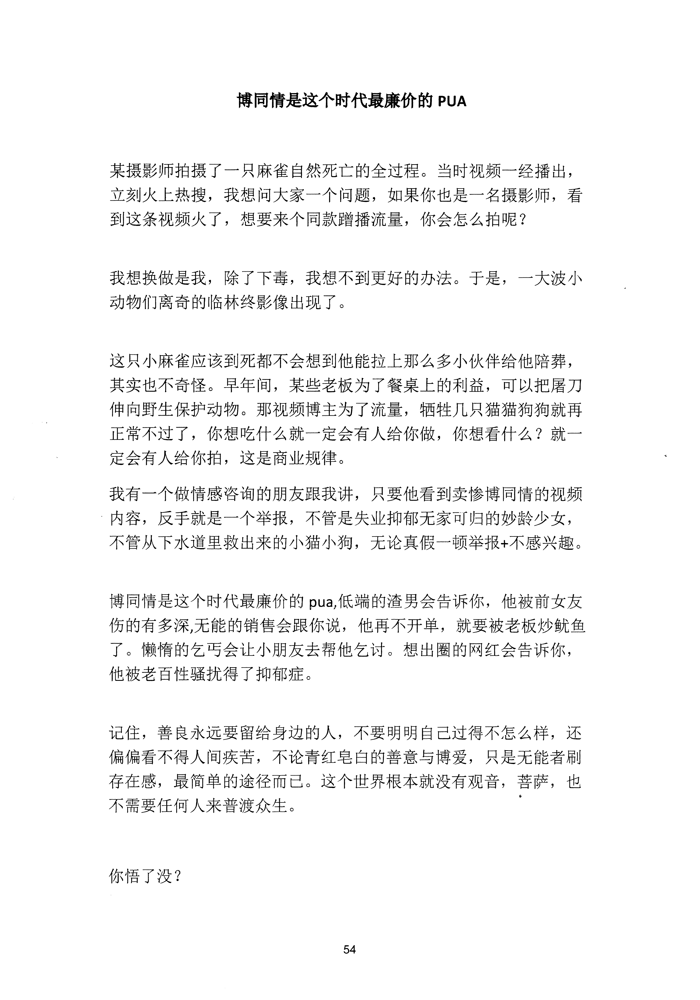

<!-- 原书第 61 页 -->

# 博同情是这个时代最廉价的PUA

某摄影师拍摄了一只麻雀自然死亡的全过程。当时视频一经播出，
立刻火上热搜，我想问大家一个问题，如果你也是一名摄影师，看
到这条视频火了，想要来个同款躇播流量，你会怎么拍呢？
我想换做是我，除了下毒，我想不到更好的办法。于是，一大波小
动物们离奇的临林终影像出现了。
这只小麻雀应该到死都不会想到他能拉上那么多小伙伴给他陪葬，
其实也不奇怪。早年间，某些老板为了餐桌上的利益，可以把屠刀
伸向野生保护动物。那视频博主为了流量，牺牲几只猫猫狗狗就再
正常不过了，你想吃什么就一定会有人给你做，你想看什么？就一
定会有人给你拍，这是商业规律。
我有一个做情感咨询的朋友跟我讲，只要他看到卖惨博同情的视频
内容，反手就是一个举报，不管是失业抑郁无家可归的妙龄少女，
不管从下水道里救出来的小猫小狗，无论真假一顿举报＋不感兴趣。
博同情是这个时代最廉价的pua低端的渣男会告诉你，他被前女友
伤的有多深，无能的销售会跟你说，他再不开单，就要被老板炒就鱼
了。懒惰的乞丐会让小朋友去帮他乞讨。想出圈的网红会告诉你，
他被老百性骚扰得了抑郁症。
记住，善良永远要留给身边的人，不要明明自己过得不怎么样，还
偏偏看不得人间疾苦，不论青红皂臼的善意与博爱，只是无能者刷
存在感最简单的途径而已。这个世界根本就没有观音，菩萨，也
不需要任何人来普渡众生。
你悟了没？
54
更多kr66e9gs

<!-- source-image-start -->

查看原书第 61 页影像

<!-- source-image-end -->
