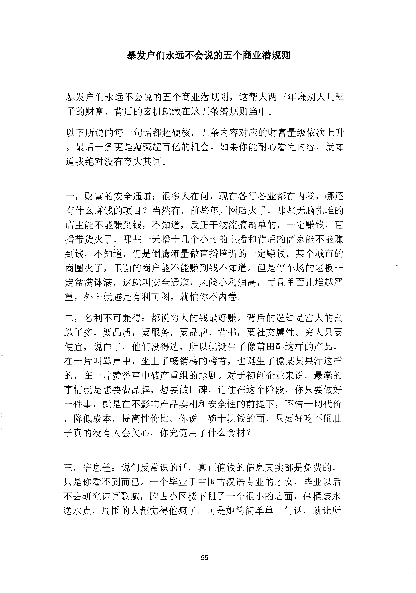
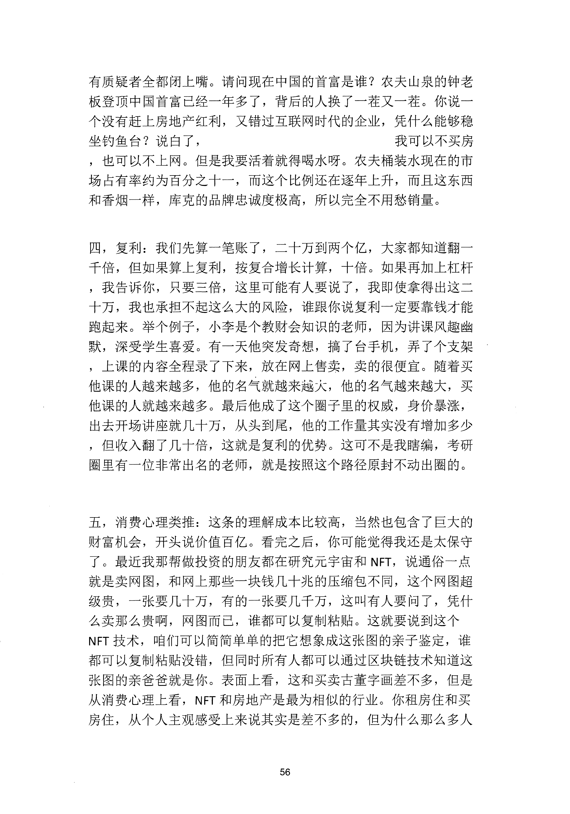
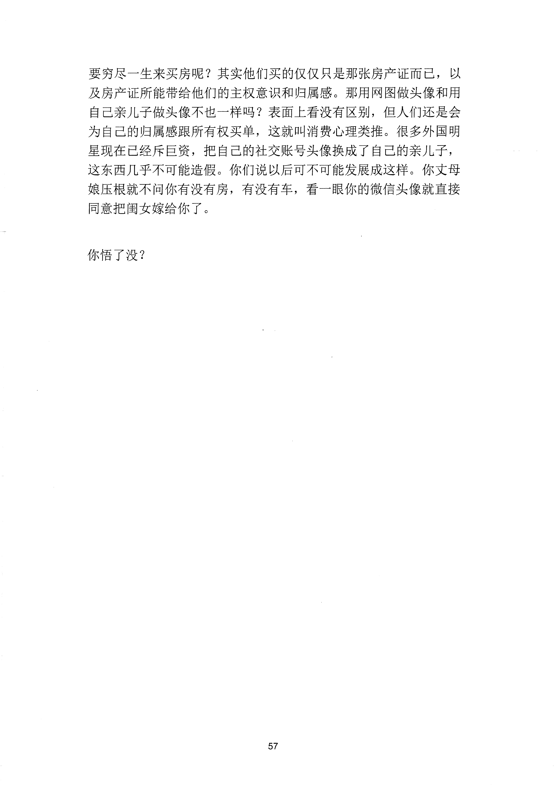

<!-- 原书第 62 页 -->

# 暴发户们永远不会说的五个商业潜规则

暴发户们永远不会说的五个商业潜规则，这帮人两三年赚别人几辈
子的财富，背后的玄机就藏在这五条潜规则当中。
以下所说的每一句话都超硬核，五条内容对应的财富量级依次上升
。最后一条更是蕴藏超百亿的机会。如果你能耐心看完内容，就知
道我绝对没有夸大其词。
一，财富的安全通道：很多人在问，现在各行各业都在内卷，哪还
有什么赚钱的项目？当然有，前些年开网店火了，那些无脑扎堆的
店主能不能赚到钱，不知道，反正干物流搞刷单的，一定赚钱，直
播带货火了，那些一天播十几个小时的主播和背后的商家能不能赚
到钱，不知道，但是倒腾流量做直播培训的一定赚钱。某个城市的
商圈火了，里面的商户能不能赚到钱不知道。但是停车场的老板一
定盆满钵满，这就叫安全通道，风险小利润高，而且里面扎堆越严
重，外面就越是有利可图，就怕你不内卷。
二，名利不可兼得：都说穷人的钱最好赚。背后的逻辑是富人的么
蛾子多，要品质，要服务，要品牌，背书，要社交属性。穷人只要
便宜，说白了，他们没得选，所以就诞生了像甫田鞋这样的产品，
在一片叫骂声中，坐上了畅销榜的榜首，也诞生了像某某果汁这样
的，在一片赞誉声中破产重组的悲剧。对于初创企业来说，最蠢的
事情就是想要做品牌，想要做口碑。记住在这个阶段，你只要做好
一件事，就是在不影响产品卖相和安全性的前提下，不惜一切代价
，降低成本，提高性价比。你说一碗十块钱的面，只要好吃不闹肚
子真的没有人会关心，你究竟用了什么食材？
三，信息差：说旬反常识的话，真正值钱的信息其实都是免费的，
只是你看不到而已。一个毕业千中国古汉语专业的才女，毕业以后
不去研究诗词歌赋，跑去小区楼下租了一个很小的店面，做桶装水
送水点，周围的人都觉得他疯了。可是她简简单单一句话，就让所
55
更多kr66e9gs

<!-- source-image-start -->

查看原书第 62 页影像

<!-- source-image-end -->

<!-- 原书第 63 页 -->

有质疑者全都闭上嘴。请问现在中国的首富是谁？农夫山泉的钟老
板登顶中国首富已经一年多了，背后的人换了一茬又一茬。你说一
个没有赶上房地产红利，又错过互联网时代的企业，凭什么能够稳
坐钓鱼台？说白了，
我可以不买房
，也可以不上网。但是我要活着就得喝水呀。农夫桶装水现在的市
场占有率约为百分之十一，而这个比例还在逐年上升，而且这东西
和香烟一样，库克的品牌忠诚度极高，所以完全不用愁销量。
四，复利：我们先算一笔账了，二十万到两个亿，大家都知道翻一
千倍，但如果算上复利，按复合增长计算，十倍。如果再加上杠杆
，我告诉你，只要三倍，这里可能有人要说了，我即使拿得出这二
十万，我也承担不起这么大的风险，谁跟你说复利一定要靠钱才能
跑起来。举个例子，小李是个教财会知识的老师，因为讲课风趣幽
默，深受学生喜爱。有一天他突发奇想，搞了台手机，弄了个支架
，上课的内容全程录了下来，放在网上售卖，卖的很便宜。随着买
他课的人越来越多，他的名气就越来越入，他的名气越来越大，买
他课的入就越来越多。最后他成了这个圈子里的权威，身价暴涨，
出去开场讲座就几十万，从头到尾，他的工作量其实没有增加多少
，但收入翻了几十倍，这就是复利的优势。这可不是我瞎编，考研
圈里有一位非常出名的老师，就是按照这个路径原封不动出圈的。
五，消费心理类推：这条的理解成本比较高，当然也包含了巨大的
财富机会，开头说价值百亿。看完之后，你可能觉得我还是太保守
了。最近我那帮做投资的朋友都在研究元宇宙和NFT,
说通俗一点
就是卖网图，和网上那些一块钱几十兆的压缩包不同，这个网图超
级贵，一张要几十万，有的一张要几千万，这叫有人要问了，凭什
么卖那么贵啊，网图而已，谁都可以复制粘贴。这就要说到这个
NFT 技术，咱们可以简简单单的把它想象成这张图的亲子鉴定，谁
都可以复制粘贴没错，但同时所有人都可以通过区块链技术知道这
张图的亲爸爸就是你。表面上看，这和买卖古董字画差不多，但是
从消费心理上看，
NFT 和房地产是最为相似的行业。你租房住和买
房住，从个人主观感受上来说其实是差不多的，但为什么那么多人
56
更多kr66e9gs

<!-- source-image-start -->

查看原书第 63 页影像

<!-- source-image-end -->

<!-- 原书第 64 页 -->

要穷尽一生来买房呢？其实他们买的仅仅只是那张房产证而已，以
及房产证所能带给他们的主权意识和归属感。那用网图做头像和用
自己亲儿子做头像不也一样吗？表面上看没有区别，但人们还是会
为自己的归属感跟所有权买单，这就叫消费心理类推。很多外国明
星现在已经斥巨资，把自己的社交账号头像换成了自己的亲儿子，
这东西几乎不可能造假。你们说以后可不可能发展成这样。你丈母
娘压根就不问你有没有房，有没有车，看一眼你的微信头像就直接
同意把闺女嫁给你了。
你悟了没？
57
更多kr66e9gs

<!-- source-image-start -->

查看原书第 64 页影像

<!-- source-image-end -->
