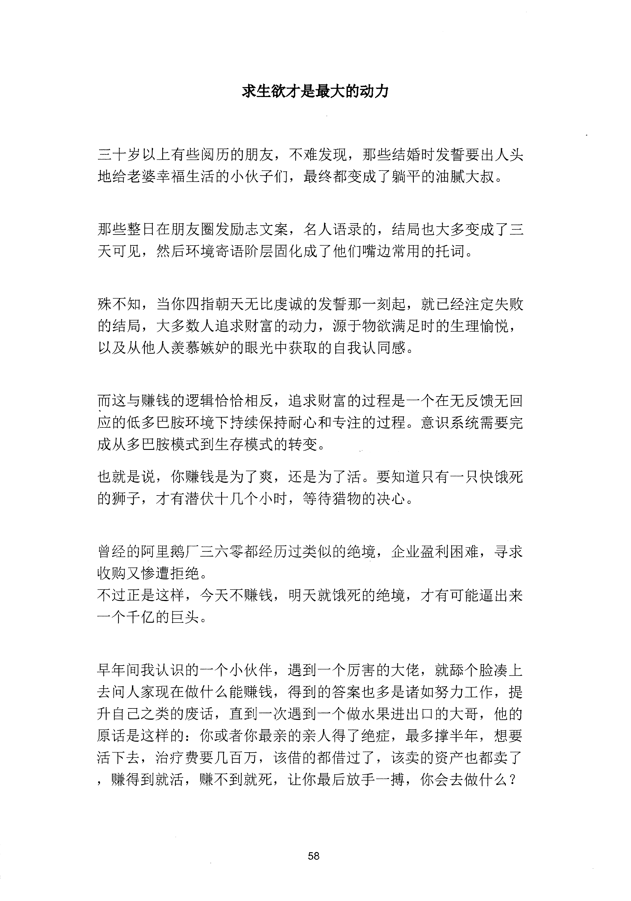
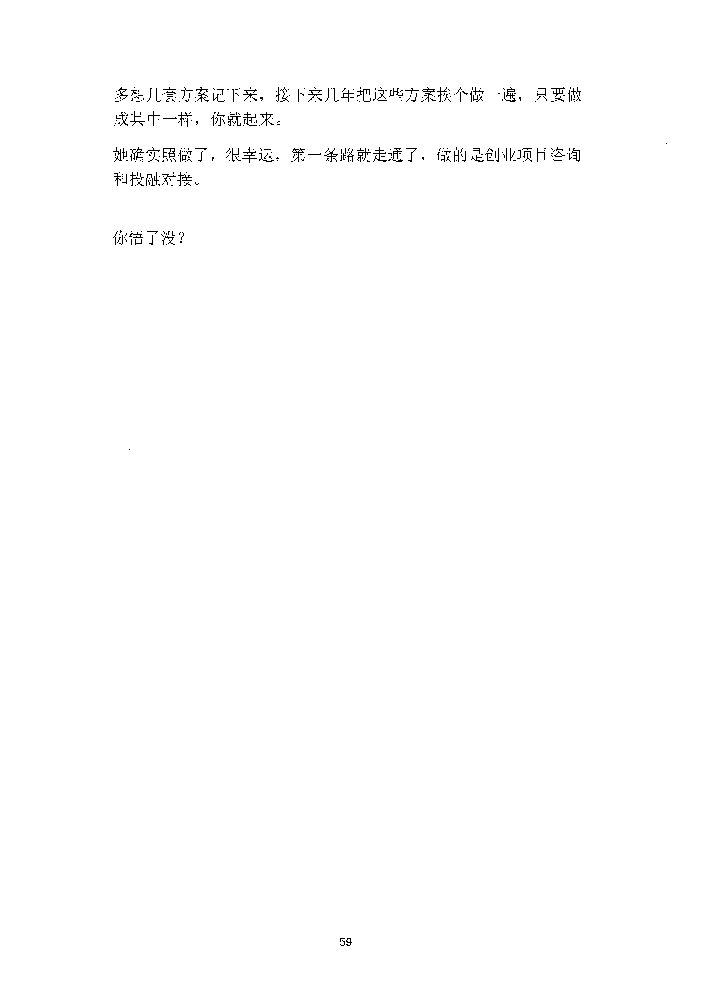

<!-- 原书第 65 页 -->

# 求生欲才是最大的动力

三十岁以上有些阅历的朋友，不难发现，那些结婚时发誓要出人头
地给老婆幸福生活的小伙子们，最终都变成了躺平的油腻大叔。
那些整日在朋友圈发励志文案，名人语录的，结局也大多变成了三
天可见，然后环境寄语阶层固化成了他们嘴边常用的托词。
殊不知，当你四指朝天无比虔诚的发誓那一刻起，就已经注定失败
的结局，大多数人追求财富的动力，源于物欲满足时的生理愉悦，
以及从他人羡慕嫉妒的眼光中获取的自我认同感。
而这与赚钱的逻辑恰恰相反，追求财富的过程是一个在无反馈无回
应的低多巴胺环境下持续保持耐心和专注的过程。意识系统需要完
成从多巴胺模式到生存模式的转变。
也就是说，你赚钱是为了爽，还是为了活。要知道只有一只快饿死
的狮子，才有潜伏十几个小时，等待猎物的决心。
曾经的阿呈鹅厂三六零都经历过类似的绝境，企业盈利困难，寻求
收购又惨遭拒绝。
不过正是这样，今天不赚钱，明天就饿死的绝境，才有可能逼出来
一个千亿的巨头。
早年间我认识的一个小伙伴，遇到一个厉害的大佬，就婖个脸凑上
去问人家现在做什么能赚钱，得到的答案也多是诸如努力工作，提
升自己之类的废话，直到一次遇到一个做水果进出口的大哥，他的
原话是这样的：你或者你最亲的亲人得了绝症，最多撑半年，想要
活下去，治疗费要几百万，该借的都借过了，该卖的资产也都卖了
，赚得到就活，赚不到就死，让你最后放手一搏，你会去做什么？
58
更多kr66e9gs

<!-- source-image-start -->

查看原书第 65 页影像

<!-- source-image-end -->

<!-- 原书第 66 页 -->

多想几套方案记下来，接下来几年把这些方案挨个做一遍，只要做
成其中一样，你就起来。
她确实照做了，很幸运，第一条路就走通了，做的是创业项目咨询
和投融对接。
你悟了没？
59
更多kr66e9gs

<!-- source-image-start -->

查看原书第 66 页影像

<!-- source-image-end -->
