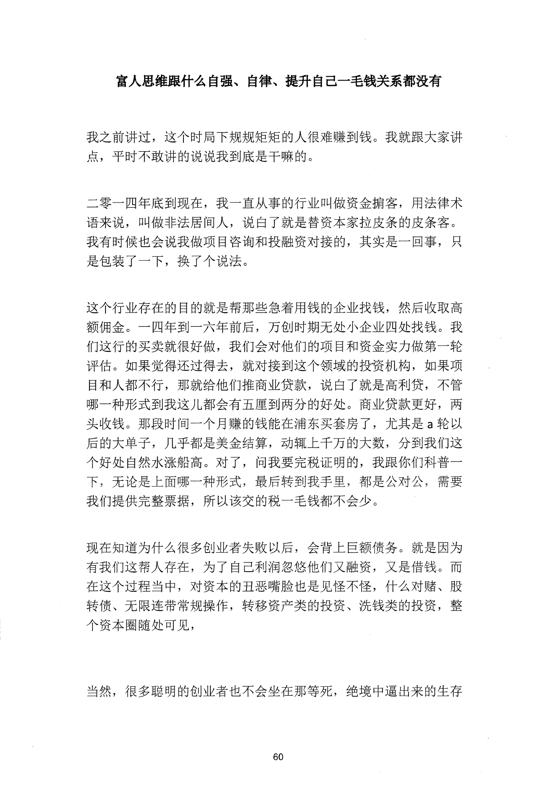
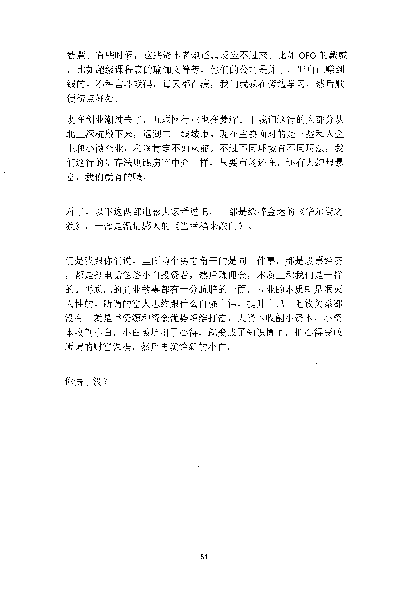

<!-- 原书第 67 页 -->

# 富人思维跟什么自强、自律、提升自己一毛钱关系都没有

我之前讲过，这个时局下规规矩矩的入很难赚到钱。我就跟大家讲
点，平时不敢讲的说说我到底是干嘛的。
二零一四年底到现在，我一直从事的行业叫做资金拍客，用法律术
语来说，叫做非法居间人，说白了就是替资本家拉皮条的皮条客。
我有时候也会说我做项目咨询和投融资对接的，其实是一回事，只
是包装了一下，换了个说法。
这个行业存在的目的就是帮那些急着用钱的企业找钱，然后收取高
额佣金。一四年到一六年前后，万创时期无处小企业四处找钱。我
们这行的买卖就很好做，我们会对他们的项目和资金实力做第一轮
评估。如果觉得还过得去，就对接到这个领域的投资机构，如果项
目和人都不行，那就给他们推商业贷款，说臼了就是高利贷，不管
哪一种形式到我这儿都会有五厘到两分的好处。商业贷款更好，两
头收钱。那段时间一个月赚的钱能在浦东买套房了，尤其是a 轮以
后的大单子，几乎都是美金结算，动辄上千万的大数，分到我们这
个好处自然水涨船高。对了，问我要完税证明的，我跟你们科普一
下，无论是上面哪一种形式，最后转到我手里，都是公对公，需要
我们提供完整票据，所以该交的税一毛钱都不会少。
现在知道为什么很多创业者失败以后，会背上巨额债务。就是因为
有我们这帮人存在，为了自己利润忽悠他们又融资，又是借钱。而
在这个过程当中，对资本的丑恶嘴脸也是见怪不怪，什么对赌、股
转债、无限连带常规操作，转移资产类的投资、洗钱类的投资，整
个资本圈随处可见，
当然，很多聪明的创业者也不会坐在那等死，绝境中逼出来的生存
60
更多kr66e9gs

<!-- source-image-start -->

查看原书第 67 页影像

<!-- source-image-end -->

<!-- 原书第 68 页 -->

智慧。有些时候，这些资本老炮还真反应不过来。比如OFO 的戴威
，比如超级课程表的瑜伽文等等，他们的公司是炸了，但自己赚到
钱的。不种宫斗戏码，每天都在演，我们就躲在旁边学习，然后顺
便捞点好处。
现在创业潮过去了，互联网行业也在萎缩。干我们这行的大部分从
北上深杭撤下来，退到二三线城市。现在主要面对的是一些私人金
主和小微企业，利润肯定不如从前。不过不同环境有不同玩法，我
们这行的生存法则跟房产中介一样，只要市场还在，还有人幻想暴
富，我们就有的赚。
对了。以下这两部电影大家看过吧，一部是纸醉金迷的《华尔街之
狼》，一部是温情感人的《当幸福来敲门》。
但是我跟你们说，里面两个男主角干的是同一件事，都是股票经济
，都是打电话忽悠小臼投资者，然后赚佣金，本质上和我们是一样
的。再励志的商业故事都有十分肮脏的一面，商业的本质就是浪灭
人性的。所谓的富人思维跟什么自强自律，提升自己一毛钱关系都
没有。就是靠资源和资金优势降维打击，大资本收割小资本，小资
本收割小臼，小白被坑出了心得，就变成了知识博主，把心得变成
所谓的财富课程，然后再卖给新的小白。
你悟了没？
61
更多kr66e9gs

<!-- source-image-start -->

查看原书第 68 页影像

<!-- source-image-end -->
