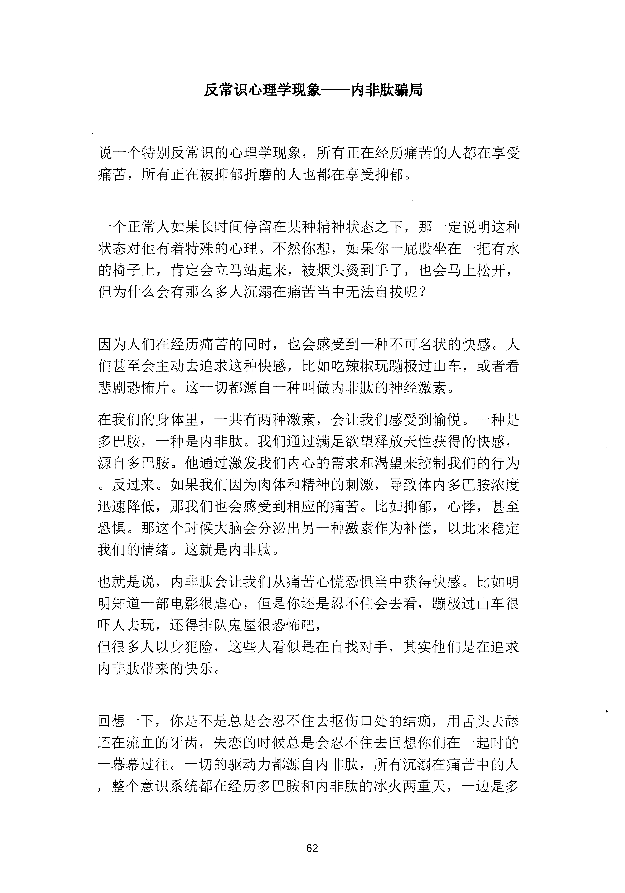
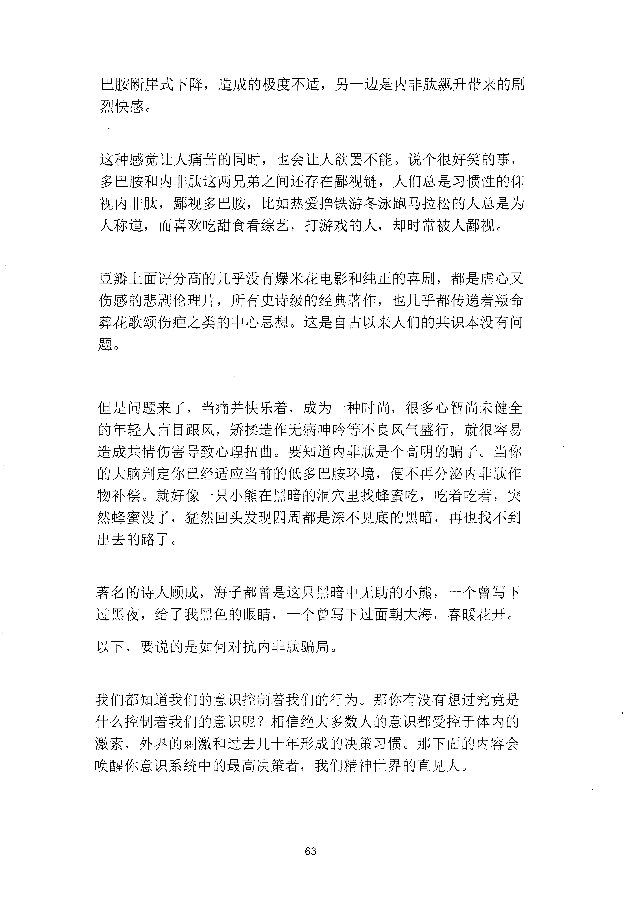
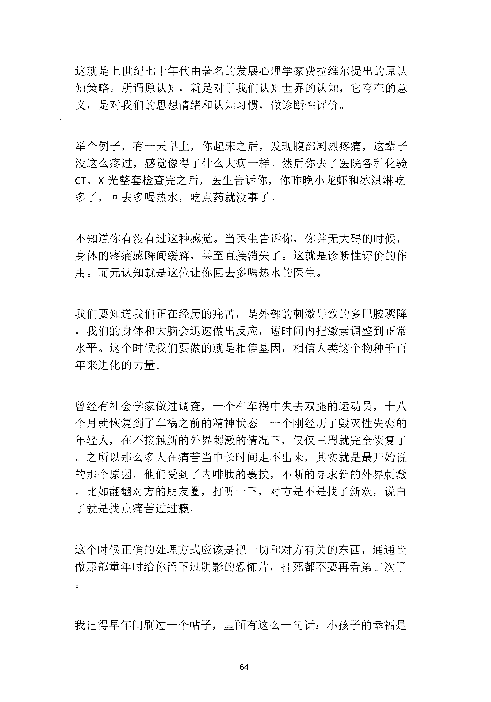
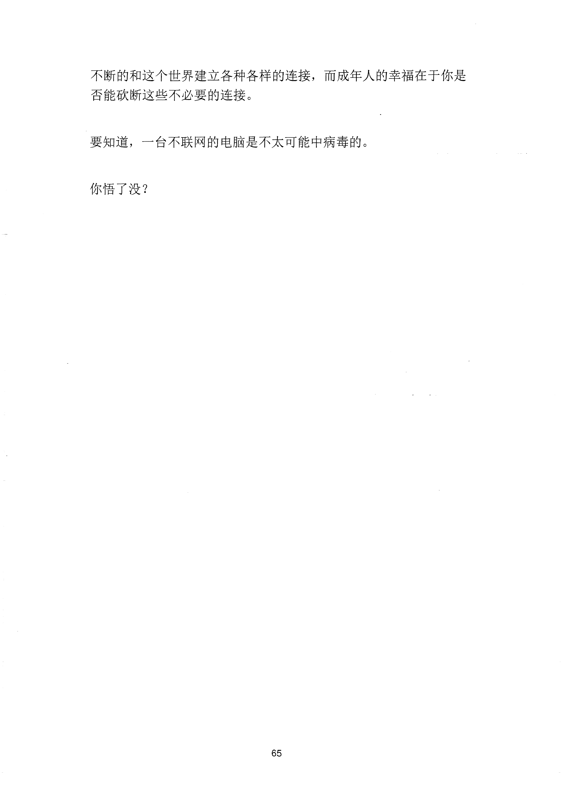

<!-- 原书第 69 页 -->

# 反常识心理学现象——内啡肽骗局

说一个特别反常识的心理学现象，所有正在经历痛苦的人都在享受痛苦，所有正在被抑郁折磨的人也都在享受抑郁。

一个正常人如果长时间停留在某种精神状态之下，那一定说明这种状态对他有着特殊的心理。不然你想，如果你一屁股坐在一把有水的椅子上，肯定会立马站起来，被烟头烫到手了，也会马上松开，但为什么会有那么多人沉溺在痛苦当中无法自拔呢？

因为人们在经历痛苦的同时，也会感受到一种不可名状的快感。人们甚至会主动去追求这种快感，比如吃辣椒玩跑极过山车，或者看悲剧恐怖片。这一切都源自一种叫做内啡肽的神经激素。在我们的身体里，一共有两种激素，会让我们感受到愉悦。一种是多巴胺，一种是内啡肽。我们通过满足欲望释放天性获得的快感，源自多巴胺。他通过激发我们内心的需求和渴望来控制我们的行为。反过来。如果我们因为肉体和精神的刺激，导致体内多巴胺浓度迅速降低，那我们也会感受到相应的痛苦。比如抑郁，心悸，甚至恐惧。那这个时候大脑会分泌出另一种激素作为补偿，以此来稳定我们的情绪。这就是内啡肽。也就是说，内啡肽会让我们从痛苦心慌恐惧当中获得快感。比如明明知道一部电影很虐心，但是你还是忍不住会去看，蹦极过山车很吓人去玩，还得排队鬼屋很恐怖吧，但很多人以身犯险，这些人看似是在自找对手，其实他们是在追求内啡肽带来的快乐。

回想一下，你是不是总是会忍不住去抠伤口处的结痂，用舌头去舔还在流血的牙齿，失恋的时候总是会忍不住去回想你们在一起时的一幕幕过往。一切的驱动力都源自内啡肽，所有沉溺在痛苦中的人，整个意识系统都在经历多巴胺和内啡肽的冰火两重天，一边是多

<!-- source-image-start -->

查看原书第 69 页影像

<!-- source-image-end -->
<!-- 原书第 70 页 -->

巴胺断崖式下降，造成的极度不适，另一边是内啡肽飘升带来的剧烈快感。

这种感觉让人痛苦的同时，也会让人欲罢不能。说个很好笑的事，多巴胺和内啡肽这两兄弟之间还存在鄙视链，人们总是习惯性的仰视内啡肽，鄙视多巴胺，比如热爱撸铁游冬泳跑马拉松的人总是为人称逞而喜欢吃甜食看综艺打游戏的人，却时常被人鄙视。

豆瓣上面评分高的几乎没有爆米花电影和纯正的喜剧，都是虐心又伤感的悲剧伦理片，所有史诗级的经典著作，也几乎都传递着叛命葬花歌颂伤疤之类的中心思想。这是自古以来人们的共识本没有问题。

但是问题来了，当痛并快乐着，成为一种时尚，很多心智尚未健全的年轻入盲目跟风，矫揉造作无病呻吟等不良风气盛行，就很容易造成共情伤害导致心理扭曲。要知道内啡肽是个高明的骗子。当你的大脑判定你已经适应当前的低多巴胺环境，便不再分泌内啡肽作物补偿。就好像一只小熊在黑暗的洞穴里找蜂蜜吃，吃着吃着，突然蜂蜜没了，猛然回头发现四周都是深不见底的黑暗，再也找不到出去的路了。

著名的诗人顾成，海子都曾是这只黑暗中无助的小熊，一个曾写下过黑夜，给了我黑色的眼睛，一个曾写下过面朝大海，春暖花开。以下，要说的是如何对抗内啡肽骗局。

我们都知道我们的意识控制着我们的行为。那你有没有想过究竟是什么控制着我们的意识呢？相信绝大多数人的意识都受控于体内的激素，外界的刺激和过去几十年形成的决策习惯。那下面的内容会唤醒你意识系统中的最高决策者，我们精神世界的直见人。

<!-- source-image-start -->

查看原书第 70 页影像

<!-- source-image-end -->
<!-- 原书第 71 页 -->

这就是上世纪七十年代由著名的发展心理学家费拉维尔提出的原认知策略。所谓原认知，就是对千我们认知世界的认知，它存在的意义，是对我们的思想情绪和认知习惯，做诊断性评价。

举个例子，有一天早上，你起床之后，发现腹部剧烈疼痛，这辈子没这么疼过，感觉像得了什么大病一样。然后你去了医院各种化验CT、

X 光整套检查完之后，医生告诉你，你昨晚小龙虾和冰淇淋吃多了，回去多喝热水，吃点药就没事了。

不知道你有没有过这种感觉。当医生告诉你，你并无大碍的时候，身体的疼痛感瞬间缓解，甚至直接消失了。这就是诊断性评价的作用。而元认知就是这位让你回去多喝热水的医生。

我们要知道我们正在经历的痛苦，是外部的刺激导致的多巴胺骤降，我们的身体和大脑会迅速做出反应，短时间内把激素调整到正常水平。这个时候我们要做的就是相信基因，相信人类这个物种千百年来进化的力量。

曾经有社会学家做过调查，一个在车祸中失去双腿的运动员，十八个月就恢复到了车祸之前的精神状态。一个刚经历了毁灭性失恋的年轻人，在不接触新的外界刺激的情况下，仅仅三周就完全恢复了。之所以那么多人在痛苦当中长时间走不出来，其实就是最开始说的那个原因，他们受到了内啡肽的裹挟，不断的寻求新的外界剌激。比如翻翻对方的朋友圈，打听一下，对方是不是找了新欢，说白了就是找点痛苦过过瘾。

这个时候正确的处理方式应该是把一切和对方有关的东西，通通当做那部童年时给你留下过阴影的恐怖片，打死都不要再看第二次了

我记得早年间刷过一个帖子，里面有这么一句话：小孩子的幸福是

<!-- source-image-start -->

查看原书第 71 页影像

<!-- source-image-end -->
<!-- 原书第 72 页 -->

不断的和这个世界建立各种各样的连接，而成年人的幸福在于你是否能砍断这些不必要的连接。

要知道，一台不联网的电脑是不太可能中病毒的。

你悟了没？

<!-- source-image-start -->

查看原书第 72 页影像

<!-- source-image-end -->
