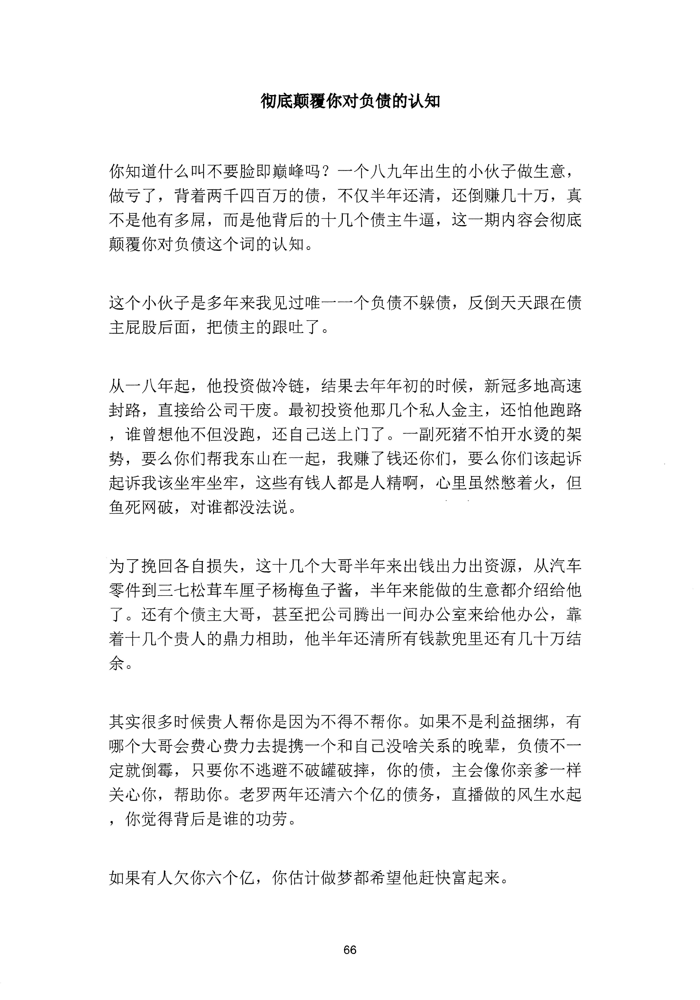

<!-- 原书第 73 页 -->

# 彻底颠覆你对负债的认知

你知道什么叫不要脸即巅峰吗？一个八九年出生的小伙子做生意，做亏了，背着两千四百万的债，不仅半年还清，还倒赚几十万，真不是他有多犀，而是他背后的十几个债主牛逼，这一期内容会彻底颠覆你对负债这个词的认知。

这个小伙子是多年来我见过唯一一个负债不躲债，反倒天天跟在债主屁股后面，把债主的跟吐了。

从一八年起，他投资做冷链，结果去年年初的时候，新冠多地高速封路，直接给公司干废。最初投资他那几个私人金主，还怕他跑路，谁曾想他不但没跑，还自己送上门了。一副死猪不怕开水烫的架势，要么你们帮我东山在一起，我赚了钱还你们，要么你们该起诉起诉我该坐牢坐牢，这些有钱人都是人精啊，心里虽然憋着火，但鱼死网破，对谁都没法说。

为了挽回各自损失，这十几个大哥半年来出钱出力出资源，从汽车零件到三七松茸车厘子杨梅鱼子酱，半年来能做的生意都介绍给他了。还有个债主大哥，甚至把公司腾出一间办公室来给他办公，靠着十几个贵人的鼎力相助，他半年还清所有钱款兜里还有几十万结余。

其实很多时候贵人帮你是因为不得不帮你。如果不是利益捆绑，有哪个大哥会费心费力去提携一个和自己没啥关系的晚辈，负债不一定就倒霉，只要你不逃避不破罐破摔，你的债，主会像你亲爹一样关心你，帮助你。老罗两年还清六个亿的债务，直播做的风生水起，你觉得背后是谁的功劳。

如果有人欠你六个亿，你估计做梦都希望他赶快富起来。

<!-- source-image-start -->

查看原书第 73 页影像

<!-- source-image-end -->
<!-- 原书第 74 页 -->

你悟了没？

<!-- source-image-start -->

查看原书第 74 页影像

<!-- source-image-end -->
