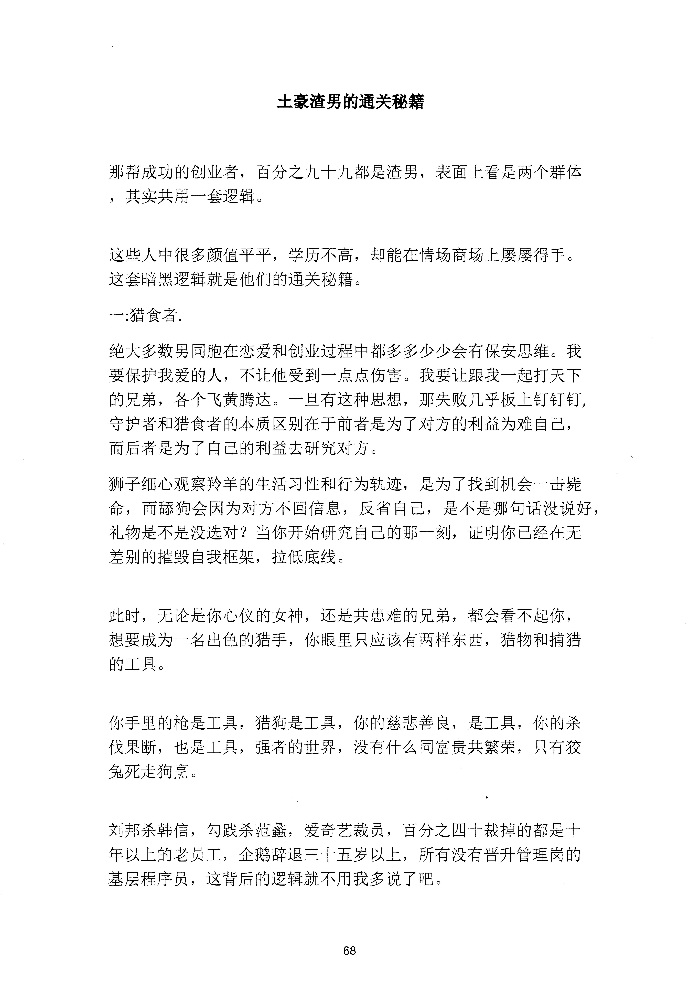
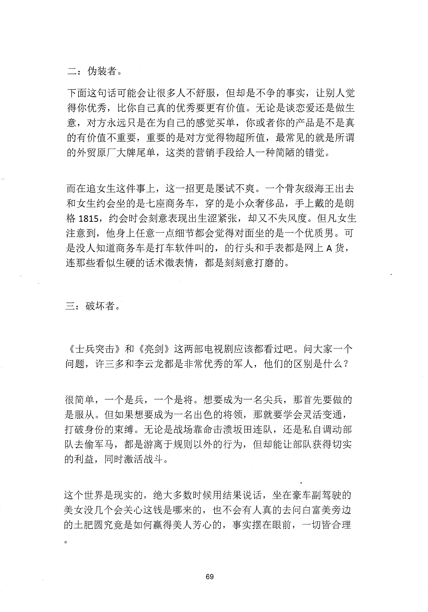
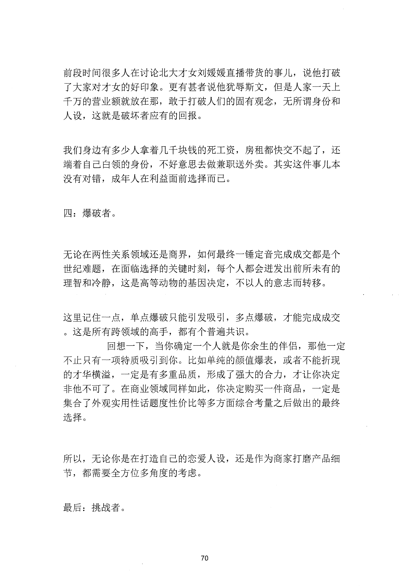
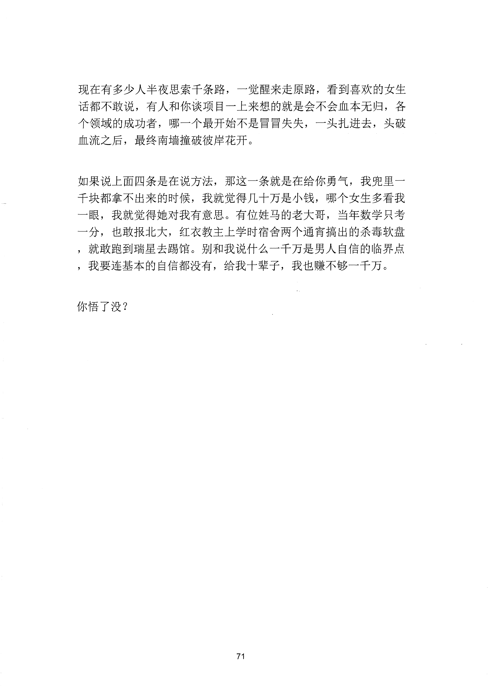

<!-- 原书第 75 页 -->

# 土豪渣男的通关秘籍

那帮成功的创业者，百分之九十九都是渣男，表面上看是两个群体，其实共用一套逻辑。

这些人中很多颜值平平，学历不高，却能在情场商场上屡屡得手。这套暗黑逻辑就是他们的通关秘籍。一：猎食者．绝大多数男同胞在恋爱和创业过程中都多多少少会有保安思维。我要保护我爱的人，不让他受到一点点伤害。我要让跟我一起打天下的兄弟，各个飞黄腾达。一旦有这种思想，那失败几乎板上钉钉钉，守护者和猎食者的本质区别在千前者是为了对方的利益为难自己，而后者是为了自己的利益去研究对方。狮子细心观察羚羊的生活习性和行为轨迹，是为了找到机会一击毙命，而薛狗会因为对方不回信息，反省自己，是不是哪旬话没说好，礼物是不是没选对？当你开始研究自己的那一刻，证明你已经在无差别的摧毁自我框架，拉低底线。

此时，无论是你心仪的女神，还是共患难的兄弟，都会看不起你，想要成为一名出色的猎手，你眼里只应该有两样东西，猎物和捕猎的工具。

你手里的枪是工具，猎狗是工具，你的慈悲善良，是工具，你的杀伐果断，也是工具，强者的世界，没有什么同富贵共繁荣，只有狡兔死走狗烹。

刘邦杀韩信，勾践杀范蠡，爱奇艺裁员，百分之四十裁掉的都是十年以上的老员工，企鹅辞退三十五岁以上，所有没有晋升管理岗的基层程序员，这背后的逻辑就不用我多说了吧。

<!-- source-image-start -->

查看原书第 75 页影像

<!-- source-image-end -->
<!-- 原书第 76 页 -->

二：伪装者。下面这句话可能会让很多人不舒服，但却是不争的事实，让别人觉得你优秀，比你自己真的优秀要更有价值。无论是谈恋爱还是做生意，对方永远只是在为自己的感觉买单，你或者你的产品是不是真的有价值不重要，重要的是对方觉得物超所值，最常见的就是所谓的外贸原厂大牌尾单，这类的营销手段给人一种简陋的错觉。

而在追女生这件事上，这一招更是屡试不爽。一个骨灰级海王出去和女生约会坐的是七座商务车，穿的是小众奢侈品，手上戴的是朗格1815,

约会时会刻意表现出生涩紧张，却又不失风度。但凡女生注意到，他身上任意一点细节都会觉得对面坐的是一个优质男。可是没人知道商务车是打车软件叫的，的行头和手表都是网上A 货，连那些看似生硬的话术微表情，都是刻刻意打磨的。

三：破坏者。

《士兵突击》和《亮剑》这两部电视剧应该都看过吧。问大家一个问题，许三多和李云龙都是非常优秀的军人，他们的区别是什么？

很简单，一个是兵，一个是将。想要成为一名尖兵，那首先要做的是服从。但如果想要成为一名出色的将领，那就要学会灵活变通，打破身份的束缚。无论是战场靠命击溃圾田连队，还是私自调动部队去偷军马，都是游离于规则以外的行为，但却能让部队获得切实的利益，同时激活战斗。

这个世界是现实的，绝大多数时候用结果说话，坐在豪车副驾驶的美女没几个会关心这钱是哪来的，也不会有人真的去问臼富美旁边的土肥圆究竟是如何赢得美人芳心的，事实摆在眼前，一切皆合理

<!-- source-image-start -->

查看原书第 76 页影像

<!-- source-image-end -->
<!-- 原书第 77 页 -->

前段时间很多人在讨论北大才女刘媛媛直播带货的事儿，说他打破了大家对才女的好印象。更有甚者说他犹辱斯文，但是人家一天上于万的营业额就放在那，敢于打破人们的固有观念，无所谓身份和人设，这就是破坏者应有的回报。

我们身边有多少人拿着几于块钱的死工资，房租都快交不起了，还端着自己白领的身份，不好意思去做兼职送外卖。其实这件事儿本没有对错，成年人在利益面前选择而已。

四：爆破者。

无论在两性关系领域还是商界，如何最终一锤定音完成成交都是个世纪难题，在面临选择的关键时刻，每个人都会进发出前所未有的理智和冷静，这是高等动物的基因决定，不以人的意志而转移。

这里记住一点，单点爆破只能引发吸引，多点爆破，才能完成成交。这是所有跨领域的高手，都有个普遍共识。

回想一下，当你确定一个人就是你余生的伴侣，那他一定不止只有一项特质吸引到你。比如单纯的颜值爆表，或者不能折现的才华横溢，一定是有多重品质，形成了强大的合力，才让你决定非他不可了。在商业领域同样如此，你决定购买一件商品，一定是集合了外观实用性话题度性价比等多方面综合考量之后做出的最终选择。

所以，无论你是在打造自己的恋爱人设，还是作为商家打磨产品细节，都需要全方位多角度的考虑。

最后：挑战者。

<!-- source-image-start -->

查看原书第 77 页影像

<!-- source-image-end -->
<!-- 原书第 78 页 -->

现在有多少人半夜思索千条路，一觉醒来走原路，看到喜欢的女生话都不敢说，有人和你谈项目一上来想的就是会不会血本无归，各个领域的成功者，哪一个最开始不是冒冒失失，一头扎进去，头破血流之后，最终南墙撞破彼岸花开。

如果说上面四条是在说方法，那这一条就是在给你勇气，我兜里一于块都拿不出来的时候，我就觉得几十万是小钱，哪个女生多看我一眼，我就觉得她对我有意思。有位姓马的老大哥，当年数学只考一分，也敢报北大，红衣教主上学时宿舍两个通宵搞出的杀毒软盘，就敢跑到瑞星去踢馆。别和我说什么一千万是男人自信的临界点，我要连基本的自信都没有，给我十辈子，我也赚不够一千万。

你悟了没？

<!-- source-image-start -->

查看原书第 78 页影像

<!-- source-image-end -->
