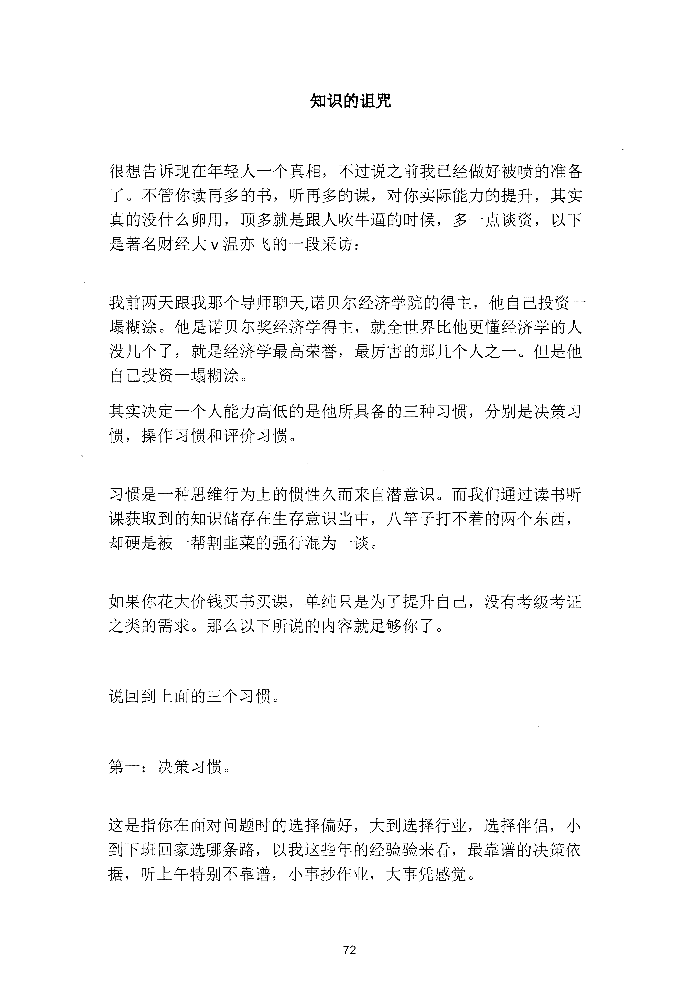
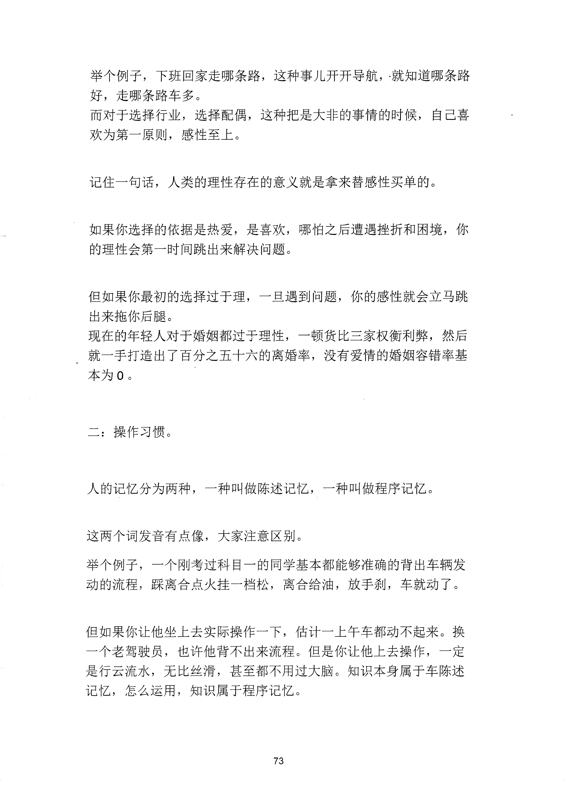
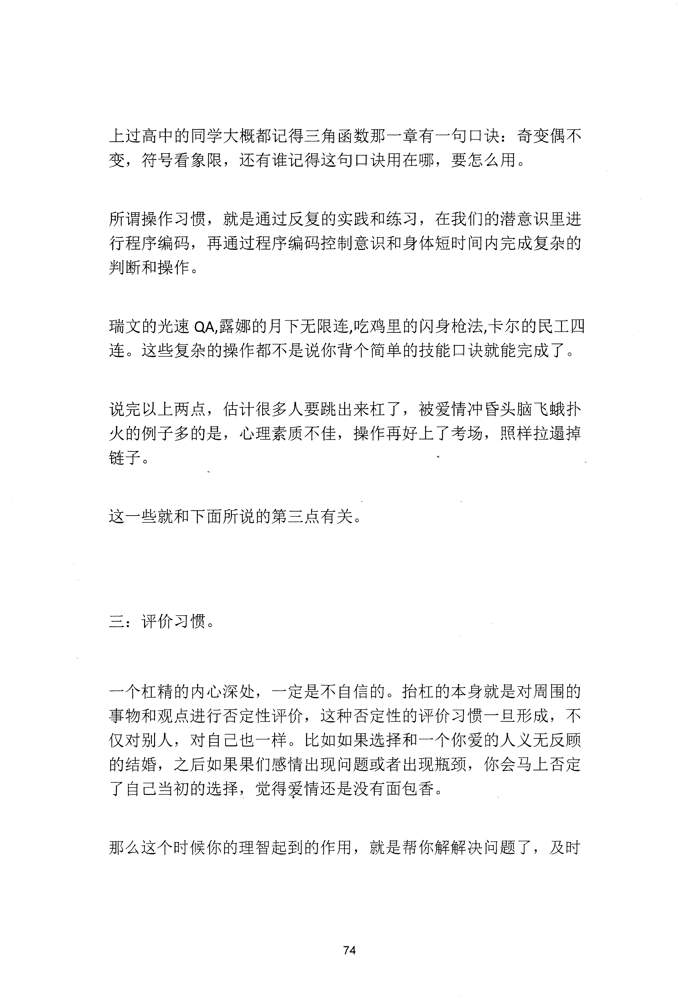
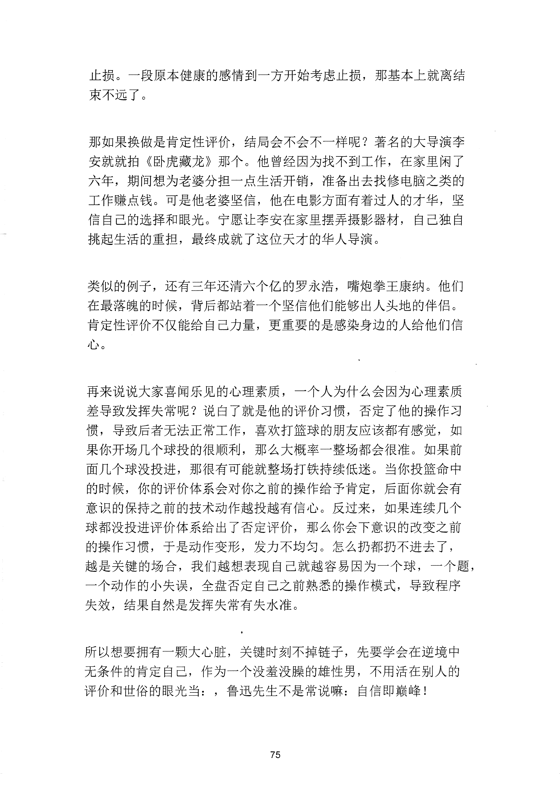
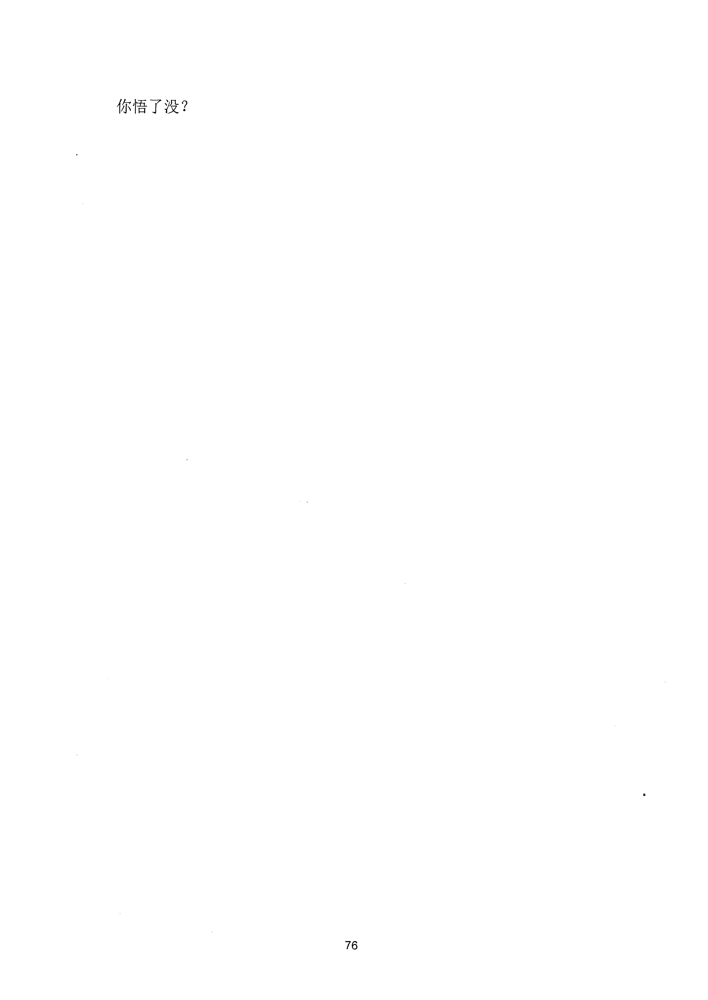

<!-- 原书第 79 页 -->

# 知识的诅咒

很想告诉现在年轻人一个真相，不过说之前我已经做好被喷的准备了。不管你读再多的书，听再多的课，对你实际能力的提升，其实真的没什么卵用，顶多就是跟人吹牛逼的时候，多一点谈资，以下是著名财经大v 温亦飞的一段采访：

我前两天跟我那个导师聊天，诺贝尔经济学院的得主，他自己投资一塌糊涂。他是诺贝尔奖经济学得主，就全世界比他更懂经济学的人没几个了，就是经济学最高荣誉，最厉害的那几个人之一。但是他自己投资一塌糊涂。其实决定一个人能力高低的是他所具备的三种习惯，分别是决策习惯，操作习惯和评价习惯。

习惯是一种思维行为上的惯性久而来自潜意识。而我们通过读书听课获取到的知识储存在生存意识当中，八竿子打不着的两个东西，却硬是被一帮割韭菜的强行混为一谈。

如果你花大价钱买书买课，单纯只是为了提升自己，没有考级考证之类的需求。那么以下所说的内容就足够你了。

说回到上面的三个习惯。

第一：决策习惯。

这是指你在面对问题时的选择偏好，大到选择行业，选择伴侣，小到下班回家选哪条路，以我这些年的经验验来看，最靠谱的决策依据，听上午特别不靠谱，小事抄作业，大事凭感觉。

<!-- source-image-start -->

查看原书第 79 页影像

<!-- source-image-end -->
<!-- 原书第 80 页 -->

举个例子，下班回家走哪条路，这种事儿开开导航，就知道哪条路好，走哪条路车多。而对于选择行业，选择配偶，这种把是大非的事情的时候，自己喜欢为第一原则，感性至上。

记住一句话，人类的理性存在的意义就是拿来替感性买单的。

如果你选择的依据是热爱，是喜欢，哪怕之后遭遇挫折和困境，你的理性会第一时间跳出来解决问题。

但如果你最初的选择过于理，一旦遇到问题，你的感性就会立马跳出来拖你后腿。现在的年轻人对千婚姻都过千理性，一顿货比三家权衡利弊，然后就一手打造出了百分之五十六的离婚率，没有爱情的婚姻容错率基本为0

。

二：操作习惯。

人的记亿分为两种，一种叫做陈述记亿，一种叫做程序记忆。

这两个词发音有点像，大家注意区别。举个例子，一个刚考过科目一的同学基本都能够准确的背出车辆发动的流程踩离合点火挂一档松，离合给油，放手刹，车就动了。

但如果你让他坐上去实际操作一下，估计一上午车都动不起来。换一个老驾驶员，也许他背不出来流程。但是你让他上去操作，一定是行云流水，无比丝滑，甚至都不用过大脑。知识本身属于车陈述记忆，怎么运用，知识属于程序记忆。

<!-- source-image-start -->

查看原书第 80 页影像

<!-- source-image-end -->
<!-- 原书第 81 页 -->

上过高中的同学大概都记得三角函数那一章有一旬口诀：奇变偶不变，符号看象限，还有谁记得这句口诀用在哪，要怎么用。

所谓操作习惯，就是通过反复的实践和练习，在我们的潜意识里进行程序编码，再通过程序编码控制意识和身体短时间内完成复杂的判断和操作。

瑞文的光速QA，露娜的月下无限连，吃鸡里的闪身枪法，卡尔的民工四连。这些复杂的操作都不是说你背个简单的技能口诀就能完成了。

说完以上两点，估计很多人要跳出来杠了，被爱情冲昏头脑飞蛾扑火的例子多的是，心理素质不佳，操作再好上了考场，照样拉遏掉链子。

这一些就和下面所说的第三点有关。

三：评价习惯。

一个杠精的内心深处，一定是不自信的。抬杠的本身就是对周围的事物和观点进行否定性评价，这种否定性的评价习惯一旦形成，不仅对别人，对自己也一样。比如如果选择和一个你爱的人义无反顾的结婚，之后如果果们感情出现问题或者出现瓶颈，你会马上否定了自己当初的选择，觉得爱情还是没有面包香。

那么这个时候你的理智起到的作用，就是帮你解解决问题了，及时

<!-- source-image-start -->

查看原书第 81 页影像

<!-- source-image-end -->
<!-- 原书第 82 页 -->

止损。一段原本健康的感情到一方开始考虑止损，那基本上就离结束不远了。

那如果换做是肯定性评价，结局会不会不一样呢？著名的大导演李安就就拍《卧虎藏龙》那个。他曾经因为找不到工作，在家里闲了六年，期间想为老婆分担一点生活开销，准备出去找修电脑之类的工作赚点钱。可是他老婆坚信，他在电影方面有着过人的才华，坚信自己的选择和眼光。宁愿让李安在家里摆弄摄影器材，自己独自挑起生活的重担，最终成就了这位天才的华人导演。

类似的例子，还有三年还清六个亿的罗永浩，嘴炮拳王康纳。他们在最落魄的时候，背后都站着一个坚信他们能够出人头地的伴侣。肯定性评价不仅能给自己力量，更重要的是感朵身边的人给他们信心。

再来说说大家喜闻乐见的心理素质，一个人为什么会因为心理素质差导致发挥失常呢？说白了就是他的评价习惯，否定了他的操作习惯，导致后者无法正常工作，喜欢打篮球的朋友应该都有感觉，如果你开场几个球投的很顺利，那么大概率一整场都会很准。如果前面几个球没投进，那很有可能就整场打铁持续低迷。当你投篮命中的时候，你的评价体系会对你之前的操作给予肯定，后面你就会有意识的保持之前的技术动作越投越有信心。反过来，如果连续几个球都没投进评价体系给出了否定评价，那么你会下意识的改变之前的操作习惯，于是动作变形，发力不均匀。怎么扔都扔不进去了，越是关键的场合，我们越想表现自己就越容易因为一个球，一个题，一个动作的小失误，全盘否定自己之前熟悉的操作模式，导致程序失效，结果自然是发挥失常有失水准。

所以想要拥有一颗大心脏，关键时刻不掉链子，先要学会在逆境中无条件的肯定自己，作为一个没羞没膜的雄性男，不用活在别人的评价和世俗的眼光当：，鲁迅先生不是常说嘛：自信即巅峰！

<!-- source-image-start -->

查看原书第 82 页影像

<!-- source-image-end -->
<!-- 原书第 83 页 -->

你悟了没？

<!-- source-image-start -->

查看原书第 83 页影像

<!-- source-image-end -->
