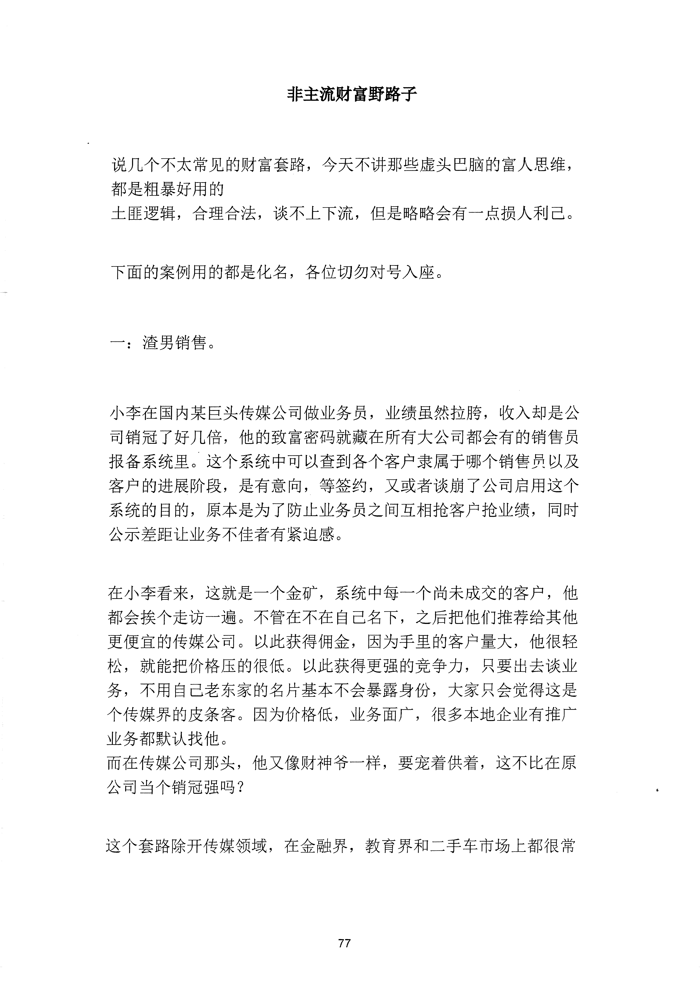
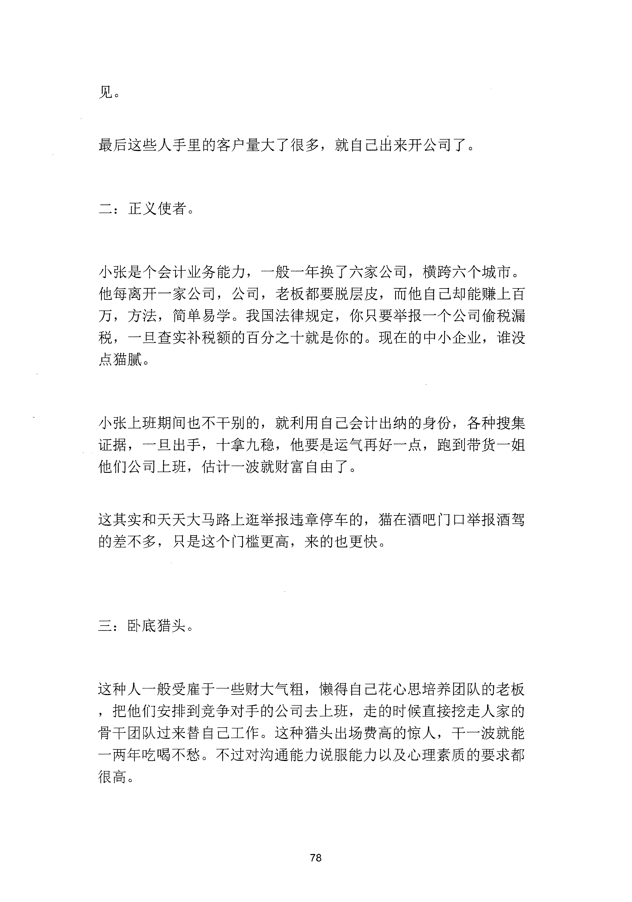
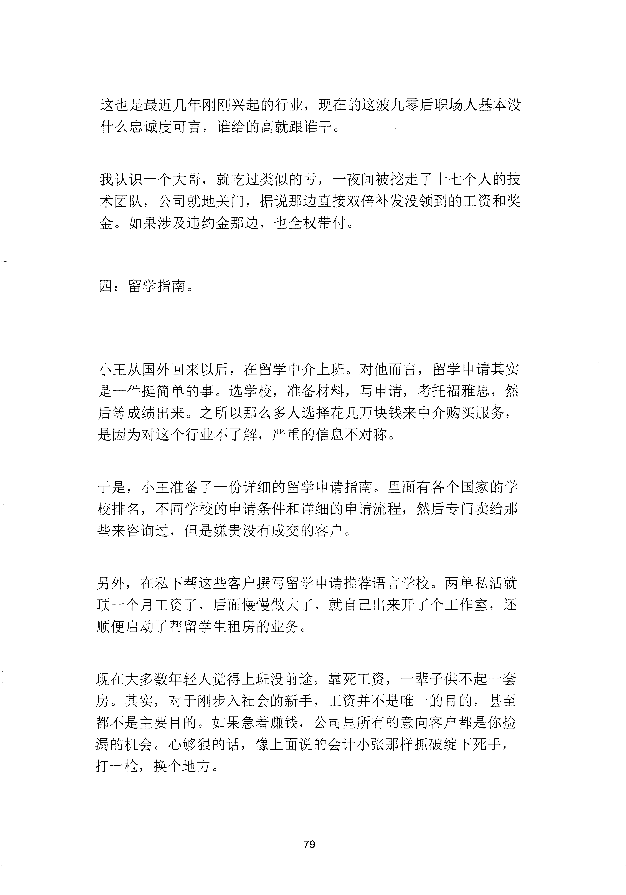
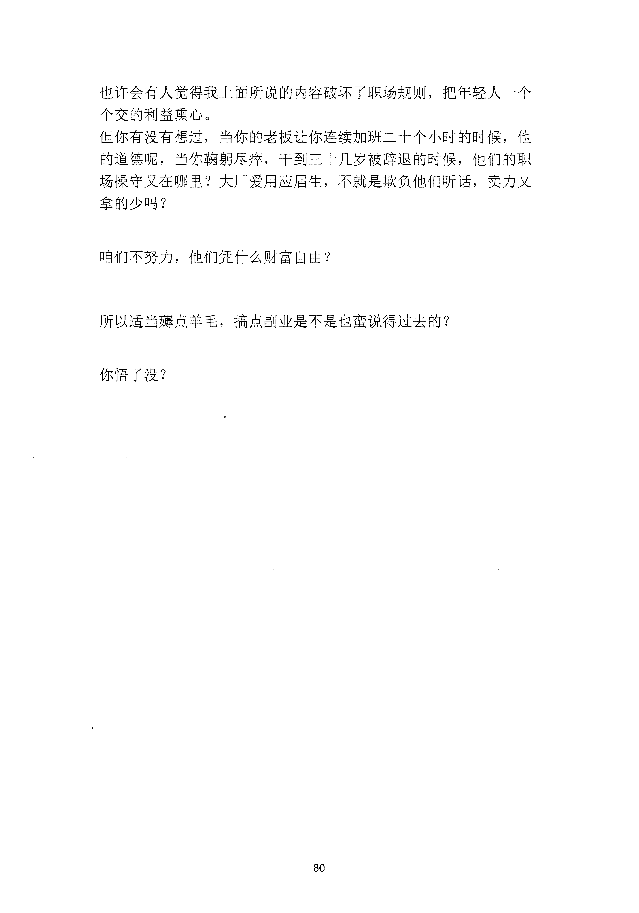

<!-- 原书第 84 页 -->

# 非主流财富野路子

说几个不太常见的财富套路，今天不讲那些虚头巴脑的富人思维，
都是粗暴好用的
土匪逻辑，合理合法，谈不上下流，但是略略会有一点损人利己。
下面的案例用的都是化名，各位切勿对号入座。
一：渣男销售。
小李在国内某巨头传媒公司做业务员，业绩虽然拉膀，收入却是公
司销冠了好几倍，他的致富密码就藏在所有大公司都会有的销售员
报备系统里。这个系统中可以查到各个客户隶属于哪个销售员以及
客户的进展阶段，是有意向，等签约，又或者谈崩了公司启用这个
系统的目的，原本是为了防止业务员之间互相抢客户抢业绩，同时
公示差距让业务不佳者有紧迫感。
在小李看来，这就是一个金矿，系统中每一个尚未成交的客户，他
都会挨个走访一遍。不管在不在自己名下，之后把他们推荐给其他
更便宜的传媒公司。以此获得佣金，因为手里的客户量大，他很轻
松，就能把价格压的很低。以此获得更强的竞争力，只要出去谈业
务，不用自己老东家的名片基本不会暴露身份，大家只会觉得这是
个传媒界的皮条客。因为价格低，业务面广，很多本地企业有推广
业务都默认找他。
而在传媒公司那头，他又像财神爷一样，要宠着供着，这不比在原
公司当个销冠强吗？
这个套路除开传媒领域，在金融界，教育界和二手车市场上都很常
77
更多kr66e9gs

<!-- source-image-start -->

查看原书第 84 页影像

<!-- source-image-end -->

<!-- 原书第 85 页 -->

见。
最后这些人手里的客户量大了很多，就自己出来开公司了。
二：正义使者。
小张是个会计业务能力，一般一年换了六家公司，横跨六个城市。
他每离开一家公司，公司，老板都要脱层皮，而他自己却能赚上百
万，方法，简单易学。我国法律规定，你只要举报一个公司偷税漏
税，一旦查实补税额的百分之十就是你的。现在的中小企业，谁没
点猫腻。
小张上班期间也不干别的，就利用自己会计出纳的身份，各种搜集
证据，一旦出手，十拿九稳，他要是运气再好一点，跑到带货一姐
他们公司上班，估计一波就财富自由了。
这其实和天天大马路上逛举报违章停车的，猫在酒吧门口举报酒驾
的差不多，只是这个门槛更高，来的也更快。
三：卧底猎头。
这种人一般受雇于一些财大气粗，懒得自己花心思培养团队的老板
，把他们安排到竞争对手的公司去上班，走的时候直接挖走人家的
骨干团队过来替自己工作。这种猎头出场费高的惊人，千一波就能
一两年吃喝不愁。不过对沟通能力说服能力以及心理素质的要求都
很高。
78
更多kr66e9gs

<!-- source-image-start -->

查看原书第 85 页影像

<!-- source-image-end -->

<!-- 原书第 86 页 -->

这也是最近几年刚刚兴起的行业，现在的这波九零后职场人基本没
什么忠诚度可言，谁给的高就跟谁干。
我认识一个大哥，就吃过类似的亏，一夜间被挖走了十七个人的技
术团队，公司就地关门，据说那边直接双倍补发没领到的工资和奖
金。如果涉及违约金那边，也全权带付。
四：留学指南。
小王从国外回来以后，在留学中介上班。对他而言，留学申请其实
是一件挺简单的事。选学校，准备材料，写申请，考托福雅思，然
后等成绩出来。之所以那么多人选择花几万块钱来中介购买服务，
是因为对这个行业不了解，严重的信息不对称。
于是，小王准备了一份详细的留学申请指南。里面有各个国家的学
校排名，不同学校的申请条件和详细的申请流程，然后专门卖给那
些来咨询过，但是嫌贵没有成交的客户。
另外，在私下帮这些客户撰写留学申请推荐语言学校。两单私活就
顶一个月工资了，后面慢慢做大了，就自已出来开了个工作室，还
顺便启动了帮留学生租房的业务。
现在大多数年轻人觉得上班没前途，靠死工资，一辈子供不起一套
房。其实，对于刚步入社会的新手，工资并不是唯一的目的，甚至
都不是主要目的。如果急着赚钱，公司里所有的意向客户都是你捡
漏的机会。心够狠的话，像上面说的会计小张那样抓破绽下死手，
打一枪，换个地方。
79
更多kr66e9gs

<!-- source-image-start -->

查看原书第 86 页影像

<!-- source-image-end -->

<!-- 原书第 87 页 -->

也许会有人觉得我上面所说的内容破坏了职场规则，把年轻人一个
个交的利益熏心。
但你有没有想过，当你的老板让你连续加班二十个小时的时候，他
的道德呢，当你鞠躬尽瘁，干到三十几岁被辞退的时候，他们的职
场操守又在哪里？大厂爱用应届生，不就是欺负他们听话，卖力又
拿的少吗？
咱们不努力，他们凭什么财富自由？
所以适当涛点羊毛，搞点副业是不是也蛮说得过去的？
你悟了没？
80
更多kr66e9gs

<!-- source-image-start -->

查看原书第 87 页影像

<!-- source-image-end -->
