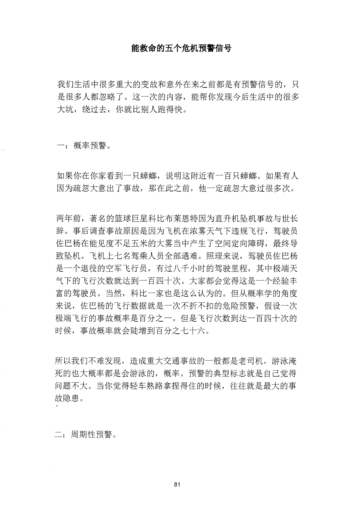
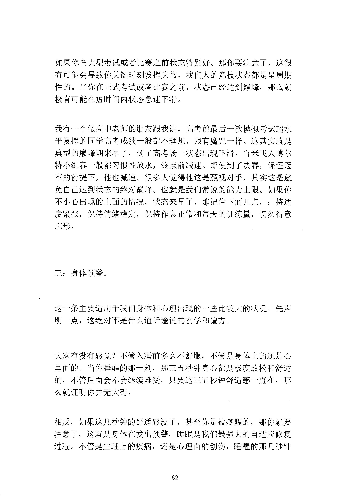
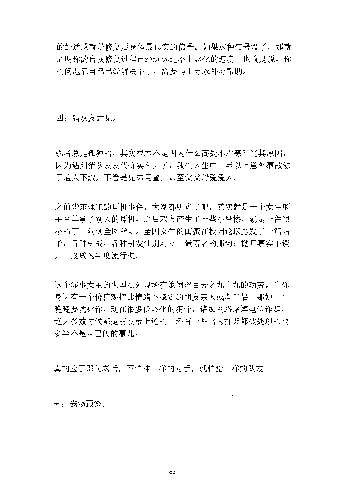
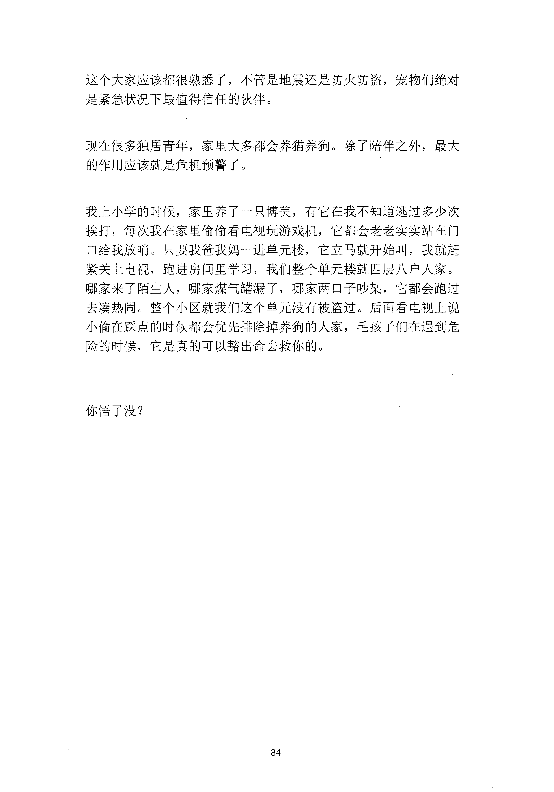

<!-- 原书第 88 页 -->

# 能救命的五个危机预警信号

我们生活中很多重大的变故和意外在来之前都是有预警信号的，只是很多人都忽略了。这一次的内容，能帮你发现今后生活中的很多大坑，绕过去，你就比别人跑得快。

一：概率预警。

如果你在你家看到一只蟀螂，说明这附近有一百只蟀螂。如果有人因为疏忽大意出了事故，那在此之前，他一定疏忽大意过很多次。

两年前，著名的篮球巨星科比布莱恩特因为直升机坠机事故与世长辞。事后调查事故原因是因为飞机在浓雾天气下违规飞行，驾驶员佐巴杨在能见度不足五米的大雾当中产生了空间定向障碍，最终导致坠机。飞机上七名驾乘人员全部遇难。照理来说，驾驶员佐巴杨是一个退役的空军飞行员，有过八千小时的驾驶里程，其中极端夭气下的飞行次数就达到一百四十次。大家都会觉得这是一个经验丰富的驾驶员。当然，科比一家也是这么认为的。但从概率学的角度来说，佐巴杨的飞行数据就是一次不折不扣的危险预警，假设一次极端飞行的事故概率是百分之一。但是飞行次数到达一百四十次的时候，事故概率就会陡增到百分之七十六。

所以我们不难发现，造成重大交通事故的一般都是老司机，游泳淹死的也大概率都是会游泳的，概率。预警的典型标志就是自己觉得问题不大。当你觉得轻车熟路拿捏得住的时候，往往就是最大的事故隐患。

二：周期性预警。

<!-- source-image-start -->

查看原书第 88 页影像

<!-- source-image-end -->
<!-- 原书第 89 页 -->

如果你在大型考试或者比赛之前状态特别好。那你要注意了，这很有可能会导致你关键时刻发挥失常，我们人的竞技状态都是呈周期性的。当你在正式考试或者比赛之前，状态已经达到巅峰，那么就极有可能在短时间内状态急速下滑。

我有一个做高中老师的朋友跟我讲，高考前最后一次模拟考试超水平发挥的同学高考成绩一般都不理想，跟有魔咒一样。这其实就是典型的巅峰期来早了，到了高考场上状态出现下滑。百米飞人博尔特小组赛一般都习惯性放水，终点前减速。即使到了决赛，保证冠军的前提下，他也减速。很多人觉得他这是苞视对手，其实这是避免自已达到状态的绝对巅峰。也就是我们常说的能力上限。如果你不小心出现的上面的情况，状态来早了，那记住下面几点，：持适度紧张，保持情绪稳定，保持作息正常和每天的训练量，切勿得意忘形。

三：身体预警。

这一条主要适用于我们身体和心理出现的一些比较大的状况。先声明一点，这绝对不是什么道听途说的玄学和偏方。

大家有没有感觉？不管入睡前多么不舒服，不管是身体上的还是心里面的。当你睡醒的那一刻，那三五秒钟身心都是极度放松和舒适的，不管后面会不会继续难受，只要这三五秒钟舒适感一直在，那么就证明你并无大碍。

相反，如果这几秒钟的舒适感没了，甚至你是被疼醒的，那你就要注意了，这就是身体在发出预警，睡眠是我们最强大的自适应修复过程。不管是生理上的疾病，还是心理面的创伤，睡醒的那几秒钟

<!-- source-image-start -->

查看原书第 89 页影像

<!-- source-image-end -->
<!-- 原书第 90 页 -->

的舒适感就是修复后身体最真实的信号。如果这种信号没了，那就证明你的自我修复过程已经远远赶不上恶化的速度。也就是说，你的问题靠自己已经解决不了，需要马上寻求外界帮助。

四：猪队友意见。

强者总是孤独的，其实根本不是因为什么高处不胜寒？究其原因，因为遇到猪队友友代价实在大了，我们人生中一半以上意外事故源千遇人不淑，不管是兄弟闺蜜，甚至父父母爱爱人。

之前华东理工的耳机事件，大家都听境了吧，其实就是一个女生顺手牵羊拿了别人的耳机，之后双方产生了一些小摩擦，就是一件很小的亨。闹到全网皆知。全因女生的闺蜜在校园论坛里发了一篇帖子，各种引战，各种引发性别对立。最著名的那句：抛开事实不谈，一度成为年度流行梗。

这个涉事女主的大型社死现场有她闺蜜百分之九十九的功劳。当你身边有一个价值观扭曲情绪不稳定的朋友亲人或者伴侣。那她早早晚晚要坑死你。现在很多低龄化的犯罪，诸如网络赌博电信诈骗，绝大多数时候都是朋友带上道的。还有一些因为打架都被处理的也多半不是自己闹的事儿。

真的应了那句老话，不怕神一样的对手，就怕猪一样的队友。

五：宠物预警。

<!-- source-image-start -->

查看原书第 90 页影像

<!-- source-image-end -->
<!-- 原书第 91 页 -->

这个大家应该都很熟悉了，不管是地震还是防火防盗，宠物们绝对是紧急状况下最值得信任的伙伴。

现在很多独居青年，家里大多都会养猫养狗。除了陪伴之外，最大的作用应该就是危机预警了。

我上小学的时候，家里养了一只博美，有它在我不知道逃过多少次挨打，每次我在家里偷偷看电视玩游戏机，它都会老老实实站在门口给我放哨。只要我爸我妈一进单元楼，它立马就开始叫，我就赶紧关上电视，跑进房间里学习，我们整个单元楼就四层八户人家。哪家来了陌生人，哪家煤气罐漏了，哪家两口子吵架，它都会跑过去凑热闹。整个小区就我们这个单元没有被盗过。后面看电视上说小偷在踩点的时候都会优先排除掉养狗的人家，毛孩子们在遇到危险的时候，它是真的可以豁出命去救你的。

你悟了没？

<!-- source-image-start -->

查看原书第 91 页影像

<!-- source-image-end -->
