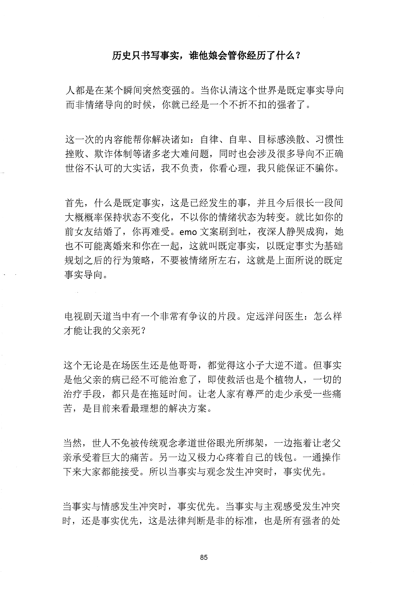
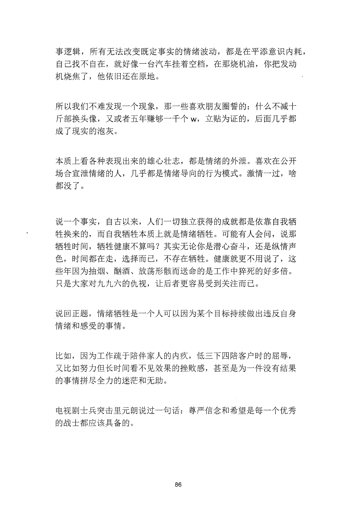
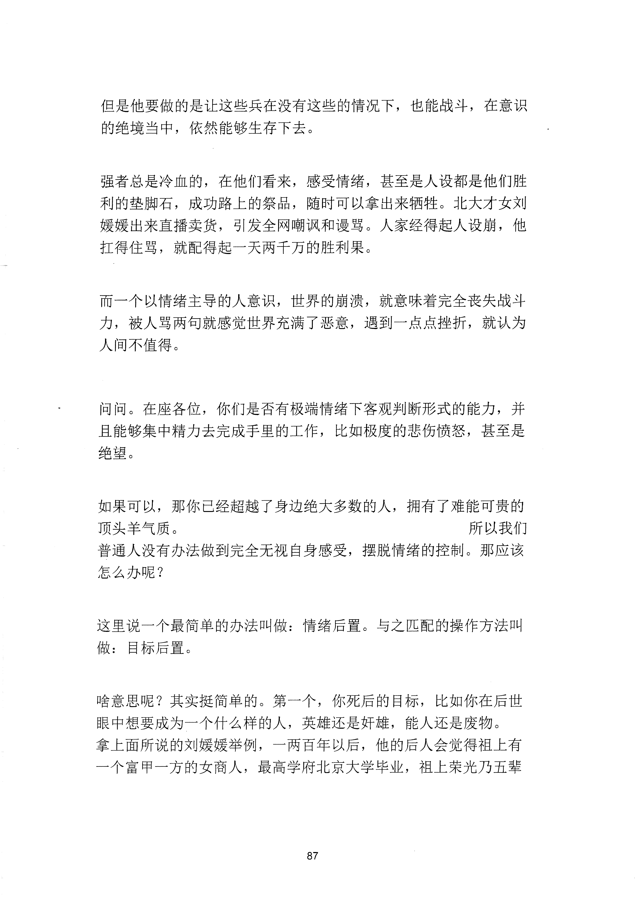
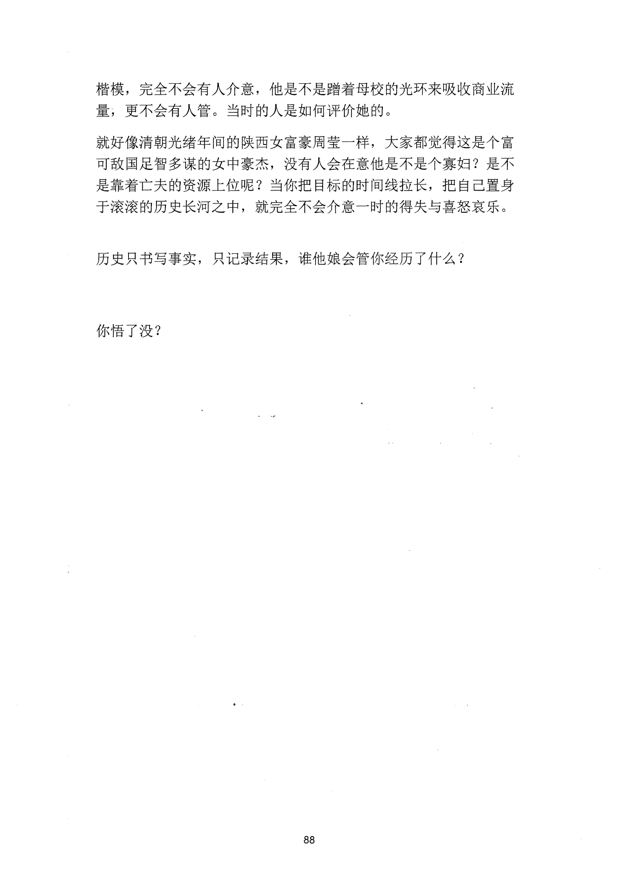

<!-- 原书第 92 页 -->

# 历史只书写事实，谁他娘会管你经历了什么？

人都是在某个瞬间突然变强的。当你认清这个世界是既定事实导向
而非情绪导向的时候，你就已经是一个不折不扣的强者了。
这一次的内容能帮你解决诸如：自律、自卑、目标感涣散、习惯性
挫败、欺诈体制等诸多老大难问题，同时也会涉及很多导向不正确
世俗不认可的大实话，我不负责，你看心理，我只能保证不骗你。
首先，什么是既定事实，这是已经发生的事，并且今后很长一段间
大概概率保持状态不变化，不以你的情绪状态为转变。就比如你的
前女友结婚了，你再难受。
emo 文案刷到吐，夜深人静哭成狗，她
也不可能离婚来和你在一起，这就叫既定事实，以既定事实为基础
规划之后的行为策略，不要被情绪所左右，这就是上面所说的既定
事实导向。
电视剧天道当中有一个非常有争议的片段。定远洋问医生：怎么样
才能让我的父亲死？
这个无论是在场医生还是他哥哥，都觉得这小子大逆不道。但事实
是他父亲的病已经不可能治愈了，即使救活也是个植物人，一切的
治疗手段，都只是在拖延时间。让老人家有尊严的走少承受一些痛
苦，是目前来看最理想的解决方案。
当然，世人不免被传统观念孝道世俗眼光所绑架，一边拖着让老父
亲承受着巨大的痛苦。另一边又极力心疼着自己的钱包。一通操作
下来大家都能接受。所以当事实与观念发生冲突时，事实优先。
当事实与情感发生冲突时，事实优先。当事实与主观感受发生冲突
时，还是事实优先，这是法律判断是非的标准，也是所有强者的处
85
更多kr66e9gs

<!-- source-image-start -->

查看原书第 92 页影像

<!-- source-image-end -->

<!-- 原书第 93 页 -->

事逻辑，所有无法改变既定事实的情绪波动，都是在平添意识内耗，
自己找不自在，就好像一台汽车挂着空档，在那烧机油，你把发动
机烧焦了，他依旧还在原地。
所以我们不难发现一个现象，那一些喜欢朋友圈誓的：什么不减十
斤部换头像，又或者五年赚够一千个W,
立贴为证的，后面几乎都
成了现实的泡灰。
本质上看各种表现出来的雄心壮志，都是情绪的外泄。喜欢在公开
场合宣泄情绪的人，几乎都是情绪导向的行为模式。激情一过，啥
都没了。
说一个事实，自古以来，人们一切独立获得的成就都是依靠自我牺
牲换来的，而自我牺牲本质上就是情绪牺牲。可能有人会问，说那
牺牲时间，牺牲健康不算吗？其实无论你是潜心奋斗，还是纵情声
色，时间都在走，选择而已，不存在牺牲。健康就更不用说了，这
些年因为抽烟、酗酒、放荡形骸而送命的是工作中猝死的好多倍。
只是大家对九九六的仇视，让后者更容易受到关注而已。
说回正题，情绪牺牲是一个入可以因为某个目标持续做出违反自身
情绪和感受的事情。
比如，因为工作疏于陪伴家人的内疚，低三下四陪客户时的屈辱，
又比如努力但长时间看不见效果的挫败感，甚至是为一件没有结果
的事情拼尽全力的迷茫和无助。
电视剧士兵突击里元朗说过一句话：尊严信念和希望是每一个优秀
的战士都应该具备的。
86
更多kr66e9gs

<!-- source-image-start -->

查看原书第 93 页影像

<!-- source-image-end -->

<!-- 原书第 94 页 -->

但是他要做的是让这些兵在没有这些的情况下，也能战斗，在意识
的绝境当中，依然能够生存下去。
强者总是冷血的，在他们看来，感受情绪，甚至是人设都是他们胜
利的垫脚石，成功路上的祭品，随时可以拿出来牺牲。北大才女刘
媛媛出来直播卖货，引发全网嘲讽和谩骂。人家经得起人设崩，他
扛得住骂，就配得起一天两千万的胜利果。
而一个以情绪主导的人意识，世界的崩溃，就意味着完全丧失战斗
力，被人骂两句就感觉世界充满了恶意，遇到一点点挫折，就认为
人间不值得。
问问。在座各位，你们是否有极端情绪下客观判断形式的能力，并
且能够集中精力去完成手里的工作，比如极度的悲伤愤怒，甚至是
绝望。
如果可以，那你已经超越了身边绝大多数的人，拥有了难能可贵的
顶头羊气质。
所以我们
普通人没有办法做到完全无视自身感受，摆脱情绪的控制。那应该
怎么办呢？
这里说一个最简单的办法叫做：情绪后置。与之匹配的操作方法叫
做：
目标后置。
啥意思呢？其实挺简单的。第一个，你死后的目标，比如你在后世
眼中想要成为一个什么样的人，英雄还是奸雄，能人还是废物。
拿上面所说的刘媛媛举例，一两百年以后，他的后人会觉得祖上有
一个富甲一方的女商人，最高学府北京大学毕业，祖上荣光乃五辈
87
更多kr66e9gs

<!-- source-image-start -->

查看原书第 94 页影像

<!-- source-image-end -->

<!-- 原书第 95 页 -->

楷模，完全不会有人介意，他是不是躇着母校的光环来吸收商业流
量，更不会有人管。当时的人是如何评价她的。
就好像清朝光绪年间的陕西女富豪周莹一样，大家都觉得这是个富
可敌国足智多谋的女中豪杰，没有人会在意他是不是个寡妇？是不
是靠着亡夫的资源上位呢？当你把目标的时间线拉长，把自己置身
于滚滚的历史长河之中，就完全不会介意一时的得失与喜怒哀乐。
历史只书写事实，只记录结果，谁他娘会管你经历了什么？
你悟了没？
88
更多kr66e9gs

<!-- source-image-start -->

查看原书第 95 页影像

<!-- source-image-end -->

<!-- 原书第 96 页 -->

更多kr66e9gs

<!-- source-image-start -->

查看原书第 96 页影像

<!-- source-image-end -->
