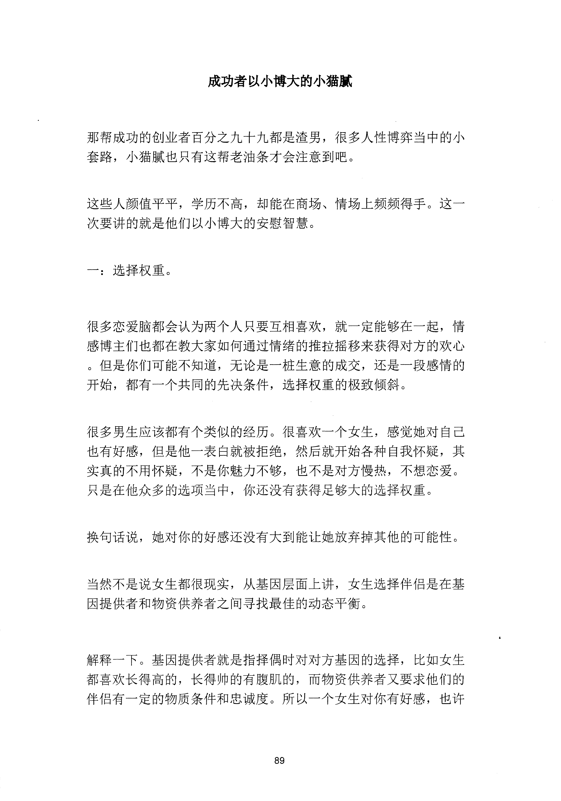
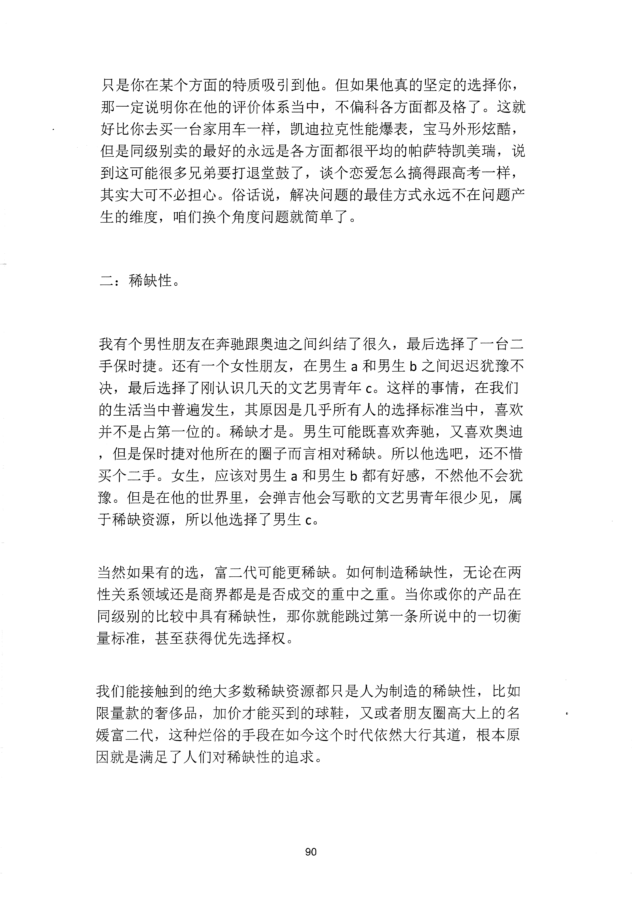
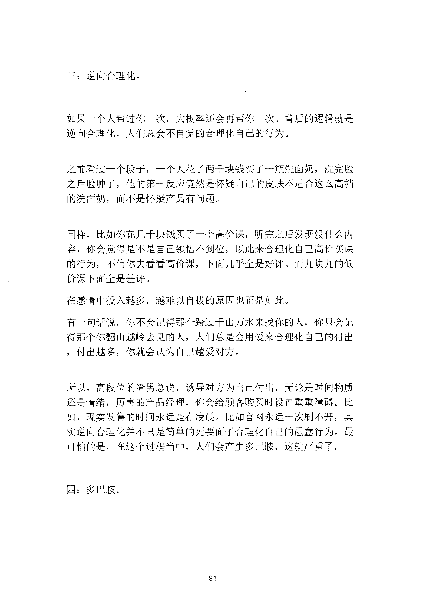
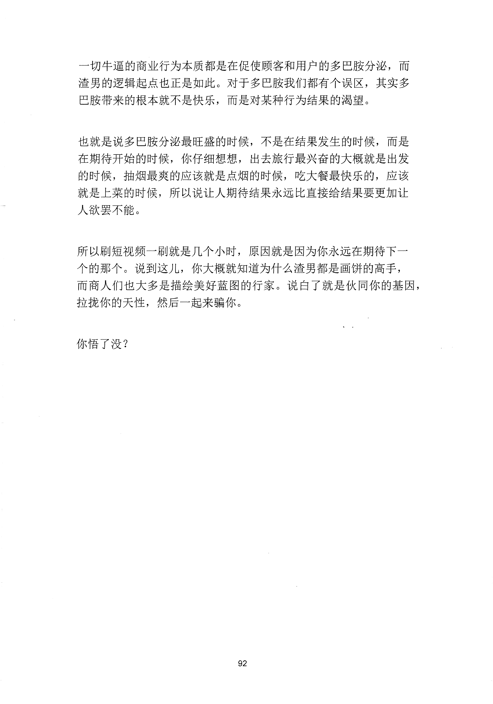

<!-- 原书第 97 页 -->

# 成功者以小博大的小猫腻

那帮成功的创业者百分之九十九都是渣男，很多人性博弈当中的小套路，小猫腻也只有这帮老油条才会注意到吧。

这些人颜值平平，学历不高，却能在商场、情场上频频得手。这一次要讲的就是他们以小博大的安慰智慧。

一：选择权重。

很多恋爱脑都会认为两个人只要互相喜欢，就一定能够在一起，情感博主们也都在教大家如何通过情绪的推拉摇移来获得对方的欢心。但是你们可能不知道，无论是一桩生意的成交，还是一段感情的开始，都有一个共同的先决条件，选择权重的极致倾斜。

很多男生应该都有个类似的经历。很喜欢一个女生，感觉她对自己也有好感，但是他一表臼就被拒绝，然后就开始各种自我怀疑，其实真的不用怀疑，不是你魅力不够，也不是对方慢热，不想恋爱。只是在他众多的选项当中，你还没有获得足够大的选择权重。

换句话说，她对你的好感还没有大到能让她放弃掉其他的可能性。

当然不是说女生都很现实，从基因层面上讲，女生选择伴侣是在基因提供者和物资供养者之间寻找最佳的动态平衡。

解释一下。基因提供者就是指择偶时对对方基因的选择，比如女生都喜欢长得高的，长得帅的有腹肌的，而物资供养者又要求他们的伴侣有一定的物质条件和忠诚度。所以一个女生对你有好感，也许

<!-- source-image-start -->

查看原书第 97 页影像

<!-- source-image-end -->
<!-- 原书第 98 页 -->

只是你在某个方面的特质吸引到他。但如果他真的坚定的选择你，那一定说明你在他的评价体系当中，不偏科各方面都及格了。这就好比你去买一台家用车一样，凯迪拉克性能爆表，宝马外形炫酷，但是同级别卖的最好的永远是各方面都很平均的帕萨特凯美瑞，说到这可能很多兄弟要打退堂鼓了，谈个恋爱怎么搞得跟高考一样，其实大可不必担心。俗话说，解决问题的最佳方式永远不在问题产生的维度，咱们换个角度问题就简单了。

二：稀缺性。

我有个男性朋友在奔驰跟奥迪之间纠结了很久，最后选择了一台二手保时捷。还有一个女性朋友，在男生a 和男生b 之间迟迟犹豫不决，最后选择了刚认识几天的文艺男青年c。这样的事情，在我们的生活当中普遍发生，其原因是几乎所有人的选择标准当中，喜欢并不是占第一位的。稀缺才是。男生可能既喜欢奔驰，又喜欢奥迪，但是保时捷对他所在的圈子而言相对稀缺。所以他选吧，还不惜买个二手。女生，应该对男生a 和男生b 都有好感，不然他不会犹豫。但是在他的世界里，会弹吉他会写歌的文艺男青年很少见，属于稀缺资源，所以他选择了男生c。

当然如果有的选，富二代可能更稀缺。如何制造稀缺性，无论在两性关系领域还是商界都是是否成交的重中之重。当你或你的产品在同级别的比较中具有稀缺性，那你就能跳过第一条所说中的一切衡量标准，甚至获得优先选择权。

我们能接触到的绝大多数稀缺资源都只是人为制造的稀缺性，比如限量款的奢侈品，加价才能买到的球鞋，又或者朋友圈高大上的名媛富二代，这种烂俗的手段在如今这个时代依然大行其道，根本原因就是满足了人们对稀缺性的追求。

<!-- source-image-start -->

查看原书第 98 页影像

<!-- source-image-end -->
<!-- 原书第 99 页 -->

三：逆向合理化。

如果一个人帮过你一次，大概率还会再帮你一次。背后的逻辑就是逆向合理化，人们总会不自觉的合理化自己的行为。

之前看过一个段子，一个人花了两千块钱买了一瓶洗面奶，洗完脸之后脸肿了，他的第一反应竞然是怀疑自己的皮肤不适合这么高档的洗面奶，而不是怀疑产品有问题。

同样，比如你花几千块钱买了一个高价课，听完之后发现没什么内容，你会觉得是不是自己领悟不到位，以此来合理化自己高价买课的行为，不信你去看看高价课，下面几乎全是好评。而九块九的低价课下面全是差评。在感情中投入越多，越难以自拔的原因也正是如此。有一句话说，你不会记得那个跨过于山万水来找你的人，你只会记得那个你翻山越岭去见的人，人们总是会用爱来合理化自己的付出，付出越多，你就会认为自己越爱对方。

所以，高段位的渣男总说，诱导对方为自己付出，无论是时间物质还是情绪，厉害的产品经理，你会给顾客购买时设置重重障碍。比如，现实发售的时间永远是在凌晨。比如官网永远一次刷不开，其实逆向合理化并不只是简单的死要面子合理化自己的愚蠢行为。最可怕的是，在这个过程当中，人们会产生多巴胺，这就严重了。

四：多巴胺。

<!-- source-image-start -->

查看原书第 99 页影像

<!-- source-image-end -->
<!-- 原书第 100 页 -->

一切牛逼的商业行为本质都是在促使顾客和用户的多巴胺分泌，而渣男的逻辑起点也正是如此。对千多巴胺我们都有个误区，其实多巴胺带来的根本就不是快乐，而是对某种行为结果的渴望。

也就是说多巴胺分泌最旺盛的时候，不是在结果发生的时候，而是在期待开始的时候，你仔细想想，出去旅行最兴奋的大概就是出发的时候，抽烟最爽的应该就是点烟的时候，吃大餐最快乐的，应该就是上菜的时候，所以说让人期待结果永远比直接给结果要更加让人欲罢不能。

所以刷短视频一刷就是几个小时，原因就是因为你永远在期待下一个的那个。说到这儿，你大概就知道为什么渣男都是画饼的高手，而商人们也大多是描绘美好蓝图的行家。说白了就是伙同你的基因，拉拢你的天性，然后一起来骗你。

你悟了没？

<!-- source-image-start -->

查看原书第 100 页影像

<!-- source-image-end -->
