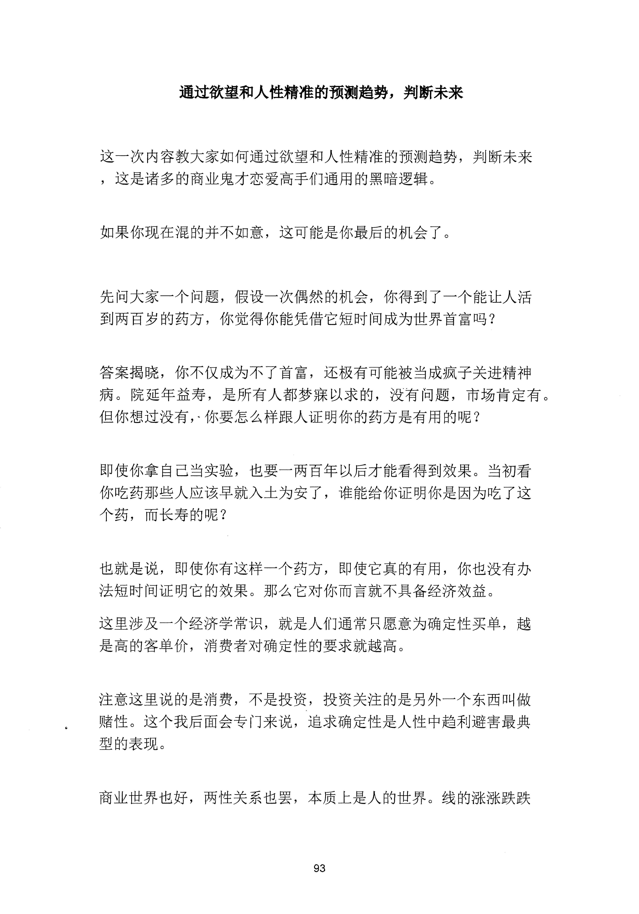
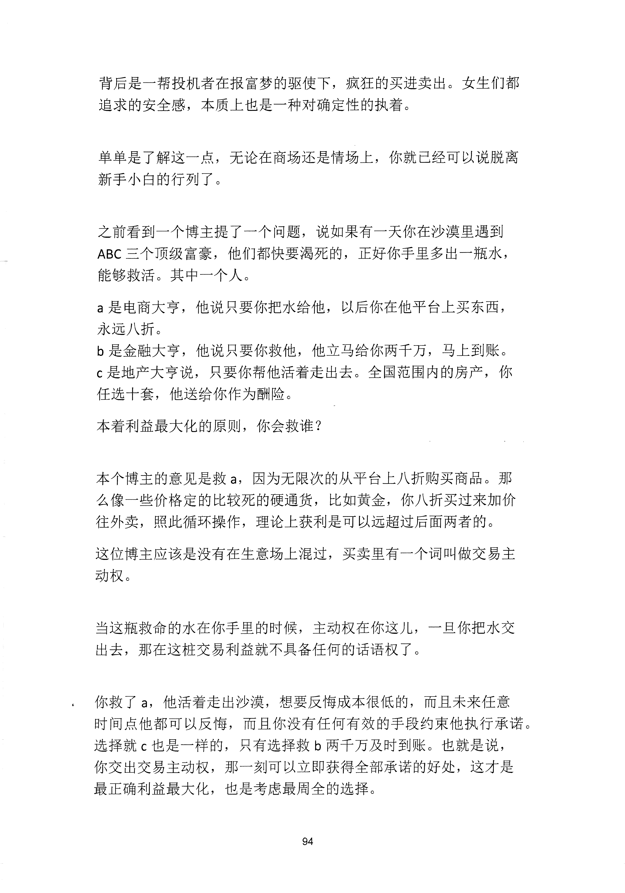
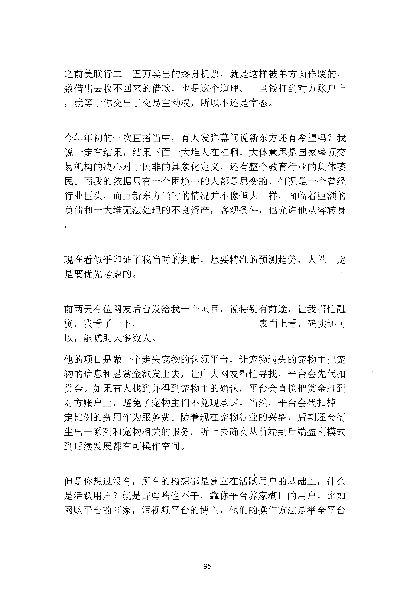
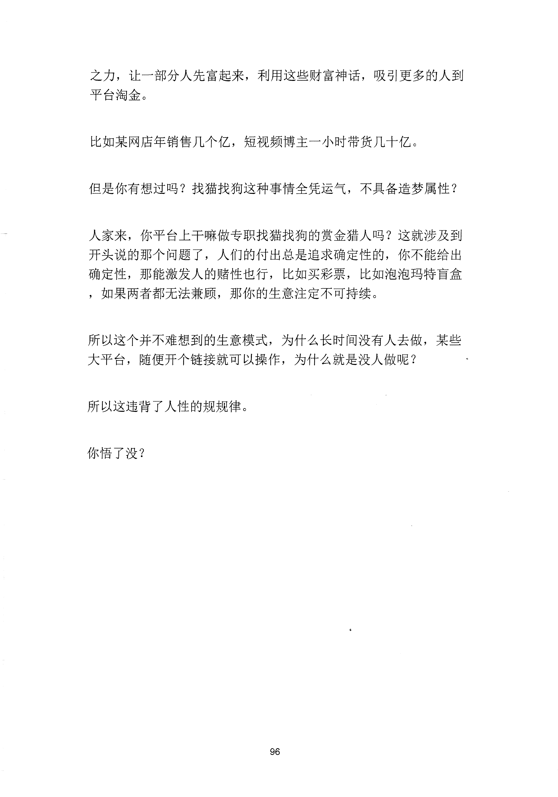

<!-- 原书第 101 页 -->

# 通过欲望和人性精准的预测趋势，判断未来

这一次内容教大家如何通过欲望和人性精准的预测趋势，判断未来
，这是诸多的商业鬼才恋爱高手们通用的黑暗逻辑。
如果你现在混的并不如意，这可能是你最后的机会了。
先问大家一个问题，假设一次偶然的机会，你得到了一个能让人活
到两百岁的药方，你觉得你能凭借它短时间成为世界首富吗？
答案揭晓，你不仅成为不了首富，还极有可能被当成疯子关进精神
病。院延年益寿，是所有人都梦寐以求的，没有问题，市场肯定有。
但你想过没有，＜你要怎么样跟人证明你的药方是有用的呢？
即使你拿自己当实验，也要一两百年以后才能看得到效果。当初看
你吃药那些人应该早就入土为安了，谁能给你证明你是因为吃了这
个药，而长寿的呢？
也就是说，即使你有这样一个药方，即使它真的有用，你也没有办
法短时间证明它的效果。那么它对你而言就不具备经济效益。
这里涉及一个经济学常识，就是人们通常只愿意为确定性买单，越
是高的客单价，消费者对确定性的要求就越高。
注意这里说的是消费，不是投资，投资关注的是另外一个东西叫做
赌性。这个我后面会专门来说，追求确定性是人性中趋利避害最典
型的表现。
商业世界也好，两性关系也罢，本质上是人的世界。线的涨涨跌跌
93
更多kr66e9gs

<!-- source-image-start -->

查看原书第 101 页影像

<!-- source-image-end -->

<!-- 原书第 102 页 -->

背后是一帮投机者在报富梦的驱使下，疯狂的买进卖出。女生们都
追求的安全感，本质上也是一种对确定性的执着。
单单是了解这一点，无论在商场还是情场上，你就已经可以说脱离
新手小白的行列了。
之前看到一个博主提了一个问题，说如果有一天你在沙漠里遇到
ABC 三个顶级富豪，他们都快要渴死的，正好你手里多出一瓶水，
能够救活。其中一个人。
a 是电商大亨，他说只要你把水给他，以后你在他平台上买东西，
永远八折。
b 是金融大亨，他说只要你救他，他立马给你两于万，马上到账。
c 是地产大亨说，只要你帮他活着走出去。全国范围内的房产，你
任选十套，他送给你作为酬险。
本着利益最大化的原则，你会救谁？
本个博主的意见是救a,
因为无限次的从平台上八折购买商品。那
么像一些价格定的比较死的硬通货，比如黄金，你八折买过来加价
往外卖，照此循环操作，理论上获利是可以远超过后面两者的。
这位博主应该是没有在生意场上混过，买卖里有一个词叫做交易主
动权。
当这瓶救命的水在你手里的时候，主动权在你这儿，一旦你把水交
出去，那在这桩交易利益就不具备任何的话语权了。
你救了a,
他活着走出沙漠，想要反悔成本很低的，而且未来任意
时间点他都可以反悔，而且你没有任何有效的手段约束他执行承诺。
选择就c 也是一样的，只有选择救b 两千万及时到账。也就是说，
你交出交易主动权，那一刻可以立即获得全部承诺的好处，这才是
最正确利益最大化，也是考虑最周全的选择。
94
更多kr66e9gs

<!-- source-image-start -->

查看原书第 102 页影像

<!-- source-image-end -->

<!-- 原书第 103 页 -->

之前美联行二十五万卖出的终身机票，就是这样被单方面作废的，
数借出去收不回来的借款，也是这个道理。一旦钱打到对方账户上
，就等于你交出了交易主动权，所以不还是常态。
今年年初的一次直播当中，有人发弹幕问说新东方还有希望吗？我
说一定有结果，结果下面一大堆人在杠啊，大体意思是国家整顿交
易机构的决心对于民非的具象化定义，还有整个教育行业的集体萎
民。而我的依据只有一个困境中的人都是思变的，何况是一个曾经
行业巨头，而且新东方当时的情况并不像恒大一样，面临着巨额的
负债和一大堆无法处理的不良资产，客观条件，也允许他从容转身
现在看似乎印证了我当时的判断，想要精准的预测趋势，人性一定
是要优先考虑的。
前两天有位网友后台发给我一个项目，说特别有前途，让我帮忙融
资。我看了一下，
表面上看，确实还可
以，能唬助大多数人。
他的项目是做一个走失宠物的认领平台，让宠物遗失的宠物主把宠
物的信息和悬赏金额发上去，让广大网友帮忙寻找，平台会先代扣
赏金。如果有人找到并得到宠物主的确认，平台会直接把赏金打到
对方账户上，避免了宠物主们不兑现承诺。当然，平台会代扣掉一
定比例的费用作为服务费。随着现在宠物行业的兴盛，后期还会衍
生出一系列和宠物相关的服务。听上去确实从前端到后端盈利模式
到后续发展都有可操作空间。
但是你想过没有，所有的构想都是建立在活跃用户的基础上，什么
是活跃用户？就是那些啥也不干，靠你平台养家糊口的用户。比如
网购平台的商家，短视频平台的博主，他们的操作方法是举全平台
95
更多kr66e9gs

<!-- source-image-start -->

查看原书第 103 页影像

<!-- source-image-end -->

<!-- 原书第 104 页 -->

之力，让一部分人先富起来，利用这些财富神话，吸引更多的人到
平台淘金。
比如某网店年销售几个亿，短视频博主一小时带货几十亿。
但是你有想过吗？找猫找狗这种事情全凭运气，不具备造梦属性？
人家来，你平台上干嘛做专职找猫找狗的赏金猎人吗？这就涉及到
开头说的那个问题了，人们的付出总是追求确定性的，你不能给出
确定性，那能激发人的赌性也行，比如买彩票，比如泡泡玛特盲盒
，如果两者都无法兼顾，那你的生意注定不可持续。
所以这个并不难想到的生意模式，为什么长时间没有人去做，某些
大平台，随便开个链接就可以操作，为什么就是没入做呢？
所以这违背了人性的规规律。
你悟了没？
96
更多kr66e9gs

<!-- source-image-start -->

查看原书第 104 页影像

<!-- source-image-end -->
