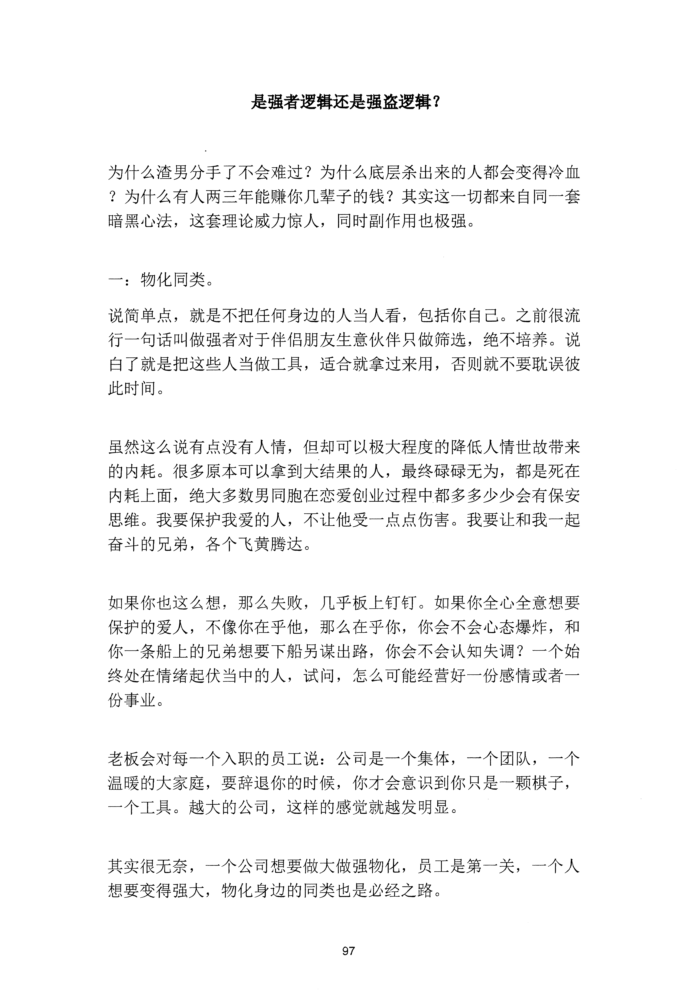
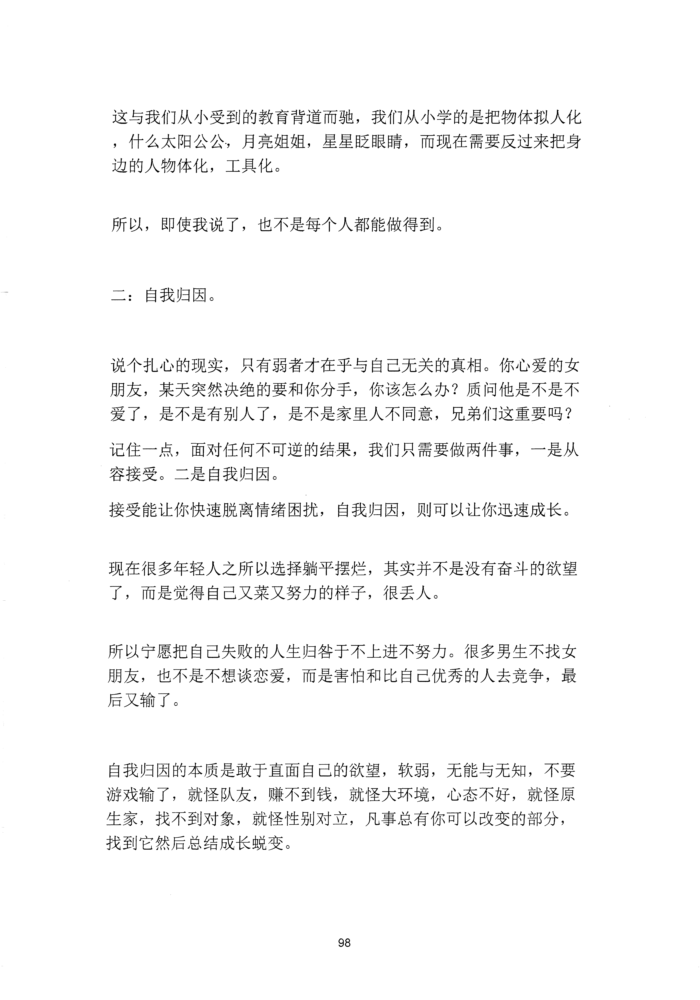
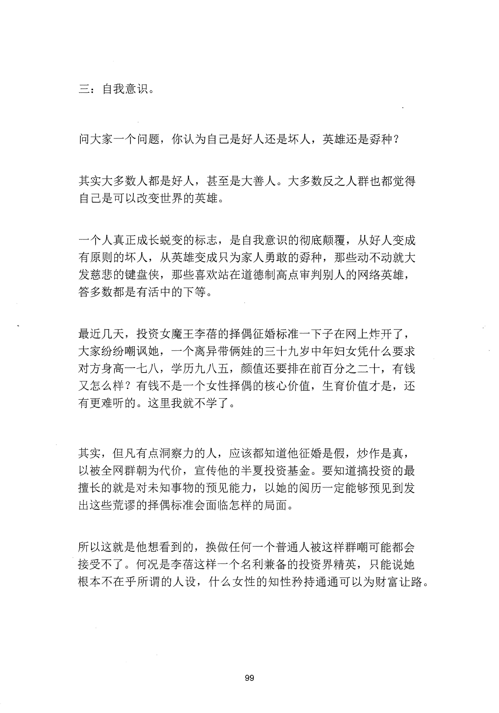
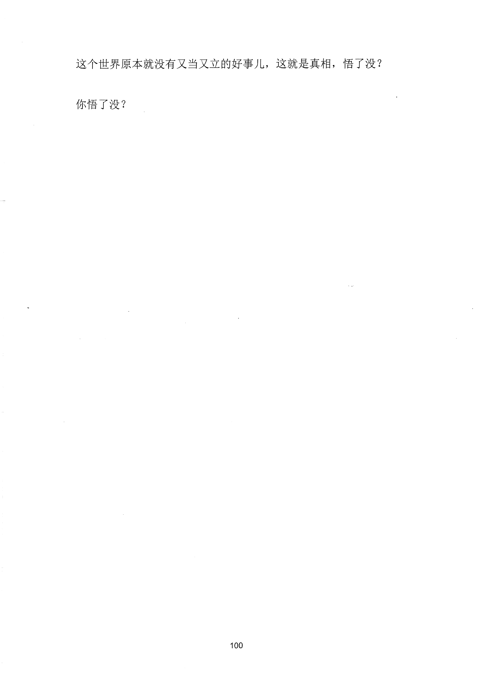

<!-- 原书第 105 页 -->

# 是强者逻辑还是强盗逻辑？

为什么渣男分手了不会难过？为什么底层杀出来的人都会变得冷血
？为什么有人两三年能赚你几辈子的钱？其实这一切都来自同一套
暗黑心法，这套理论威力惊人，同时副作用也极强。
一：物化同类。
说简单点，就是不把任何身边的人当人看，包括你自己。之前很流
行一句话叫做强者对于伴侣朋友生意伙伴只做筛选，绝不培养。说
白了就是把这些人当做工具，适合就拿过来用，否则就不要耽误彼
此时间。
虽然这么说有点没有人情，但却可以极大程度的降低人情世故带来
的内耗。很多原本可以拿到大结果的人，最终碌碌无为，都是死在
内耗上面，绝大多数男同胞在恋爱创业过程中都多多少少会有保安
思维。我要保护我爱的人，不让他受一点点伤害。我要让和我一起
奋斗的兄弟，各个飞黄腾达。
如果你也这么想，那么失败，几乎板上钉钉。如果你全心全意想要
保护的爱人，不像你在乎他，那么在乎你，你会不会心态爆炸，和
你一条船上的兄弟想要下船另谋出路，你会不会认知失调？一个始
终处在情绪起伏当中的人，试问，怎么可能经营好一份感情或者一
份事业。
老板会对每一个入职的员工说：公司是一个集体，一个团队，一个
温暖的大家庭，要辞退你的时候，你才会意识到你只是一颗棋子，
一个工具。越大的公司，这样的感觉就越发明显。
其实很无奈，一个公司想要做大做强物化，员工是第一关，一个人
想要变得强大，物化身边的同类也是必经之路。
97
更多kr66e9gs

<!-- source-image-start -->

查看原书第 105 页影像

<!-- source-image-end -->

<!-- 原书第 106 页 -->

这与我们从小受到的教育背道而驰，我们从小学的是把物体拟人化
，什么太阳公公，月亮姐姐，星星眨眼睛，而现在需要反过来把身
边的人物体化，工具化。
所以，即使我说了，也不是每个人都能做得到。
二：自我归因。
说个扎心的现实，只有弱者才在乎与自已无关的真相。你心爱的女
朋友，某天突然决绝的要和你分手，你该怎么办？质问他是不是不
爱了，是不是有别人了，是不是家里人不同意，兄弟们这重要吗？
记住一点，面对任何不可逆的结果，我们只需要做两件事，一是从
容接受。二是自我归因。
接受能让你快速脱离情绪困扰，自我归因，则可以让你迅速成长。
现在很多年轻人之所以选择躺平摆烂，其实并不是没有奋斗的欲望
了，而是觉得自己又菜又努力的样子，很丢人。
所以宁愿把自已失败的人生归咎于不上进不努力。很多男生不找女
朋友，也不是不想谈恋爱，而是害怕和比自己优秀的人去竞争，最
后又输了。
自我归因的本质是敢于直面自己的欲望，软弱，无能与无知，不要
游戏输了，就怪队友，赚不到钱，就怪大环境，心态不好，就怪原
生家，找不到对象，就怪性别对立，凡事总有你可以改变的部分，
找到它然后总结成长蜕变。
98
更多kr66e9gs

<!-- source-image-start -->

查看原书第 106 页影像

<!-- source-image-end -->

<!-- 原书第 107 页 -->

三：自我意识。
问大家一个问题，你认为自己是好人还是坏人，英雄还是群种？
其实大多数人都是好人，甚至是大善人。大多数反之人群也都觉得
自己是可以改变世界的英雄。
一个人真正成长蜕变的标志，是自我意识的彻底颠覆，从好人变成
有原则的坏人，从英雄变成只为家人勇敢的秀种，那些动不动就大
发慈悲的键盘侠，那些喜欢站在道德制高点审判别人的网络英雄，
答多数都是有活中的下等。
最近几天，投资女魔王李蓿的择偶征婚标准一下子在网上怍开了，
大家纷纷嘲讽她，一个离异带俩娃的三十九岁中年妇女凭什么要求
对方身高一七八，学历九八五，颜值还要排在前百分之二十，有钱
又怎么样？有钱不是一个女性择偶的核心价值，生育价值才是，还
有更难听的。这里我就不学了。
其实，但凡有点洞察力的人，应该都知道他征婚是假，炒作是真，
以被全网群朝为代价，宣传他的半夏投资基金。要知道搞投资的最
擅长的就是对未知事物的预见能力，以她的阅历一定能够预见到发
出这些荒谬的择偶标准会面临怎样的局面。
所以这就是他想看到的，换做任何一个普通人被这样群嘲可能都会
接受不了。何况是李蓿这样一个名利兼备的投资界精英，只能说她
根本不在乎所谓的人设，什么女性的知性矜持通通可以为财富让路。
99
更多kr66e9gs

<!-- source-image-start -->

查看原书第 107 页影像

<!-- source-image-end -->

<!-- 原书第 108 页 -->

这个世界原本就没有又当又立的好事儿，这就是真相，悟了没？
你悟了没？
100
更多kr66e9gs

<!-- source-image-start -->

查看原书第 108 页影像

<!-- source-image-end -->
