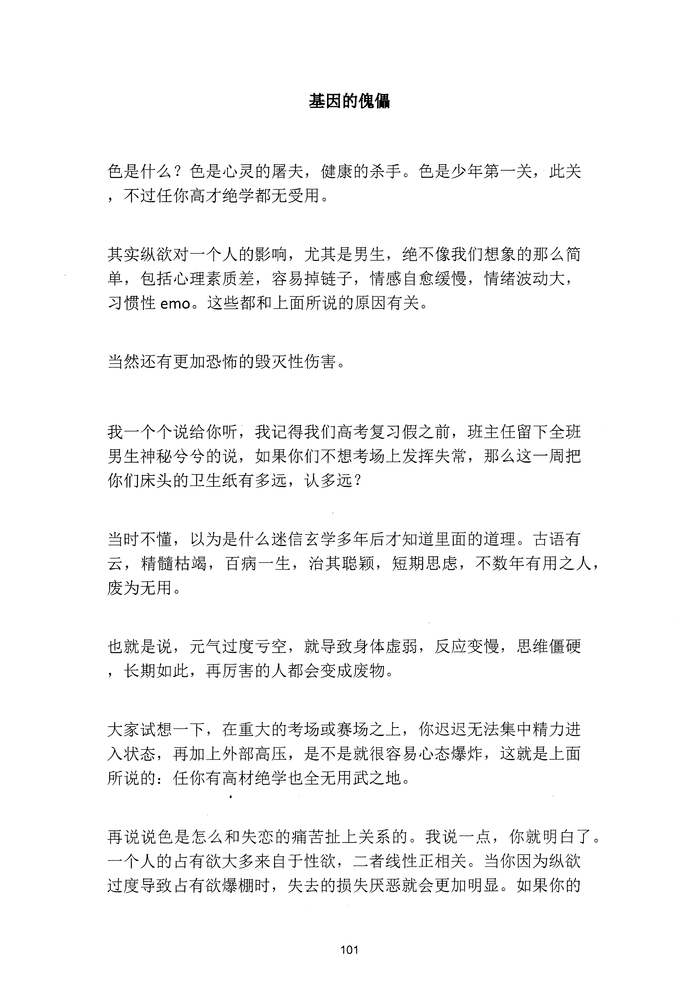
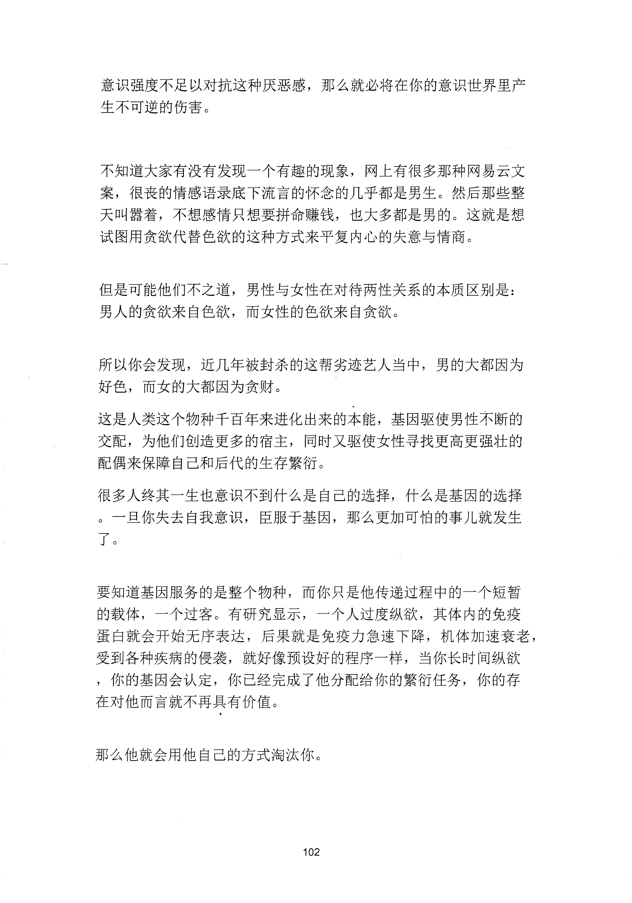
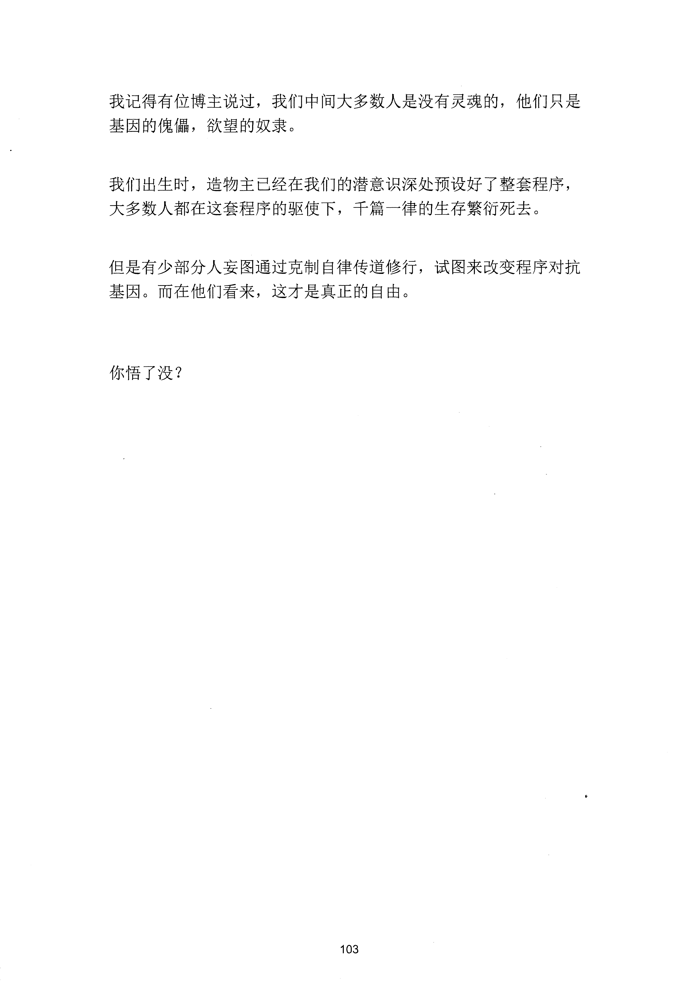

<!-- 原书第 109 页 -->

# 基因的傀儡

色是什么？色是心灵的屠夫，健康的杀手。色是少年第一关，此关，不过任你高才绝学都无受用。

其实纵欲对一个人的影响，尤其是男生，绝不像我们想象的那么简单，包括心理素质差，容易掉链子，情感自愈缓慢，情绪波动大，习惯性emo。这些都和上面所说的原因有关。

当然还有更加恐怖的毁灭性伤害。

我一个个说给你听，我记得我们高考复习假之前，班主任留下全班男生神秘兮兮的说，如果你们不想考场上发挥失常，那么这一周把你们床头的卫生纸有多远，认多远？

当时不懂，以为是什么迷信玄学多年后才知道里面的道理。古语有云，精髓枯竭，百病一生，治其聪颖，短期思虑，不数年有用之人，废为无用。

也就是说，元气过度亏空，就导致身体虚弱，反应变慢，思维僵硬，长期如此，再厉害的人都会变成废物。

大家试想一下，在重大的考场或赛场之上，你迟迟无法集中精力进入状态，再加上外部高压，是不是就很容易心态爆炸，这就是上面所说的：任你有高材绝学也全无用武之地。

再说说色是怎么和失恋的痛苦扯上关系的。我说一点，你就明白了。一个人的占有欲大多来自于性欲，二者线性正相关。当你因为纵欲过度导致占有欲爆棚时，失去的损失厌恶就会更加明显。如果你的

<!-- source-image-start -->

查看原书第 109 页影像

<!-- source-image-end -->
<!-- 原书第 110 页 -->

意识强度不足以对抗这种厌恶感，那么就必将在你的意识世界里产生不可逆的伤害。

不知道大家有没有发现一个有趣的现象，网上有很多那种网易云文案，很丧的清感语录底下流言的怀念的几乎都是男生。然后那些整天叫嚣着，不想感情只想要拼命赚钱，也大多都是男的。这就是想试招用贪欲代替色欲的这种方式来平复内心的失意与情商。

但是可能他们不之道，男性与女性在对待两性关系的本质区别是：男人的贪欲来自色欲，而女性的色欲来自贪欲。

所以你会发现，近几年被封杀的这帮劣迹艺人当中，男的大都因为好色，而女的大都因为贪财。这是人类这个物种千百年来进化出来的本能，基因驱使男性不断的交配，为他们创造更多的宿主，同时又驱使女性寻找更高更强壮的配偶来保障自己和后代的生存繁衍。很多人终其一生也意识不到什么是自己的选择，什么是基因的选择。一旦你失去自我意识，臣服于基因，那么更加可怕的事儿就发生了。

要知道基因服务的是整个物种，而你只是他传递过程中的一个短暂的载体，一个过客。有研究显示，一个人过度纵欲，其体内的免疫蛋臼就会开始无序表达，后果就是免疫力急速下降，机体加速衰老，受到各种疾病的侵袭，就好像预设好的程序一样，当你长时间纵欲，你的基因会认定，你已经完成了他分配给你的繁衍任务，你的存在对他而言就不再具有价值。

那么他就会用他自己的方式淘汰你。

<!-- source-image-start -->

查看原书第 110 页影像

<!-- source-image-end -->
<!-- 原书第 111 页 -->

我记得有位博主说过，我们中间大多数人是没有灵魂的，他们只是基因的傀儡，欲望的奴隶。

我们出生时，造物主已经在我们的潜意识深处预设好了整套程序，大多数人都在这套程序的驱使下，千篇一律的生存繁衍死去。

但是有少部分人妄图通过克制自律传道修行，试图来改变程序对抗基因。而在他们看来，这才是真正的自由。

你悟了没？

<!-- source-image-start -->

查看原书第 111 页影像

<!-- source-image-end -->
