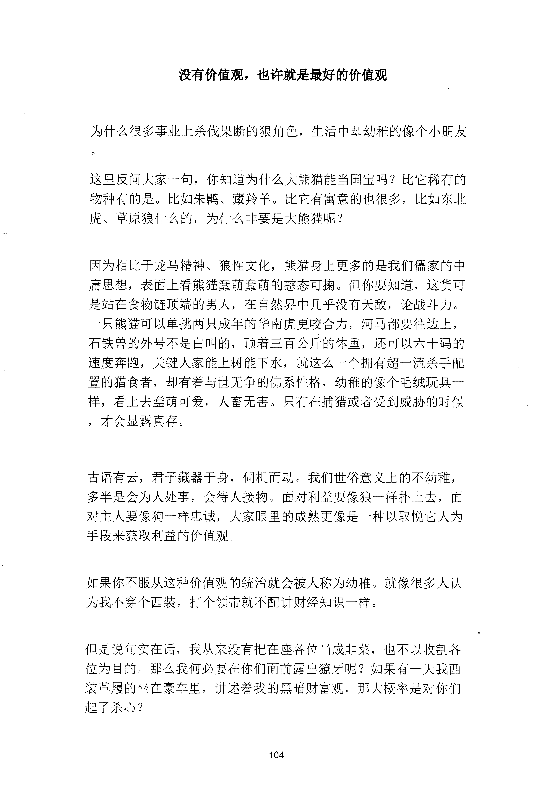
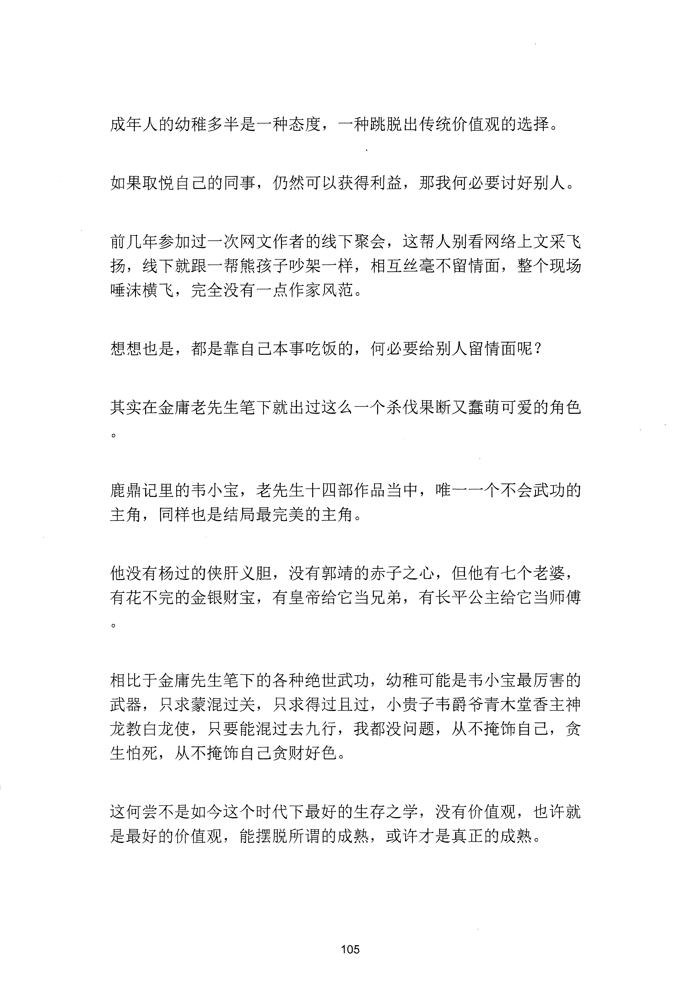
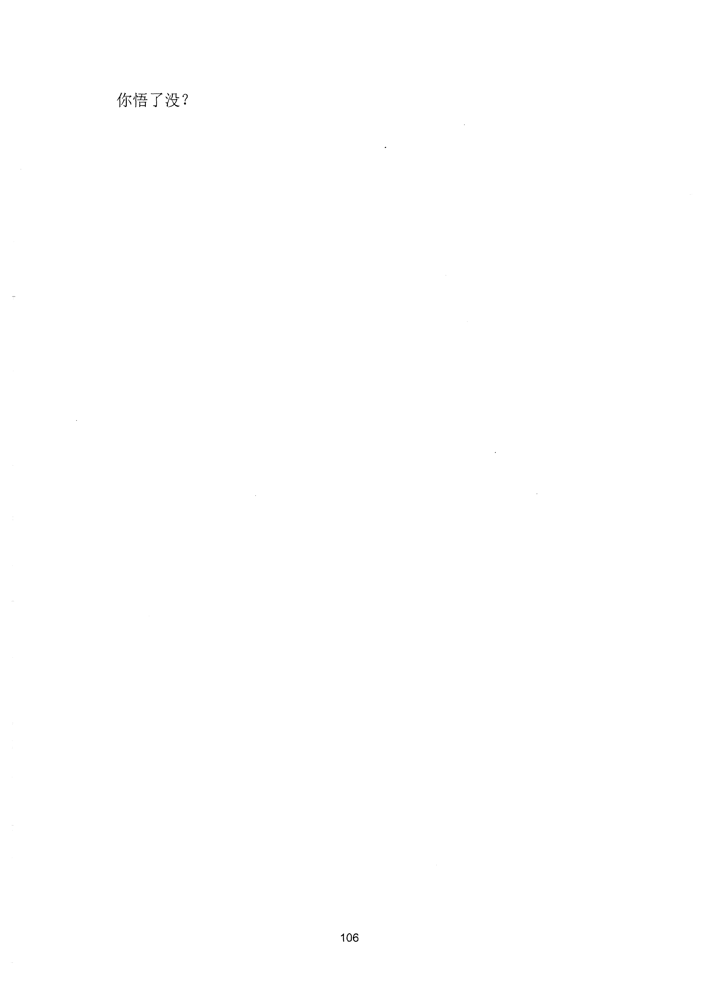

<!-- 原书第 112 页 -->

# 没有价值观，也许就是最好的价值观

为什么很多事业上杀伐果断的狠角色，生活中却幼稚的像个小朋友

这里反问大家一句，你知道为什么大熊猫能当国宝吗？比它稀有的物种有的是。比如朱鹦、藏羚羊。比它有寓意的也很多，比如东北虎、草原狼什么的，为什么非要是大熊猫呢？

因为相比于龙马精神、狼性文化，熊猫身上更多的是我们儒家的中庸思想，表面上看熊猫蠢萌蠢萌的憋态可拘。但你要知道，这货可是站在食物链顶端的男人，在自然界中几乎没有天敌，论战斗力。一只熊猫可以单挑两只成年的华南虎更咬合力，河马都要往边上，石铁兽的外号不是白叫的，顶着三百公斤的体重，还可以六十码的速度奔跑，关键人家能上树能下水，就这么一个拥有超一流杀手配置的猎食者，却有着与世无争的佛系性格，幼稚的像个毛绒玩具一样，看上去蠢萌可爱，人畜无害。只有在捕猎或者受到威胁的时候，才会显露真存。

古语有云，君子藏器于身，伺机而动。我们世俗意义上的不幼稚，多半是会为入处事，会待人接物。面对利益要像狼一样扑上去，面对主人要像狗一样忠诚，大家眼里的成熟更像是一种以取悦它人为手段来获取利益的价值观。

如果你不服从这种价值观的统治就会被人称为幼稚。就像很多人认为我不穿个西装，打个领带就不配讲财经知识一样。

但是说旬实在话，我从来没有把在座各位当成韭菜，也不以收割各位为目的。那么我何必要在你们面前露出撩牙呢？如果有一天我西装革履的坐在豪车里，讲述着我的黑暗财富观，那大概率是对你们起了杀心？

<!-- source-image-start -->

查看原书第 112 页影像

<!-- source-image-end -->
<!-- 原书第 113 页 -->

成年人的幼稚多半是一种态度，一种跳脱出传统价值观的选择。

如果取悦自己的同事，仍然可以获得利益，那我何必要讨好别人。

前几年参加过一次网文作者的线下聚会，这帮人别看网络上文采飞扬，线下就跟一帮熊孩子吵架一样，相互丝毫不留情面，整个现场唾沫横飞，完全没有一点作家风范。

想想也是，都是靠自己本事吃饭的，何必要给别人留情面呢？

其实在金庸老先生笔下就出过这么一个杀伐果断又蠢萌可爱的角色

鹿鼎记里的韦小宝，老先生十四部作品当中，唯一一个不会武功的主角，同样也是结局最完美的主角。

他没有杨过的侠肝义胆，没有郭靖的赤子之心，但他有七个老婆，有花不完的金银财宝，有皇帝给它当兄弟，有长平公主给它当师傅

相比于金庸先生笔下的各种绝世武功，幼稚可能是韦小宝最厉害的武器，只求蒙混过关，只求得过且过，小贵子韦爵爷青木堂香主神龙教白龙使，只要能混过去九行，我都没问题，从不掩饰自己，贪生怕死，从不掩饰自己贪财好色。

这何尝不是如今这个时代下最好的生存之学，没有价值观，也许就是最好的价值观，能摆脱所谓的成熟，或许才是真正的成熟。

<!-- source-image-start -->

查看原书第 113 页影像

<!-- source-image-end -->
<!-- 原书第 114 页 -->

你悟了没？

<!-- source-image-start -->

查看原书第 114 页影像

<!-- source-image-end -->
