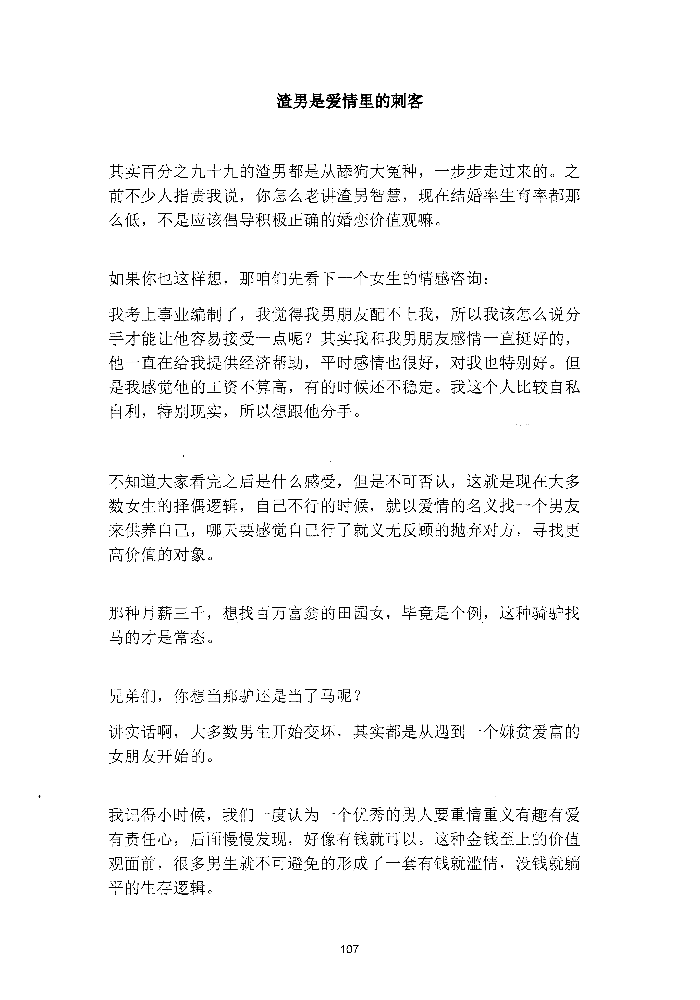
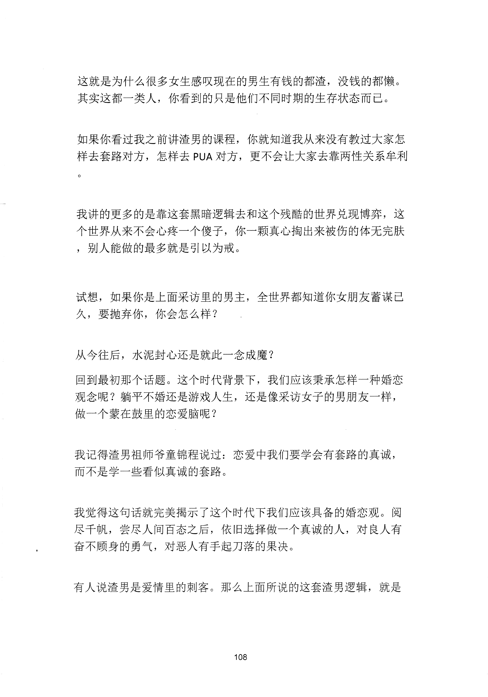
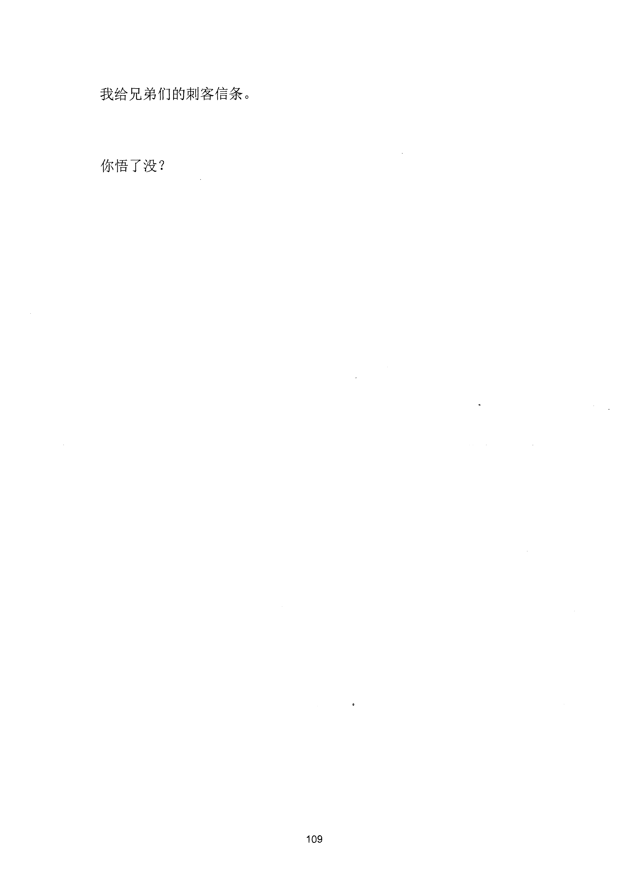

<!-- 原书第 115 页 -->

# 渣男是爱情里的刺客

其实百分之九十九的渣男都是从婖狗大冤种，一步步走过来的。之
前不少人指责我说，你怎么老讲渣男智慧，现在结婚率生育率都那
么低，不是应该倡导积极正确的婚恋价值观嘛。
如果你也这样想，那咱们先看下一个女生的情感咨询：
我考上事业编制了，我觉得我男朋友配不上我，所以我该怎么说分
手才能让他容易接受一点呢？其实我和我男朋友感清一直挺好的，
他一直在给我提供经济帮助，平时感情也很好，对我也特别好。但
是我感觉他的工资不算高，有的时候还不稳定。我这个人比较自私
自利，特别现实，所以想跟他分手。
不知道大家看完之后是什么感受，但是不可否认，这就是现在大多
数女生的择偶逻辑，自己不行的时候，就以爱情的名义找一个男友
来供养自己，哪天要感觉自己行了就义无反顾的抛弃对方，寻找更
高价值的对象。
那种月薪三于，想找百万富翁的田园女，毕竟是个例，这种骑驴找
马的才是常态。
兄弟们，你想当那驴还是当了马呢？
讲实话啊，大多数男生开始变坏，其实都是从遇到一个嫌贫爱富的
女朋友开始的。
我记得小时候，我们一度认为一个优秀的男人要重情重义有趣有爱
有责任心，后面慢慢发现，好像有钱就可以。这种金钱至上的价值
观面前，很多男生就不可避免的形成了一套有钱就滥情，没钱就躺
平的生存逻辑。
107
更多kr66e9gs

<!-- source-image-start -->

查看原书第 115 页影像

<!-- source-image-end -->

<!-- 原书第 116 页 -->

这就是为什么很多女生感叹现在的男生有钱的都渣，没钱的都懒。
其实这都一类人，你看到的只是他们不同时期的生存状态而已。
如果你看过我之前讲渣男的课程，你就知道我从来没有教过大家怎
样去套路对方，怎样去PUA 对方，更不会让大家去靠两性关系牟利
我讲的更多的是靠这套黑暗逻辑去和这个残酷的世界兑现博弈，这
个世界从来不会心疼一个傻子，你一颗真心掏出来被伤的体无完肤
，别人能做的最多就是引以为戒。
试想，如果你是上面采访里的男主，全世界都知道你女朋友蓄谋已
久，要抛弃你，你会怎么样？
从今往后，水泥封心还是就此一念成魔？
回到最初那个话题。这个时代背景下，我们应该秉承怎样一种婚恋
观念呢？躺平不婚还是游戏人生，还是像采访女子的男朋友一样，
做一个蒙在鼓里的恋爱脑呢？
我记得渣男祖师爷童锦程说过：恋爱中我们要学会有套路的真诚，
而不是学一些看似真诚的套路。
我觉得这句话就完美揭示了这个时代下我们应该具备的婚恋观。阅
尽千帆，尝尽人间百态之后，依旧选择做一个真诚的人，对良人有
奋不顾身的勇气，对恶人有手起刀落的果决。
有人说渣男是爱情里的刺客C
那么上面所说的这套渣男逻辑，就是
108
更多kr66e9gs

<!-- source-image-start -->

查看原书第 116 页影像

<!-- source-image-end -->

<!-- 原书第 117 页 -->

我给兄弟们的刺客信条。
你悟了没？
109
更多kr66e9gs

<!-- source-image-start -->

查看原书第 117 页影像

<!-- source-image-end -->
