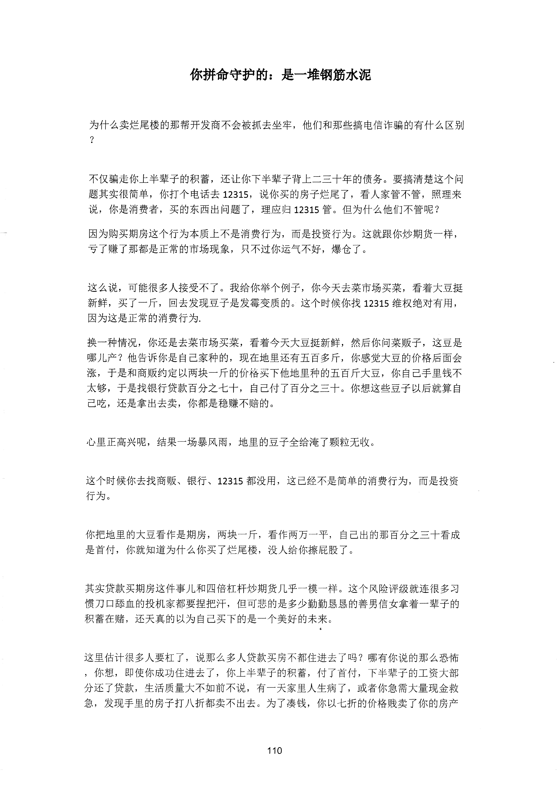
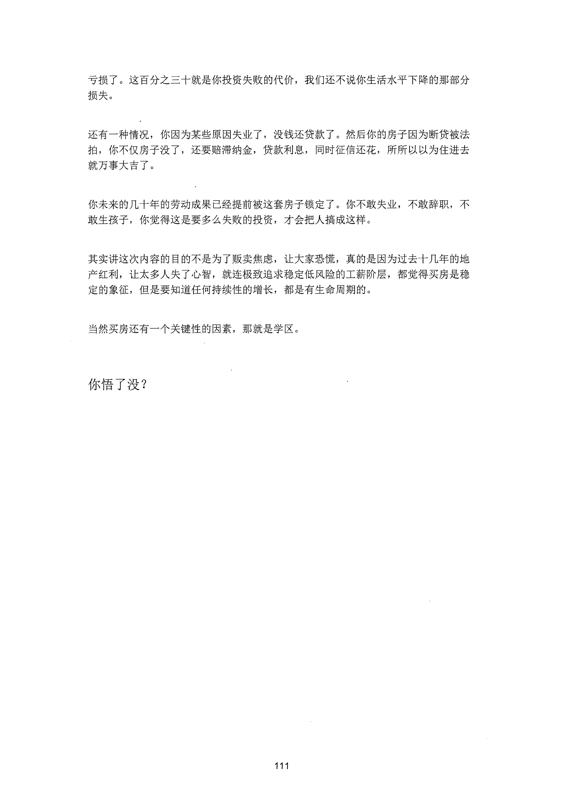

<!-- 原书第 118 页 -->

# 你拼命守护的：是一堆钢筋水泥

为什么卖烂尾楼的那帮开发商不会被抓去坐牢，他们和那些搞电信诈骗的有什么区别？·

不仅骗走你上半辈子的积蓄，还让你下半辈子背上二三十年的债务。要搞清楚这个问题其实很简单，你打个电话去12315,

说你买的房子烂尾了，看人家管不管，照理来说，你是消费者，买的东西出问题了，理应归12315 管。但为什么他们不管呢？因为购买期房这个行为本质上不是消费行为，而是投资行为。这就跟你炒期货一样，亏了赚了那都是正常的市场现象，只不过你运气不好，爆仓了。

这么说，可能很多人接受不了。我给你举个例子，你今天去菜市场买菜，看着大豆挺新鲜，买了一斤，回去发现豆子是发霉变质的。这个时候你找12315 维权绝对有用，因为这是正常的消费行为．换一种情况，你还是去菜市场买菜，看着今天大豆挺新鲜，然后你问菜贩子，这豆是哪儿产？他告诉你是自己家种的，现在地里还有五百多斤，你感觉大豆的价格后面会涨，于是和商贩约定以两块一斤的价裕头下他地里种的五百斤大豆，你自己手里钱不太够，于是找银行贷款百分之七十，自己付了百分之三十。你想这些豆子以后就算自己吃，还是拿出去卖，你都是稳赚不赔的。

心里正高兴呢，结果一场暴风雨，地里的豆子全给淹了颗粒无收。

这个时候你去找商贩、银行、

12315 都没用，这已经不是简单的消费行为，而是投资行为。

你把地里的大豆看作是期房，两块一斤，看作两万｀，平，自己出的那百分之二十看成是首付，你就知道为什么你买了烂尾楼，没人给你擦屁股了e

其实贷款买期房这件事儿和四倍杠杆炒期货几乎一模一样。这个风险评级就连很多习惯刀口膀血的投机家都要捏把汗，但可悲的是多少勤勤恳恳的善男信女拿着一辈子的积蓿在赌，还天真的以为自己买下的是一个美好的未来。

这里估计很多人要杠了，说那么多人贷款买房不都住进去了吗？哪有你说的那么恐怖，你想，即使你成功住进去了，你上半辈子的积蓄，付了首付，下半辈子的工资大部分还了贷款，生活质量大不如前不说，有一天家里人生病了，或者你急需大量现金救急，发现手里的房子打八折都卖不出去e 为了凑钱，你以七折的价格贱卖了你的房产

<!-- source-image-start -->

查看原书第 118 页影像

<!-- source-image-end -->
<!-- 原书第 119 页 -->

亏损了。这百分之三十就是你投资失败的代价，我们还不说你生活水平下降的那部分损失。

还有一种情况，你因为某些原因失业了，没钱还贷款了。然后你的房子因为断贷被法拍，你不仅房子没了，还要赔滞纳金，贷款利息，同时征信还花，所所以以为住进去就万事大吉了。

你未来的几十年的劳动成果已经提前被这套房子锁定了。你不敢失业，不敢辞职，不敢生孩子，你觉得这是要多么失败的投资，才会把人搞成这样。

其实讲这次内容的目的不是为了贩卖焦虑，让大家恐慌，真的是因为过去十几年的地产红利，让太多人失了心智，就连极致追求稳定低风险的工薪阶层，都觉得买房是稳定的象征，但是要知道任何持续性的增长，都是有生命周期的。

当然买房还有一个关键性的因素，那就是学区。

你悟了没？

<!-- source-image-start -->

查看原书第 119 页影像

<!-- source-image-end -->
