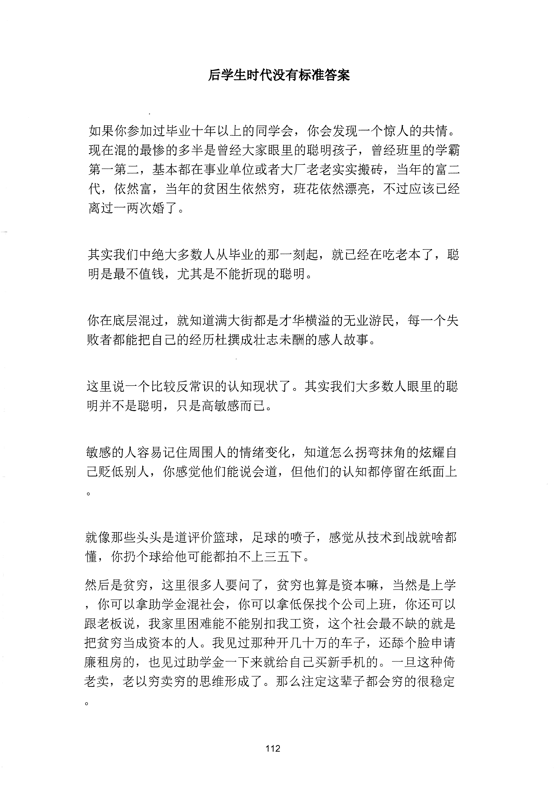
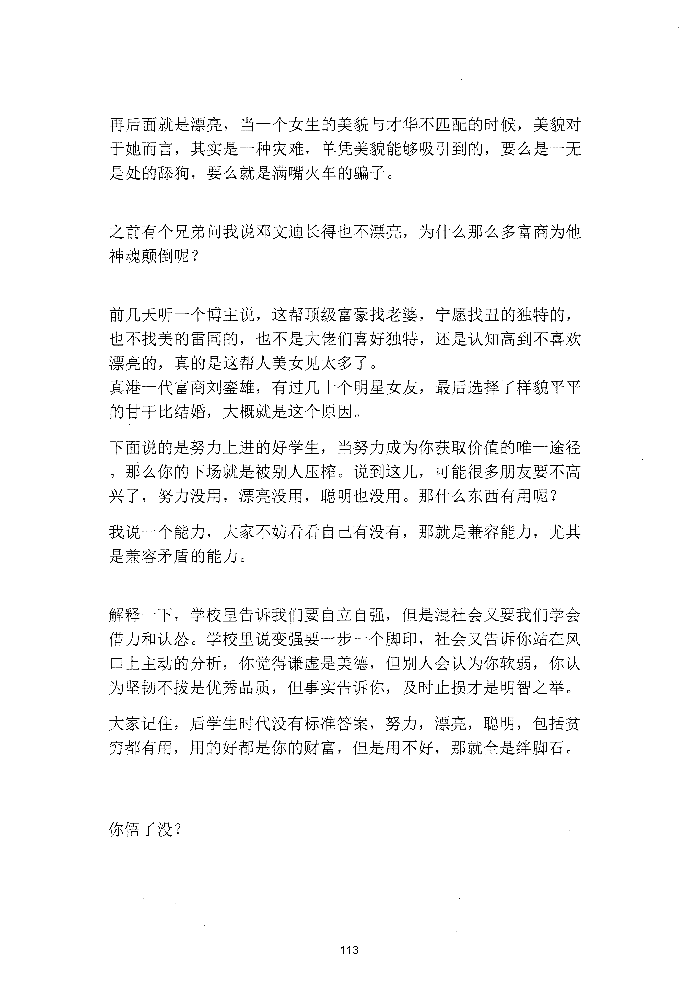

<!-- 原书第 120 页 -->

# 后学生时代没有标准答案

如果你参加过毕业十年以上的同学会，你会发现一个惊人的共情。现在混的最惨的多半是曾经大家眼里的聪明孩子，曾经班里的学霸第一第二，基本都在事业单位或者大厂老老实实搬砖，当年的富二代，依然富，当年的贫困生依然穷，班花依然漂亮，不过应该已经离过一两次婚了。

其实我们中绝大多数人从毕业的那一刻起，就已经在吃老本了，聪明是最不值钱，尤其是不能折现的聪明。

你在底层混过，就知道满大街都是才华横溢的无业游民，每一个失败者都能把自己的经历杜撰成壮志未酬的感人故事。

这里说一个比较反常识的认知现状了。其实我们大多数人眼里的聪明并不是聪明，只是高敏感而已。

敏感的人容易记住周围人的情绪变化，知道怎么拐弯抹角的炫耀自已贬低别人，你感觉他们能说会道，但他们的认知都停留在纸面上

就像那些头头是道评价篮球，足球的喷子，感觉从技术到战就啥都懂，你扔个球给他可能都拍不上三五下。然后是贫穷，这里很多人要问了，贫穷也算是资本嘛，当然是上学，你可以拿助学金混社会，你可以拿低保找个公司上班，你还可以跟老板说，我家里困难能不能别扣我工资，这个社会最不缺的就是把贫穷当成资本的人。我见过那种开几十万的车子，还舔个脸申请廉租房的，也见过助学金一下来就给自己买新手机的。一旦这种倚老卖，老以穷卖穷的思维形成了。那么注定这辈子都会穷的很稳定

<!-- source-image-start -->

查看原书第 120 页影像

<!-- source-image-end -->
<!-- 原书第 121 页 -->

再后面就是漂亮，当一个女生的美貌与才华不匹配的时候，美貌对于她而言，其实是一种灾难，单凭美貌能够吸引到的，要么是一无是处的薛狗，要么就是满嘴火车的骗子。

之前有个兄弟问我说邓文迪长得也不漂亮，为什么那么多富商为他神魂颠倒呢？

前几天听一个博主说，这帮顶级富豪找老婆，宁愿找丑的独特的，也不找美的雷同的，也不是大佬们喜好独特，还是认知高到不喜欢漂亮的，真的是这帮人美女见太多了。真港一代富商刘銮雄，有过几十个明星女友，最后选择了样貌平平的甘干比结婚，大概就是这个原因。下面说的是努力上进的好学生，当努力成为你获取价值的唯一途径。那么你的下场就是被别人压椋。说到这儿，可能很多朋友要不高兴了，努力没用，漂亮没用，聪明也没用。那什么东西有用呢？我说一个能力，大家不妨看看自己有没有，那就是兼容能力，尤其是兼容矛盾的能力。

解释一下，学校里告诉我们要自立自强，但是混社会又要我们学会借力和认怂。学校里说变强要一步一个脚印，社会又告诉你站在风口上主动的分析，你觉得谦虚是美德，但别人会认为你软弱，你认为坚韧不拔是优秀品质，但事实告诉你，及时止损才是明智之举。大家记住，后学生时代没有标准答案，努力，漂亮，聪明，包括贫穷都有用，用的好都是你的财富，但是用不好，那就全是绊脚石。

你悟了没？

<!-- source-image-start -->

查看原书第 121 页影像

<!-- source-image-end -->
