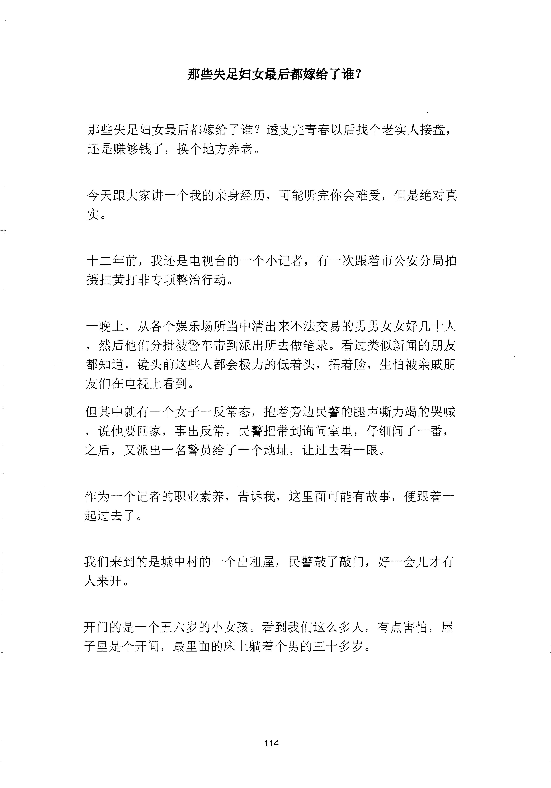
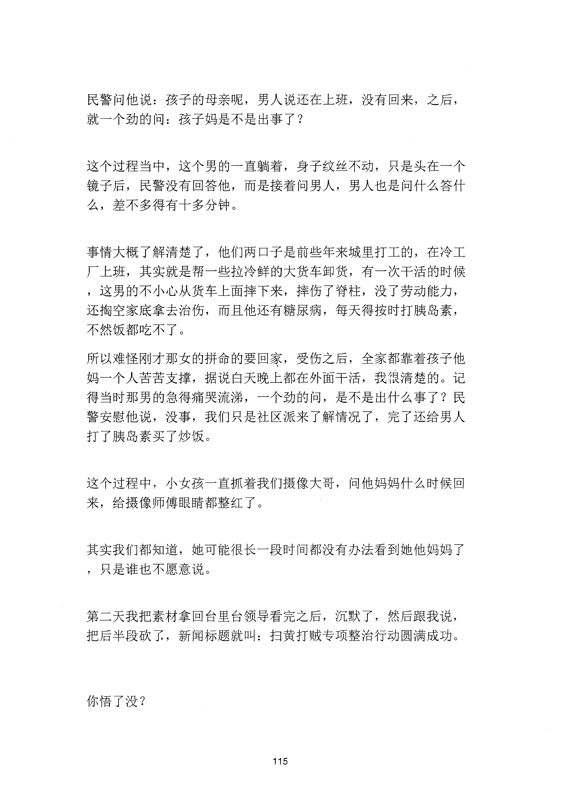

<!-- 原书第 122 页 -->

# 那些失足妇女最后都嫁给了谁？

那些失足妇女最后都嫁给了谁？透支完青春以后找个老实人接盘，还是赚够钱了，换个地方养老。

今天跟大家讲一个我的亲身经历，可能听完你会难受，但是绝对真实。

十二年前，我还是电视台的一个小记者，有一次跟着市公安分局拍摄扫黄打非专项整治行动。

一晚上，从各个娱乐场所当中清出来不法交易的男男女女好几十人，然后他们分批被警车带到派出所去做笔录。看过类似新闻的朋友都知道，镜头前这些人都会极力的低着头，捂着脸，生怕被亲戚朋友们在电视上看到。但其中就有一个女子一反常态，抱着旁边民警的腿声嘶力竭的哭咳，说他要回家，事出反常，民警把带到询问室里，仔细问了一番，之后，又派出一名警员给了一个地址，让过去看一眼。

作为一个记者的职业素养，告诉我，这里面可能有故事，便跟着一起过去了。

我们来到的是城中村的一个出租屋，民警敲了敲门，好一会儿才有人来开。

开门的是一个五六岁的小女孩。看到我们这么多人，有点害怕，屋子里是个开间，最里面的床上躺着个男的三十多岁。

<!-- source-image-start -->

查看原书第 122 页影像

<!-- source-image-end -->
<!-- 原书第 123 页 -->

民警问他说：孩子的母亲呢，男人说还在上班，没有回来，之后，就一个劲的问：孩子妈是不是出事了？

这个过程当中，这个男的一直躺着，身子纹丝不动，只是头在一个镜子后，民警没有回答他，而是接着问男人，男人也是问什么答什么，差不多得有十多分钟。

事情大概了解清楚了，他们两口子是前些年来城里打工的，在冷工厂上班，其实就是帮一些拉冷鲜的大货车卸货，有一次干活的时候，这男的不小心从货车上面摔下来，摔伤了脊柱，没了劳动能力，还掏空家底拿去治伤，而且他还有糖尿病，每天得按时打胰岛素，不然饭都吃不了。所以难怪刚才那女的拼命的要回家，受伤之后，全家都靠着孩子他妈一个人苦苦支撑，据说白天晚上都在外面干活，我很清楚的。记得当时那男的急得痛哭流涕，一个劲的问，是不是出什么事了？民警安慰他说，没事，我们只是社区派来了解情况了，完了还给男人打了胰岛素买了炒饭。

这个过程中，小女孩一直抓着我们摄像大哥，问他妈妈什么时候回来，给摄像师傅眼睛都整红了。

其实我们都知道，她可能很长一段时间都没有办法看到她他妈妈了，只是谁也不愿意说。

第二天我把素材拿回台里台领导看完之后，沉默了，然后跟我说，把后半段砍了，新闻标题就叫：扫黄打贼专项整治行动圆满成功。

你悟了没？

<!-- source-image-start -->

查看原书第 123 页影像

<!-- source-image-end -->
