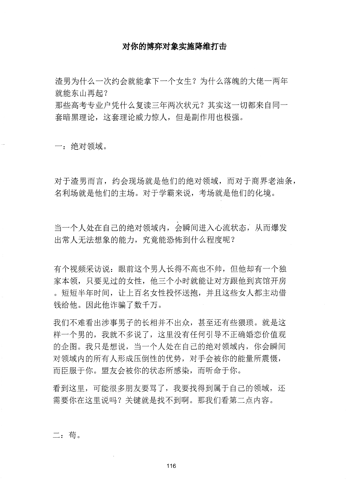
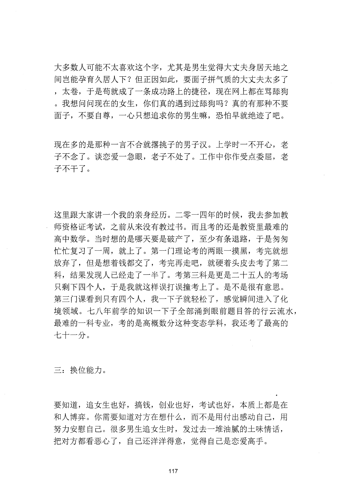
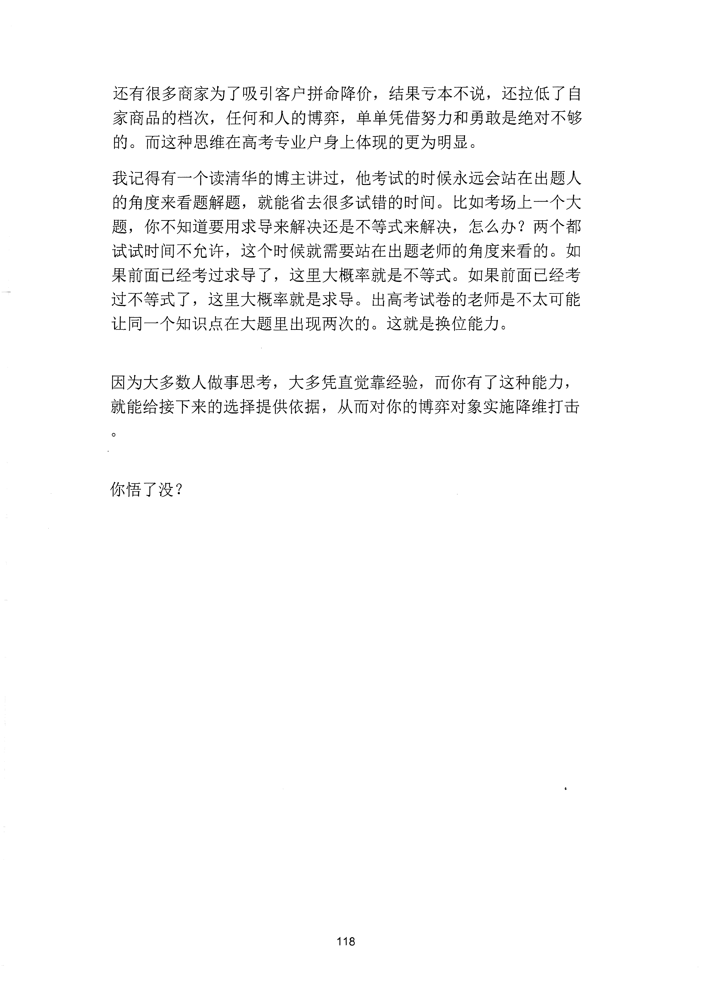

<!-- 原书第 124 页 -->

# 对你的博弈对象实施降维打击

渣男为什么一次约会就能拿下一个女生？为什么落魄的大佬一两年就能东山再起？那些高考专业户凭什么复读三年两次状元？其实这一切都来自同一套暗黑理论，这套理论威力惊人，但是副作用也极强。

一：绝对领域。

对于渣男而言，约会现场就是他们的绝对领域，而对于商界老油条，名利场就是他们的主场。对于学霸来说，考场就是他们的化境。

当一个人处在自己的绝对领域内，会瞬间进入心流状态，从而爆发出常人无法想象的能力，究竟能恐怖到什么程度呢？

有个视频采访说：眼前这个男人长得不高也不帅，但他却有一个独家本领，只要见过的女性，他三个小时就能让对方跟他到宾馆开房。短短半年时间，让上百名女性投怀送抱，并且这些女人都主动借钱给他。因此他诈骗了数千万。我们不难看出涉事男子的长相并不出众，甚至还有些狠琐。就是这样一个男的，我就不多说了，这里没有任何引导不正确婚恋价值观的企图。我只是想说，当一个人处在自己的绝对领域内，你会瞬间对领域内的所有人形成压倒性的优势，对手会被你的能量所震慑，而臣服千你。盟友会被你的状态所感染，而听命于你。看到这里，可能很多朋友要骂了，我要找得到属于自己的领域，还需要你在这里说吗？关键就是找不到啊。那我们看第二点内容。

二：苟。

<!-- source-image-start -->

查看原书第 124 页影像

<!-- source-image-end -->
<!-- 原书第 125 页 -->

大多数人可能不太喜欢这个字，尤其是男生觉得大丈夫身居天地之间岂能孕育久居人下？但正因如此，要面子拼气质的大丈夫太多了，太卷，于是苟就成了一条成功路上的捷径，现在网上都在骂舔狗。我想问问现在的女生，你们真的遇到过舔狗吗？真的有那种不要面子，不要自尊，一心只想追求你的男生嘛，恐怕早就绝迹了吧。

现在多的是那种一言不合就摆挑子的男子汉。上学时一不开心，老子不念了。谈恋爱一急眼，老子不处了。工作中你作受点委屈，老子不干了。

这里跟大家讲一个我的亲身经历。二零一四年的时候，我去参加教师资格证考试，之前从来没有教过书。而且考的还是教资里最难的高中数学。当时想的是哪天要是破产了，至少有条退路，于是匆匆忙忙复习了一周，就上了。第一门理论考的两眼一摸黑，考完就想放弃了，但是想着钱都交了，考完再走吧，就硬着头皮去考了第二科，结果发现人已经走了一半了。考第三科是更是二十五人的考场只剩下四个人，于是我就这样误打误撞考上了。是不是很有意思。第三门课看到只有四个人，我一下子就轻松了，感觉瞬间进入了化境领域。七八年前学的知识一下子全部涌到眼前题目答的行云流水，最难的一科专业，考的是高概数分这种变态学科，我还考了最高的七十一分。

三：换位能力。

要知道，追女生也好，搞钱创业也好，考试也好，本质上都是在和人博弈。你需要知道对方在想什么，而不是用付出感动自己，用努力安慰自己。很多男生追女生时，发过去一堆油腻的土味情话，把对方都看恶心了，自己还洋洋得意，觉得自己是恋爱高手。

<!-- source-image-start -->

查看原书第 125 页影像

<!-- source-image-end -->
<!-- 原书第 126 页 -->

还有很多商家为了吸引客户拼命降价，结果亏本不说，还拉低了自家商品的档次，任何和人的博弈，单单凭借努力和勇敢是绝对不够的。而这种思维在高考专业户身上体现的更为明显。我记得有一个读清华的博主讲过，他考试的时候永远会站在出题人的角度来看题解题，就能省去很多试错的时间。比如考场上一个大题，你不知道要用求导来解决还是不等式来解决，怎么办？两个都试试时间不允许，这个时候就需要站在出题老师的角度来看的。如果前面已经考过求导了，这里大概率就是不等式。如果前面已经考过不等式了，这里大概率就是求导。出高考试卷的老师是不太可能让同一个知识点在大题里出现两次的。这就是换位能力。

因为大多数人做事思考大多凭直觉靠经验，而你有了这种能力，就能给接下来的选择提供依据，从而对你的博弈对象实施降维打击

你悟了没？

<!-- source-image-start -->

查看原书第 126 页影像

<!-- source-image-end -->
